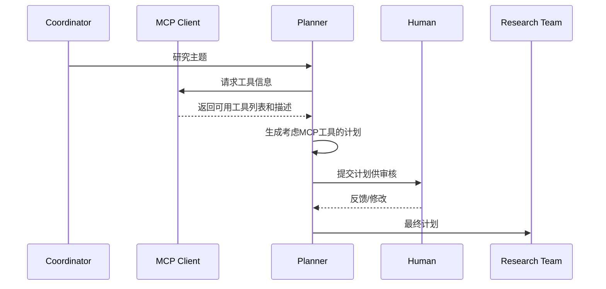
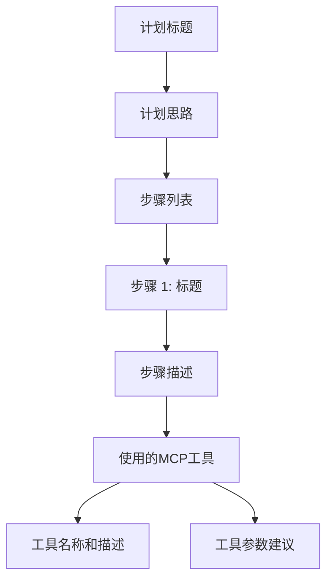

# Design Document: MCP-Aware Planner

## Overview

本设计文档描述了如何增强 DeerFlow 的 planner 节点，使其在制定研究计划时能够考虑到系统中可用的 MCP 工具。这将使 planner 能够生成更加有针对性和高效的研究计划，充分利用系统的全部能力。

## Architecture

当前的 DeerFlow 架构中，planner 节点负责生成研究计划，但它并不了解系统中可用的 MCP 工具。我们将通过以下方式增强这一架构：

1. **MCP 工具信息收集**：在 planner 节点执行前，收集系统中所有可用的 MCP 工具信息
2. **上下文增强**：将 MCP 工具信息作为额外上下文提供给 planner 的 LLM
3. **工具感知计划生成**：修改 planner 提示模板，指导 LLM 考虑 MCP 工具并在适当的情况下将其纳入计划中
4. **计划模型扩展**：扩展 Plan 模型，使其能够包含 MCP 工具使用信息

下图展示了修改后的架构流程：



## Components and Interfaces

### 1. MCP 工具信息收集器

新增一个组件，负责从 MCP 客户端收集工具信息：

```python
def get_mcp_tools_info(config: RunnableConfig) -> dict:
    """收集所有可用的 MCP 工具信息。
    
    Args:
        config: 运行时配置
        
    Returns:
        包含工具名称、描述和所属服务器的字典
    """
    configurable = Configuration.from_runnable_config(config)
    mcp_servers = {}
    tools_info = {}
    
    if configurable.mcp_settings:
        for server_name, server_config in configurable.mcp_settings["servers"].items():
            if server_config["enabled_tools"]:
                mcp_servers[server_name] = {
                    k: v for k, v in server_config.items()
                    if k in ("transport", "command", "args", "url", "env")
                }
                
                # 所有 MCP 工具对 planner 可见
                # 收集工具信息
                with MultiServerMCPClient(mcp_servers) as client:
                    for tool in client.get_tools():
                        if tool.name in server_config["enabled_tools"]:
                            tools_info[tool.name] = {
                                "name": tool.name,
                                "description": tool.description,
                                "server": server_name,
                                "parameters": tool.parameters
                            }
    
    return tools_info
```

### 2. 扩展的 Plan 模型

扩展现有的 Plan 模型，增加对 MCP 工具的支持：

```python
class StepTool:
    """表示步骤中使用的工具。"""
    name: str
    description: str
    server: str
    parameters: dict

class Step:
    need_search: bool
    title: str
    description: str
    step_type: Literal["research", "processing"]
    tools: Optional[List[StepTool]] = None  # 新增字段，表示步骤中使用的 MCP 工具

class Plan:
    locale: str
    has_enough_context: bool
    thought: str
    title: str
    steps: List[Step]
```

### 3. 修改后的 planner_node 函数

修改 planner_node 函数，使其能够收集和使用 MCP 工具信息：

```python
def planner_node(
    state: State, config: RunnableConfig
) -> Command[Literal["human_feedback", "reporter"]]:
    """Planner node that generate the full plan with MCP tools awareness."""
    logger.info("Planner generating full plan with MCP tools awareness")
    configurable = Configuration.from_runnable_config(config)
    plan_iterations = state["plan_iterations"] if state.get("plan_iterations", 0) else 0
    
    # 收集 MCP 工具信息
    mcp_tools_info = get_mcp_tools_info(config)
    
    # 将 MCP 工具信息添加到状态中，以便在模板中使用
    state["mcp_tools_info"] = mcp_tools_info
    
    messages = apply_prompt_template("planner", state, configurable)
    
    # 其余代码保持不变...
```

### 4. 修改后的 planner 提示模板

在 planner.md 模板中添加对 MCP 工具的考虑：

```markdown
## Available MCP Tools


The following specialized tools are available for your research plan:


### {{ tool_name }}
- **Description**: {{ tool_info.description }}
- **Server**: {{ tool_info.server }}


When creating your plan, consider how these tools can be utilized to gather more comprehensive and accurate information. For steps that could benefit from these tools, include them in your plan by specifying which tool should be used.

No specialized MCP tools are currently available.

```

## Data Models

### MCP 工具信息模型

```python
class MCPToolInfo:
    name: str  # 工具名称
    description: str  # 工具描述
    server: str  # 所属服务器
    parameters: dict  # 工具参数
    planner_visible: bool = True  # 是否对 planner 可见
```

### 配置扩展

在 Configuration 类中添加新的配置选项：

```python
@dataclass(kw_only=True)
class Configuration:
    # 现有字段...
    
    # 新增字段
    mcp_planner_integration: bool = True  # 是否启用 MCP 工具感知的计划生成
```

## Error Handling

1. **MCP 服务器连接错误**：
   - 如果无法连接到 MCP 服务器，记录错误并继续执行，但不包含该服务器的工具信息
   - 在日志中清晰标记哪些服务器连接失败

2. **工具信息收集错误**：
   - 对于每个工具，单独处理异常，确保一个工具的错误不会影响其他工具的信息收集
   - 提供降级机制，即使没有工具信息也能生成计划

3. **计划生成错误**：
   - 如果 LLM 在考虑 MCP 工具时生成了无效的计划，回退到不考虑 MCP 工具的计划生成

## Testing Strategy

1. **单元测试**：
   - 测试 `collect_mcp_tools_info` 函数在各种配置下的行为
   - 测试扩展的 Plan 模型序列化和反序列化
   - 测试修改后的 planner_node 函数

2. **集成测试**：
   - 测试完整的计划生成流程，包括 MCP 工具信息收集和计划生成
   - 测试不同研究主题下 MCP 工具的选择和使用
   - 测试用户反馈和计划修改流程

3. **模拟测试**：
   - 使用模拟的 MCP 服务器和工具进行测试
   - 测试各种错误情况和边缘情况

## Implementation Considerations

1. **性能影响**：
   - MCP 工具信息收集可能会增加计划生成的延迟
   - 考虑缓存工具信息，避免每次计划生成都重新收集

2. **提示工程**：
   - 需要仔细设计提示模板，确保 LLM 能够理解和正确使用 MCP 工具信息
   - 可能需要多次迭代和调整提示模板

3. **用户体验**：
   - 确保计划中清晰标注哪些步骤使用了哪些 MCP 工具
   - 提供工具描述和使用方法，帮助用户理解计划

4. **配置灵活性**：
   - 允许用户控制哪些 MCP 工具对 planner 可见
   - 提供全局开关，允许完全禁用 MCP 工具感知的计划生成

## 前端展示

为了让用户能够清晰地了解 planner 如何利用 MCP 工具来制定计划，我们需要在前端界面上进行相应的改进：

### 1. 计划展示界面

在展示生成的研究计划时，我们将增强前端界面以突出显示 MCP 工具的使用：



具体设计包括：

1. **工具标记**：
   - 在使用 MCP 工具的步骤旁边添加特殊图标或标记
   - 使用不同颜色区分不同类型的工具

2. **工具详情卡片**：
   - 当用户悬停在工具名称上时，显示工具的详细信息
   - 包括工具描述、所属服务器、参数说明等

3. **工具使用建议**：
   - 在步骤描述中突出显示工具使用建议
   - 提供参数填充的示例

### 2. 计划编辑界面

当用户编辑计划时，提供 MCP 工具相关的辅助功能：

1. **工具选择器**：
   - 提供可视化的工具选择界面
   - 按类别或服务器分组显示可用工具

2. **参数编辑器**：
   - 为工具参数提供结构化的编辑界面
   - 提供参数验证和自动补全功能

3. **工具预览**：
   - 允许用户预览工具的预期输出
   - 提供类似工具的替代建议

### 3. 执行结果展示

在研究步骤执行后，增强结果展示：

1. **工具使用标记**：
   - 在结果中标记哪些部分来自 MCP 工具
   - 显示工具执行的详细信息

2. **工具效果评估**：
   - 提供工具使用效果的可视化评估
   - 允许用户对工具使用进行评分和反馈

### 4. 响应式设计

确保在不同设备上的良好体验：

1. **移动适配**：
   - 在移动设备上优化工具信息的展示
   - 使用折叠面板减少屏幕占用

2. **无障碍设计**：
   - 确保工具信息对屏幕阅读器友好
   - 提供键盘导航支持

## Future Extensions

1. **工具相关性分析**：
   - 实现更智能的工具选择算法，基于研究主题和工具描述的语义相似性
   - 使用机器学习模型预测哪些工具最适合特定研究主题

2. **工具使用建议**：
   - 为每个工具提供具体的使用建议和示例
   - 在计划中包含工具使用的详细说明

3. **工具使用反馈**：
   - 收集工具使用的反馈和效果
   - 基于历史数据优化工具选择和使用建议

4. **前端可视化增强**：
   - 提供工具使用流程的可视化图表
   - 实现工具执行过程的实时监控和可视化