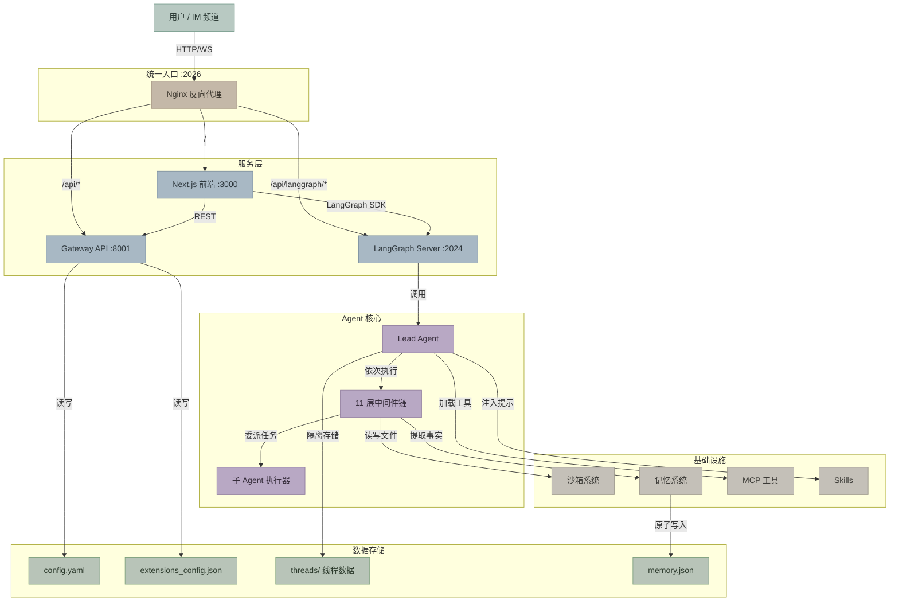
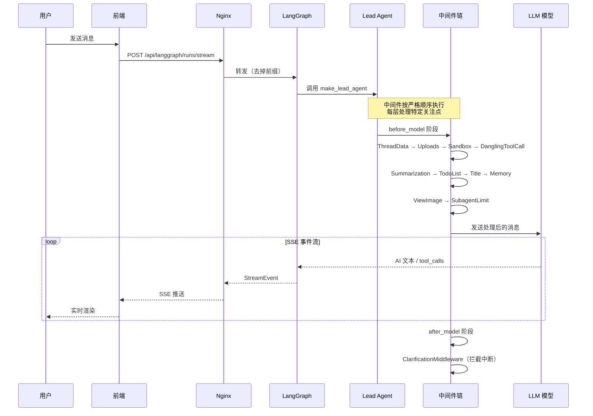
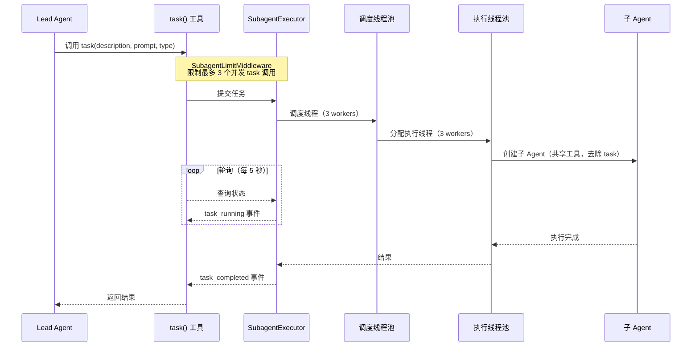
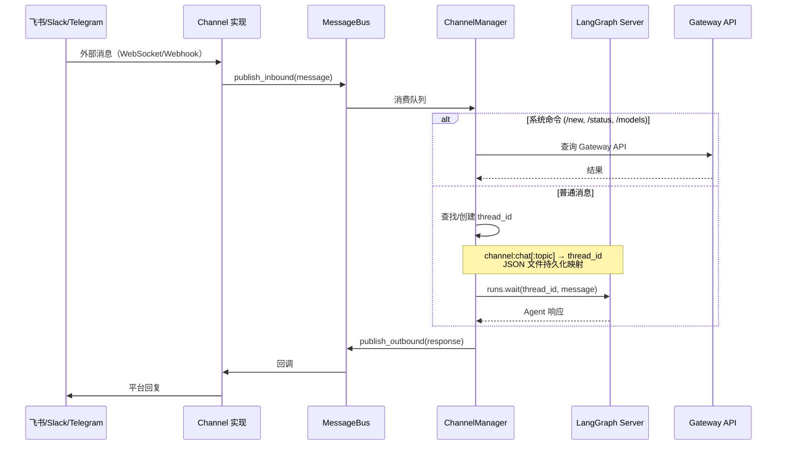

# DeerFlow 架构分析

## 项目定位

DeerFlow（**D**eep **E**xploration and **E**fficient **R**esearch **Flow**）是字节跳动开源的 **超级 Agent 编排框架**，基于 LangGraph 构建，提供子 Agent 委派、沙箱执行、持久记忆和可扩展 Skills 系统。面向需要复杂多步骤推理和工具调用的 AI 应用场景。

**技术栈**：Python 3.12+ / LangGraph / FastAPI / Next.js 16 / React 19 / TypeScript 5.8

## 核心能力

| 类别 | 能力 | 对应模块 |
|------|------|----------|
| Agent 编排 | 通过中间件链动态组装 Lead Agent，支持 thinking/vision | `src/agents/lead_agent/` |
| 子 Agent 委派 | 将任务分发给后台子 Agent 并行执行（双线程池，3 并发） | `src/subagents/` |
| 沙箱执行 | 在隔离环境中执行 bash/文件操作，支持本地和 Docker | `src/sandbox/` |
| 持久记忆 | LLM 驱动的事实提取 + 异步去抖更新 + 系统提示注入 | `src/agents/memory/` |
| Skills 系统 | 基于 Markdown 的可扩展技能包，支持安装/启用/禁用 | `src/skills/` |
| MCP 集成 | 多服务器 MCP 工具管理，支持 stdio/SSE/HTTP + OAuth | `src/mcp/` |
| IM 频道 | 飞书/Slack/Telegram 消息桥接 | `src/channels/` |
| 文件上传 | 多格式文档上传 + 自动转 Markdown | `src/gateway/routers/uploads.py` |
| 嵌入式客户端 | 无需 HTTP 服务的进程内 Python SDK | `src/client.py` |

## 架构图



## 关键流程时序图

### 流程 1：用户消息处理（主路径）



**为什么这样设计**：中间件链模式将 11 个正交关注点解耦，每层只处理自己的职责（沙箱获取、记忆注入、上传跟踪等），新增功能只需添加一个中间件，不影响其他层。

**关键细节**：中间件分 `before_model`（预处理）和 `after_model`（后处理）两个阶段。ClarificationMiddleware 必须排在最后，因为它通过 `Command(goto=END)` 中断整个流程。

**边界情况**：用户中断时，DanglingToolCallMiddleware 会为没有响应的 tool_calls 注入占位 ToolMessage，防止 LLM 因缺少工具响应而报错。

### 流程 2：子 Agent 任务委派



**为什么这样设计**：双线程池（调度 + 执行）将任务调度与实际执行解耦。调度池负责排队和优先级，执行池负责运行子 Agent，避免一个慢任务阻塞调度。

**关键细节**：子 Agent 继承 Lead Agent 的所有工具，但去除 `task` 工具本身（防止无限递归委派）。默认 15 分钟超时，可按 agent 类型覆盖。

**边界情况**：超过 3 个并发任务时，SubagentLimitMiddleware 在 `after_model` 阶段直接截断多余的 tool_calls，而不是排队等待。

### 流程 3：IM 频道消息桥接



**为什么这样设计**：MessageBus 发布/订阅模式将平台特定的消息格式与 Agent 交互完全解耦。新增一个 IM 平台只需实现 Channel 接口，不涉及核心 Agent 逻辑。

**关键细节**：IM 频道通过 `langgraph-sdk` HTTP 客户端与 LangGraph Server 通信，和前端走同一套 API，确保 thread 管理的一致性。支持按频道和用户覆盖 session 配置（model、thinking、plan_mode 等）。

## 模块详解

### 1. Agent 系统 (`src/agents/`)

**对上层提供**：`make_lead_agent(config)` — LangGraph 注册的图入口，返回完全组装好的 Agent

**依赖下层**：
- `src/models/factory.py` — 创建 LLM 实例
- `src/tools/` — 组装工具集
- `src/sandbox/` — 沙箱生命周期
- `src/skills/` — 技能注入
- `src/mcp/` — MCP 工具加载

**核心文件**：
| 文件 | 职责 |
|------|------|
| `lead_agent/agent.py` | Agent 工厂 + 中间件链组装 + 系统提示生成 |
| `thread_state.py` | `ThreadState` 定义（扩展 `AgentState`，含 sandbox/artifacts/todos/uploads） |
| `middlewares/*.py` | 11 个中间件，每个处理一个正交关注点 |
| `memory/updater.py` | LLM 驱动的事实提取 + 原子文件写入 |
| `memory/queue.py` | 去抖更新队列（30s 默认，按线程去重） |

### 2. 沙箱系统 (`src/sandbox/`)

**对上层提供**：`bash`, `ls`, `read_file`, `write_file`, `str_replace` 五个工具

**不提供**：网络隔离、资源限额（由 Docker/K8s 层处理）

**设计决策**：
- 选择了**虚拟路径系统**（Agent 看到 `/mnt/user-data/`，物理路径是 `threads/{id}/user-data/`）→ 而非直接暴露物理路径 → 因为需要在本地和 Docker 模式间无缝切换
- 选择了 **Provider 模式**（`SandboxProvider` 抽象 + `acquire/get/release` 生命周期）→ 而非硬编码 → 因为需要支持 Local / Docker / K8s 三种后端

### 3. 子 Agent 系统 (`src/subagents/`)

**对上层提供**：`task()` 工具 — Lead Agent 通过调用此工具委派任务

**不提供**：子 Agent 间通信（每个子 Agent 独立运行，不共享状态）

**核心文件**：
| 文件 | 职责 |
|------|------|
| `executor.py` | 双线程池执行引擎（调度 3 + 执行 3），15min 超时 |
| `registry.py` | Agent 注册表，支持内置 + 自定义 Agent 类型 |
| `builtins/general_purpose.py` | 通用子 Agent（全工具，去除 task） |
| `builtins/bash_agent.py` | 命令执行专用子 Agent |

### 4. Gateway API (`src/gateway/`)

**对上层提供**：REST API — 模型、MCP、Skills、Memory、上传、Artifact 的 CRUD

**不提供**：Agent 会话管理（由 LangGraph Server 负责）

**设计决策**：
- 选择了 **双服务架构**（LangGraph Server 管 Agent + Gateway 管其他）→ 而非单体 → 因为 LangGraph 有自己的服务框架，无法嵌入 FastAPI
- 选择了 **Nginx 统一代理** → 而非让前端直连两个服务 → 因为简化前端配置，统一处理 CORS

### 5. 前端 (`frontend/src/`)

**对上层提供**：Web 聊天界面，支持流式响应、Artifact 展示、设置管理

**核心模式**：
- **Thread Hooks** (`core/threads/hooks.ts`) — `useThreadStream`、`useSubmitThread`、`useThreads` 封装所有 LangGraph SDK 交互
- **LangGraph 客户端单例** (`core/api/`) — `getAPIClient()` 全局复用，拦截 `runs.stream()` 做 payload 清洗
- **乐观 UI** — 用户消息立即显示，不等服务端确认；真实消息到达后替换
- **TanStack Query** 管理服务端状态，localStorage 管理用户偏好

**模式映射**（UI 模式 → 后端配置）：
| 模式 | thinking_enabled | is_plan_mode | subagent_enabled |
|------|:---:|:---:|:---:|
| flash | false | false | false |
| thinking | true | false | false |
| pro | true | true | false |
| ultra | true | true | true |

**Provider 嵌套顺序**（依赖流自上而下）：
`SubtasksProvider` → `ArtifactsProvider` → `PromptInputProvider`

### 6. 配置系统 (`src/config/`)

**两个配置文件**：
| 文件 | 内容 | 运行时修改 |
|------|------|-----------|
| `config.yaml` | 模型、工具、沙箱、记忆、摘要、频道 | 部分（Gateway API） |
| `extensions_config.json` | MCP 服务器、Skills 开关 | 完全支持（Gateway API + mtime 热加载） |

**设计决策**：
- 选择了 **`$` 前缀环境变量解析**（`api_key: $OPENAI_API_KEY`）→ 而非 dotenv 自动注入 → 因为需要同一配置文件在不同环境间复用
- 选择了 **反射加载**（`use: langchain_openai:ChatOpenAI`）→ 而非硬编码 provider → 因为支持任意 LangChain 兼容模型

### 7. MCP 系统 (`src/mcp/`)

**对上层提供**：`get_cached_mcp_tools()` — 返回所有已启用 MCP 服务器的工具列表

**设计决策**：
- 选择了 **懒加载 + mtime 缓存失效** → 而非启动时全量加载 → 因为 MCP 服务器可能很多且启动慢
- 选择了 **OAuth token 自动刷新** → 而非要求用户手动管理 → 因为 HTTP/SSE 类型的 MCP 服务器需要长期运行

### 8. 记忆系统 (`src/agents/memory/`)

**对上层提供**：自动提取用户上下文和事实 → 注入系统提示

**工作流**：MemoryMiddleware 过滤消息 → Queue 去抖（30s）→ LLM 提取事实 → 原子写入 `memory.json` → 下次交互注入 top 15 事实

**设计决策**：
- 选择了 **异步去抖队列** → 而非同步更新 → 因为记忆提取不应阻塞用户交互
- 选择了 **temp file + rename 原子写入** → 而非直接写 → 因为防止并发写入导致数据损坏

### 9. 嵌入式客户端 (`src/client.py`)

**对上层提供**：无需启动任何 HTTP 服务，在 Python 进程内直接使用 DeerFlow 全部能力

**不提供**：HTTP API（这是 Gateway 的职责）、前端界面

**核心设计**：Client 导入 `src/` 内部模块，用和 LangGraph Server + Gateway 完全相同的代码路径构建 Agent、执行工具、管理配置。返回值严格对齐 Gateway Pydantic 模型（通过 `TestGatewayConformance` 测试保障）。

**Agent 生命周期**：
```
DeerFlowClient() — 只加载配置，不创建 Agent
    ↓
chat() / stream() — 首次调用触发 _ensure_agent()
    ↓
_ensure_agent() — 检查 config_key 是否变化
    ↓ 变化了 / 首次
create_agent(model, tools, middleware, system_prompt, state_schema, checkpointer)
    ↓ 没变
复用缓存的 Agent 实例
```

**Config Key 机制**：`(model_name, thinking_enabled, is_plan_mode, subagent_enabled)` 四元组决定 Agent 是否需要重建。任何一项变化都触发完整重建（模型实例 + 工具集 + 中间件链 + 系统提示）。

**流式协议对齐**：`stream()` 产出的 `StreamEvent` 类型与 LangGraph SSE 协议一一对应：

| 事件类型 | 触发时机 | 数据内容 |
|----------|---------|---------|
| `values` | 每个状态快照 | `{title, messages[], artifacts[]}` |
| `messages-tuple` | 每条新消息 | AI 文本 / tool_calls / tool 结果 |
| `end` | 流结束 | `{}` |

**消息去重**：用 `seen_ids: set` 跟踪已发送的 message ID，防止 `stream_mode="values"` 模式下重复推送同一条消息。

**Gateway 等价方法**（15 个，覆盖所有 Gateway 端点）：

| 类别 | 方法 | 与 Gateway 的关键差异 |
|------|------|---------------------|
| 会话 | `chat()`, `stream()` | 直接调用 Agent，不走 HTTP |
| 模型 | `list_models()`, `get_model()` | 读内存中的 AppConfig |
| MCP | `get_mcp_config()`, `update_mcp_config()` | 写文件后自动 `reset_agent()` |
| Skills | `list_skills()`, `get_skill()`, `update_skill()`, `install_skill()` | 写文件后自动 `reset_agent()` |
| 记忆 | `get_memory()`, `reload_memory()`, `get_memory_config()`, `get_memory_status()` | 直接读 memory.json |
| 上传 | `upload_files()`, `list_uploads()`, `delete_upload()` | 接收 `Path` 而非 `UploadFile` |
| Artifact | `get_artifact()` | 返回 `(bytes, mime_type)` 而非 HTTP Response |

**安全防护**：
- **路径遍历检查** — `delete_upload()` 和 `get_artifact()` 用 `relative_to()` 防止 `../` 逃逸
- **ZIP 炸弹防护** — `install_skill()` 检查解压后总大小 ≤ 100MB
- **符号链接清理** — 解压 `.skill` 后删除所有符号链接
- **绝对路径拒绝** — ZIP 内含绝对路径或 `..` 的条目直接拒绝
- **目录拒绝** — `upload_files()` 在复制前验证每个路径必须是普通文件

**文件转换**：上传 PDF/PPT/Excel/Word 时自动转 Markdown。在已有事件循环内时，复用单个 `ThreadPoolExecutor(max_workers=1)` 避免每个文件创建新线程池。

**设计决策**：
- 选择了 **导入内部模块** → 而非 HTTP 自调用 → 因为消除网络开销，支持单进程部署
- 选择了 **config_key 四元组判断** → 而非每次重建 → 因为 Agent 创建开销大（加载工具、MCP、系统提示）
- 选择了 **写 extensions_config.json 后自动 reset_agent** → 而非要求调用者手动 reset → 因为配置变更后必须重建 Agent 才能生效

### 10. IM 频道 (`src/channels/`)

**对上层提供**：飞书、Slack、Telegram 消息桥接到 DeerFlow Agent

**不提供**：富文本渲染（各平台自行处理格式转换）

**与 Client 的对比**：IM 频道选择通过 LangGraph SDK HTTP 客户端通信（和前端一样），而非像 `DeerFlowClient` 那样直接导入 Agent。原因是 IM 频道需要复用 LangGraph Server 的 thread 持久化，这样 IM 和 Web 界面共享同一份对话历史。

**设计决策**：
- 选择了 **通过 LangGraph SDK HTTP 客户端通信** → 而非直接导入 Agent → 因为复用 LangGraph Server 的 thread 持久化，IM 和 Web 共享对话历史
- 选择了 **JSON 文件持久化 thread 映射** → 而非数据库 → 因为简单场景足够，避免引入外部依赖

## 关键设计决策

| 选择了 | 而非 | 因为 |
|--------|------|------|
| LangGraph 作为 Agent 运行时 | 自建状态机 | LangGraph 提供检查点、流式、中断等基础设施 |
| 11 层中间件链 | 单体 Agent 逻辑 | 每层职责正交，新增功能不影响其他层 |
| 双服务架构（LangGraph + Gateway） | 单体服务 | LangGraph 有独立运行时，无法嵌入 FastAPI |
| 虚拟路径系统 | 直接物理路径 | 本地/Docker 模式无缝切换 |
| 反射式模型加载 (`use:` 路径) | 硬编码 provider 枚举 | 支持任意 LangChain 兼容模型 |
| 异步去抖记忆更新 | 同步更新 | 不阻塞用户交互 |
| MessageBus 发布/订阅 | 直接调用 | IM 平台解耦，新增频道零侵入 |
| DeerFlowClient 嵌入式客户端 | 仅 HTTP API | 支持无服务的进程内集成 |

## 依赖关系

```
config.yaml / extensions_config.json
    ↓
src/config/ (配置加载)
    ↓
src/models/factory.py (LLM 实例)
src/reflection/ (反射加载)
    ↓
src/tools/ (工具组装)
├── src/sandbox/tools.py (沙箱工具)
├── src/mcp/ (MCP 工具)
├── src/community/ (社区工具: tavily, jina, firecrawl, image_search)
└── src/tools/builtins/ (内置工具: present_files, ask_clarification, view_image)
    ↓
src/agents/lead_agent/ (Agent 工厂)
├── src/agents/middlewares/ (11 层中间件)
├── src/agents/memory/ (记忆系统)
├── src/skills/ (技能系统)
└── src/subagents/ (子 Agent)
    ↓
langgraph.json → LangGraph Server :2024
    ↓
src/gateway/ → FastAPI Gateway :8001
    ↓
docker/nginx/ → Nginx :2026 (统一代理)
    ↓
frontend/ → Next.js :3000
src/channels/ → IM 桥接（飞书/Slack/Telegram）
src/client.py → 嵌入式 Python SDK
```

**启动顺序**：
1. `config.yaml` + `extensions_config.json`（读取配置）
2. LangGraph Server `:2024`（Agent 运行时）
3. Gateway API `:8001`（REST API）
4. Frontend `:3000`（Web 界面）
5. Nginx `:2026`（统一代理）
6. IM Channels（可选，按配置启动）
