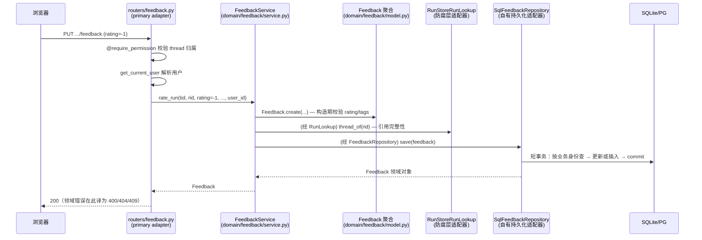

# 用户反馈（Feedback）模块设计

> 面向想读懂或二次开发这个模块的人。读完你将能回答：一次点踩从浏览器到数据库经过哪些层、每层为什么只能做那些事、想加个字段该改哪几个文件。
>
> 本文假定你已读过 [HEXAGONAL_ARCHITECTURE_zh.md](HEXAGONAL_ARCHITECTURE_zh.md)——那里讲六边形的规则，这里讲规则在这个模块上的具体样子。术语（端口、适配器、聚合、防腐层）不再重复解释。
>
> 姊妹文档：[SCHEDULE_DESIGN_zh.md](SCHEDULE_DESIGN_zh.md)——定时任务模块，同样的结构但复杂度高一个量级（**尚在 `rayhpeng/hexagonal-scheduling-slice` 分支，未合并到本分支**）。

---

## 1. 这个模块做什么

给一次 agent 执行（run）点赞或点踩，可以附原因标签和文字评论。

产品层面的三条决定，解释了后面所有设计：

| 决定 | 后果 |
|---|---|
| **一个用户对一个 run 只有一个当前评价** | 写入是 upsert（"我现在的看法是 X"），不是 append；聚合身份是 `(thread_id, run_id, user_id)` 三元组 |
| **再点一次当前按钮 = 撤回** | 有 DELETE 用例，且撤回不存在的评价不是错误 |
| **评价回显嵌在消息列表里** | 没有独立的读端点；读路径为分页和全量各准备了一个批量方法 |

对应的 HTTP 面（`app/gateway/routers/feedback.py`）：

```
PUT    /api/threads/{tid}/runs/{rid}/feedback    设置当前评价（幂等）
DELETE /api/threads/{tid}/runs/{rid}/feedback    撤回
```

## 2. 当前状态：已完整迁移

这是仓库第一个走完六边形切片的模块，也是后续模块的样板。内圈、外圈、组合根、契约测试都已到位：

```
packages/harness/deerflow/domain/feedback/     内圈（harness）
backend/app/adapters/feedback/                 从适配器（app）
backend/app/gateway/routers/feedback.py        主适配器（app）
backend/app/gateway/deps.py::langgraph_runtime 组合根（app）
```

与 schedule 模块不同，这里**没有新旧并存**——旧的 `FeedbackRepository`（散在 `persistence/` 下的那一版）已经删除，没有兼容层，没有双写。

已知的收尾待办见总纲 §7，其中优先级最高的一项是本文 §11 的第一个陷阱。

## 3. 内圈全景

```
domain/feedback/
├── __init__.py      上下文的公开 API：领域对象 + 服务（端口刻意不在这里导出）
├── model.py         Feedback（聚合根）· 5 个领域错误 · 2 个白名单常量
├── ports.py         2 个 Protocol：FeedbackRepository · RunLookup
└── service.py       FeedbackService —— 用例编排（input port）
```

`model.py` 是**单文件**而非目录，因为这里只有一个聚合、没有值对象、没有状态机——对比 schedule 的 `model/` 包（两个聚合 + 两个状态机 + 值对象）。模块规模决定形态，不必强行对称。

三层纪律：

| 文件 | 职责 | 纪律 |
|---|---|---|
| `model.py` | 业务事实与不变量 | 零依赖（仅标准库）；不知道存储和 HTTP 存在；不变量在构造期校验 |
| `ports.py` | 领域声明的接口 | 技术中立——签名里不出现 SQL、表名、HTTP 状态码 |
| `service.py` | 用例编排 | 内圈唯一调用 output port 的地方；`user_id` 显式传参；自身不含业务规则 |

`__init__.py` 的导出策略值得注意：**它导出领域对象和服务，但不导出端口**。端口是给适配器和测试用的契约，不是日常调用点的符号，所以要写 `from deerflow.domain.feedback.ports import FeedbackRepository`——多打几个字，换来"谁在实现契约"这件事在 import 里就看得见。

CI 的 `tests/test_harness_domain_purity.py` 会 AST 扫描整个 `domain/`，禁止 import sqlalchemy / fastapi / pydantic / app / harness 基础设施模块。

## 4. `Feedback`：规则本体

`model.py`，93 行，一个 frozen dataclass 加五个错误类。

### 4.1 字段与身份

```python
@dataclass(frozen=True)
class Feedback:
    feedback_id: str          # 代理主键，工厂生成的 uuid4
    run_id: str               # ┐
    thread_id: str            # ├ 业务身份三元组
    rating: int               # │ (thread_id, run_id, user_id)
    user_id: str | None = None# ┘
    message_id: str | None = None
    comment: str | None = None
    tags: tuple[str, ...] = ()
    created_at: datetime = field(default_factory=lambda: datetime.now(UTC))
```

**两套身份，别混。** `feedback_id` 是行的代理主键；决定"是不是同一条评价"的是 `(thread_id, run_id, user_id)`。upsert 按业务身份查找、更新时**保留原有的 `feedback_id`**——`SqlFeedbackRepository.save` 和 `InMemoryFeedbackRepository.save` 都显式实现了这一点，契约测试 `test_save_updates_keeping_identity` 逐字段盯着它。前端如果拿 `feedback_id` 做 key，重新评价后 key 不变。

`user_id` 可以是 `None`——那是免鉴权模式（`database.backend` 无认证部署）。所有读方法的 `user_id` 参数因此都是 `str | None`，`None` 表示不按所有者过滤。

`message_id` 把评价收窄到 run 里的某一条消息而不是整个 run，可选。

### 4.2 创建即一致

```python
def __post_init__(self):
    if self.rating not in VALID_RATINGS:      # (-1, 1)
        raise InvalidRatingError(...)
    unknown = set(self.tags) - VALID_FEEDBACK_TAGS
    if unknown:
        raise InvalidTagError(...)
```

校验在 `__post_init__`，不在工厂里，所以**绕不过去**：`Feedback.create(...)` 和 `Feedback(...)` 直接构造走同一条路（`test_direct_construction_also_validates` 盯着这条）。适配器从数据库读出来重建对象时也会过这一遍——一行手工改坏的数据在读取时就会炸，而不是流到前端。

推论一条：**非法输入永远在任何 IO 之前报错**。`FeedbackService.rate_run` 先构造聚合再查 run（见 §6.2），所以一个非法 rating 配一个不存在的 run，报的是 `InvalidRatingError` 而不是 `RunNotFoundError`。

### 4.3 tags 是语言中立的 slug

```python
VALID_FEEDBACK_TAGS = frozenset({
    "incorrect", "not_as_expected", "slow", "style_tone", "safety_legal", "other",
})
```

白名单在领域里，翻译在前端。存储和分析只见 slug，所以中文界面和英文界面提交的"回答不对"能聚合到一起。

加标签要动这个 frozenset，见 §10.2。

### 4.4 `frozen=True` 意味着什么

聚合不可变。想改评价就构造一个新的（`dataclasses.replace` 或 `Feedback.create`），没有 setter，没有"半更新"的中间态。`test_frozen` 盯着这条。

代价是仓储的 `save` 只能是整体替换语义，不能是字段级 patch——这正是端口签名 `save(feedback: Feedback)` 的原因。

### 4.5 一处与 schedule 的分歧：这里读了时钟

`created_at` 的默认值是 `datetime.now(UTC)`——**领域在构造期读了系统时钟**。schedule 模块刻意避免这件事（`now` 一律由调用方显式传参，领域从不读时钟，测试天然确定）。

两个切片在这一点上不一致，如实记录：feedback 的时间只是一个记账戳，不参与任何规则判断（没有"超过 N 天的评价失效"这类逻辑），所以读时钟的代价只是测试里断言时间需要一点宽容（`test_created_at_is_tz_aware` 只断言"带时区"而非具体值）。schedule 的时间是**规则输入**（下次触发、租约过期），那里必须显式传参。

如果哪天 feedback 出现依赖时间的规则，应当同时把 `created_at` 改成显式传参。

## 5. 端口：领域对外的两个依赖

`ports.py` 声明领域需要外界做什么，由外圈实现。

| 端口 | 回答什么问题 | 方法数 |
|---|---|---|
| `FeedbackRepository` | 评价存在哪、怎么按所有者过滤、并发 upsert 冲突怎么表达 | 4 |
| `RunLookup` | 这个 run 属于哪个 thread | 1 |

### 5.1 两条约定，比签名更重要

**① 所有者过滤是参数，不是异常。** 每个读方法都收 `user_id: str | None`：非 `None` 时限制到该用户的条目，`None` 表示不过滤（免鉴权模式）。别人的评价表现为"查不到"，而不是抛权限错误。

**② 并发 upsert 的败者必须翻译成领域错误。** 两个并发请求可以都没查到、都去插入，输的那个撞上唯一约束。适配器负责把 `IntegrityError` 翻译成 `DuplicateFeedbackError`，router 再映射成 HTTP 409 让客户端重试。旧代码在这里泄漏了驱动异常，结果是 500。

### 5.2 两个刻意的缺席

**没有 `find_one` / `get_by_id`。** 读路径只有批量方法，因为唯一的消费者是消息列表回显——它要的是"这一页所有 run 的当前评价"，不是"某一条评价"。加一个单条读方法就要有人来回答"谁在用它"。

**`RunLookup` 里没有 `user_id`。** 它只回答纯事实"run 属于哪个 thread"，不掺授权。授权是两环链条，见 §6.2。

### 5.3 为什么 `RunLookup` 只有一个方法

feedback 需要知道的关于 run 的全部事情，就是"它属于哪个 thread"。而 run 上下文的仓储（`RunStore`）有 26 个方法。

依赖那一个方法而不是那 26 个，是接口隔离原则的教科书用法，收益是具体的：`domain/feedback/` 整个包里没有一行提到 `RunStore`、`runtime`、`persistence`。run 上下文换存储实现，feedback 领域一个字不用改。

代价是外圈要写一层防腐层，见 §7.2。

## 6. 应用服务：用例编排

`service.py`，75 行。构造函数收两个端口，之后只见 Protocol 类型。

### 6.1 用例清单

| 方法 | 支撑 | 领域错误 |
|---|---|---|
| `rate_run(...)` | `PUT /feedback` | `InvalidRatingError` / `InvalidTagError` / `RunNotFoundError` / `DuplicateFeedbackError` |
| `retract_run_rating(...)` | `DELETE /feedback` | — |
| `latest_per_run_in_thread(...)` | 消息列表全量路径 | — |
| `latest_for_runs(...)` | 消息列表分页路径 | — |

服务自身**不含业务规则**：rating 和 tags 的合法性归聚合，所有者过滤归仓储，它只负责"按什么顺序调用谁"。

### 6.2 `rate_run`：顺序是设计，不是随意

```python
feedback = Feedback.create(...)          # ① 先构造：规则校验在此
await self._require_run(thread_id, run_id)  # ② 再查 run：引用完整性
return await self._repository.save(feedback) # ③ 最后落库
```

**① 在 ② 之前**，所以错误归因不受 IO 结果影响——非法 rating 配不存在的 run，报 `InvalidRatingError`。`test_invalid_rating_rejected_before_run_lookup` 就是钉这个顺序的。

**② 是引用完整性，不是授权。** 授权是两环链条：

```
router 的 @require_permission(..., owner_check=True)  ->  你拥有这个 thread
service 的 _require_run                              ->  run 属于该 thread
                          两者合起来               ->  你拥有这个 run
```

这解释了为什么 `RunLookup.thread_of` 签名里没有 `user_id`：第一环已经证明了 thread 归属，第二环只需回答纯事实。少了任何一环都不成立——单独的 `_require_run` 拦不住"用自己的 thread 配别人的 run"以外的攻击面，单独的 `owner_check` 拦不住跨 thread 的 run id。

### 6.3 读路径为什么有两个方法

`latest_per_run_in_thread` 拉整个 thread，`latest_for_runs` 只拉指定的一批 run。后者是给消息列表分页端点用的——一页只需要这一页那几个 run 的角标，拉整个 thread 在长会话里是浪费。

两者都是**批量**方法，返回 `dict[run_id, Feedback]`，一次查询覆盖一页。前端按钮的高亮状态由此而来，没有独立的读端点。

### 6.4 `retract` 为什么不查 run

写路径校验引用完整性，删路径不校验，这个不对称是有意的：删一条不存在的评价本来就返回 `False`（router 转成 404），多一次 `RunLookup` 调用不会改变任何结果，只是多一次 IO。

## 7. 适配器：两种形态

两个从适配器住在 `app/adapters/feedback/`，一个端口一个文件。它们性质不同——判据和命名惯例见总纲 §5，这里讲各自的实现要点。

### 7.1 `feedback_repository.py`：自有持久化

`SqlFeedbackRepository` 只做两种翻译：

1. **领域对象 ↔ ORM 行**：`_to_domain` / `_to_row` 两个静态方法。`_to_row` 显式列出每个字段而不是 `**asdict()`——新加的列在被刻意映射之前保持私有。
2. **技术异常 → 领域错误**：`IntegrityError → DuplicateFeedbackError`。

外加一件跨数据库的脏活：`_tz_aware()`。SQLite 读回来的 `datetime` 丢了 tzinfo，而存进去的一律是 UTC，所以读路径统一补回 `UTC`。这是 `_to_domain` 存在的第二个理由——**读取归一化只发生在这一个地方**。`tests/test_persistence_timezone.py` 盯着它。

session 生命周期 = 一个端口方法（每方法一个短事务）。没有跨方法的事务，也没有 unit-of-work——feedback 的用例都是单聚合操作，不需要。

一处继承的微妙之处，这个类的 docstring 自己写着：

> Explicit inheritance is a readability aid only: a missing method would still instantiate fine (Protocol bodies are inherited), so the contract test suite must cover every port method.

`class SqlFeedbackRepository(FeedbackRepository)` 里的显式继承只是可读性提示。Protocol 的方法体是 `...`，继承过来就是"返回 `None` 的空实现"，所以**少写或拼错一个方法不会报错，只会静默返回 `None`**。这不是理论风险，见 §11.2。

### 7.2 `run_lookup.py`：防腐层

`RunStoreRunLookup` 全部实现就是三行：

```python
async def thread_of(self, run_id: str) -> str | None:
    run = await self._run_store.get(run_id)
    return run.get("thread_id") if run else None
```

把 26 个方法的 `RunStore` 收窄成 1 个问题，顺带把 `RunStore.get()` 返回的 `dict[str, Any]` 挡在领域外面。

`RunStore` 的类型注解走 `TYPE_CHECKING`，运行时零 import 开销——这个模块被组合根延迟 import，没必要在导入时拉起 `deerflow.runtime` 包。

文件里的 `TODO(hexagonal)` 写的是**触发条件**而不是抱怨：

```
TODO(hexagonal): this depends on ``RunStore``, an infrastructure
component, rather than on a contract published by the run context --
that context has not been through a hexagonal slice yet. When it
publishes one (a DTO, not its aggregate and not its repository),
replace the body of this class. The ``RunLookup`` port does not move.
```

最后一句是这层设计买到的东西：上游重构时改动范围是一个文件，端口和领域一行不动。

**为什么这是正常形态而不是欠债**：feedback 是下游（Customer），run 是上游（Supplier）。上游没有发布正式契约之前，下游为它写一层防腐层是 DDD 的标准答案。真正需要警惕的是这层**没有被测试**，见 §11.1。

### 7.3 组合根

`app/gateway/deps.py::langgraph_runtime` 是适配器唯一的实例化点：

```python
app.state.feedback_service = FeedbackService(
    repository=SqlFeedbackRepository(sf),
    runs=RunStoreRunLookup(app.state.run_store),
)
```

`sf is None`（memory 后端）时 `feedback_service = None`，router 的依赖返回 503。这条规则目前只有一行注释在守——总纲 §7 待办 2 就是把这段装配抽成可单测的纯函数。

## 8. 一次点踩的旅程

以 `PUT /api/threads/{tid}/runs/{rid}/feedback` 为主线，每一步都可以打开对应文件核对：



逐层职责：

1. **Router**（`app/gateway/routers/feedback.py`）只做协议转换：解析请求与当前用户 → 调 service → 把领域错误映射为 HTTP 码（`InvalidRatingError→400`、`InvalidTagError→400`、`RunNotFoundError→404`、`DuplicateFeedbackError→409`）。不含任何业务判断。
2. **Service**（`service.py`）编排用例，顺序见 §6.2。
3. **聚合**（`model.py`）持有全部规则。回答"Feedback 的合法状态是什么"，读这一个文件即可。
4. **Adapters**（`app/adapters/feedback/`）只翻译不编排，见 §7。
5. **组合根**（`deps.py`）决定谁实现哪个端口，见 §7.3。

**回显不走独立端点**：消息列表接口（`thread_runs.py`）经 service 的 `latest_per_run_in_thread` / `latest_for_runs` 批量取每个 run 的当前评价，嵌进消息数据返回——前端按钮高亮由此而来，与主流 Chat 产品一致。

## 9. 测试分层

分层与架构一一对应，失败定位因此清晰：

| 测试文件 | 层 | 规模 | 红了说明 |
|---|---|---|---|
| `test_feedback_domain.py` | 聚合 | 9 | 业务规则错 |
| `test_feedback_service.py` | 用例编排（双 fake 端口） | 9 | 编排顺序或错误映射错 |
| `test_feedback.py::FeedbackRepositoryContract` | 端口契约 × 2 实现 | 11 × 2 | 存储实现与端口语义漂移 |
| `test_persistence_timezone.py` | 适配器细节 | 1 | SQLite 时区归一化坏了 |
| `test_owner_isolation.py` | 跨用户隔离 | 2 | 所有者过滤坏了 |
| `test_thread_messages_feedback.py` | 回显集成 | — | 消息列表拼装坏了 |

**契约测试的形状**值得学：`FeedbackRepositoryContract` 是一个不带 `Test` 前缀的基类（pytest 不会直接收集它），`TestSqlFeedbackRepository` 和 `TestInMemoryFeedbackRepository` 各自继承它并提供 `repo` fixture。一套语义用例，两套实现各跑一遍。

**零 IO 的 fake 住在 `tests/feedback_fakes.py`**，不在测试文件里——这样契约套件和服务测试都能当普通模块 import，不依赖 tests 目录恰好在 `sys.path` 上。

`test_feedback_service.py` 是总纲 §2「唯一检验」的活样本：整个用例在两个 dict fake 上端到端跑通，零 IO、零 HTTP。

## 10. 二次开发指引

### 10.1 给评价加一个字段

以加 `model_name`（记录被评价的 run 用了哪个模型）为例，改动顺序：

1. `model.py` — `Feedback` 加字段；如果有合法值约束，在 `__post_init__` 里加校验
2. `test_feedback_domain.py` — 先写红的测试（TDD 是这个仓库的硬要求）
3. ORM 层 — `deerflow/persistence/feedback/model.py` 加列，并在 `migrations/versions/` 加一个 alembic revision（**每个 ORM 变更都必须有 revision**，见 backend/AGENTS.md）
4. `feedback_repository.py` — `_to_domain` / `_to_row` 各加一行（这是"显式列字段"的代价，也是它的价值）
5. `tests/feedback_fakes.py` — fake 通常不用改（它存整个聚合）
6. `routers/feedback.py` — 要不要进请求/响应模型？**默认不进**，除非前端真的需要

端口签名不用动——`save(feedback)` 传的是整个聚合。

### 10.2 加一个原因标签

改 `model.py` 的 `VALID_FEEDBACK_TAGS`，加 slug；前端加翻译。不要在前端硬编码后端没有的 slug——`InvalidTagError` 会拦下来（这是有意的：白名单在领域侧才能保证分析口径统一）。

### 10.3 加一个用例

比如"导出某 thread 的全部评价"：

1. 端口够用吗？`latest_per_run_in_thread` 可能已经够。够就不要加端口。
2. 不够则先在 `ports.py` 加方法并写清语义（docstring 是契约测试的依据）
3. `FeedbackRepositoryContract` 加用例——**两套实现都必须跑通**
4. 两个实现各自实现
5. `service.py` 加编排方法，`test_feedback_service.py` 用 fake 测
6. router 加端点，只做协议转换

### 10.4 换存储

实现 `FeedbackRepository` 的四个方法，在契约套件里加一个继承 `FeedbackRepositoryContract` 的测试类，改组合根一行。领域和 service 一行不动——这是六边形买到的东西，`test_harness_domain_purity.py` 保证它不退化。

### 10.5 不要做的事

- **不要在 router 里写业务判断。** rating 合法性、tags 白名单、引用完整性都有归属，router 只翻译协议。
- **不要让端口签名出现 SQL / 表名 / HTTP 状态码。** 纯度测试拦 import，但拦不住命名——`save_row` 这种名字要靠 review。
- **不要在领域里 import 适配器。** 想不到理由要这么做，但如果你觉得需要，说明用例编排放错层了。
- **不要给 `RunLookup` 加方法来"顺便"拿 run 的别的信息。** 那是 run 上下文的数据，需要更多就说明该等它发布契约，或者你的用例应该住在别的上下文里。
- **不要用 `**asdict()` 简化 `_to_row`。** 显式字段列表是一道闸门：新列在被刻意映射之前不会悄悄进出数据库。

## 11. 常见陷阱速查

### 11.1 `RunLookup` 没有契约测试（已知缺口，最高优先级）

`FeedbackRepository` 有双实现契约套件，`RunLookup` 没有——`RunStoreRunLookup` 只在 `tests/feedback_fakes.py` 的 fake 层面被覆盖，**从未对着真实的 `RunStore` 跑过**。

失效路径很具体：`RunStore.get()` 返回 `dict[str, Any]`，适配器靠 `run.get("thread_id")` 取值。一旦那个 dict 的键改名，`thread_of` 对所有 run 返回 `None`、所有点踩变成 404，而测试全绿。

防腐层的价值是把不受控的外部形状挡在门外，门本身没被测过，挡不挡得住是运气。

### 11.2 显式继承 Protocol 会把拼错的方法名变成静默 `None`

真实发生过：`latest_per_run_in_thread` 一度被写成 `latest_per_run_i_thread`（少一个 `n`）。因为 `SqlFeedbackRepository` 显式继承 `FeedbackRepository`，Protocol 的方法体是 `...`，真方法退化成"返回 `None` 的空实现"——**没有 `AttributeError`**，只是所有调用返回 `None`。

抓到它的是契约套件里那些断言返回值的用例（`assert await repo.latest_per_run_in_thread(...) == {}` 得到 `None`）。

**注意 `test_satisfies_port` 抓不到这类错误**：`isinstance(repo, FeedbackRepository)` 对 `runtime_checkable` Protocol 只检查方法名存在，而继承使得名字总是存在。所以那条断言证明的是"没有忘记声明"，不是"实现是对的"——**契约套件必须覆盖每个端口方法并断言返回值**，这不是可选项。

### 11.3 upsert 更新时不要换 `feedback_id`

按业务身份三元组查到已有行时，保留原 `feedback_id`。前端可能用它做列表 key，换掉会导致重新评价后组件重挂载。

### 11.4 SQLite 读回的时间没有 tzinfo

一律经 `_to_domain` 的 `_tz_aware()` 补 UTC。绕过 `_to_domain` 自己组装 `Feedback` 就会漏掉这一步。

### 11.5 免鉴权模式下 `user_id` 是 `None`

它是合法值，不是"忘记传"。所有读方法的 `user_id: str | None` 里，`None` 的语义是"不按所有者过滤"，不是"过滤 user_id 为 null 的行"。写路径的 `remove_for_run` 是例外——它用 `user_id` 做等值匹配，所以 `None` 只删 `user_id IS NULL` 的行。

### 11.6 并发 upsert 的 409 不是 bug

两个并发请求都没查到、都插入，输的那个撞唯一约束 → `DuplicateFeedbackError` → HTTP 409。客户端重试即可。旧代码这里泄漏 `IntegrityError`，返回的是 500。

## 12. 代码索引

| 关注点 | 文件 |
|---|---|
| 聚合、不变量、领域错误 | `packages/harness/deerflow/domain/feedback/model.py` |
| 端口契约（语义写在 docstring 里） | `packages/harness/deerflow/domain/feedback/ports.py` |
| 用例编排 | `packages/harness/deerflow/domain/feedback/service.py` |
| 上下文公开 API | `packages/harness/deerflow/domain/feedback/__init__.py` |
| SQL 适配器 | `backend/app/adapters/feedback/feedback_repository.py` |
| 防腐层适配器 | `backend/app/adapters/feedback/run_lookup.py` |
| HTTP 入口 + 错误映射 | `backend/app/gateway/routers/feedback.py` |
| 组合根 | `backend/app/gateway/deps.py::langgraph_runtime` |
| ORM 行 + 迁移 | `packages/harness/deerflow/persistence/feedback/model.py`、`persistence/migrations/versions/` |
| 零 IO fake | `backend/tests/feedback_fakes.py` |
| 测试分层 | 见 §9 |
