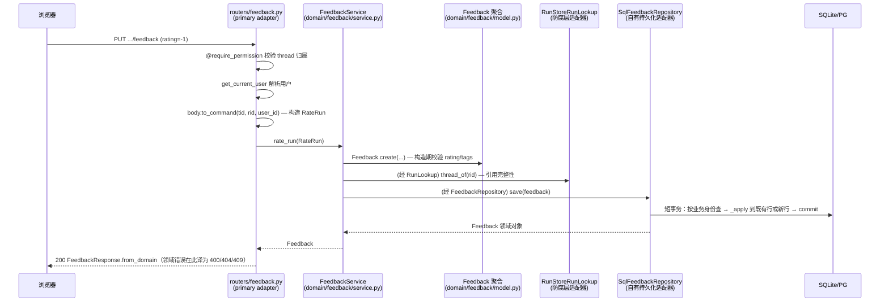

# 用户反馈（Feedback）模块设计

> [六边形设计规范](HEXAGONAL_ARCHITECTURE_zh.md) 的**参考实现走读**。本文假定你已读过规范：术语（端口、适配器、聚合、command、防腐层）与通用规则不再重复解释，只讲三件事——feedback 特有的产品决定、每条规范规则落在哪个文件、以及 feedback 特有的陷阱。读完你将能回答：一次点踩从浏览器到数据库经过哪些层、每层为什么只能做那些事、想加个字段该改哪几个文件。
>
> 姊妹文档：[SCHEDULE_DESIGN_zh.md](SCHEDULE_DESIGN_zh.md)——定时任务模块，同样的结构但复杂度高一个量级。

---

## 1. 这个模块做什么

给一次 agent 执行（run）点赞或点踩，可以附原因标签和文字评论。

产品层面的三条决定，解释了后面所有设计：

| 决定 | 后果 |
|---|---|
| **一个用户对一个 run 只有一个当前评价** | 写入是 upsert（"我现在的看法是 X"），不是 append；聚合身份是 `(thread_id, run_id, user_id)` 三元组 |
| **再点一次当前按钮 = 撤回** | 有 DELETE 用例，且撤回不存在的评价不是错误 |
| **评价回显嵌在消息列表里** | 没有独立的读端点；读路径为分页和全量各准备了一个批量方法 |

对应的 HTTP 面（`app/gateway/routers/feedback.py`）：

```
PUT    /api/threads/{tid}/runs/{rid}/feedback    设置当前评价（幂等）
DELETE /api/threads/{tid}/runs/{rid}/feedback    撤回
```

评价在业务上**与 run 绑定**。早期版本曾有一个可选的 `message_id`（把评价收窄到 run 内某一条消息），从未被任何读写方使用，属于冗余设计，已连同存储列一起移除（迁移 `0011_feedback_drop_message_id`）。

## 2. 内圈全景

```
domain/feedback/            对应规范 §2 的 domain 七件套
├── __init__.py             上下文公开 API：聚合 + 命令 + 错误 + 服务（端口刻意不导出）
├── model.py                Feedback（聚合根）· 2 个白名单常量        → 七件套 model/
├── exceptions.py           5 个领域错误，一个基类 FeedbackError      → 七件套 exceptions/
├── commands.py             RateRun · RetractRunRating               → 七件套 commands/
├── ports.py                FeedbackRepository · RunLookup           → 七件套 ports/
└── service.py              FeedbackService（写方法即 handler）       → 七件套 command_handlers/
```

`model.py` 是**单文件**而非目录，因为这里只有一个聚合、没有值对象、没有状态机——对比 schedule 的 `model/` 包。模块规模决定形态，不必强行对称。events 缺席：feedback 的业务事实目前没有任何跨上下文订阅方（规范 §3.2 的触发条件未到）。

`__init__.py` 的导出策略值得注意：**它导出聚合、命令、错误和服务，但不导出端口**。端口是给适配器和测试用的契约，不是日常调用点的符号，所以要写 `from deerflow.domain.feedback.ports import FeedbackRepository`——多打几个字，换来"谁在实现契约"这件事在 import 里就看得见。

## 3. `Feedback`：规则本体

一个 frozen dataclass。

### 3.1 字段与身份

```python
@dataclass(frozen=True)
class Feedback:
    feedback_id: str          # 代理主键，工厂生成的 uuid4
    run_id: str               # ┐
    thread_id: str            # ├ 业务身份三元组
    rating: int               # │ (thread_id, run_id, user_id)
    user_id: str | None = None# ┘
    comment: str | None = None
    tags: tuple[str, ...] = ()
    created_at: datetime = field(default_factory=lambda: datetime.now(UTC))
```

**两套身份，别混。** `feedback_id` 是行的代理主键；决定"是不是同一条评价"的是 `(thread_id, run_id, user_id)`。upsert 按业务身份查找、更新时**保留原有的 `feedback_id`**——这条契约由适配器的 `_apply` 设计承载（代理主键不在其中，见 §7.1），契约测试 `test_save_updates_keeping_identity` 逐字段盯着它。前端如果拿 `feedback_id` 做 key，重新评价后 key 不变。

`user_id` 可以是 `None`——那是免鉴权模式（`database.backend` 无认证部署）。读方法的 `None` 表示不按所有者过滤；**删除路径的 `None` 语义不同**，见 §5.2。

### 3.2 创建即一致

```python
def __post_init__(self):
    if self.rating not in VALID_RATINGS:      # (-1, 1)
        raise InvalidRatingError(...)
    unknown = set(self.tags) - VALID_FEEDBACK_TAGS
    if unknown:
        raise InvalidTagError(...)
```

校验在 `__post_init__`，不在工厂里，所以**绕不过去**：`Feedback.create(...)` 和直接构造走同一条路（`test_direct_construction_also_validates` 盯着这条）。适配器从数据库读出来重建对象时也会过这一遍——一行手工改坏的数据在读取时就会炸，而不是流到前端。

推论一条：**非法输入永远在任何 IO 之前报错**。handler 先构造聚合再查 run（见 §6.2），所以一个非法 rating 配一个不存在的 run，报的是 `InvalidRatingError` 而不是 `RunNotFoundError`。

`Feedback.create` 的参数是散装关键字参数——这是规范 §2.1 变形 ② 的规定形态（工厂参数 = 聚合字段减代理主键，永不收 command）；feedback 的六个参数彼此独立、无可聚类的领域概念，所以没有值对象。

### 3.3 tags 是语言中立的 slug

```python
VALID_FEEDBACK_TAGS = frozenset({
    "incorrect", "not_as_expected", "slow", "style_tone", "safety_legal", "other",
})
```

白名单在领域里，翻译在前端。存储和分析只见 slug，所以中文界面和英文界面提交的"回答不对"能聚合到一起。加标签见 §10.2。

### 3.4 时间戳的真相源

`created_at` 是**记账戳**，由聚合构造时刻确定（`default_factory` 读时钟），upsert 更新时随新聚合刷新——语义是"当前这份看法是什么时候给出的"。它**不参与任何业务规则**（没有"超过 N 天的评价失效"这类逻辑），所以允许 `default_factory` 读时钟；一旦时间成为**规则输入**，必须改为显式 `now=` 传参（规范 §4 的时钟规则管的是后者，schedule 的 `next_after(now)` 是对照实例）。存储侧：`_apply` 把聚合的 `created_at` 写入行，读回经 `_tz_aware` 补时区——聚合构造时刻是唯一真相源，适配器不打自己的时间戳。

### 3.5 `frozen=True` 意味着什么

聚合不可变。想改评价就构造一个新的，没有 setter，没有"半更新"的中间态（`test_frozen` 盯着）。代价是仓储的 `save` 只能是整体替换语义——这正是端口签名 `save(feedback)` 的原因。

## 4. Commands：写用例的具名载体

`commands.py` 是规范 §3.1"写用例一律 command 化"的落地：

| Command | Handler | 请求模型 |
|---|---|---|
| `RateRun` | `FeedbackService.rate_run` | `RateRunRequest` |
| `RetractRunRating` | `FeedbackService.retract_run_rating` | 无 body，端点内直接构造 |

命名链三种拼写互为变体（规范 §2.1），grep 任何一个就能找到用例全部三层。

**command 是哑数据**：不做业务校验——rating 合法性归聚合 `__post_init__`，结构校验归 router 的 api model。所以"非法 rating 先于未知 run 报错"的归因顺序由 handler 的构造顺序拥有，`test_command_is_dumb_data` 钉这条。

**查询刻意不 command 化**：`latest_per_run_in_thread` / `latest_for_runs` 收普通参数——command 表达改变状态的意图，包装读操作是纯样板。

**身份不进请求模型**：`RateRunRequest` 上没有也不许有 `user_id` 字段，它由服务端解析后经 `to_command(thread_id, run_id, user_id)` 注入（规范 §2.1 变形 ①）。

## 5. 端口：领域对外的两个依赖

| 端口 | 回答什么问题 | 方法数 |
|---|---|---|
| `FeedbackRepository` | 评价存在哪、怎么按所有者过滤、并发 upsert 冲突怎么表达 | 4 |
| `RunLookup` | 这个 run 属于哪个 thread | 1 |

### 5.1 两条约定，比签名更重要

**① 读路径的所有者过滤是参数，不是异常。** 读方法收 `user_id: str | None`：非 `None` 时限制到该用户的条目，`None` 表示不过滤（免鉴权模式）。别人的评价表现为"查不到"，而不是抛权限错误。

**② 并发 upsert 的败者必须翻译成领域错误。** 两个并发请求可以都没查到、都去插入，输的那个撞上唯一约束。适配器负责把 `IntegrityError` 翻译成 `DuplicateFeedbackError`，router 再映射成 HTTP 409 让客户端重试。旧代码在这里泄漏了驱动异常，结果是 500。

### 5.2 删除路径的 `None` 是等值匹配，不是"不过滤"

`remove_for_run` 与读方法**刻意不对称**：所有权是**等值匹配**——非 `None` 只删该用户的条目，`None` 只匹配 NULL 所有者的条目（免鉴权模式写下的），**不是**"无视所有者删除"。删除绝不能跨所有者，端口 docstring 与契约用例 `test_remove_for_run_none_user_matches_only_null_owner`（两实现各跑一遍）共同钉死这条语义。

### 5.3 两个刻意的缺席

**没有 `find_one` / `get_by_id`。** 读路径只有批量方法，因为唯一的消费者是消息列表回显——它要的是"这一页所有 run 的当前评价"。加单条读方法就要有人回答"谁在用它"。

**`RunLookup` 里没有 `user_id`。** 它只回答纯事实"run 属于哪个 thread"，不掺授权——授权是两环链条，见 §6.2。feedback 需要知道的关于 run 的全部事情就是这一问，而 run 上下文的仓储有 26 个方法；依赖一个方法而不是 26 个，收益是 `domain/feedback/` 整个包里没有一行提到 `RunStore`。代价是外圈要写一层防腐层，见 §7.2。

## 6. 应用服务：用例编排

构造函数收两个端口，之后只见 Protocol 类型。

### 6.1 用例清单

| 方法 | 输入 | 支撑 | 领域错误 |
|---|---|---|---|
| `rate_run(cmd)` | `RateRun` | `PUT /feedback` | `InvalidRatingError` / `InvalidTagError` / `RunNotFoundError` / `DuplicateFeedbackError` |
| `retract_run_rating(cmd)` | `RetractRunRating` | `DELETE /feedback` | — |
| `latest_per_run_in_thread(...)` | 普通参数 | 消息列表全量路径 | — |
| `latest_for_runs(...)` | 普通参数 | 消息列表分页路径 | — |

服务自身**不含业务规则**：rating 和 tags 的合法性归聚合，所有者匹配归仓储，它只负责"按什么顺序调用谁"。

### 6.2 `rate_run`：顺序是设计，不是随意

```python
feedback = Feedback.create(              # ① 先构造：规则校验在此
    run_id=cmd.run_id, thread_id=cmd.thread_id, rating=cmd.rating, ...)
await self._require_run(cmd.thread_id, cmd.run_id)  # ② 再查 run：引用完整性
return await self._repository.save(feedback)        # ③ 最后落库
```

**① 在 ② 之前**，所以错误归因不受 IO 结果影响。`test_invalid_rating_rejected_before_run_lookup` 钉这个顺序。

**② 是引用完整性，不是授权。** 授权是两环链条：

```
router 的 @require_permission(..., owner_check=True)  ->  你拥有这个 thread
service 的 _require_run                              ->  run 属于该 thread
                          两者合起来               ->  你拥有这个 run
```

这解释了为什么 `RunLookup.thread_of` 签名里没有 `user_id`：第一环已经证明了 thread 归属，第二环只需回答纯事实。少了任何一环都不成立。

### 6.3 读路径为什么有两个方法

`latest_per_run_in_thread` 拉整个 thread，`latest_for_runs` 只拉指定的一批 run——后者给消息列表分页端点用，一页只需要这一页那几个 run 的角标。两者都是**批量**方法，返回 `dict[run_id, Feedback]`，一次查询覆盖一页（防 N+1，规范 §5.2 读链路的实例）。

### 6.4 `retract` 为什么不查 run

写路径校验引用完整性，删路径不校验，这个不对称是有意的：删一条不存在的评价本来就返回 `False`（router 转成 404），多一次 `RunLookup` 调用不改变任何结果，只是多一次 IO。

## 7. 适配器与组合根

两个从适配器住在 `app/adapters/feedback/`，一个端口一个文件；两形态判据见规范 §2。

### 7.1 `feedback_repository.py`：自有持久化

`SqlFeedbackRepository` 只做两种翻译：

1. **领域对象 ↔ ORM 行**：`_to_domain(row)` / `_apply(row, feedback)`（规范 §2.1 变形 ③r/③w）。`_apply` 就地全字段赋值，**一份字段清单同时服务 insert 与 update**——新字段不可能"插入有值、更新静默丢失"；代理主键 `feedback_id` 刻意不在其中（insert 构造行时定死，upsert 因此天然保留既有身份）。显式列字段而非 `**asdict()`：新列在被刻意映射前不进出数据库。
2. **技术异常 → 领域错误**：`IntegrityError → DuplicateFeedbackError`。

外加一件跨数据库的脏活：`_tz_aware()`。SQLite 读回来的 `datetime` 丢了 tzinfo，而存进去的一律是 UTC，读路径统一补回——**读取归一化只发生在 `_to_domain` 这一个地方**，`tests/test_persistence_timezone.py` 盯着它。

session 生命周期 = 一个端口方法（每方法一个短事务）。没有跨方法的事务，也没有 unit-of-work——feedback 的用例都是单聚合操作，不需要。

类 docstring 自带一条继承警示（规范 §4 也有）：显式继承 Protocol 只是可读性提示，拼错方法名不会报错、只会静默返回 `None`——契约套件必须覆盖每个端口方法并断言返回值，实证见 §11.1。

### 7.2 `run_lookup.py`：防腐层

`RunStoreRunLookup` 全部实现就是三行：

```python
async def thread_of(self, run_id: str) -> str | None:
    run = await self._run_store.get(run_id)
    return run.get("thread_id") if run else None
```

把 26 个方法的 `RunStore` 收窄成 1 个问题，顺带把 `RunStore.get()` 返回的 `dict[str, Any]` 挡在领域外面。文件里的 `TODO(hexagonal)` 写的是触发条件（run 上下文发布 DTO 契约时替换类体，端口不动）——防腐层是上下游关系的正常形态，不是欠债。真正需要警惕的是这层**没有对真实 `RunStore` 的契约测试**，见 §11.2。

### 7.3 组合根

`app/composition.py::build_domain_services()` 是适配器唯一的实例化点——纯函数，收已建好的基础设施、返回装配结果，由 `deps.py::langgraph_runtime` 在启动时调用：

```python
return DomainServices(
    feedback=FeedbackService(
        repository=SqlFeedbackRepository(session_factory),
        runs=RunStoreRunLookup(run_store),
    ),
)
```

`session_factory is None`（memory 后端）时服务为 `None`，router 的依赖返回 503——装配抽成纯函数正是为了让这条规则可被 `tests/test_composition.py` 断言，而不是靠 lifespan 里的一行注释。

## 8. 一次点踩的旅程



逐层职责：Router 只做协议转换（构造 command、渲染白名单响应、映射错误码）；Service 编排（§6.2 的顺序）；聚合持有全部规则；适配器只翻译不编排；组合根决定谁实现哪个端口。**回显不走独立端点**：消息列表接口经 `latest_per_run_in_thread` / `latest_for_runs` 批量取每个 run 的当前评价嵌进消息数据——前端按钮高亮由此而来。

## 9. 测试分层

分层与架构一一对应，失败定位因此清晰：

| 测试文件 | 层 | 规模 | 红了说明 |
|---|---|---|---|
| `test_feedback_domain.py` | 聚合 | 9 | 业务规则错 |
| `test_feedback_service.py` | 用例编排（双 fake 端口） | 10 | 编排顺序或错误映射错 |
| `test_feedback.py::FeedbackRepositoryContract` | 端口契约 × 2 实现 | 12 × 2 | 存储实现与端口语义漂移 |
| `test_composition.py` | 组合根 | 2 | 装配规则错（memory → None） |
| `test_persistence_timezone.py` | 适配器细节 | 1 | SQLite 时区归一化坏了 |
| `test_thread_messages_feedback.py` | 回显集成 | — | 消息列表拼装坏了 |

**契约测试的形状**值得学：`FeedbackRepositoryContract` 是一个不带 `Test` 前缀的基类（pytest 不直接收集），`TestSqlFeedbackRepository` 和 `TestInMemoryFeedbackRepository` 各自继承并提供 `repo` fixture——一套语义用例，两套实现各跑一遍。**零 IO 的 fake 住在 `tests/feedback_fakes.py`**，不在测试文件里——契约套件和服务测试都能当普通模块 import。

`test_feedback_service.py` 是规范 §1「唯一检验」的活样本：整个用例在两个 dict fake 上端到端跑通，零 IO、零 HTTP。

## 10. 二次开发指引

### 10.1 给评价加一个字段

以加 `model_name`（记录被评价的 run 用了哪个模型）为例，改动顺序：

1. `model.py` — `Feedback` 加字段；如果有合法值约束，在 `__post_init__` 里加校验
2. `test_feedback_domain.py` — 先写红的测试（TDD 是这个仓库的硬要求）
3. `commands.py` — 用户要能提交它才加（`RateRun` 加字段，router 的 `to_command` 跟着传）；服务端派生的字段不进 command
4. ORM 层 — `deerflow/persistence/feedback/model.py` 加列，并在 `migrations/versions/` 加一个 alembic revision（**每个 ORM 变更都必须有 revision**，见 backend/AGENTS.md）
5. `feedback_repository.py` — `_to_domain` / `_apply` 各加一行（`_apply` 的一份清单覆盖 insert 与 update，不存在第三处要同步的写路径）
6. `tests/feedback_fakes.py` — fake 通常不用改（它存整个聚合）
7. `routers/feedback.py` — 要不要进请求/响应模型？**默认不进**，除非前端真的需要

端口签名不用动——`save(feedback)` 传的是整个聚合。

### 10.2 加一个原因标签

改 `model.py` 的 `VALID_FEEDBACK_TAGS`，加 slug；前端加翻译。不要在前端硬编码后端没有的 slug——`InvalidTagError` 会拦下来（有意的：白名单在领域侧才能保证分析口径统一）。

### 10.3 加一个用例

比如"导出某 thread 的全部评价"：

1. 端口够用吗？`latest_per_run_in_thread` 可能已经够。够就不要加端口。
2. 不够则先在 `ports.py` 加方法并写清语义（docstring 是契约测试的依据）
3. `FeedbackRepositoryContract` 加用例——**两套实现都必须跑通，并断言返回值**
4. 两个实现各自实现
5. 写用例则在 `commands.py` 加 command（命名链三拼写对齐）；`service.py` 加方法，`test_feedback_service.py` 用 fake 测
6. router 加端点，只做协议转换（有 body 则请求模型加 `to_command`）

### 10.4 换存储

实现 `FeedbackRepository` 的四个方法，在契约套件里加一个继承 `FeedbackRepositoryContract` 的测试类，改组合根一行。领域和 service 一行不动——这是六边形买到的东西，`test_harness_domain_purity.py` 保证它不退化。

### 10.5 不要做的事

规范 §4 的规则清单全部适用；feedback 语境下最常犯的四条：

- **不要在 router 里写业务判断。** rating 合法性、tags 白名单、引用完整性都有归属。
- **不要给 `RunLookup` 加方法来"顺便"拿 run 的别的信息。** 需要更多就说明该等 run 上下文发布契约，或你的用例应该住在别的上下文。
- **不要用 `**asdict()` 简化 `_apply` 或 command 解包。** 显式字段列表是闸门。
- **不要让身份字段出现在请求模型上。** `user_id` 只能经 `to_command` 参数注入。

## 11. 常见陷阱速查

### 11.1 显式继承 Protocol 会把拼错的方法名变成静默 `None`

真实发生过：`latest_per_run_in_thread` 一度被写成 `latest_per_run_i_thread`（少一个 `n`）。因为适配器显式继承 Protocol，方法体 `...` 被继承，真方法退化成"返回 `None` 的空实现"——**没有 `AttributeError`**。抓到它的是契约套件里断言返回值的用例；`isinstance(repo, FeedbackRepository)` 抓不到（`runtime_checkable` 只查方法名存在，继承使名字总是存在）。所以"契约套件覆盖每个端口方法并断言返回值"不是可选项。

### 11.2 `RunLookup` 没有对真实 `RunStore` 的契约测试（已知缺口，最高优先级）

`RunStoreRunLookup` 只在 fake 层面被覆盖。失效路径很具体：`RunStore.get()` 返回 `dict[str, Any]`，适配器靠 `run.get("thread_id")` 取值——键改名则 `thread_of` 对所有 run 返回 `None`、所有点踩变 404，而测试全绿。防腐层的价值是把不受控的外部形状挡在门外，门本身没被测过，挡不挡得住是运气。

### 11.3 upsert 更新时不要换 `feedback_id`

按业务身份三元组查到已有行时保留原 `feedback_id`——`_apply` 不含代理主键正是为此。前端可能用它做列表 key，换掉会导致组件重挂载。

### 11.4 SQLite 读回的时间没有 tzinfo

一律经 `_to_domain` 的 `_tz_aware()` 补 UTC。绕过 `_to_domain` 自己组装 `Feedback` 就会漏掉这一步。

### 11.5 `user_id=None` 在读和删两侧语义不同

读路径 `None` = 不按所有者过滤；删除路径 `None` = **只匹配 NULL 所有者的条目**（等值匹配，见 §5.2）。混淆两者的后果是免鉴权与鉴权混合部署时删错行——契约用例已钉死正确语义。

### 11.6 并发 upsert 的 409 不是 bug

两个并发请求都没查到、都插入，输的那个撞唯一约束 → `DuplicateFeedbackError` → HTTP 409，客户端重试即可。旧代码这里泄漏 `IntegrityError`，返回的是 500。

## 12. 代码索引

| 关注点 | 文件 |
|---|---|
| 聚合、不变量、白名单常量 | `packages/harness/deerflow/domain/feedback/model.py` |
| 领域错误（一族一基类） | `packages/harness/deerflow/domain/feedback/exceptions.py` |
| 命令（写用例的输入载体） | `packages/harness/deerflow/domain/feedback/commands.py` |
| 端口契约（语义写在 docstring 里） | `packages/harness/deerflow/domain/feedback/ports.py` |
| 用例编排（写方法即 command handler） | `packages/harness/deerflow/domain/feedback/service.py` |
| 上下文公开 API | `packages/harness/deerflow/domain/feedback/__init__.py` |
| SQL 适配器（`_to_domain` / `_apply`） | `backend/app/adapters/feedback/feedback_repository.py` |
| 防腐层适配器 | `backend/app/adapters/feedback/run_lookup.py` |
| HTTP 入口 + api model + 错误映射 | `backend/app/gateway/routers/feedback.py` |
| 组合根 | `backend/app/composition.py::build_domain_services` |
| ORM 行 + 迁移 | `packages/harness/deerflow/persistence/feedback/model.py`、`migrations/versions/0011_feedback_drop_message_id.py` |
| 零 IO fake | `backend/tests/feedback_fakes.py` |
| 测试分层 | 见 §9 |
