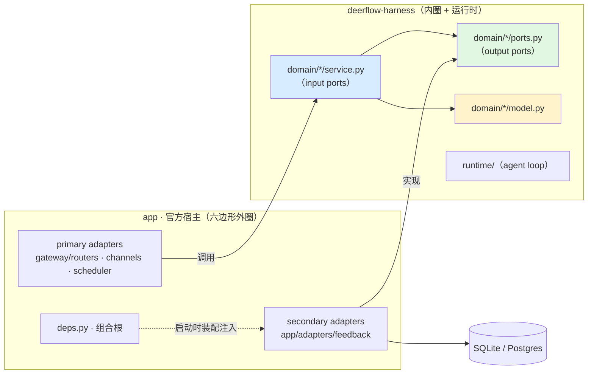

# DeerFlow 后端架构：六边形设计

> 面向想理解 DeerFlow 后端架构的学习者。读完你将能回答：任何一段后端代码，为什么在它所在的位置。
>
> **本文只讲规则**，不讲某个模块的具体样子。想看规则落到真实代码上、想动手改一个模块，读对应的模块文档：
>
> - [FEEDBACK_DESIGN_zh.md](FEEDBACK_DESIGN_zh.md) —— 用户反馈模块，首个完成的切片，最简单的样板
> - [SCHEDULE_DESIGN_zh.md](SCHEDULE_DESIGN_zh.md) —— 定时任务模块，两个聚合 + 两个状态机 + 四道并发防线（**尚在 `rayhpeng/hexagonal-scheduling-slice` 分支，未合并到本分支**）
>
> 编码规约见 `backend/AGENTS.md`。

---

## 1. 两个正交的边界

DeerFlow 后端由两个互相垂直的边界切分，理解它们是理解一切的前提。

**边界一：harness / app —— 回答"哪些代码可复用发布"。**

- `packages/harness/deerflow/`（import 前缀 `deerflow.*`）：可独立发布的 agent 框架包——agent 循环、工具、沙箱、MCP、技能、配置；
- `app/`（import 前缀 `app.*`）：不发布的应用层——FastAPI Gateway 与 IM 渠道集成。

依赖单向：app 可以 import deerflow，deerflow 永不 import app（CI 中 `tests/test_harness_boundary.py` 执法）。

**边界二：内圈 / 外圈 —— 回答"业务规则与技术细节谁依赖谁"。**

这是六边形架构引入的维度：**业务核心（内圈）不依赖任何基础设施（外圈）；基础设施实现业务声明的接口**。两个边界叠加后的切分规则一句话：

> **domain（模型 + 端口 + 应用服务）归 harness；adapters + 入口 + 组合根归 app。**

历史上仓库只有边界一，于是持久化实现以"框架能力"的名义沉进了 harness，业务规则以"应用胶水"的名义散进了 router——两个维度被一条边界承担。六边形重构补上的就是第二个维度。

## 2. 六边形架构究竟是什么

真名是 **Ports & Adapters**（Cockburn, 2005）。"六边形"只是画图的偶然，六条边没有任何含义。它的全部内容是一个观念转变加一条规则：

> **应用只有"内外"之分，没有"上下"之分。** 数据库和浏览器没有本质区别——它们都是站在边界外、想与业务核心对话的外部世界。传统分层图把数据库画成业务的"地基"，这是错觉；六边形把它掰起来，与 UI 摆在同一圈上，降格为业务的一个"插件"。

**唯一规则**：依赖箭头永远从外指向内。核心声明接口（port），外部世界各自带转换头（adapter）来插。调用可以由内向外发起（业务调仓储），但依赖方向始终向内（仓储实现的是业务声明的接口）——调用方向与依赖方向解耦，这就是"依赖反转"的准确含义。

**唯一检验**：业务逻辑能否在没有 HTTP、没有数据库的测试里（全部换成 fake）完整运行。能，就实现了；不能，无论目录叫什么名字都没实现。DeerFlow 的 `tests/test_feedback_service.py` 就是这个检验的活样本：整个 feedback 用例在零 IO 的 dict fake 上端到端跑通。



**与 AWS 官方指南的对应。** DeerFlow 的分层直接采用 AWS Prescriptive Guidance《Building hexagonal architectures on AWS》的划分：应用分成三个文件夹——入口（主适配器）、领域（领域**与接口**）、适配器（从适配器）：

| AWS 概念 | AWS 建议的位置 | DeerFlow 对应 |
|---|---|---|
| 入口 / primary adapters | `entrypoints/` | `app/gateway/routers/`、`app/channels/`、scheduler |
| 领域 + 接口 | `domain/`（`ports/` 是它的**子目录**） | `packages/harness/deerflow/domain/<模块>/`，`ports.py` 在包内 |
| 从适配器 / secondary adapters | `adapters/` | `app/adapters/<上下文>/` |

**端口属于领域，不是独立一层**——AWS 明确把 `ports/` 放在 `domain/` 之下，描述为"领域借以与数据库、API 或其他外部组件通信的抽象"。把端口抽成与领域平级的第三层是常见误读：那会让领域反过来依赖一个外部包才能声明自己的需求，恰好破坏依赖倒置。

DeerFlow 的两处偏离，都是有意的：`entrypoints/` 沿用仓库既有的 `app/gateway/routers/`（改名收益不抵影响面）；**组合根 AWS 未定义**——那份指南没有这个概念，DeerFlow 的组合根（`app/gateway/deps.py::langgraph_runtime`）是自己的工程判断，实例见 [FEEDBACK_DESIGN_zh.md](FEEDBACK_DESIGN_zh.md) §7.3。

## 3. 内圈的三个构件

每个已迁移的业务模块在 `packages/harness/deerflow/domain/<模块>/` 下由三个文件组成，纪律各不同：

| 文件 | 职责 | 纪律 |
|---|---|---|
| `model.py` | **聚合**：业务事实与不变量 | 零依赖（仅标准库）；不知道存储和 HTTP 的存在；不变量在构造期校验（"创建即一致"） |
| `ports.py` | **端口**：领域声明的接口（`typing.Protocol`） | 技术中立——签名里不允许出现 SQL、表名、文件路径等词汇 |
| `service.py` | **应用服务**：用例编排 | 内圈里唯一调用 output port 的构件；`user_id` 显式传参；自身不含业务规则 |

一个关键理解："service 调用 port"是合法的——**port 是 domain 自己声明、自己拥有的接口**，调用自己的抽象不构成对外圈的依赖。运行时注入的实现来自外圈（`app/adapters/`），但 service 只见 Protocol 类型。

方向要分清：**output port 是"注入进来"**（组合根把 SQL adapter 塞进 service 构造函数），**input port 是"暴露出去"**（service 本身就是 input port 实现体，router 从 `app.state` 拿到后调用）。

三个文件不是硬性文件数，是三种纪律：模块简单时 `model.py` 是单文件（feedback），复杂到有多个聚合和值对象时它是一个包（schedule 的 `model/`）。想看这三层在真实代码里长什么样、以及一个请求怎么穿过它们，读 [FEEDBACK_DESIGN_zh.md](FEEDBACK_DESIGN_zh.md) §3–§8。

## 4. 从适配器的两种形态

同一个上下文的从适配器看起来同级，性质可能完全不同。以 feedback 的两个为例——`SqlFeedbackRepository` 自己写 SQL，`RunStoreRunLookup` 一行 SQL 也没有。分辨靠两个问题：

1. **这些表归我这个上下文所有吗？**
2. **我自己写 SQL、知道表结构吗？**

| | 两问皆是 | 两问皆否 |
|---|---|---|
| 名称 | **自有持久化** | **防腐层**（ACL） |
| 例子 | `SqlFeedbackRepository` | `RunStoreRunLookup` |
| 文件 | `feedback_repository.py` | `run_lookup.py` |
| 触达 | `feedback` 表（feedback 上下文自有） | `runs` 表（run 上下文所有） |
| 手段 | 自己的 ORM 查询与短事务 | 调用 run 上下文已有的 `RunStore` |
| 类名前缀 | `Sql` | 被包装者的名字（`RunStore`） |
| docstring 首行标记 | `Secondary adapter (owned persistence)` | `Secondary adapter (anti-corruption layer)` |

**命名惯例**：文件名取端口名的 snake_case，性质与技术**不进文件名**——分别由类名前缀和 docstring 首行的固定标记承载。`Sql` 前缀读作"我自己写 SQL"，`RunStore` / `ThreadStore` 这类前缀读作"我借道那个组件"。

想找出全部防腐层，grep 标记即可：

```bash
grep -rl "anti-corruption layer" app/adapters/
```

**为什么不用 `sql_` / `acl_` 文件名前缀**（这个方案被评估过并否决）：

1. 前缀是**实现属性**而非身份属性。文件的身份是"实现哪个端口"；换存储时 `sql_` 就得改名，但端口没变、import 路径理应不动——技术选择泄漏到结构上，正是六边形要避免的。
2. 冗余：`from app.adapters.feedback.sql_feedback_repository import SqlFeedbackRepository` 里 "sql" 出现两次。
3. `acl` 在本仓库会被读成 access control list（`app/gateway/authz.py` 就在隔壁）。而且 ACL 不是一种技术，是一种**关系**——`RunStoreRunLookup` 里的 `RunStore` 已经把关系说清楚了。

**前缀真正有价值的时机**：同一端口在生产代码里有多个实现并存。目前 `FeedbackRepository` 只有一个生产实现（内存版只存在于 `tests/feedback_fakes.py`）。到那天再引入 `sql_` / `memory_`，届时改名有正当理由。

**防腐层不是欠债，是上下游关系的正常形态。** feedback 是下游（Customer），run 是上游（Supplier）；上游还没有发布正式契约之前，下游为它写一层防腐层正是 DDD 给的标准答案。但要在代码里写清楚它何时会变——**TODO 应描述触发条件，而不是抱怨现状**：

`app/adapters/feedback/run_lookup.py` 里的实际写法（代码注释统一用英文，与仓库其余部分一致）：

```python
    TODO(hexagonal): this depends on ``RunStore``, an infrastructure
    component, rather than on a contract published by the run context --
    that context has not been through a hexagonal slice yet. When it
    publishes one (a DTO, not its aggregate and not its repository),
    replace the body of this class. The ``RunLookup`` port does not move.
```

最后一句是这层设计买到的东西：上游重构时，改动范围是一个文件，端口与领域一行不动。

## 5. 规则如何被守住

规则不自动执法就会退化，DeerFlow 用三层机械手段守住边界：

| 手段 | 位置 | 守住什么 |
|---|---|---|
| AST 边界测试 | `tests/test_harness_boundary.py` | harness 永不 import `app.*` |
| AST 纯度测试 | `tests/test_harness_domain_purity.py` | `domain/` 永不 import sqlalchemy / fastapi / pydantic / app / harness 基础设施模块——"内圈零依赖"的机器可验证形式 |
| 契约测试 | `tests/test_feedback.py` | `FeedbackRepositoryContract` 一套用例，由 `TestSqlFeedbackRepository` 与 `TestInMemoryFeedbackRepository` 各跑一遍——port 语义与实现不漂移；这也是"全 fake 可运行"检验的常态化 |

测试分层与架构分层一一对应，失败定位因此清晰：域测试红 = 业务规则错；service 测试红 = 编排错；契约测试红 = 存储实现错。具体模块的测试分层表见各切片文档（如 [FEEDBACK_DESIGN_zh.md](FEEDBACK_DESIGN_zh.md) §9）。

**契约套件必须断言返回值，不能只断言"端口被满足"。** 一个显式继承 `Protocol` 的适配器，拼错方法名不会抛 `AttributeError`——Protocol 的方法体是 `...`，真方法退化成"返回 `None` 的空实现"，而 `isinstance(repo, SomePort)` 依然为真（继承使得方法名总是存在）。这不是理论风险，feedback 切片真实踩过，见 [FEEDBACK_DESIGN_zh.md](FEEDBACK_DESIGN_zh.md) §11.2。

## 6. 现状地图：哪些已迁移、哪些还没有

六边形是渐进迁移，当前状态：

| 模块 | 状态 | 代码位置 | 模块文档 |
|---|---|---|---|
| **Feedback** | ✅ 已迁移（首个垂直切片，后续模块的样板） | `domain/feedback/` + `app/adapters/feedback/` | [FEEDBACK_DESIGN_zh.md](FEEDBACK_DESIGN_zh.md) |
| **Scheduling** | 🚧 内圈完成、外圈进行中（另一分支） | `domain/schedule/` + `app/adapters/schedule/` | [SCHEDULE_DESIGN_zh.md](SCHEDULE_DESIGN_zh.md) |
| Run / ThreadMeta / RunEvent | 旧模式（有抽象基类 + 双实现，待领域化） | `runtime/*/store/`、`persistence/` | — |
| Channel / 配置写路径等 | 旧模式（待迁移） | `persistence/*/sql.py`、`gateway/routers/` | — |

阅读旧模式代码时请注意：它们代表**迁移前的形态**（仓储返回裸 dict、领域规则散落、哨兵式用户解析），不要以它们为新代码的模板——新模块一律复制 Feedback 的形状（上述纯度测试会拦截倒退）。

**跨模块的收尾待办**，按优先级：

| # | 待办 | 为什么 |
|---|---|---|
| 1 | 补 `RunStoreRunLookup` 对真实 `RunStore` 的契约测试 | 唯一有实质风险的一项，见 [FEEDBACK_DESIGN_zh.md](FEEDBACK_DESIGN_zh.md) §11.1 |
| 2 | 装配抽成纯函数 `app/composition.py::build_domain_services()` | 组合根现在与启动流程混在一个函数里，无法单测；"memory 后端 → 503"这条规则目前只有一行注释在守 |
| 3 | 依赖注入改用 `Annotated[FeedbackService, Depends(get_feedback_service)]` 别名 | 测试可用 `dependency_overrides` 替换 service，不必再直接摸 `app.state` |
| 4 | 端口 `thread_of` 是否收窄成 `belongs_to_thread(run_id, thread_id) -> bool` | 判断内聚进端口，并与 schedule 的 `ThreadLookup.exists_for_user` 对称（未决） |

第 3 项注入的仍是**应用级单例 service**，不是 per-request session——事务边界留在端口方法内部，路由不该知道 session 的存在。

## 7. 术语表

| 术语 | 含义 | DeerFlow 对应 |
|---|---|---|
| Domain（领域核心） | 纯业务规则，零基础设施依赖 | `domain/feedback/model.py` |
| Port（端口） | 领域声明的技术中立接口，**位于 domain 包内** | `FeedbackRepository`、`RunLookup`（Protocol） |
| Input port | 用例接口，被入口调用 | `FeedbackService.rate_run(...)` |
| Output port | 领域对外依赖，被基础设施实现 | `FeedbackRepository.save(feedback)` |
| Primary adapter（入口） | 外部协议 → 用例调用；AWS 称 `entrypoints/` | `gateway/routers/`、`channels/`、scheduler |
| Secondary adapter · 自有持久化 | 实现 output port，自己拥有表并写 SQL | `SqlFeedbackRepository` |
| Secondary adapter · 防腐层 | 实现 output port，把别的上下文的宽接口收窄 | `RunStoreRunLookup` |
| 组合根 | 适配器唯一的实例化地 | `app/gateway/deps.py::langgraph_runtime`（计划抽出 `build_domain_services()`） |
| 聚合 | 一致性边界，不变量构造期成立 | `Feedback` |
| 契约测试 | 多实现共用一套语义用例 | `FeedbackRepositoryContract` |

## 8. 延伸阅读

- 想基于此架构做扩展（加字段、加用例、换存储、加入口）→ 二次开发指南；
- 想了解写代码时的判定规则（什么放哪、什么禁止）→ `backend/AGENTS.md` 的分层规约章节；
- AWS Prescriptive Guidance，《Building hexagonal architectures on AWS》——
  [Best practices](https://docs.aws.amazon.com/prescriptive-guidance/latest/hexagonal-architectures/best-practices.html)
  给出本文 §2 采用的三文件夹结构，
  [Structure a Python project in hexagonal architecture using AWS Lambda](https://docs.aws.amazon.com/prescriptive-guidance/latest/patterns/structure-a-python-project-in-hexagonal-architecture-using-aws-lambda.html)
  是同一结构的 Python 落地示例；
- Cockburn 的 Ports & Adapters 原文（2005），"六边形"这个名字的出处。
