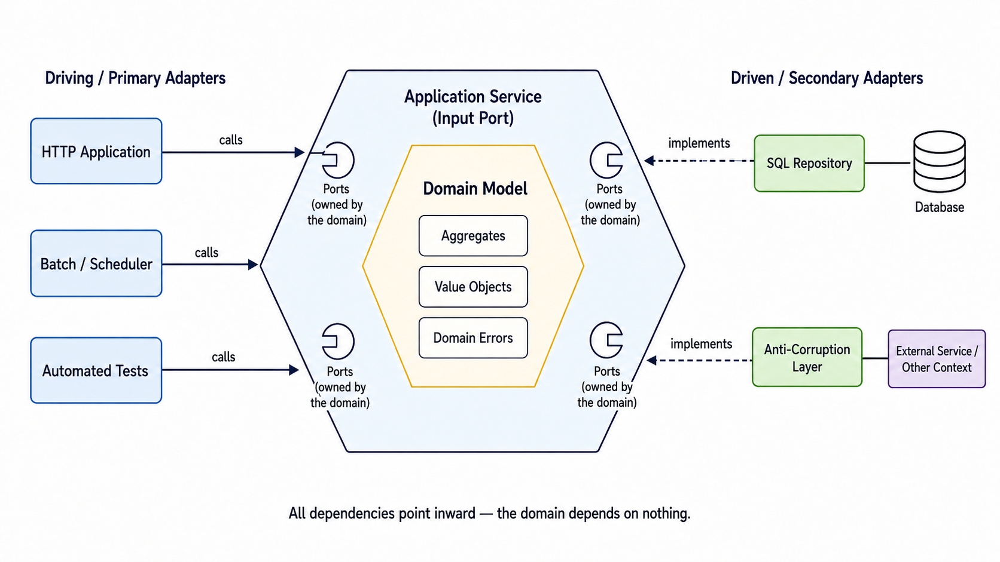
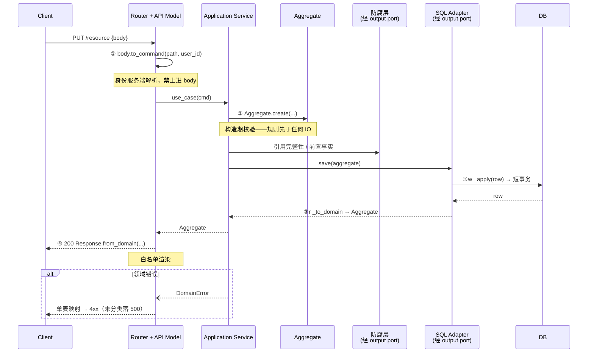
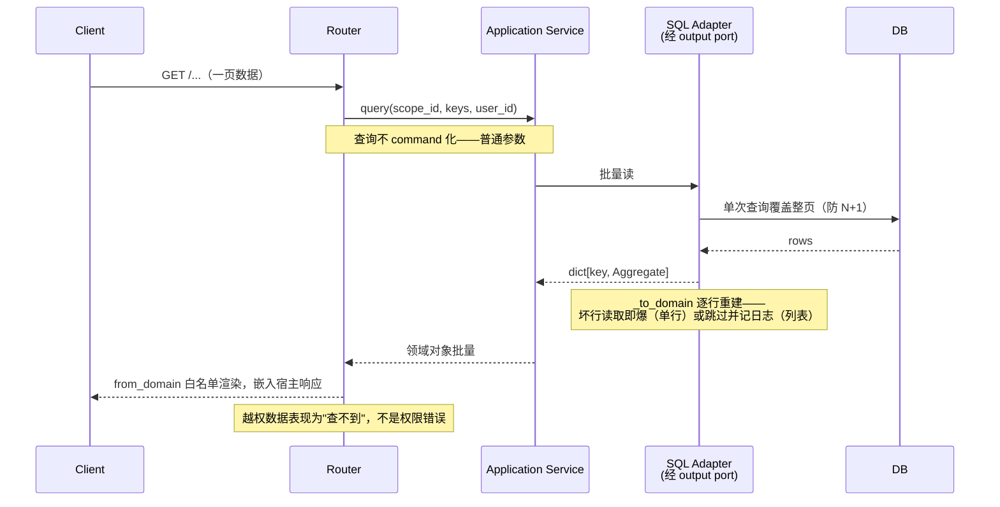

# DeerFlow 后端架构：六边形设计规范

> 本文是**规范**：新业务模块必须按此结构落地，代码与规范冲突时以规范为准。全文只讲标准形态，不绑定具体模块——规则落到真实代码上的样子，见参考实现的模块文档：[FEEDBACK_DESIGN_zh.md](FEEDBACK_DESIGN_zh.md) 与 [SCHEDULE_DESIGN_zh.md](SCHEDULE_DESIGN_zh.md)。编码规约见 `backend/AGENTS.md`。
>
> 引用标记 [C] / [G] / [B] / [P] 的出处见 §7。

---

## 1. 六边形架构是什么

真名 **Ports & Adapters**（Cockburn, 2005 [C]）。"六边形"只是画图的偶然。它的意图，原文一句话说尽：

> "Allow an application to equally be driven by users, programs, automated test or batch scripts, and to be developed and tested in isolation from its eventual run-time devices and databases." [C]
>
> （允许应用被用户、程序、自动化测试或批处理脚本**平等地**驱动，并且能在与最终运行期设备和数据库**隔离**的条件下开发与测试。）



| 图中概念 | 定义 | 规范落点 |
|---|---|---|
| Domain Model · Aggregates | 聚合：一致性边界，不变量在构造期成立 | `domain/<ctx>/model` |
| Domain Model · Value Objects | 值对象：无身份、按值比较；解析校验过的领域概念 | 同上 |
| Domain Model · Domain Errors | 领域自己的失败词汇——入口拿它们映射协议码，而不是让领域认识 409 | `exceptions.py` |
| Application Service（input port） | 用例编排的入口面，自身不含业务规则 | `service.py` |
| Ports | **领域自己声明、自己拥有**的技术中立接口，画在六边形的边上——它是六边形的一部分 | `ports.py` |
| Driving / Primary Adapters | 驱动应用的入口。Cockburn 点名 http 应用、批处理、**自动化测试**皆是 driver——"测试与真实入口平等"是定义的一部分 | 入口 + 时钟 + 回调 + service 测试 |
| Driven / Secondary Adapters | 实现端口的外部集成：自有持久化 与 防腐层 两形态（§2） | `app/adapters/<ctx>/` |
| External Service / Other Context | 对一个六边形而言，**同进程的邻居上下文也是外部世界**——这是防腐层存在的原因 | 防腐层的对接对象 |

**全图的题眼是两种箭头**：实线 "calls" 是调用方向（入口调进来，业务也经端口调出去）；虚线 "implements" 是依赖方向（适配器实现领域声明的接口）。调用可以双向穿越边界，**依赖永远指向内**——两者解耦即"依赖反转"的准确含义（[B]："the domain is the core of the application and doesn't depend on any other module"）。

**唯一检验**：业务逻辑能否在没有 HTTP、没有数据库的测试里（全部换成 fake）完整运行——参考实现的 service 测试套件就是这个检验的常态化：整个用例在零 IO 的 dict fake 上端到端跑通。

## 2. 标准结构

本仓库先有一条自己的边界：**harness（`deerflow.*`，可发布框架包）/ app（`app.*`，不发布应用层）**，依赖单向 app → harness。六边形叠加其上的切分规则一句话：

> **domain（模型 + 命令 + 端口 + 应用服务）归 harness；adapters + 入口 + 组合根归 app。**

结构直接采用 AWS Prescriptive Guidance 的三文件夹划分——"entrypoints (primary adapters), domain (domain and interfaces), and adapters (secondary adapters)" [B]——每个业务模块的规定形态：

```
packages/harness/deerflow/domain/<ctx>/   # 内圈（对应 AWS domain/ 七件套 [B]）
├── model.py 或 model/    # 聚合·值对象（model/："entities, value objects, and domain services"）
├── exceptions.py         # 领域错误（exceptions/："the known errors defined within the domain"；
│                         #   与 model 平级——AWS 树中 exceptions/ 是七件套的独立成员）
├── commands.py           # 命令（commands/："command objects that define the information
│                         #   required to perform an operation on the domain"；见 §3.1）
├── ports.py              # 端口（ports/："abstractions through which the domain communicates
│                         #   with databases, APIs, or other external components"）
│                         #   ★ ports 是 domain 的子目录，不是与之平级的第三层——抽成独立层
│                         #     会让领域依赖外部包才能声明自己的需求，恰好破坏依赖倒置
├── service.py            # 应用服务（command_handlers/："methods or classes that run commands
│                         #   on the domain"；写方法即 handler，命名依据见 §3.1）
└── (events.py)           # 领域事件——按 §3.2 的触发条件引入，默认不建

backend/app/adapters/<ctx>/               # 从适配器（AWS adapters/ [B]）
├── <端口名snake_case>.py  # 一个端口一个文件；两种形态见下
backend/app/gateway/routers/<ctx>/        # 入口（AWS entrypoints/ [B]；目录名沿用既有 routers，
│                                         #   等多数模块六边形化后一次性更名）
├── router.py             # 协议转换 + 领域错误→HTTP 单表映射
└── models.py             # api model："defines the interface the primary adapter requires to
                          #   communicate with clients" [B] —— 主适配器自己的模型，不是领域
                          #   对象的视图；入向 to_command、出向 from_domain，见 §2.1
backend/app/composition.py                # 组合根：适配器唯一实例化点（AWS 未定义此概念，
                                          #   本仓库自有——纯函数，装配规则可被单测断言）
```

**文件命名规则**：

- **单复数**：装同类多件的文件用复数（`ports.py` / `commands.py` / `exceptions.py` / `events.py`）；装单一整体概念或单个类的用单数（`model` = the domain model 这个整体，AWS 目录树与 cosmicpython 同为单数；`service.py` 里恰好一个 Application Service 类）。名从形态，不照搬 Django 的 `models.py`——那是 ORM 语境。
- **错误类名保留 PEP 8 的 `Error` 后缀**（如 `XxxNotFoundError`），文件名叫 `exceptions.py` 对齐 AWS 概念名——两者不冲突，`requests/exceptions.py` 里放 `HTTPError` 正是先例；`Exception` 后缀是 Java/C# 惯例，与标准库和本仓库全部现存错误类相悖，禁止引入。
- 一个上下文一个错误基类（`<Ctx>Error`），入口的单表映射可按基类兜底。

**从适配器的两种形态**，判据两问——表归本上下文所有吗？自己写 SQL 吗：

| | 两问皆是：自有持久化 | 两问皆否：防腐层（ACL） |
|---|---|---|
| docstring 首行标记 | `Secondary adapter (owned persistence)` | `Secondary adapter (anti-corruption layer)` |
| 类名前缀 | `Sql`（我自己写 SQL） | 被包装者的名字（读作"我借道那个组件"） |
| 职责 | 领域对象 ↔ ORM 行显式互译；技术异常 → 领域错误 | 把上游宽接口收窄成本上下文的一个问题 |

技术维度不进文件名（换存储时 `sql_` 前缀就得改名，而端口没变）；防腐层的 TODO 写**触发条件**而非抱怨——上游发布契约（一个 DTO，不是它的聚合或仓储）时替换类体，端口不动。**跨上下文只能拿 DTO**，永远不依赖别人的聚合或仓储。

**ORM 行的归属**是一条有意规则而非欠债：表定义随共享的 engine/alembic migrations 基建统一居住在 harness `persistence/` 下，**适配器是它唯一的读写方**；迁出的触发条件是共享基建的所属模块自身六边形化。

### 2.1 转换链：数据的四次变形

**线上格式（wire）**：HTTP body 中实际传输的原始 JSON——转换链的最外端形态，类型系统之外的世界（没有 tuple 只有 array、没有 datetime 只有字符串，客户端想塞什么字段都能塞）。wire 上的字节就是 API 契约本身。

一个写请求穿过六边形时，数据恰好变形四次（① ② ③w ④）；读回程经 ③r 重建。每次变形有**唯一的 owner 和规定的方法名**——这是全文档最机械、也最值得机械执行的部分：

| # | 变形 | Owner | 方法 | 规则 |
|---|---|---|---|---|
| ① | wire → Command | 请求模型 | `to_command(path_params..., user_id)` | body 归模型字段；路径参数与**服务端解析的身份**经参数注入——**身份字段禁止出现在请求模型上**；wire 类型 → 领域类型（如 `list` → `tuple`）在此完成；无 body 的用例在端点内直接构造 command，不造空请求模型 |
| ② | Command → 聚合 | handler（service 写方法） | 显式逐字段调聚合工厂 `Aggregate.create(...)` | 禁止 `**asdict(cmd)`——显式字段列表是闸门；禁止聚合与 command 互相 import（两者只在 service 相遇）；**工厂参数 = 聚合字段（减去工厂生成的代理主键）**：标量传标量、多个参数共同表达一个领域概念时聚成值对象传入，永不收 command——聚合的构造面向多个来源（handler、适配器重建、测试），不绑定任何用例的输入形态 |
| ③w | 聚合 → ORM 行 | 自有持久化适配器 | `_apply(row, aggregate)`（就地） | **一份显式字段清单服务 insert 与 update 两条写路径**——新字段不可能"插入有值、更新静默丢失"；代理主键不进 `_apply`（在 insert 构造行时定死，upsert 保留既有身份归端口契约）。例外：CAS 型写方法（§4）分字段所有权，**刻意不走**整聚合映射 |
| ③r | ORM 行 → 聚合 | 自有持久化适配器 | `_to_domain(row)` | 显式字段列表；读取归一化（如补时区）只发生在此处；重建也过 `__post_init__`（坏行读取即爆）；技术异常在适配器译成领域错误 |
| ④ | 聚合 → wire | 响应模型 | `from_domain(aggregate)` classmethod | 白名单渲染，服务端字段（租约、身份内部形态…）不进 wire；禁止模块级散转换函数 |

**命名链**：一个写用例一个名字，三种拼写互为变体——command `PascalCase` 祈使动词短语（无 `Command` 后缀，模块路径已是语境）↔ handler 方法 `snake_case` ↔ 请求模型 `<Command名>Request`。grep 任何一个拼写就能找到用例的全部三层。

静态结构（类图，通用角色）：

```mermaid
classDiagram
    class UseCaseRequest {
        <<api model>>
        +仅 body 字段
        +to_command(path_params, user_id) Command
    }
    class ResourceResponse {
        <<api model · 白名单>>
        +from_domain(aggregate)$
    }
    class Command {
        <<frozen · 哑数据>>
        +路径参数·user_id·payload
    }
    class ApplicationService {
        <<input port>>
        +use_case(cmd) Aggregate
        +query(params) 批量
    }
    class Aggregate {
        <<frozen>>
        +create()$
        +__post_init__() 校验
    }
    class OutputPort {
        <<Protocol>>
        +save(aggregate)
    }
    class SqlAdapter {
        <<owned persistence>>
        -_apply(row, aggregate)
        -_to_domain(row)
    }
    class OrmRow

    UseCaseRequest ..> Command : ① to_command
    ApplicationService ..> Command : 消费
    ApplicationService ..> Aggregate : ② create
    ApplicationService --> OutputPort : 调用
    SqlAdapter ..|> OutputPort : 实现
    SqlAdapter ..> OrmRow : ③w _apply / ③r _to_domain
    ResourceResponse ..> Aggregate : ④ from_domain
    note for Command "Command 与 Aggregate 互不 import\n唯一汇点是 Service"
```



## 3. Commands 与 Events

AWS 的 domain 七件套里有 `commands/` 与 `events/` [B]。commands 是本仓库的标准配备；events 采用轻量形态 + 明确的升格触发条件——不是省略，是设计决策，何时升格写在这里。

### 3.1 Commands：写用例一律 command 化，查询不

标准形态是每个用例一个 command 对象 + 每 command 一个 handler——[G] 指出这是单一职责与开闭原则的应用方式。本仓库的规定：

- **写用例一律 command 化**：每个改变状态的用例对应 `commands.py` 里的一个 frozen dataclass，handler 即 service 方法；**查询保持普通参数**——command 表达改变状态的意图，包装读操作是纯样板（CQRS 的最浅形态：读写异形）。
- **command 是哑数据**：不做业务校验——值规则归聚合 `__post_init__`，结构校验归入口的 api model，所以错误归因顺序（构造聚合先于任何 IO）仍由 handler 的构造顺序拥有。
- **构造点在 api model**：`body.to_command(...)`（§2.1 变形 ①）——wire 形状拥有"翻译成领域词汇"这半边。
- **部分更新的提示**：update 类用例（`None` = 未提供）command 化时需要 `Unset` sentinel 表达三态，勿把 `None` 的两种含义混进一个字段。
- **文件为何叫 `service.py` 而非 `command_handlers.py`**："Application Service" 是六边形/DDD 的一级正统术语，AWS 的 `command_handlers/` 是它的一种实现风格（函数式 handler + 注册表分发），不是概念本身的名字——名字跟着选定的形态走：本仓库的形态是"handler 即 service 方法"，且该类还持有不收 command 的查询方法，叫 `command_handlers.py` 会错报一半内容（cosmicpython 同样先叫 `services.py`，到引入 message bus 那章才改名 `handlers.py`）。**演进分界**：当 §3.2 的 events 升格、组合根引入统一 dispatcher 时，写路径的自然形态变为独立 handler 函数（command handler 与 event handler 同居 `handlers.py`，按类型分发），`Service` 类在写侧消解、读侧留成 `queries.py`——在那之前，一个 Service 类聚合读写用例是更少样板、类型可追踪的形态。它的贫血风险由既有规则守住："service 自身不含业务规则"（§4）。

### 3.2 Events：业务事实默认走入站适配器，第二订阅方出现时升格为事件

标准形态是领域行为完成后发出事件（"Define events that the domain objects emit after they complete a behavior" [B]），供其他模块订阅。本仓库的对应设计：

- **轻量形态**：一个业务事实只有一个消费者时，用**点对点回调 + 入站适配器**表达——入站适配器负责过滤（与本上下文无关的事件压根产生不出领域 DTO，service 因此不需要守卫子句）与翻译（运行时类型 → 领域词汇），再调用用例。组合根只装这一个监听者，领域不产生事件对象。
- **升格触发条件**：同一业务事实出现**第二个订阅方**。判例：要给某个已有回调链的事实加通知——在监听者里加分支（入站适配器开始编排）或让 service 调通知端口（本上下文被迫认识通知领域）都是错误答案——正确答案是此刻引入事件。
- **升格路径**：
  1. 事件类型放 `domain/<ctx>/events.py`（frozen dataclass，领域词汇），由**应用服务**在用例完成处发出——聚合保持纯函数式（返回新状态），不自带事件收集器；
  2. 组合根装配一个进程内同步 dispatcher（`dict[事件类型, list[订阅者]]` 即可起步），替换单一 hook；订阅者住各自上下文的入站适配器；
  3. 既有入站适配器的过滤与翻译职责不变——它翻译出的领域 DTO 驱动用例，用例完成后发领域事件；跨进程投递（AWS 语境的 "routed to other microservices"）是第三阶段，触发条件是真的拆了服务。

## 4. 规则清单

每条附执法手段；无机械执法的靠 review，标 ⚠。

| 规则 | 执法 |
|---|---|
| harness 永不 import `app.*` | `tests/test_harness_boundary.py` |
| `domain/` 永不 import sqlalchemy / fastapi / pydantic / app / harness 基础设施 | `tests/test_harness_domain_purity.py`（AST） |
| 不变量在 `__post_init__` 校验，工厂与直接构造走同一条路（"创建即一致"，绕不过去） | 域测试（直接构造也校验的用例模式） |
| `now` 与运营阈值显式传入（`now=` 参数、policy 值对象注入），领域不读时钟与配置 | 纯度测试拦 import；⚠ `datetime.now` 靠 review |
| 端口签名技术中立：不出现 SQL、表名、HTTP 状态码、`Mapping[str, Any]`、运行时类型 | ⚠ review；`Mapping` 出现即领域在处理传输/存储格式 |
| 事务边界在端口方法内部（`async with session_factory()`）；session 不进路由签名 | ⚠ review；per-request session 会破坏冲突翻译点与非 HTTP 入口 |
| 技术异常在适配器译成领域错误，翻译点唯一；防腐层只许端口契约声明的异常逃逸 | 契约测试 + service 测试 |
| 领域错误 → HTTP 码单表映射；未分类错误落 500，不默认 4xx | router 测试 |
| 转换链四次变形的 owner 与方法名固定（§2.1），身份字段禁止出现在请求模型上 | ⚠ review |
| 契约测试覆盖每个端口方法**并断言返回值**——`isinstance(repo, Port)` 抓不到拼错的方法名（Protocol 继承使名字总是存在） | 各上下文契约套件 × 双实现 |
| CAS 不得表达成 `save(aggregate)`——读改写会重新引入 CAS 要关的竞态 | 契约测试 |
| 响应模型是白名单不是 dump；服务端字段不进 wire | api model 显式字段 |
| 越权一律表现为"不存在"（None / False / 404），不抛权限错误 | 契约测试 + owner isolation 测试 |

测试分层与架构分层一一对应：域测试红 = 规则错；service 测试红 = 编排错；契约测试红 = 存储实现错。契约测试全绿**不代表**可以多实例并发——原子性归实现不归契约，由真数据库的 race 测试单独负责。

## 5. 调用关系：读与写的标准链路

### 5.1 写链路



要点各归其位：编排顺序本身是设计——先构造聚合（零 IO 校验先行），错误归因不受 IO 结果影响；事务收在端口方法内部，路由不知道 session 存在；技术异常在适配器译成领域错误后才穿出边界。

### 5.2 读链路



读侧三条规则在此汇齐：查询收普通参数（§3.1）；批量方法按页返回、不设 N+1 形态的单条端点；所有者过滤是仓储参数而非异常。

### 5.3 多驱动源

写链路的 driver 不只 HTTP：时钟入口（poller）与运行时回调入口（inbound adapter）走完全相同的 `Service → Ports → Adapters` 路径，只是 ① 的形态不同——时钟入口没有 wire 形状，直接构造调用；回调入口先过滤再翻译成领域 DTO（§3.2）。真实系统中三种驱动源共存的宏观图与派发闭环，见 [SCHEDULE_DESIGN_zh.md](SCHEDULE_DESIGN_zh.md)。

**本节的结论**：调用双向穿越边界（入口调进来、业务调出去、回调再调进来），依赖从不——六边形内的代码 import 不到链路右侧的任何东西，由 §4 的 AST 测试执法而非自觉。

## 6. 现状与待办

| 模块 | 状态 |
|---|---|
| **Feedback** | ✅ 参考实现（`domain/feedback/` + `app/adapters/feedback/`） |
| **Scheduling** | ✅ 参考实现（`domain/schedule/` + `app/adapters/schedule/`）；旧代码已停用待删 |
| Run / ThreadMeta / RunEvent / Channel 等 | 旧模式，待迁移——阅读时勿以其为模板，新模块一律照 §2 |

待办，按优先级：

| # | 待办 |
|---|---|
| 1 | 补防腐层对真实上游组件的契约测试（防腐层的门本身没被测过） |
| 2 | 删除 schedule 旧代码（`app/scheduler/service.py`、`gateway/routers/scheduled_tasks.py`、旧 `sql.py` 仓储部分） |
| 3 | feedback 依赖注入对齐 `Annotated[Service, Depends(...)]` 别名形态 |
| 4 | schedule 写用例按 §3.1 command 化（含部分更新的 `Unset` sentinel） |

## 7. 引用出处

引用 AWS / Cockburn 须给页面级出处；JS 渲染页（`welcome.html` 等）不作引用锚点。

- **[C]** Cockburn, *Hexagonal Architecture*（2005）——Intent 原句与 driver 类别清单：
  <https://alistair.cockburn.us/hexagonal-architecture/>
- **[G]** AWS Prescriptive Guidance, *Building hexagonal architectures on AWS* — Introduction：
  <https://docs.aws.amazon.com/prescriptive-guidance/latest/hexagonal-architectures/introduction.html>
- **[B]** 同指南 *Best practices*——三文件夹结构与 domain 七件套定义：
  <https://docs.aws.amazon.com/prescriptive-guidance/latest/hexagonal-architectures/best-practices.html>
- **[P]** *Structure a Python project in hexagonal architecture using AWS Lambda*——同一结构的 Python 落地示例：
  <https://docs.aws.amazon.com/prescriptive-guidance/latest/patterns/structure-a-python-project-in-hexagonal-architecture-using-aws-lambda.html>
