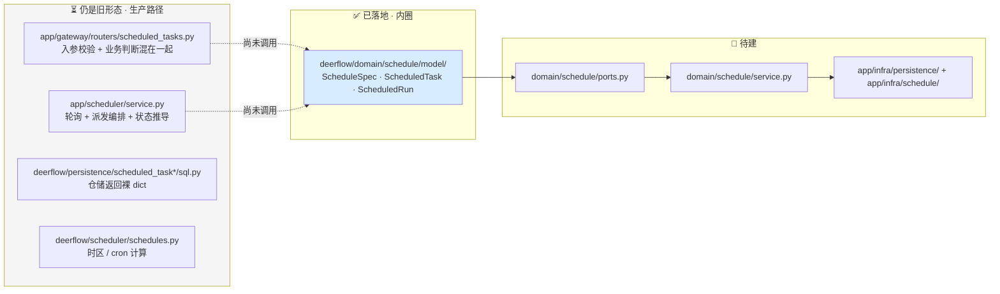
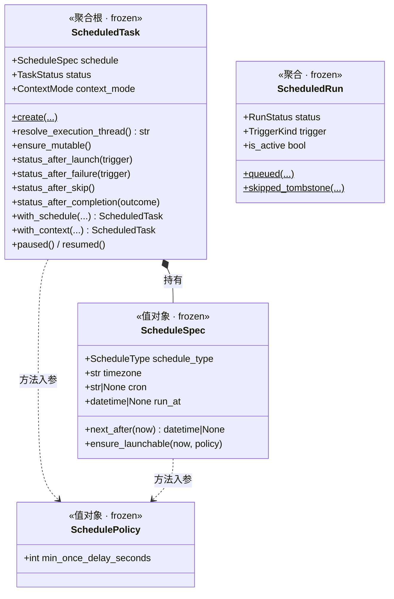
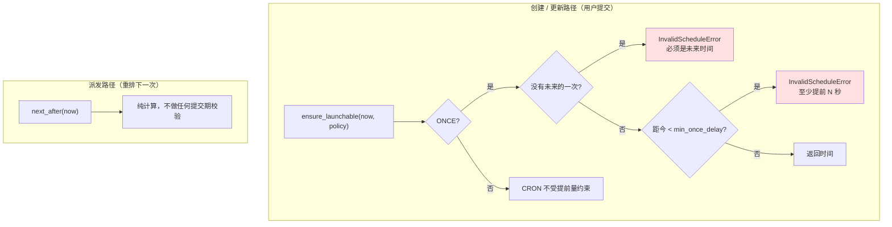
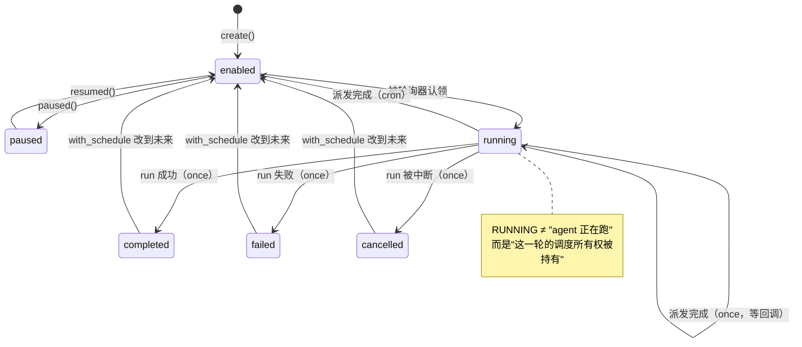
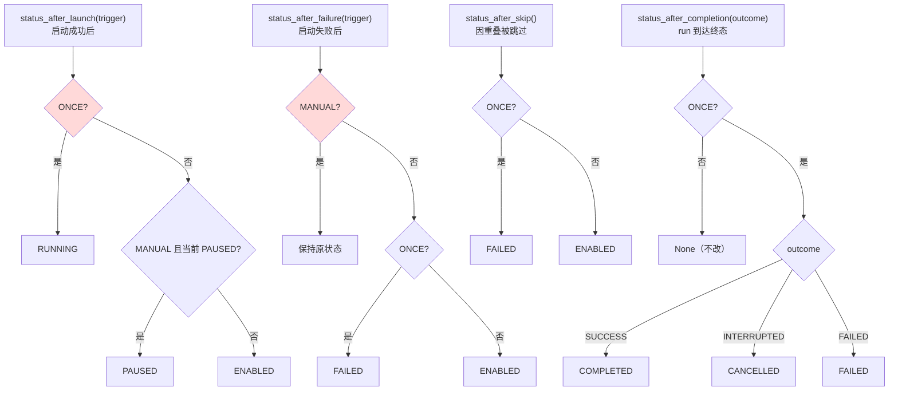

# 定时任务（Schedule）模块设计

> 面向想理解或扩展定时任务模块的人。读完你将能回答：一条定时规则从创建到执行经历了什么、它的每条业务规则住在哪个文件、以及你要改它时该动哪里。
>
> 配套文档：[`HEXAGONAL_ARCHITECTURE_zh.md`](HEXAGONAL_ARCHITECTURE_zh.md)（本文遵循的架构分层）、`backend/AGENTS.md`（编码规约与调度相关的运行时约定）。
>
> **本文当前只覆盖领域模型层**（`domain/schedule/model/`）——六边形迁移的第一步。端口、应用服务与适配器仍在旧位置，见 §2。

---

## 1. 这个模块做什么

一句话：

> 让用户注册一条「到点、或按 cron 用这段 prompt 起一次 agent run」的规则，由后台轮询器按时把它派发进**既有的** Gateway run 生命周期。

一条最简单的使用路径：

```
用户在 /workspace/scheduled-tasks 建一条任务
  "每天 09:00（Asia/Shanghai）帮我总结昨天的 GitHub issue"
       ↓
后台轮询器每 5 秒扫一次，发现它到点了
       ↓
起一个 agent run（新 thread、非交互模式）
       ↓
run 结束后回写执行记录，并算出下一次的时间
```

**一条硬约束**（写在 `backend/AGENTS.md` 里）：调度器只决定 **when**，不得引入第二套执行栈。它最终只做一件事——在正确的时刻调用一次现有的 run 启动入口，然后记账。模块的全部复杂度都在"正确的时刻"和"记账"的并发与崩溃语义上，而不在执行本身。

两个核心概念，对应两张表、两个聚合：

| 概念 | 是什么 | 聚合 | 表 |
|---|---|---|---|
| **任务**（task） | 用户注册的**规则**，长期存在 | `ScheduledTask` | `scheduled_tasks` |
| **执行**（run） | 规则的**一次触发**，只读历史 | `ScheduledRun` | `scheduled_task_runs` |

---

## 2. 当前状态：新旧并存

**这一节请先读，否则你会在代码库里迷路。**

模块正处于六边形重构的中途。领域模型已经落地，但**生产代码路径还没有切过来**：



含义很具体：

- **`domain/schedule/model/` 是唯一的真相声明处**，但目前只有域测试在用它。运行中的定时任务走的仍是 `app/scheduler/service.py` 那套。
- 两边**规则内容一致**（模型是逐条从旧代码搬迁的，每个方法的 docstring 都标了来源行号），但**代码是重复的**。这是迁移中间态的正常代价。
- 你现在改一条业务规则，要**两边都改**，直到迁移完成。旧位置见 §10 的索引。
- 新增业务规则请**只写在领域模型里**，然后在旧位置调用它——不要再往 router / service 里加新的判断。

迁移完成后 `app/scheduler/service.py`、`deerflow/scheduler/` 整包、两个 `sql.py` 都会消失，本文会补上端口与服务层章节。

---

## 3. 领域模型全景

`packages/harness/deerflow/domain/schedule/model/` 是一个包而非单文件，因为这个上下文有两个聚合加一个值对象：

```
model/
├── errors.py    9 个领域错误，零依赖
├── enums.py     5 个枚举，零依赖
├── spec.py      ScheduleSpec（值对象）· SchedulePolicy（值对象）
├── task.py      ScheduledTask（聚合根）· TERMINAL_TASK_STATUSES
└── run.py       ScheduledRun（聚合）· ACTIVE/TERMINAL_RUN_STATUSES
```

**纪律**：这一层零基础设施依赖——没有 SQL、没有 HTTP、没有配置读取、不看时钟（`now` 一律由调用方显式传入）。CI 的 `tests/test_harness_domain_purity.py` 会 AST 扫描整个 `domain/` 目录执法。唯一的第三方依赖是 `croniter`，它是确定性纯计算库（无 IO、无全局状态），与标准库 `zoneinfo` 同性质——日历计算本身就是定时任务的领域知识。



三个关系值得注意：

- **两个聚合之间只有 `task_id` 字符串引用，没有对象引用。** 一次派发要写两张表，且现状就不在同一个事务里——它们是各自独立的一致性边界。
- **`SchedulePolicy` 是"传入"而非"持有"。** 它承载运营可调阈值（当前只有 `min_once_delay_seconds`），由组合根从 `config.scheduler` 构造。聚合若持有它，同一个任务对象在不同部署配置下语义就不同了。它的领域默认值是 `0`（不施加约束），真正的业务阈值只能由外圈注入。
- **`ScheduledTask` 持有的是解析后的 `ScheduleSpec`，不是原始 dict。** dict ↔ 值对象的映射属于适配器层。

---

## 4. `ScheduleSpec`：调度在什么时候

它把三个存储字段（`schedule_type` / `schedule_spec` JSON / `timezone`）解析成一个校验过的值对象。

### 4.1 两种调度类型

| 类型 | 依据字段 | 语义 |
|---|---|---|
| `cron` | `cron`（5 段） | 周期性，永远有下一次 |
| `once` | `run_at` | 一次性，用完即止 |

### 4.2 创建即一致

所有校验与规范化都在 `__post_init__` 里，**不在工厂方法里**。原因很实际：frozen dataclass 仍然可以逐字段直接构造，把规则放在 `cron_schedule()` / `once_at()` 里等于留了一条绕过通道。

构造期做四件事：

1. 时区必须是合法 IANA 名（先做，因为下面本地化 `run_at` 要用它）
2. `cron` 必须存在且恰好 5 段，空白折叠后写回
3. `once` 必须带 `run_at`
4. naive 的 `run_at` 按**任务自己的时区**本地化——`2026-08-01T09:00` 配 `Asia/Shanghai` 意为"上海时间早上九点"，不是 UTC 九点

非法输入在**任何 IO 发生之前**就抛 `InvalidScheduleError`。

### 4.3 两个算时间的方法，别用反

这是本模块最容易写错的一处：



- `next_after(now)` —— 算下一次是什么时候。cron 在**任务时区**里算，返回 UTC；once 只在还没过期时返回。
- `ensure_launchable(now, policy)` —— 同样的计算，外加**只在用户提交时才成立**的约束：once 必须在未来，且至少提前 `min_once_delay_seconds`（默认配置 60 秒，防止用户建一个立刻就要跑的任务）。cron 从不受这个下限约束。

**用反的后果**：拿 `ensure_launchable` 做派发后重排，会让一个正常执行完的 cron 任务被"提前量不足"拒绝。

### 4.4 时区是真的按时区算

cron 表达式在任务声明的时区里求值，然后转成 UTC 存储。这意味着夏令时切换会被正确吸收：

```
America/New_York 的 "0 9 * * *"
  2026-03-07（EST, UTC-5）→ 14:00 UTC
  2026-03-09（EDT, UTC-4）→ 13:00 UTC
```

用户看到的始终是"每天早上九点"。

### 4.5 它不知道自己怎么被存储

`ScheduleSpec` 上**没有**序列化方法。数据库里那个 `schedule_spec` JSON 列（以及 HTTP 请求/响应里的同名字段）与值对象之间的双向映射，属于适配器层：

```
{"cron": "0 9 * * *"}  ←──→  ScheduleSpec(CRON, "Asia/Shanghai", cron="0 9 * * *")
        （JSON 列 / HTTP 字段）        （值对象）
                    ↑
        app/infra/schedule/spec_mapping.py
```

这不是洁癖，是一条可执行的判据：**一旦领域方法的签名里出现 `Mapping[str, Any]`，就说明领域在处理持久化/传输格式了**。解析这件事天然可以切成两半——结构校验（键在不在？值是不是字符串？）属于边界，值校验（cron 是不是 5 段、时区认不认识、`run_at` 有没有）属于 `__post_init__`。切开之后领域完全不需要看见 dict，签名全部强类型。

同样的形状在 Feedback 上下文里也成立：`Feedback` 聚合对 ORM 行一无所知，转换全在 `app/infra/persistence/feedback.py`。

---

## 5. `ScheduledTask`：规则本体

聚合根，持有全部不变量。

### 5.1 字段分组

| 组 | 字段 | 说明 |
|---|---|---|
| 身份 | `task_id` `user_id` | 一切读写按 `user_id` 隔离 |
| 内容 | `title` `prompt` | |
| 调度 | `schedule`（`ScheduleSpec`） | |
| 执行上下文 | `context_mode` `thread_id` `assistant_id` | 见 5.2 |
| 状态 | `status` `overlap_policy` | 见 5.3、5.5 |
| 调度游标 | `next_run_at` | **认领的唯一依据**：为空或在未来 ⇒ 不会被派发 |
| 回执 | `last_run_at` `last_run_id` `last_thread_id` `last_error` `run_count` | 仅供展示 |

### 5.2 执行上下文：每次新会话，还是复用同一个

| `context_mode` | 语义 |
|---|---|
| `fresh_thread_per_run`（默认） | 每次派发新建一个 thread，各次执行互不干扰 |
| `reuse_thread` | 所有执行都落在同一个 thread 里，agent 能看到历史 |

不变量：`reuse_thread` **必须**带 `thread_id`，构造期强制。

`resolve_execution_thread()` 回答"这次派发用哪个 thread"。注意它**不是幂等的**——`fresh_thread_per_run` 每次调用都生成新 UUID。调用方必须每次派发只调一次，把结果存进局部变量，供 run 记录、启动调用、返回结果三处复用。

### 5.3 状态机



三件反直觉的事，理解了它们就理解了这个状态机：

**① `running` 不表示 agent 在执行。** 轮询器认领任务的那一刻就写 `running`，此时 run 还没创建。它真正的含义是"某个轮询进程持有这一轮的调度所有权（租约）"。`ensure_mutable()` 因此在这个状态拒绝编辑——正在被派发的任务改不得。

**② cron 任务几乎从不停在 `running`。** 派发一完成立刻回 `enabled`。只有 `once` 会停在 `running` 等待完成回调——因为在启动那一刻宣布 `completed` 会在 run 失败或进程崩溃时永久说谎。

**③ 终态可以被重新武装。** 把一个 `completed` / `failed` / `cancelled` 的任务的调度改到未来时间，状态会被强制拉回 `enabled`（`TERMINAL_TASK_STATUSES`）。不这么做的话，接口会返回 200、`next_run_at` 有值、但**永远不触发**——静默死亡。

### 5.4 四条状态推导规则

派发流程的每个出口都要回答"任务接下来是什么状态"。这四个方法就是答案，**判定顺序即语义**（现状是 `if/elif/else`，写成并列的 `if` 会静默改变行为）：



两个**判定顺序陷阱**（红色节点），都有专门的测试锁住：

- **`status_after_launch` 先判 ONCE**：一个 `paused` 的 once 任务被手动触发，结果是 `RUNNING` 而不是 `PAUSED`。
- **`status_after_failure` 先判 MANUAL**：一个 once 任务被手动触发且失败，保持原状态而不是 `FAILED`——失败的手动触发不能吃掉这个任务本来的调度未来。

另外三处设计意图：

- `status_after_skip` **没有 trigger 参数**。跳过只发生在自动调度路径上——手动触发遇到重叠是直接拒绝、不留记录的，所以那个分支根本不存在，加参数会暗示一个虚构的可能性。
- once 被跳过是 `FAILED` 而非 `COMPLETED`：唯一的那次机会丢了，说"完成"等于谎称执行过。
- 完成回调里 `INTERRUPTED` 映射到 `CANCELLED` 而非 `FAILED`：用户主动取消、或同 thread 被新 run 抢占，都不是执行失败。

### 5.5 重叠策略

`overlap_policy` 目前固定为 `"skip"`：一个任务同时最多有一个活跃执行，到点时若上一次还没结束，这一次就被跳过。

聚合上用 `skips_on_overlap` 属性封装这个判断，字符串比较只存在于这一处——将来加第二种策略（比如 `queue`）只改这里。之所以不做成枚举：目前只有一个取值，单值枚举是噪音。

---

## 6. `ScheduledRun`：一次执行的记账

字段几乎是 `scheduled_task_runs` 表的镜像，业务逻辑很少。它存在的核心理由是**两个具名工厂**：

| 工厂 | 产出状态 | 用在哪 |
|---|---|---|
| `ScheduledRun.queued(...)` | `QUEUED`（活跃） | 正常派发 |
| `ScheduledRun.skipped_tombstone(...)` | `SKIPPED`（**直接终态**） | 因重叠被跳过 |

**为什么墓碑必须是第二个工厂，而不是"先 queued 再改状态"**——这是全模块最容易写错的一处：

数据库上有一个部分唯一索引 `uq_scheduled_task_run_active`，谓词是 `status IN ('queued','running')`，保证一个任务最多一条活跃执行。跳过发生时，上一次执行**还占着**那个槽位。如果墓碑先建成 `queued`，它自己就会撞上这个索引。`skipped` 落在谓词之外，永不冲突。

用两个具名工厂而不是一个可变状态的构造器，就是用类型系统把这条规则焊死，让错误实现写不出来。

`ACTIVE_RUN_STATUSES` 这个常量必须与上述索引谓词保持逐字一致——它是"跳过"判断的快路径依据，而索引是并发下的最终仲裁者，两者漂移会让它们对不上。

执行状态共六个：`queued → running → success | failed | interrupted`，外加旁路的 `skipped`。

---

## 7. 二次开发指引

### 7.1 给任务加一个字段

例：加一个 `notify_on_failure: bool`。

1. `model/task.py` 的 `ScheduledTask` 加字段（带默认值）
2. 若有约束，写进 `__post_init__`
3. `persistence/scheduled_tasks/model.py` 的 ORM 行加列
4. 新增一个 alembic revision（`cd backend && make migrate-rev MSG="..."`），用 `_helpers.py` 的幂等 helper
5. router 的请求/响应模型加字段
6. 前端 `frontend/src/core/scheduled-tasks/types.ts` 同步
7. 域测试补一条

### 7.2 加一种调度类型

例：加 `interval`（每 N 分钟）。

1. `model/enums.py` 的 `ScheduleType` 加成员
2. `model/spec.py`：加承载参数的字段（如 `interval_seconds`）、在 `__post_init__` 加校验、在 `next_after` 加一个分支
3. 适配器的 `spec_mapping`（见 §4.5）：进出两个方向各加一个分支
4. **逐个检查 `task.py` 里四个 `status_after_*`**——它们目前都在问"是不是 ONCE"，新类型会落进 else 分支。确认那是你要的语义（大概率是：interval 与 cron 同属周期性）
5. 域测试：新类型在 §5.4 四张表里各补一行

不需要改数据库——`schedule_spec` 是 JSON 列。

### 7.3 改一条状态推导规则

只改 `model/task.py` 对应的那个方法，**顺便改 `app/scheduler/service.py` 里的旧副本**（见 §2）。域测试里对应的真值表用例必须同步更新——那张表就是规则的规格说明。

### 7.4 加一种重叠策略

例：加 `queue`（排队而非跳过）。

这是改动面最大的一种，因为它触及数据库不变量：

1. `model/task.py`：`skips_on_overlap` 拆成策略判断
2. `scheduled_task_runs` 的部分唯一索引**必须**改成条件化的（`... AND overlap_policy = 'skip'`）——现在它是纯状态谓词，会把排队的执行也挡掉。索引同时定义在 ORM `__table_args__` 和迁移文件里，**两处都要改**（空库 bootstrap 走 `create_all`，不执行迁移）
3. 跳过路径的墓碑逻辑要相应分叉

动手前先读 `backend/AGENTS.md` 里关于这个索引的整段说明。

### 7.5 不要做的事

- **不要在 router 或 service 里新增业务判断**——那是迁移前的旧形态，新规则一律进领域模型
- **不要在领域层读配置或时钟**——阈值通过 `SchedulePolicy` 注入，`now` 显式传参；CI 的纯度测试会拦截基础设施导入
- **不要为定时执行另建一套运行栈**——必须复用现有的 run 生命周期

---

## 8. 常见陷阱速查

| 陷阱 | 后果 |
|---|---|
| 用 `ensure_launchable` 做派发后重排 | 正常执行完的 cron 任务被"提前量不足"拒绝 |
| 把 `status_after_*` 的 `if/elif` 写成并列 `if` | 两处判定顺序失效，静默改变行为 |
| 多次调用 `resolve_execution_thread()` | 每次拿到不同的 thread，记录与实际执行对不上 |
| 墓碑先建 `queued` 再改 `skipped` | 撞上唯一索引，跳过流程直接报错 |
| 改了 `ACTIVE_RUN_STATUSES` 没改索引谓词 | 快路径与数据库仲裁者判断不一致 |
| 终态任务改了调度但没重新武装 | 接口返回 200，任务永不触发 |
| 只改领域模型，忘了 `app/scheduler/service.py` | 迁移完成前，生产行为不变 |

---

## 9. 术语表

| 术语 | 含义 |
|---|---|
| 任务（task） | 用户注册的定时**规则**，长期存在 |
| 执行（run） | 规则的**一次**触发，只读历史 |
| 派发（dispatch） | 把一个到期任务变成一次执行的动作 |
| 触发方式（trigger） | `scheduled`（轮询器）或 `manual`（用户点"立即执行"） |
| 认领（claim） | 轮询器取得某任务这一轮调度所有权 |
| 租约（lease） | 认领时盖的带过期时间的戳，用于崩溃恢复 |
| 重叠（overlap） | 到点时上一次执行还没结束 |
| 墓碑（tombstone） | 被跳过的那次执行留下的终态记录 |
| 重新武装（re-arm） | 把终态任务拉回 `enabled` 使其可再次被认领 |

---

## 10. 代码索引

**领域模型（已迁移，本文覆盖）**

| 文件 | 内容 |
|---|---|
| [`domain/schedule/model/enums.py`](../packages/harness/deerflow/domain/schedule/model/enums.py) | `TaskStatus` `RunStatus` `ScheduleType` `ContextMode` `TriggerKind` |
| [`domain/schedule/model/errors.py`](../packages/harness/deerflow/domain/schedule/model/errors.py) | 9 个领域错误 |
| [`domain/schedule/model/spec.py`](../packages/harness/deerflow/domain/schedule/model/spec.py) | `ScheduleSpec` `SchedulePolicy` |
| [`domain/schedule/model/task.py`](../packages/harness/deerflow/domain/schedule/model/task.py) | `ScheduledTask` `TERMINAL_TASK_STATUSES` |
| [`domain/schedule/model/run.py`](../packages/harness/deerflow/domain/schedule/model/run.py) | `ScheduledRun` `ACTIVE_RUN_STATUSES` `TERMINAL_RUN_STATUSES` |
| [`tests/test_schedule_domain.py`](../tests/test_schedule_domain.py) | 域测试，全同步零 IO；四张真值表逐格覆盖 |

**尚未迁移（生产路径，见 §2）**

| 文件 | 内容 |
|---|---|
| [`app/gateway/routers/scheduled_tasks.py`](../app/gateway/routers/scheduled_tasks.py) | 10 个 HTTP 端点，含入参校验与业务判断 |
| [`app/scheduler/service.py`](../app/scheduler/service.py) | 轮询循环、派发编排、状态推导、完成回调、启动清扫 |
| [`deerflow/scheduler/schedules.py`](../packages/harness/deerflow/scheduler/schedules.py) | 时区 / cron / 下次时间计算 |
| [`persistence/scheduled_tasks/`](../packages/harness/deerflow/persistence/scheduled_tasks/) | 任务表 ORM + 仓储 |
| [`persistence/scheduled_task_runs/`](../packages/harness/deerflow/persistence/scheduled_task_runs/) | 执行表 ORM + 仓储，含唯一索引定义 |
| [`config/scheduler_config.py`](../packages/harness/deerflow/config/scheduler_config.py) | `enabled` `poll_interval_seconds` `lease_seconds` `max_concurrent_runs` `min_once_delay_seconds` |

**前端**

`frontend/src/core/scheduled-tasks/`（类型、API、cron 解析、预设配方）与 `frontend/src/app/workspace/scheduled-tasks/page.tsx`。
