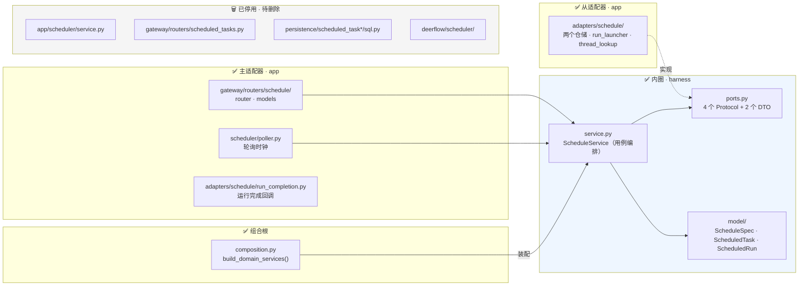
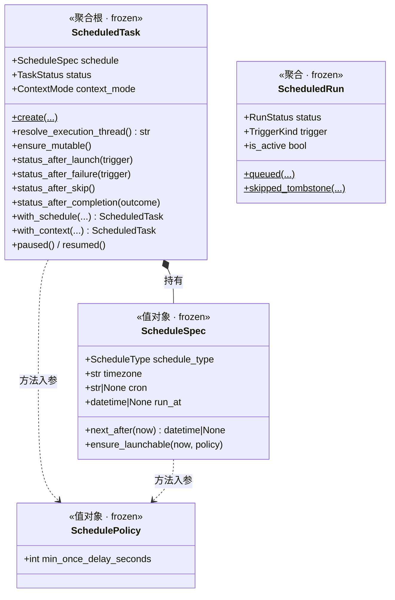
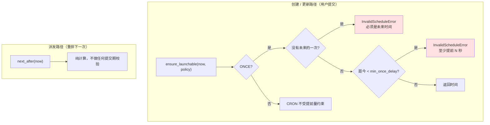
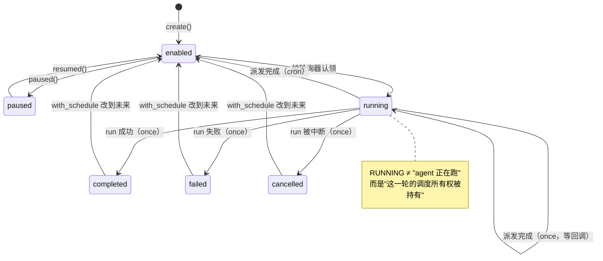
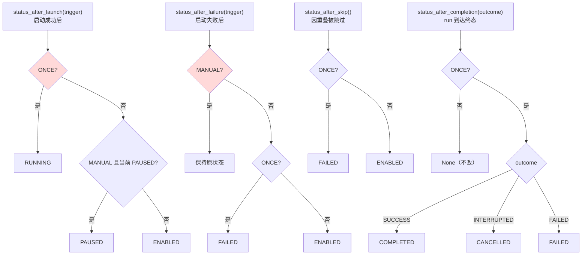
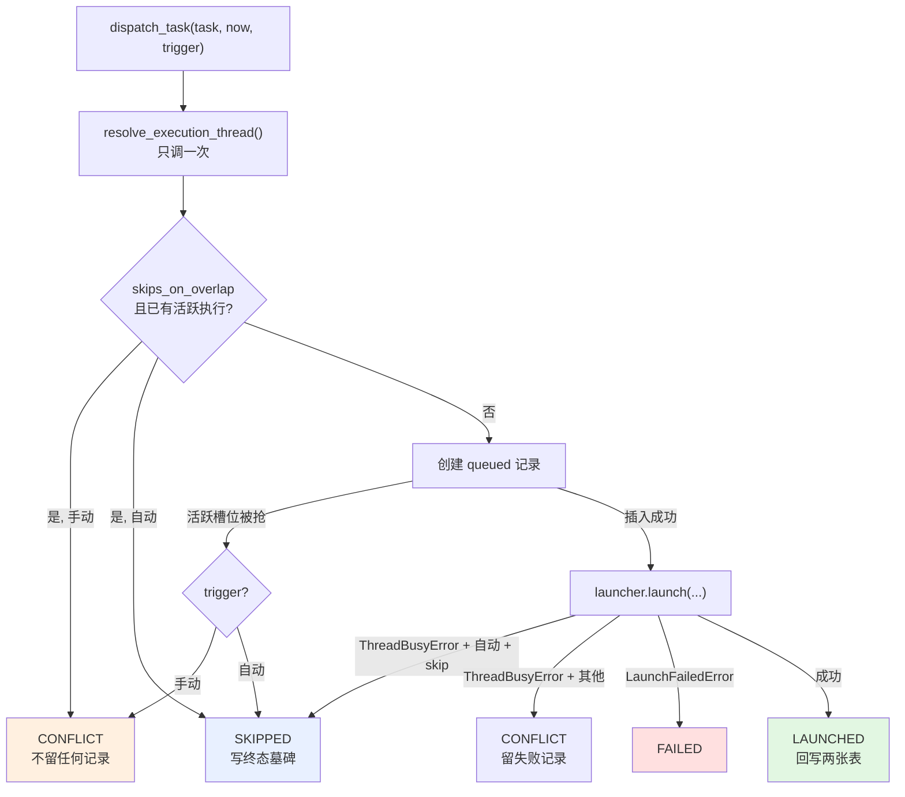

# 定时任务（Schedule）模块设计

> 面向想理解或扩展定时任务模块的人。读完你将能回答：一条定时规则从创建到执行经历了什么、它的每条业务规则住在哪个文件、以及你要改它时该动哪里。
>
> 配套文档：[`HEXAGONAL_ARCHITECTURE_zh.md`](HEXAGONAL_ARCHITECTURE_zh.md)（本文遵循的架构分层）、`backend/AGENTS.md`（编码规约与调度相关的运行时约定）。
>
> **本文覆盖整个内圈**（`domain/schedule/`：模型、端口、应用服务）。适配器与入口仍在旧位置，见 §2。

---

## 1. 这个模块做什么

一句话：

> 让用户注册一条「到点、或按 cron 用这段 prompt 起一次 agent run」的规则，由后台轮询器按时把它派发进**既有的** Gateway run 生命周期。

一条最简单的使用路径：

```
用户在 /workspace/scheduled-tasks 建一条任务
  "每天 09:00（Asia/Shanghai）帮我总结昨天的 GitHub issue"
       ↓
后台轮询器每 5 秒扫一次，发现它到点了
       ↓
起一个 agent run（新 thread、非交互模式）
       ↓
run 结束后回写执行记录，并算出下一次的时间
```

**一条硬约束**（写在 `backend/AGENTS.md` 里）：调度器只决定 **when**，不得引入第二套执行栈。它最终只做一件事——在正确的时刻调用一次现有的 run 启动入口，然后记账。模块的全部复杂度都在"正确的时刻"和"记账"的并发与崩溃语义上，而不在执行本身。

两个核心概念，对应两张表、两个聚合：

| 概念 | 是什么 | 聚合 | 表 |
|---|---|---|---|
| **任务**（task） | 用户注册的**规则**，长期存在 | `ScheduledTask` | `scheduled_tasks` |
| **执行**（run） | 规则的**一次触发**，只读历史 | `ScheduledRun` | `scheduled_task_runs` |

---

## 2. 当前状态：生产已切换，旧代码待删

**这一节请先读，否则你会在代码库里迷路。**

生产路径**已经走新架构**。旧代码还留在仓库里，但已经没有任何东西装配它，下一个提交负责删除：



含义很具体：

- **`domain/schedule/` 是唯一的真相声明处**，运行中的定时任务已经走它。改一条业务规则只改这一处。
- `DEAD` 里的文件仍能编译、仍有测试，但**不再被任何装配路径引用**——`app.py` 启动的是 `SchedulePoller`，注册的是 `routers/schedule/`，完成回调走 `composition.py` 装的那个。留着只是为了让删除单独成为一个可审查的提交。
- 旧的重复规则因此不再需要"两边都改"。如果你在 `DEAD` 里发现和内圈不一致的逻辑，以内圈为准。
- 新增业务规则请**只写在内圈**，然后在旧位置调用它——不要再往 router / 旧 service 里加新的判断。

**还差什么**：四个端口都没有真实实现。适配器落地后，`app/scheduler/service.py`、`deerflow/scheduler/` 整包、两个 `sql.py` 都会消失，router 瘦身成协议转换。

## 3. 内圈全景

```
domain/schedule/
├── service.py       ScheduleService —— 用例编排（input port）
├── ports.py         4 个 Protocol + LaunchedRun / RunOutcome（output ports）
└── model/           领域模型；是包而非单文件，因为这里有两个聚合加值对象
    ├── errors.py    9 个领域错误，零依赖
    ├── enums.py     6 个枚举，零依赖
    ├── spec.py      ScheduleSpec（值对象）· SchedulePolicy（值对象）
    ├── task.py      ScheduledTask（聚合根）· TERMINAL_TASK_STATUSES
    └── run.py       ScheduledRun（聚合）· ACTIVE/TERMINAL_RUN_STATUSES
```

三层的纪律各不相同：

| 文件 | 职责 | 纪律 |
|---|---|---|
| `model/` | 业务事实与不变量 | 零依赖；不知道存储和 HTTP 存在；不变量在构造期校验 |
| `ports.py` | 领域声明的接口 | 技术中立——签名里不出现 SQL、表名、HTTP 状态码、运行时类型 |
| `service.py` | 用例编排 | 内圈唯一调用 output port 的地方；`user_id` 显式传参；自身不含业务规则 |

一个关键理解：**service 调用 port 是合法的**——port 是领域自己声明、自己拥有的接口，调用自己的抽象不构成对外圈的依赖。运行时注入的实现来自外圈，但 service 只见 Protocol 类型。

**纪律**：这一层零基础设施依赖——没有 SQL、没有 HTTP、没有配置读取、不看时钟（`now` 一律由调用方显式传入）。CI 的 `tests/test_harness_domain_purity.py` 会 AST 扫描整个 `domain/` 目录执法。唯一的第三方依赖是 `croniter`，它是确定性纯计算库（无 IO、无全局状态），与标准库 `zoneinfo` 同性质——日历计算本身就是定时任务的领域知识。



三个关系值得注意：

- **两个聚合之间只有 `task_id` 字符串引用，没有对象引用。** 一次派发要写两张表，且现状就不在同一个事务里——它们是各自独立的一致性边界。
- **`SchedulePolicy` 是"传入"而非"持有"。** 它承载运营可调阈值（当前只有 `min_once_delay_seconds`），由组合根从 `config.scheduler` 构造。聚合若持有它，同一个任务对象在不同部署配置下语义就不同了。它的领域默认值是 `0`（不施加约束），真正的业务阈值只能由外圈注入。
- **`ScheduledTask` 持有的是解析后的 `ScheduleSpec`，不是原始 dict。** dict ↔ 值对象的映射属于适配器层。

---

## 4. `ScheduleSpec`：调度在什么时候

它把三个存储字段（`schedule_type` / `schedule_spec` JSON / `timezone`）解析成一个校验过的值对象。

### 4.1 两种调度类型

| 类型 | 依据字段 | 语义 |
|---|---|---|
| `cron` | `cron`（5 段） | 周期性，永远有下一次 |
| `once` | `run_at` | 一次性，用完即止 |

### 4.2 创建即一致

所有校验与规范化都在 `__post_init__` 里，**不在工厂方法里**。原因很实际：frozen dataclass 仍然可以逐字段直接构造，把规则放在 `cron_schedule()` / `once_at()` 里等于留了一条绕过通道。

构造期做四件事：

1. 时区必须是合法 IANA 名（先做，因为下面本地化 `run_at` 要用它）
2. `cron` 必须存在且恰好 5 段，空白折叠后写回
3. `once` 必须带 `run_at`
4. naive 的 `run_at` 按**任务自己的时区**本地化——`2026-08-01T09:00` 配 `Asia/Shanghai` 意为"上海时间早上九点"，不是 UTC 九点

非法输入在**任何 IO 发生之前**就抛 `InvalidScheduleError`。

### 4.3 两个算时间的方法，别用反

这是本模块最容易写错的一处：



- `next_after(now)` —— 算下一次是什么时候。cron 在**任务时区**里算，返回 UTC；once 只在还没过期时返回。
- `ensure_launchable(now, policy)` —— 同样的计算，外加**只在用户提交时才成立**的约束：once 必须在未来，且至少提前 `min_once_delay_seconds`（默认配置 60 秒，防止用户建一个立刻就要跑的任务）。cron 从不受这个下限约束。

**用反的后果**：拿 `ensure_launchable` 做派发后重排，会让一个正常执行完的 cron 任务被"提前量不足"拒绝。

### 4.4 时区是真的按时区算

cron 表达式在任务声明的时区里求值，然后转成 UTC 存储。这意味着夏令时切换会被正确吸收：

```
America/New_York 的 "0 9 * * *"
  2026-03-07（EST, UTC-5）→ 14:00 UTC
  2026-03-09（EDT, UTC-4）→ 13:00 UTC
```

用户看到的始终是"每天早上九点"。

### 4.5 它不知道自己怎么被存储

`ScheduleSpec` 上**没有**序列化方法。数据库里那个 `schedule_spec` JSON 列（以及 HTTP 请求/响应里的同名字段）与值对象之间的双向映射，属于适配器层：

```
{"cron": "0 9 * * *"}  ←──→  ScheduleSpec(CRON, "Asia/Shanghai", cron="0 9 * * *")
        （JSON 列 / HTTP 字段）        （值对象）
                    ↑
     ScheduleSpec.from_primitives()（领域，一份）
     + 每个适配器自己那几行「本格式用哪两个键」
```

这不是洁癖，是一条可执行的判据：**一旦领域方法的签名里出现 `Mapping[str, Any]`，就说明领域在处理持久化/传输格式了**。解析这件事天然可以切成两半——结构校验（键在不在？值是不是字符串？）属于边界，值校验（cron 是不是 5 段、时区认不认识、`run_at` 有没有）属于 `__post_init__`。切开之后领域完全不需要看见 dict，签名全部强类型。

同样的形状在 Feedback 上下文里也成立：`Feedback` 聚合对 ORM 行一无所知，转换全在 `app/adapters/feedback/feedback_repository.py`。

---

## 5. `ScheduledTask`：规则本体

聚合根，持有全部不变量。

### 5.1 字段分组

| 组 | 字段 | 说明 |
|---|---|---|
| 身份 | `task_id` `user_id` | 一切读写按 `user_id` 隔离 |
| 内容 | `title` `prompt` | |
| 调度 | `schedule`（`ScheduleSpec`） | |
| 执行上下文 | `context_mode` `thread_id` `assistant_id` | 见 5.2 |
| 状态 | `status` `overlap_policy` | 见 5.3、5.5 |
| 调度游标 | `next_run_at` | **认领的唯一依据**：为空或在未来 ⇒ 不会被派发 |
| 回执 | `last_run_at` `last_run_id` `last_thread_id` `last_error` `run_count` | 仅供展示 |

### 5.2 执行上下文：每次新会话，还是复用同一个

| `context_mode` | 语义 |
|---|---|
| `fresh_thread_per_run`（默认） | 每次派发新建一个 thread，各次执行互不干扰 |
| `reuse_thread` | 所有执行都落在同一个 thread 里，agent 能看到历史 |

不变量：`reuse_thread` **必须**带 `thread_id`，构造期强制。

`resolve_execution_thread()` 回答"这次派发用哪个 thread"。注意它**不是幂等的**——`fresh_thread_per_run` 每次调用都生成新 UUID。调用方必须每次派发只调一次，把结果存进局部变量，供 run 记录、启动调用、返回结果三处复用。

### 5.3 状态机



三件反直觉的事，理解了它们就理解了这个状态机：

**① `running` 不表示 agent 在执行。** 轮询器认领任务的那一刻就写 `running`，此时 run 还没创建。它真正的含义是"某个轮询进程持有这一轮的调度所有权（租约）"。`ensure_mutable()` 因此在这个状态拒绝编辑——正在被派发的任务改不得。

**② cron 任务几乎从不停在 `running`。** 派发一完成立刻回 `enabled`。只有 `once` 会停在 `running` 等待完成回调——因为在启动那一刻宣布 `completed` 会在 run 失败或进程崩溃时永久说谎。

**③ 终态可以被重新武装。** 把一个 `completed` / `failed` / `cancelled` 的任务的调度改到未来时间，状态会被强制拉回 `enabled`（`TERMINAL_TASK_STATUSES`）。不这么做的话，接口会返回 200、`next_run_at` 有值、但**永远不触发**——静默死亡。

### 5.4 四条状态推导规则

派发流程的每个出口都要回答"任务接下来是什么状态"。这四个方法就是答案，**判定顺序即语义**（现状是 `if/elif/else`，写成并列的 `if` 会静默改变行为）：



两个**判定顺序陷阱**（红色节点），都有专门的测试锁住：

- **`status_after_launch` 先判 ONCE**：一个 `paused` 的 once 任务被手动触发，结果是 `RUNNING` 而不是 `PAUSED`。
- **`status_after_failure` 先判 MANUAL**：一个 once 任务被手动触发且失败，保持原状态而不是 `FAILED`——失败的手动触发不能吃掉这个任务本来的调度未来。

另外三处设计意图：

- `status_after_skip` **没有 trigger 参数**。跳过只发生在自动调度路径上——手动触发遇到重叠是直接拒绝、不留记录的，所以那个分支根本不存在，加参数会暗示一个虚构的可能性。
- once 被跳过是 `FAILED` 而非 `COMPLETED`：唯一的那次机会丢了，说"完成"等于谎称执行过。
- 完成回调里 `INTERRUPTED` 映射到 `CANCELLED` 而非 `FAILED`：用户主动取消、或同 thread 被新 run 抢占，都不是执行失败。

### 5.5 重叠策略

`overlap_policy` 目前固定为 `"skip"`：一个任务同时最多有一个活跃执行，到点时若上一次还没结束，这一次就被跳过。

聚合上用 `skips_on_overlap` 属性封装这个判断，字符串比较只存在于这一处——将来加第二种策略（比如 `queue`）只改这里。之所以不做成枚举：目前只有一个取值，单值枚举是噪音。

---

## 6. `ScheduledRun`：一次执行的记账

字段几乎是 `scheduled_task_runs` 表的镜像，业务逻辑很少。它存在的核心理由是**两个具名工厂**：

| 工厂 | 产出状态 | 用在哪 |
|---|---|---|
| `ScheduledRun.queued(...)` | `QUEUED`（活跃） | 正常派发 |
| `ScheduledRun.skipped_tombstone(...)` | `SKIPPED`（**直接终态**） | 因重叠被跳过 |

**为什么墓碑必须是第二个工厂，而不是"先 queued 再改状态"**——这是全模块最容易写错的一处：

数据库上有一个部分唯一索引 `uq_scheduled_task_run_active`，谓词是 `status IN ('queued','running')`，保证一个任务最多一条活跃执行。跳过发生时，上一次执行**还占着**那个槽位。如果墓碑先建成 `queued`，它自己就会撞上这个索引。`skipped` 落在谓词之外，永不冲突。

用两个具名工厂而不是一个可变状态的构造器，就是用类型系统把这条规则焊死，让错误实现写不出来。

`ACTIVE_RUN_STATUSES` 这个常量必须与上述索引谓词保持逐字一致——它是"跳过"判断的快路径依据，而索引是并发下的最终仲裁者，两者漂移会让它们对不上。

执行状态共六个：`queued → running → success | failed | interrupted`，外加旁路的 `skipped`。

---

## 7. 端口：领域对外的四个依赖

`ports.py` 声明领域需要外界做什么，由外圈实现。签名一律技术中立——出现 SQL、表名、HTTP 状态码就是越界了。

| 端口 | 回答什么问题 |
|---|---|
| `ScheduledTaskRepository` | 规则存在哪、怎么按用户隔离、怎么原子地认领到期任务 |
| `ScheduledRunRepository` | 执行记录存在哪、谁来仲裁"一个任务只能有一条活跃执行" |
| `RunLauncher` | 怎么真正启动一次 agent run |
| `ThreadLookup` | 这个 thread 存在吗、这个用户能用吗 |

外加两个 DTO：`LaunchedRun`（启动成功后拿到的 run 身份）、`RunOutcome`（一次执行到达终态的领域表述）。

### 7.1 三条约定，比签名更重要

**① 越权一律表现为"不存在"。** 别人的任务在读取时返回 `None` / `False` / 从列表里消失，而不是抛权限错误——调用方不能借此判断"这个 id 到底存不存在"。

**② `RunLauncher` 只允许两种异常逃逸。**

```
执行 thread 已经忙  ->  ThreadBusyError
其他任何失败        ->  LaunchFailedError
```

这条约定是**整个重构的支点**。旧代码的编排层要靠 `isinstance(exc, HTTPException) and exc.status_code == 409` 去嗅探"线程忙"，于是业务逻辑依赖了 Web 框架。翻译交给适配器之后，领域只认自己的两个错误。两者必须区分，因为结果不同：自动调度遇到线程忙是一次跳过的机会，真正的失败则要记为失败。

**③ `RunOutcome` 挡住运行时类型。** 旧的完成回调直接吃 `deerflow.runtime.RunRecord`——一个基础设施类型，纯度测试会拦下它。现在由外圈先转换成 `RunOutcome`，顺带承担了旧代码内联做的过滤：一次不带定时任务元数据、或还没到终态的 run，压根产生不出 `RunOutcome`，service 也就不会被调用。

### 7.2 两个刻意的缺席

**没有 `Clock` 端口。** `now` 一律由调用方显式传参（`run_once(now=...)`、`dispatch_task(now=...)`），领域从不读时钟，测试天然确定。再加一个 `Clock` 只会制造"到底该用参数还是 `self._clock.now()`"的第二个真相源。

**`claim_due` 不接收"谁在认领"。** 那是**进程身份**，不是规则。适配器可以记一个（诊断用），但没有任何代码读回来——决定认领能否被接管的只有过期时间。相比之下 `lease_seconds`（多久算过期）留在了 `SchedulePolicy` 里，因为它直接决定崩溃后多快能恢复，是领域关心的策略。

### 7.3 原子性归实现，不归契约

`claim_due` 的 docstring 明说：单线程语义（选哪些行、写什么状态）是契约的一部分，**原子性不是**。一个内存实现可以满足全部单线程规则却毫无并发保证。

这条边界很重要——`tests/schedule_fakes.py` 的模块 docstring 和 `test_schedule_fakes.py` 都重复了它：**契约测试全绿不代表可以跑多个调度器实例**。并发由真数据库上的 `test_scheduled_task_dispatch_race.py` 单独负责。

---

## 8. 应用服务：用例编排

`ScheduleService` 是这个上下文的 input port。主适配器（HTTP router、轮询器、完成回调）调它，然后把返回值翻译成自己的协议。它**自身不含业务规则**——每个判断都委托给聚合。

### 8.1 用例清单

| 分类 | 方法 |
|---|---|
| 读 | `list_tasks` · `list_tasks_by_thread` · `get_task` · `list_task_runs` |
| 写 | `create_task` · `update_task` · `pause_task` · `resume_task` · `delete_task` |
| 派发 | `trigger_task`（手动） · `run_once`（轮询一轮） · `dispatch_task`（单次派发） |
| 生命周期 | `handle_run_completion` · `reconcile_on_startup` |

### 8.2 `dispatch_task`：四条出口

整个模块的风险中心。它把一个到期任务变成一次执行，有且只有四种结局：



**快路径与槽位仲裁必须产生相同结果。** `has_active` 是非原子的快路径——两个并发派发可以都通过它。真正的仲裁者是仓储：第二条活跃记录会被拒绝，抛 `ActiveRunConflictError`。调用方**不能分辨自己被哪一种机制拦下**，否则重试行为就会分叉。`test_schedule_service.py` 里那条断言逐字段比较两条路径的 `DispatchResult`，就是钉死这一点。

**只有 launch 被 try 包住。** 端口契约保证它只逃逸两种异常，所以后续记账写入的失败是真故障，会如实冒泡。旧代码把 launch 和记账一起包在 `except Exception` 里，结果是一次**已经成功启动**的执行会因为记账失败被标记成 failed。

### 8.3 `run_once`：预算是全局的

```python
active = await runs.count_active()          # 跨所有任务
budget = policy.max_concurrent_runs - active
if budget <= 0: return []
claimed = await tasks.claim_due(now=..., lease_seconds=..., limit=budget)
```

`max_concurrent_runs` 限制的是**同时活跃的执行总数**，不是每轮的批量大小。长时间运行的任务会跨轮次累积，所以每一轮只能认领进剩余的额度。把它当成"每轮最多认领 N 个"会让长任务把系统压垮。

### 8.4 更新任务：为什么 `context` 是打包的

```python
await service.update_task(
    task_id, user_id=..., now=...,
    title=None,            # None = 不改
    prompt=None,
    schedule=None,
    context=ContextChange(ContextMode.REUSE_THREAD, "thread-1"),
)
```

`None` 表示"没传"，不需要哨兵值。这能成立的唯一原因是：所有可选字段里，只有 `thread_id` 的 `None` 本身有含义（解绑），而它和 `context_mode` 本来就一起变化——`with_context` 同时接收两者，切换到 fresh 模式就意味着清空绑定。打包成 `ContextChange` 之后歧义消失，其余字段就能用最朴素的 `None`。

这也正好对上 HTTP 层：router 的 PATCH 本来就是 `exclude_none` 语义。

### 8.5 完成回调与启动清扫

`handle_run_completion(outcome, now)` 先写执行记录的终态，再看任务：`once` 推向终态（成功→completed / 中断→cancelled / 失败→failed），`cron` 保持状态不变。**但 `last_error` 无条件写入**——cron 任务保住了调度，仍然要报告上次出了什么问题。任务在 run 飞行途中被删掉不算错误，静默返回。

`reconcile_on_startup(error)` 依次跑两个清扫并返回修复计数。它**不吞异常**——部分清扫失败要不要阻塞启动，是调用方的策略，不是领域的。

---

## 9. 二次开发指引

### 9.1 给任务加一个字段

例：加一个 `notify_on_failure: bool`。

1. `model/task.py` 的 `ScheduledTask` 加字段（带默认值）
2. 若有约束，写进 `__post_init__`
3. 若用户要能设置它：`service.py` 的 `create_task` / `update_task` 加参数
4. `persistence/scheduled_tasks/model.py` 的 ORM 行加列
5. 新增一个 alembic revision（`cd backend && make migrate-rev MSG="..."`），用 `_helpers.py` 的幂等 helper
6. router 的请求/响应模型加字段
7. 前端 `frontend/src/core/scheduled-tasks/types.ts` 同步
8. 域测试补一条；若走了第 3 步，service 测试也补一条

端口通常不用动——`add` / `save` 交换的是整个聚合，多一个字段不改变签名。

### 9.2 加一种调度类型

例：加 `interval`（每 N 分钟）。

1. `model/enums.py` 的 `ScheduleType` 加成员
2. `model/spec.py`：加承载参数的字段（如 `interval_seconds`）、在 `__post_init__` 加校验、在 `next_after` 加一个分支
3. `ScheduleSpec.from_primitives`（见 §4.5）加一个分支；两个适配器各自的 `_spec_to_column` / `_spec_to_wire` 也各加一个
4. **逐个检查 `task.py` 里四个 `status_after_*`**——它们目前都在问"是不是 ONCE"，新类型会落进 else 分支。确认那是你要的语义（大概率是：interval 与 cron 同属周期性）
5. 域测试：新类型在 §5.4 四张表里各补一行

不需要改数据库——`schedule_spec` 是 JSON 列。

### 9.3 改一条状态推导规则

只改 `model/task.py` 对应的那个方法，**顺便改 `app/scheduler/service.py` 里的旧副本**（见 §2）。`domain/schedule/service.py` 一般不用动——它只调用聚合，不复制规则。

域测试里对应的真值表用例必须同步更新——那张表就是规则的规格说明。

### 9.4 加一个用例

例：加"克隆一个任务"。

1. `service.py` 加方法：读出聚合 → 用聚合方法或 `replace` 造出新的 → 经 `add` 持久化
2. **不要在 service 里写规则**。如果发现自己在写 `if task.status is ...`，那条判断属于聚合
3. 只有当现有端口回答不了你的问题时才加端口方法——先问"这是新的存储能力，还是我把编排写复杂了"
4. service 测试补一组（全 fake，零 IO）
5. router 加端点，把领域错误映射成 HTTP 码

### 9.5 加一种重叠策略

例：加 `queue`（排队而非跳过）。

这是改动面最大的一种，因为它触及数据库不变量：

1. `model/task.py`：`skips_on_overlap` 拆成策略判断
2. `scheduled_task_runs` 的部分唯一索引**必须**改成条件化的（`... AND overlap_policy = 'skip'`）——现在它是纯状态谓词，会把排队的执行也挡掉。索引同时定义在 ORM `__table_args__` 和迁移文件里，**两处都要改**（空库 bootstrap 走 `create_all`，不执行迁移）
3. 跳过路径的墓碑逻辑要相应分叉

动手前先读 `backend/AGENTS.md` 里关于这个索引的整段说明。

### 9.6 不要做的事

- **不要在 router 或旧 service 里新增业务判断**——新规则一律进聚合
- **不要在 `domain/schedule/service.py` 里写规则**——它只编排；出现 `if task.status is ...` 就说明放错地方了
- **不要在领域层读配置或时钟**——阈值通过 `SchedulePolicy` 注入，`now` 显式传参；CI 的纯度测试会拦截基础设施导入
- **不要让端口签名沾上技术词汇**——`Mapping[str, Any]`、HTTP 状态码、表名出现在 `ports.py` 里都是信号
- **不要为定时执行另建一套运行栈**——必须复用现有的 run 生命周期

---

## 10. 常见陷阱速查

| 陷阱 | 后果 |
|---|---|
| 用 `ensure_launchable` 做派发后重排 | 正常执行完的 cron 任务被"提前量不足"拒绝 |
| 把 `status_after_*` 的 `if/elif` 写成并列 `if` | 两处判定顺序失效，静默改变行为 |
| 多次调用 `resolve_execution_thread()` | 每次拿到不同的 thread，记录与实际执行对不上 |
| 墓碑先建 `queued` 再改 `skipped` | 撞上唯一索引，跳过流程直接报错 |
| 改了 `ACTIVE_RUN_STATUSES` 没改索引谓词 | 快路径与数据库仲裁者判断不一致 |
| 终态任务改了调度但没重新武装 | 接口返回 200，任务永不触发 |
| 只改领域模型，忘了 `app/scheduler/service.py` | 迁移完成前，生产行为不变 |
| 适配器让 `launch` 逃逸出第三种异常 | 领域收到不认识的错误；线程忙被记成失败而不是跳过 |
| 快路径与槽位仲裁产生不同结果 | 调用方能分辨被哪种机制拦下，重试行为分叉 |
| 把契约测试全绿当成可以多实例 | fake 没有任何原子性；并发由真数据库的 dispatch_race 测试负责 |

---

## 11. 术语表

| 术语 | 含义 |
|---|---|
| 任务（task） | 用户注册的定时**规则**，长期存在 |
| 执行（run） | 规则的**一次**触发，只读历史 |
| 派发（dispatch） | 把一个到期任务变成一次执行的动作 |
| 触发方式（trigger） | `scheduled`（轮询器）或 `manual`（用户点"立即执行"） |
| 认领（claim） | 轮询器取得某任务这一轮调度所有权 |
| 租约（lease） | 认领时盖的带过期时间的戳，用于崩溃恢复 |
| 重叠（overlap） | 到点时上一次执行还没结束 |
| 墓碑（tombstone） | 被跳过的那次执行留下的终态记录 |
| 重新武装（re-arm） | 把终态任务拉回 `enabled` 使其可再次被认领 |
| 端口（port） | 领域声明、外圈实现的技术中立接口 |
| input port | 用例接口，被入口调用——这里就是 `ScheduleService` |
| output port | 领域对外的依赖，被适配器实现——这里是四个 Protocol |
| 聚合（aggregate） | 一致性边界，不变量在构造期成立 |
| 活跃槽位（active slot） | 一个任务同时最多持有一条 `queued`/`running` 执行 |

---

## 12. 代码索引

**内圈（已迁移，本文覆盖）**

| 文件 | 内容 |
|---|---|
| [`domain/schedule/service.py`](../packages/harness/deerflow/domain/schedule/service.py) | `ScheduleService` · `DispatchResult` · `ContextChange` |
| [`domain/schedule/ports.py`](../packages/harness/deerflow/domain/schedule/ports.py) | 4 个 Protocol · `LaunchedRun` · `RunOutcome` |
| [`domain/schedule/model/enums.py`](../packages/harness/deerflow/domain/schedule/model/enums.py) | `TaskStatus` `RunStatus` `ScheduleType` `ContextMode` `TriggerKind` `DispatchOutcome` |
| [`domain/schedule/model/errors.py`](../packages/harness/deerflow/domain/schedule/model/errors.py) | 9 个领域错误 |
| [`domain/schedule/model/spec.py`](../packages/harness/deerflow/domain/schedule/model/spec.py) | `ScheduleSpec` `SchedulePolicy` |
| [`domain/schedule/model/task.py`](../packages/harness/deerflow/domain/schedule/model/task.py) | `ScheduledTask` `TERMINAL_TASK_STATUSES` |
| [`domain/schedule/model/run.py`](../packages/harness/deerflow/domain/schedule/model/run.py) | `ScheduledRun` `ACTIVE_RUN_STATUSES` `TERMINAL_RUN_STATUSES` |
| [`tests/test_schedule_domain.py`](../tests/test_schedule_domain.py) | 域测试，全同步零 IO；四张真值表逐格覆盖 |
| [`tests/test_schedule_service.py`](../tests/test_schedule_service.py) | 用例测试；完整生命周期跑在 fake 上，是迁移的验收标准 |
| [`tests/schedule_fakes.py`](../tests/schedule_fakes.py) | 四个端口的内存实现 |
| [`tests/test_schedule_fakes.py`](../tests/test_schedule_fakes.py) | 契约测试：31 用例 × 内存 fake + 真 sqlite 两套实现 |

**主适配器（入口）**

| 文件 | 内容 |
|---|---|
| [`gateway/routers/schedule/router.py`](../app/gateway/routers/schedule/router.py) | 10 个 HTTP 端点，只做协议转换 + 领域错误→状态码 |
| [`gateway/routers/schedule/models.py`](../app/gateway/routers/schedule/models.py) | 请求/响应模型；响应是白名单，不是 ORM 转储；`schedule_spec` 的进出转换是模型自己的方法 |
| [`app/scheduler/poller.py`](../app/scheduler/poller.py) | 轮询时钟 + 启动恢复 |
| [`adapters/schedule/run_completion.py`](../app/adapters/schedule/run_completion.py) | 运行完成回调；过滤掉非本上下文的运行，其余转成 `RunOutcome` 并调用用例。与上面两个同为入站，只是留在上下文包内 |

**从适配器**

| 文件 | 内容 |
|---|---|
| [`adapters/schedule/scheduled_task_repository.py`](../app/adapters/schedule/scheduled_task_repository.py) | 自有持久化；`FOR UPDATE SKIP LOCKED` 与 `protect_terminal` CAS |
| [`adapters/schedule/scheduled_run_repository.py`](../app/adapters/schedule/scheduled_run_repository.py) | 自有持久化；`IntegrityError → ActiveRunConflictError` 的翻译点 |
| [`adapters/schedule/run_launcher.py`](../app/adapters/schedule/run_launcher.py) | 防腐层；`ConflictError` / `HTTPException(409)` → `ThreadBusyError` |
| [`adapters/schedule/thread_lookup.py`](../app/adapters/schedule/thread_lookup.py) | 防腐层；`check_access(require_existing=True)` |

**组合根**

| 文件 | 内容 |
|---|---|
| [`app/composition.py`](../app/composition.py) | `build_domain_services()` · `build_run_completion_hook()` · `build_schedule_policy()` |
| [`config/scheduler_config.py`](../packages/harness/deerflow/config/scheduler_config.py) | `enabled` `poll_interval_seconds` `lease_seconds` `max_concurrent_runs` `min_once_delay_seconds` |

**已停用，待删除（见 §2）**

| 文件 | 内容 |
|---|---|
| [`app/gateway/routers/scheduled_tasks.py`](../app/gateway/routers/scheduled_tasks.py) | 旧端点，已不注册 |
| [`app/scheduler/service.py`](../app/scheduler/service.py) | 旧轮询 + 派发编排，已不装配 |
| [`deerflow/scheduler/schedules.py`](../packages/harness/deerflow/scheduler/schedules.py) | 时区 / cron 计算，规则已进 `ScheduleSpec` |
| [`persistence/scheduled_task*/sql.py`](../packages/harness/deerflow/persistence/scheduled_tasks/) | 旧仓储（返回裸 dict）。**ORM 行与唯一索引定义仍在用，不要一起删** |

**前端**

`frontend/src/core/scheduled-tasks/`（类型、API、cron 解析、预设配方）与 `frontend/src/app/workspace/scheduled-tasks/page.tsx`。
