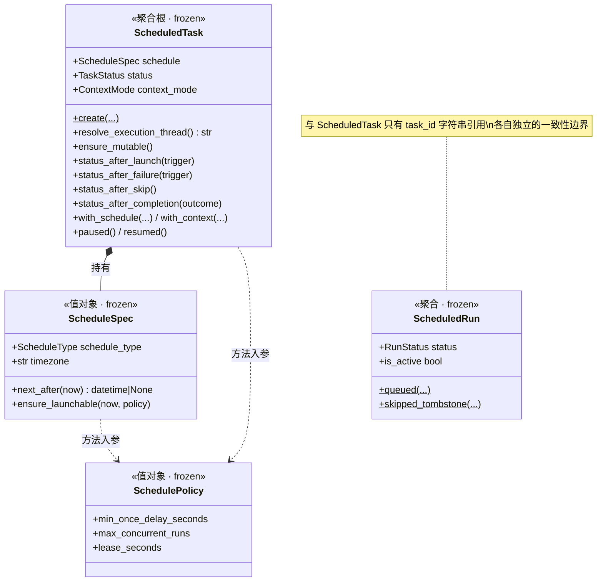
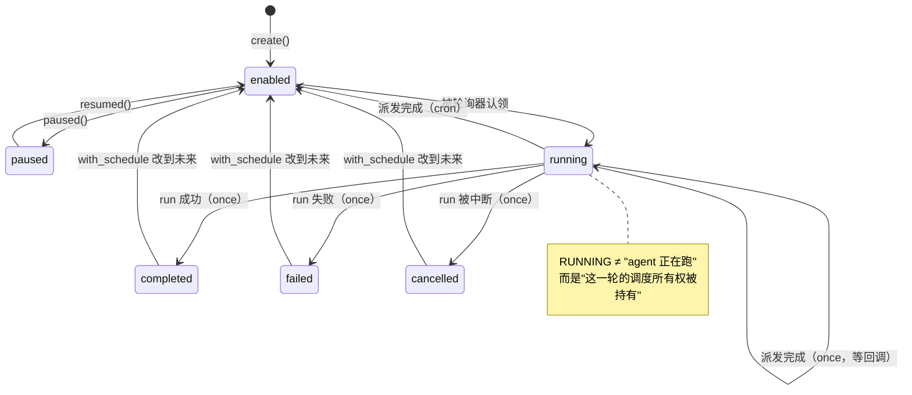
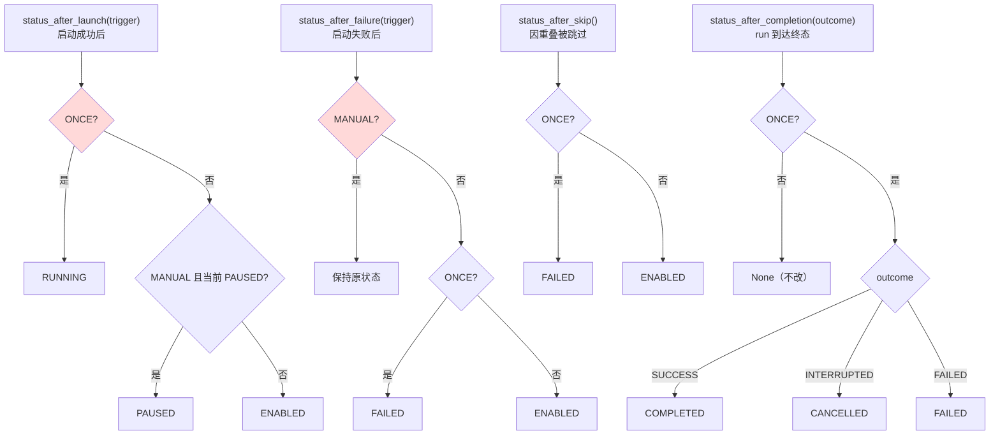
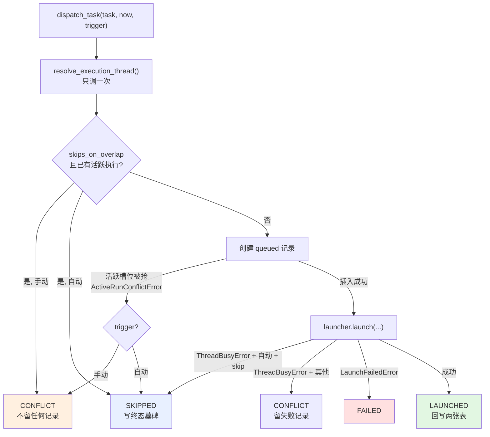
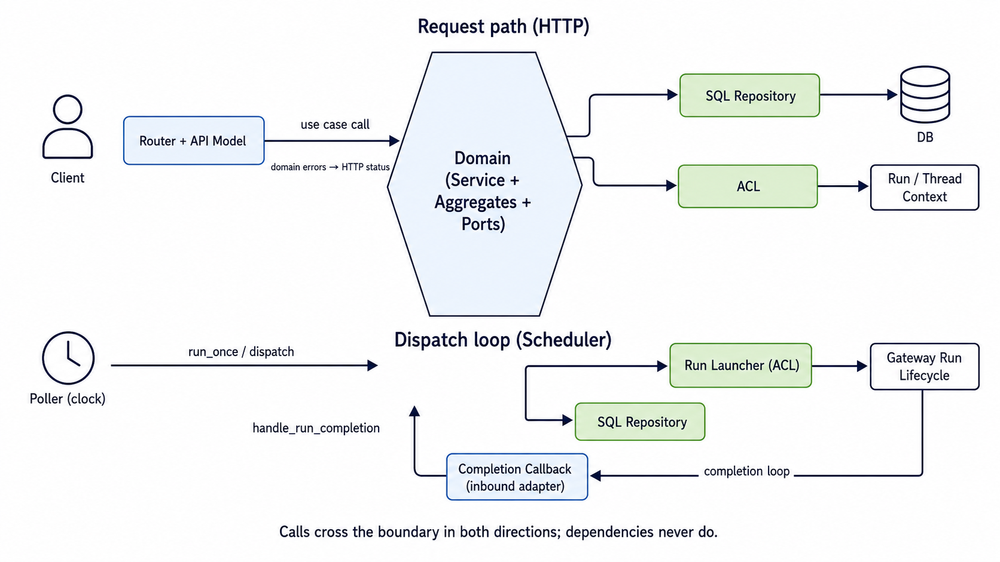
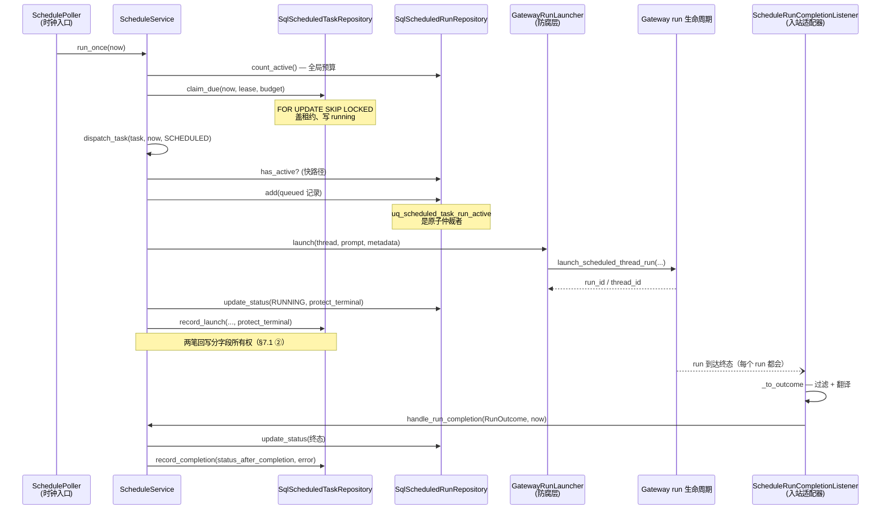

# 定时任务（Schedule）模块设计

> [六边形设计规范](HEXAGONAL_ARCHITECTURE_zh.md) 的**参考实现走读**。本文假定你已读过规范：术语（端口、适配器、聚合、command、防腐层）与通用规则不再重复解释。结构上业务先行：§1 是零实现词汇的行为规格（系统承诺了什么），§2 起才讲每条承诺由哪个文件的什么机制兑现、以及 schedule 特有的陷阱。读完你将能回答：一条定时规则从创建到执行经历了什么、它的每条并发防线由谁守卫、想加一种调度类型该改哪几个文件。
>
> 姊妹文档：[FEEDBACK_DESIGN_zh.md](FEEDBACK_DESIGN_zh.md)——首个切片、规范的最小实例。schedule 是同样的结构，复杂度高一个量级：两个聚合、两个状态机、三种驱动源、四道并发防线。

---

## 1. 业务需求与行为规格

让用户注册一条「到点、或按 cron 用这段 prompt 起一次 agent run」的规则，由系统按时执行并记录每次执行的结果。本章只讲系统**承诺的行为**；每条承诺由什么机制兑现，见括号里指向的章节。

### 1.1 用户能做什么

| 操作 | 语义要点 |
|---|---|
| 创建任务 | 两种调度：cron（周期）或 once（一次）；两种执行上下文：每次新会话，或固定在某个已有会话里（后者要求该会话存在且归本人） |
| 部分更新 | 只改提交的字段；任务正在派发中时拒绝编辑；把一个已结束的任务改到未来时间会自动重新启用它 |
| 暂停 / 恢复 | 暂停的任务不被自动调度，但仍可手动触发，触发后保持暂停 |
| 立即执行 | 无视调度时间跑一次；撞上该任务还有执行在跑时直接拒绝（409），不排队 |
| 删除 | 任何状态都可删，包括执行中——飞行中的 run 不受影响，只是结果无处写回 |
| 查执行历史 | 每次触发（包括被跳过的）都留一条记录 |

所有读写按用户隔离；别人的任务表现为"不存在"，不是"无权限"。

### 1.2 调度语义：什么时候跑

- cron 表达式在**任务声明的时区**里求值。夏令时切换被正确吸收：纽约的"每天 9 点"在冬夏令时对应不同的 UTC 时刻，用户视角始终是"每天 9 点"。
- once 任务的时刻必须在未来，且距提交至少一个运营下限（默认 60 秒），防止"立刻就要跑"的任务；cron 不受此限制。
- 定时触发的 run 是**非交互的**：执行中的 agent 不能停下来向用户提问——后台没有人会回答。
- 执行走普通的 agent run 生命周期，调度器只决定 when（§8）。

### 1.3 重叠：跳过，不排队

一个任务同时最多一次执行在跑。到点时上一次还没结束：

- **自动调度**：这一次被**跳过**，留一条终态记录作审计；cron 任务等下一个自然周期，once 任务记为**失败**——唯一的机会丢了，说"完成"等于谎称执行过。
- **手动触发**：直接拒绝，让用户自己决定，不替他排队。

选择跳过而非排队是产品决定：对"每天 9 点总结昨天"这类任务，一个迟到两小时才补跑的 occurrence 产出的往往已经不是用户要的东西。（机制：§8 的四道防线之一；将来若需要排队策略，改动面见 §10.4。）

### 1.4 忙时等待：延迟，不丢失

系统对同时执行的定时 run 总数设全局上限（运营配置）。到期任务多于余量时：

- 多出来的任务**等待**，按到期时间先后依次放行——不会丢失，也不会被随机跳过；
- 等待没有超时：预算被长任务占满多久，就等多久。预算的回收依赖每个 run 终将结束（§1.5 的恢复语义为此兜底）；
- 等待期间错过的 cron 周期**不补跑**：轮到它时跑一次，然后从当前时刻算下一个周期。宕机三天的每日任务恢复后也只跑一次，不连跑三次。

推论：长期预算不足的表现不是积压爆炸（系统里每任务最多一条"欠账"），而是低频任务被静默降频——这是容量报警该盯的信号。

### 1.5 失败与恢复

| 出了什么事 | 用户看到什么 |
|---|---|
| 提交的规则非法（坏 cron、过近的 once…） | 立即拒绝，任何数据都不写 |
| run 启动失败 | 执行记录记失败；once 任务失败，cron 任务照常排下一次并展示上次的错误 |
| 目标会话正忙（固定会话模式） | 自动调度视同一次重叠跳过；手动触发拒绝 |
| run 执行中失败 / 超时 | once 记失败；cron 保住调度，展示错误 |
| run 被用户取消 | once 记**取消**（不是失败——用户主动行为）；cron 不受影响 |
| 服务进程崩溃 | 重启后自动清理：跑到一半的执行记录标"中断"，等一个永远不会来的完成信号的 once 任务标"取消"；调度立即恢复，不需要人工干预 |

已成功启动的执行**绝不**因系统内部的记账失败被追认为失败（§6.1）。

### 1.6 明确的非目标

- **没有执行队列**——重叠跳过、忙时靠下轮重试，见 1.3/1.4；
- **不补跑错过的周期**（no catch-up）；
- **不保证准点**——执行时刻 = 到期后的下一个轮询拍点再加预算等待，轮询间隔是运营配置；
- **任务不携带凭据**——定时 run 拿不到请求级 secrets（它没有"每次请求重新提供"的人）；
- **单调度器实例**——多实例下互斥机制仍正确，但预算各算各的（§9 的测试边界）。

## 2. 内圈全景

```
domain/schedule/                 对应规范 §2 的 domain 七件套
├── __init__.py       上下文公开 API：聚合 + 命令 + 错误 + 服务（端口刻意不导出）
├── exceptions.py     10 个领域错误，一个基类 ScheduleError        → 七件套 exceptions/
├── commands.py       6 个写用例 command + UNSET + ContextChange   → 七件套 commands/
├── ports.py          4 个 Protocol + LaunchedRun / RunOutcome     → 七件套 ports/
├── service.py        ScheduleService（写方法即 handler）          → 七件套 command_handlers/
└── model/            两个聚合 + 值对象；是包而非单文件            → 七件套 model/
    ├── enums.py      6 个枚举，零依赖
    ├── spec.py       ScheduleSpec（值对象）· SchedulePolicy（值对象）
    ├── task.py       ScheduledTask（聚合根）· TERMINAL_TASK_STATUSES
    └── run.py        ScheduledRun（聚合）· ACTIVE/TERMINAL_RUN_STATUSES
```

`model/` 是**包**而非单文件，因为这里有两个聚合加两个值对象——对比 feedback 的单文件 `model.py`。模块规模决定形态，不必强行对称。`model/__init__` 把拆分对调用方隐藏；**子模块只 import 兄弟模块、永不回头 import 包本身**（防止部分初始化循环，`model/__init__` docstring 有说明）。

纯度纪律与 feedback 相同（规范 §4 的 AST 测试执法），多一条豁免说明：唯一的第三方依赖 `croniter` 是确定性纯计算库（无 IO、无全局状态），与标准库 `zoneinfo` 同性质——日历计算本身就是定时任务的领域知识。



- **`SchedulePolicy` 是"传入"而非"持有"**。它承载运营可调阈值，由组合根从 `config.scheduler` 构造（§7.3）。聚合若持有它，同一个任务对象在不同部署配置下语义就不同了。领域默认值刻意宽松（不施加约束），真正的业务阈值只能由外圈注入——`test_composition.py` 钉住"生产拿到的不是领域默认值"。
- **`ScheduledTask` 持有解析后的 `ScheduleSpec`，不是原始 dict**。dict ↔ 值对象的映射归适配器（规范 §2.1）。

## 3. 聚合与值对象

### 3.1 `ScheduleSpec`：调度在什么时候

把三个存储字段（`schedule_type` / `schedule_spec` JSON / `timezone`）解析成一个校验过的值对象。两种类型：`cron`（5 段表达式，周期性）与 `once`（`run_at`，一次性）。

**创建即一致**：全部校验在 `__post_init__`（时区必须是合法 IANA 名；cron 恰好 5 段、空白折叠；once 必须带 `run_at`；naive 的 `run_at` 按**任务自己的时区**本地化）。非法输入在任何 IO 之前抛 `InvalidScheduleError`。

**两个算时间的方法，别用反**——这是本模块最容易写错的一处：

- `next_after(now)`——算下一次是什么时候。cron 在**任务时区**里求值后转 UTC（夏令时切换被正确吸收：纽约的 `0 9 * * *` 在 EST 是 14:00 UTC、EDT 是 13:00 UTC，用户看到的始终是"每天早上九点"）；once 只在还没过期时返回。派发后重排用它。
- `ensure_launchable(now, policy)`——同样的计算，外加**只在用户提交时才成立**的约束：once 必须在未来、且至少提前 `min_once_delay_seconds`。cron 从不受这个下限约束。创建/更新用它。

用反的后果：拿 `ensure_launchable` 做派发后重排，会让一个正常执行完的 cron 任务被"提前量不足"拒绝。

**它不知道自己怎么被存储**：`ScheduleSpec` 上没有序列化方法。`from_primitives()` 是入向解析的唯一领域面；出向的「本格式用哪两个键」各归各的适配器——存储侧 `_spec_to_column`（SQL 适配器）、线上侧 `_spec_to_wire`（api model），两者今天恰好相似，但主适配器不许 import 从适配器，所以刻意不合并（§7.1）。

### 3.2 `ScheduledTask`：规则本体与状态机

字段分组：身份（`task_id` / `user_id`）、内容（`title` / `prompt`）、调度（`schedule`）、执行上下文（`context_mode` / `thread_id` / `assistant_id`）、状态（`status` / `overlap_policy`）、调度游标（`next_run_at`——**认领的唯一依据**：为空或在未来 ⇒ 不会被派发）、回执（`last_*` / `run_count`，仅供展示）。

执行上下文两种：`fresh_thread_per_run`（默认，每次派发新 thread）与 `reuse_thread`（同一 thread，agent 能看到历史；构造期强制必须带 `thread_id`）。`resolve_execution_thread()` **不是幂等的**——fresh 模式每次调用生成新 UUID，派发流程必须只调一次、结果三处复用。

**时间戳的真相源**（对照 FEEDBACK_DESIGN §3.4）：`created_at` 归聚合构造时刻——`create` 工厂从显式收到的 `now` 打戳，适配器原样持久化、绝不自己读时钟（契约用例双实现钉住）。`updated_at` 归**存储写路径**——CAS 方法（`record_launch` / `record_completion`）更新行时手里根本没有聚合，只有适配器能盖"最后写入"戳；聚合上的转换方法因此刻意不动它。两个戳都不是规则输入；规则看的时钟永远是显式 `now=` 参数。

状态机：



三件反直觉的事，理解了它们就理解了这个状态机：

**① `running` 不表示 agent 在执行。** 轮询器认领任务的那一刻就写 `running`，此时 run 还没创建。真正的含义是"某个轮询进程持有这一轮的调度所有权（租约）"。`ensure_mutable()` 因此在这个状态拒绝编辑。

**② cron 任务几乎从不停在 `running`。** 派发一完成立刻回 `enabled`。只有 `once` 会停在 `running` 等完成回调——在启动那一刻宣布 `completed` 会在 run 失败或进程崩溃时永久说谎。

**③ 终态可以被重新武装。** 把 `completed` / `failed` / `cancelled` 任务的调度改到未来，状态被强制拉回 `enabled`（`TERMINAL_TASK_STATUSES`——一个常量服务重新武装与 `protect_terminal` 两条规则，因为"终态"正是"可重新武装"的定义域）。不这么做，接口返回 200、`next_run_at` 有值、但**永远不触发**——静默死亡。

**四条状态推导规则**——派发流程的每个出口都要回答"任务接下来是什么状态"，**判定顺序即语义**（`if/elif/else` 写成并列 `if` 会静默改变行为）：



两个**判定顺序陷阱**（红色节点），都有专门的测试锁住：`status_after_launch` 先判 ONCE（暂停的 once 任务被手动触发 → `RUNNING` 而非 `PAUSED`）；`status_after_failure` 先判 MANUAL（once 任务手动触发失败 → 保持原状态——失败的手动触发不能吃掉任务本来的调度未来）。另外三处意图：`status_after_skip` 没有 trigger 参数（跳过只发生在自动路径上，手动重叠是直接拒绝、不留记录）；once 被跳过是 `FAILED` 而非 `COMPLETED`（唯一的机会丢了，说"完成"等于谎称执行过）；`INTERRUPTED` 映射 `CANCELLED` 而非 `FAILED`（用户主动取消不是执行失败）。

### 3.3 `ScheduledRun`：一次执行的记账

字段几乎是 `scheduled_task_runs` 表的镜像。它存在的核心理由是**两个具名工厂**：

| 工厂 | 产出状态 | 用在哪 |
|---|---|---|
| `ScheduledRun.queued(...)` | `QUEUED`（活跃） | 正常派发 |
| `ScheduledRun.skipped_tombstone(...)` | `SKIPPED`（**直接终态**） | 因重叠被跳过 |

**为什么墓碑必须是第二个工厂，而不是"先 queued 再改状态"**：数据库上的部分唯一索引 `uq_scheduled_task_run_active`（谓词 `status IN ('queued','running')`）保证一个任务最多一条活跃执行。跳过发生时，上一次执行**还占着**那个槽位——墓碑若先建成 `queued`，它自己就会撞上索引。`skipped` 落在谓词之外，永不冲突。两个具名工厂是用类型系统把这条规则焊死，让错误实现写不出来。

`ACTIVE_RUN_STATUSES` 常量必须与索引谓词逐字一致——它是"跳过"判断的快路径依据，索引是并发下的最终仲裁者，两者漂移会让它们对不上（一致性由独立测试钉住，域测试保持零依赖）。

## 4. Commands：写用例的具名载体

`commands.py` 是规范 §3.1 的落地，六个 HTTP 驱动的写用例：

| Command | Handler | 请求模型 |
|---|---|---|
| `CreateScheduledTask` | `ScheduleService.create_scheduled_task` | `CreateScheduledTaskRequest` |
| `UpdateScheduledTask` | `ScheduleService.update_scheduled_task` | `UpdateScheduledTaskRequest` |
| `PauseTask` | `ScheduleService.pause_task` | 无 body，端点内直接构造 |
| `ResumeTask` | `ScheduleService.resume_task` | 同上 |
| `DeleteTask` | `ScheduleService.delete_task` | 同上 |
| `TriggerTask` | `ScheduleService.trigger_task` | 同上 |

对应的 wire 契约（`app/gateway/routers/schedule/`；HTTP 只是三种驱动源之一，另两种见 §8）：

```
GET    /api/scheduled-tasks               列表
POST   /api/scheduled-tasks               创建
GET    /api/scheduled-tasks/{id}          详情
PATCH  /api/scheduled-tasks/{id}          部分更新
POST   /api/scheduled-tasks/{id}/pause    暂停
POST   /api/scheduled-tasks/{id}/resume   恢复
POST   /api/scheduled-tasks/{id}/trigger  立即执行（409/502/200 三种码）
DELETE /api/scheduled-tasks/{id}          删除
GET    /api/scheduled-tasks/{id}/runs     执行历史
GET    /api/threads/{tid}/scheduled-tasks 某 thread 绑定的任务
```

命名链三拼写互为变体（规范 §2.1），grep 任何一个就能找到用例全部三层。command 是哑数据（`context_mode="not-a-mode"` 能构造出来——校验归聚合，错误归因顺序归 handler 的构造顺序）；身份不进请求模型（`user_id` 服务端解析后经 `to_command` 参数注入，测试钉住两个请求模型上都没有该字段）。

schedule 在 feedback 之上多出三个设计点：

**① `UNSET` sentinel 表达三态**（规范 §3.1 明文）。`UpdateScheduledTask` 的四个可选字段默认 `UNSET`（"未提供"），与 `None` 严格区分。wire 保持历史契约（显式 `null` = 未提供），`to_command` 是 `None`→`UNSET` 翻译的唯一发生处——三态在 command 层无歧义，两态在 wire 层不破坏兼容。

**② `ContextChange` 是字段联动的对象化先例。** `context_mode` 与 `thread_id` 总是一起变（`with_context` 同时接收两者，切到 fresh 模式就意味着清空绑定）。打包之后，"解绑 thread"与"没传 thread"再无歧义——`thread_id` 的 `None` 有含义，但它只在 `ContextChange` 内部出现。

**③ `now` 不是 command 字段。** 它是服务端时钟读数、规则输入，不是客户端意图的一部分——handler 签名保留显式 `now=` 参数（`create_scheduled_task(cmd, *, now)`），与规范 §4 的时钟纪律一脉相承。

**时钟与回调驱动的写用例刻意不 command 化**：`run_once` / `dispatch_task` / `handle_run_completion` / `reconcile_on_startup`。这些 driver 没有 wire 形状可翻译（规范 §5.3）——轮询器递给 service 的是已认领的聚合加时钟读数，完成回调递的是已经领域化的 `RunOutcome`。command 化只是把领域词汇再包一层领域词汇。

`UpdateScheduledTask` 的组装有一处独特编排：schedule 与 context 是复合字段，客户端可以只提交一半（只改时区、只改 thread）。router 先读一次当前任务、把它传给 `to_command(task_id, user_id, current)`，由请求模型补出**完整值对象**——api model 保持零 IO，service 收到的永远是整个 `ScheduleSpec` / `ContextChange` 而非松散字段的补丁。

## 5. 端口：领域对外的四个依赖

| 端口 | 回答什么问题 | 实现形态 |
|---|---|---|
| `ScheduledTaskRepository` | 规则存在哪、怎么按用户隔离、怎么原子地认领到期任务 | 自有持久化 |
| `ScheduledRunRepository` | 执行记录存在哪、谁仲裁"一个任务只能有一条活跃执行" | 自有持久化 |
| `RunLauncher` | 怎么真正启动一次 agent run | 防腐层 |
| `ThreadLookup` | 这个 thread 存在吗、这个用户能用吗 | 防腐层 |

外加两个 DTO：`LaunchedRun`（启动成功拿到的 run 身份）、`RunOutcome`（一次执行到达终态的领域表述）。

### 5.1 三条约定，比签名更重要

**① 越权一律表现为"不存在"**（规范 §4）：别人的任务读取返回 `None` / `False` / 从列表消失，不抛权限错误。

**② `RunLauncher` 只允许两种异常逃逸。**

```
执行 thread 已经忙  ->  ThreadBusyError
其他任何失败        ->  LaunchFailedError
```

这条约定是**整个重构的支点**。旧编排层靠 `isinstance(exc, HTTPException) and exc.status_code == 409` 嗅探"线程忙"，业务逻辑因此依赖了 Web 框架。翻译交给适配器后，领域只认自己的两个错误。必须区分，因为结果不同：自动调度遇到线程忙是一次跳过的机会，真正的失败要记为失败。

**③ `RunOutcome` 挡住运行时类型。** 旧完成回调直接吃 `deerflow.runtime.RunRecord`——纯度测试会拦下它。现在由入站适配器先过滤再翻译（§7.2），service 因此不需要守卫子句。

### 5.2 两个刻意的缺席

**没有 `Clock` 端口。** `now` 一律显式传参，领域从不读时钟，测试天然确定。再加 `Clock` 只会制造"该用参数还是 `self._clock.now()`"的第二个真相源。

**`claim_due` 不接收"谁在认领"。** 那是**进程身份**，不是规则——适配器自己生成 `lease_owner`（诊断用），没有任何代码读回来；决定认领能否被接管的只有过期时间。相比之下 `lease_seconds` 留在 `SchedulePolicy` 里，因为它决定崩溃后多快恢复，是领域关心的策略。

### 5.3 原子性归实现，不归契约

`claim_due` 的单线程语义（选哪些行、写什么状态）是契约的一部分，**原子性不是**——内存实现可以满足全部单线程规则却毫无并发保证。**契约测试全绿不代表可以跑多个调度器实例**；并发由真数据库上的 `test_schedule_dispatch_race.py` 单独负责（§9）。

## 6. 应用服务：用例编排

`ScheduleService` 是这个上下文的 input port。三种主适配器（HTTP router、轮询器、完成回调）调它，把返回值翻译成各自的协议。它自身不含业务规则——每个判断都委托给聚合。

| 分类 | 方法 | 输入 |
|---|---|---|
| 读 | `list_tasks` · `list_tasks_by_thread` · `get_task` · `list_task_runs` | 普通参数（查询不 command 化） |
| 写 | `create_scheduled_task` · `update_scheduled_task` · `pause_task` · `resume_task` · `delete_task` | command（§4） |
| 派发 | `trigger_task`（command + `now=`） · `run_once` · `dispatch_task` | 后两者是时钟驱动，领域词汇直入 |
| 生命周期 | `handle_run_completion` · `reconcile_on_startup` | 回调/启动驱动 |

### 6.1 `dispatch_task`:四条出口

整个模块的风险中心。把一个到期任务变成一次执行，有且只有四种结局：



**快路径与槽位仲裁必须产生相同结果。** `has_active` 是非原子快路径——两个并发派发可以都通过它。真正的仲裁者是仓储：第二条活跃记录被拒绝，抛 `ActiveRunConflictError`，收敛到与快路径**字节一致**的结局（手动 → CONFLICT 且不留 run 行；自动 → SKIPPED 墓碑）。调用方不能分辨自己被哪种机制拦下，否则重试行为分叉——`test_schedule_service.py` 逐字段比较两条路径的 `DispatchResult` 钉死这一点。

**只有 launch 被 try 包住。** 端口契约保证它只逃逸两种异常，所以后续记账写入的失败是真故障、如实冒泡。旧代码把 launch 和记账一起包在 `except Exception` 里，结果是一次**已经成功启动**的执行会因记账失败被标记成 failed。

**成功分支的两笔回写都带 `protect_terminal=True`**——一个快速失败的 run 能在这两笔写落库之前就到达完成回调，CAS 保证回调写下的终态不被启动路径的迟到写覆盖（§7.1）。

### 6.2 `run_once`：预算是全局的

```python
active = await runs.count_active()          # 跨所有任务
budget = policy.max_concurrent_runs - active
if budget <= 0: return []
claimed = await tasks.claim_due(now=..., lease_seconds=..., limit=budget)
```

`max_concurrent_runs` 限制**同时活跃的执行总数**，不是每轮批量。长任务跨轮次累积，每轮只能认领进剩余额度——当成"每轮最多 N 个"会让长任务压垮系统。

**等待去哪了（§1.4 承诺的兑现处）**：没轮到的到期任务不进任何等待结构——它就留在表里，`next_run_at` 停在过去。`claim_due` 的 `ORDER BY next_run_at ASC, id ASC` + `LIMIT budget` 让表本身成为隐式优先队列：出队 = 认领，重新入队 = `record_launch` 重排 `next_run_at`；预算释放后最早到期的先被放行，轮询间隔就是消费节拍。已跑过的 cron 任务 `next_run_at` 立即排到未来、退出到期集合，所以高频任务不可能把低频任务永远压在队尾。这是"不建第二套执行栈"的直接推论——一张有索引的表加一条排序查询，比一个要考虑持久化、崩溃恢复、重复消费的队列组件便宜得多。

### 6.3 完成回调与启动清扫

`handle_run_completion(outcome, now)` 先写执行记录终态，再问聚合这个结局意味着什么、只写那个答案：once 推向终态，cron 保持不变。**但 `last_error` 无条件写入**——cron 保住了调度，仍要报告上次出了什么问题。任务在 run 飞行途中被删掉不是错误，静默返回。

`reconcile_on_startup(error)` 清扫崩溃留下的两种残骸：永远不会结束的活跃执行记录、和停在 `running` 等一个已死回调的 once 任务（后者不被过期认领覆盖——已启动的任务释放了租约，认领查询永远看不见它）。它**不吞异常**——部分清扫失败要不要阻塞启动，是调用方的策略。

这个回调同时是 §1.4 全局预算的回收信号：`count_active` 数的活跃执行记录靠它写成终态。回调丢失（run 已结束但钩子没落库）会让那格预算一直被占——泄漏到上限时调度整体停摆，直到下一次进程重启的清扫把它收回。清扫刻意只在启动时跑：进程存活时"活跃记录多老算僵死"无法安全判定（run 真的可能跑很久），运行中的周期性清扫需要先有 run 表侧的对账依据（§11 有对应陷阱条目）。

## 7. 适配器与组合根

四个从适配器 + 一个入站适配器住在 `app/adapters/schedule/`，一个端口一个文件；两形态判据见规范 §2。

### 7.1 两个自有持久化仓储

`SqlScheduledTaskRepository` / `SqlScheduledRunRepository`——表归本上下文所有、自己写 SQL。除 feedback 同款的 `_to_domain` / `_apply` / `_tz_aware` 外，有四处 schedule 特有：

**① 认领是原子的**：`claim_due` 用 `FOR UPDATE SKIP LOCKED` 挑出到期行、盖租约、写 `running`——迁移自旧仓储的语句原文，它是模块的并发契约而非风格选择。两个认领分支（`enabled` 且到期、`running` 但租约过期）加上 `cancel_stuck_once_tasks` 只清租约为 NULL 的行，共同构成崩溃恢复语义。

**② CAS 分字段所有权，刻意不走整聚合映射**（规范 §2.1 ③w 的明文例外）。派发路径与完成回调并发写同一行 `scheduled_tasks`：`record_launch` 拥有调度侧字段（`next_run_at` / `last_run_*` / `run_count` / 租约），`record_completion` 只拥有裁决（终态 status + `last_error`）。任何一方表达成"读-改-写整个聚合"都会重放过期快照、回滚对方的写入——后果是 cron 任务带着已流逝的 `next_run_at` 卡在 `running`，且没有任何恢复路径能到达它。`protect_terminal` 旗标关闭镜像方向的竞态（回调先写终态、启动路径的写后到）。**不要把这两个方法"简化"成 `save(task)`**。

**③ `IntegrityError → ActiveRunConflictError` 的翻译点**在 `add()` 的 commit 上——只有活跃状态的插入可能撞 `uq_scheduled_task_run_active`；终态行（墓碑）在谓词之外，那里的 IntegrityError 是真故障、原样冒泡。

**④ 坏行读取抛 `CorruptStoredScheduleError`**，不是 `InvalidScheduleError`。后者是"客户端提交的 schedule 非法"，router 映射 422；存储损坏是服务端故障，专用错误刻意不进 router 的映射表、落"未分类 → 500"分支（否则 PATCH——修复坏行的唯一 HTTP 路径——自己也会 422，坏行变得不可修复）。单行读冒泡，列表读跳过并记日志。`tests/test_schedule_corrupt_rows.py` 在真 sqlite 上钉住。

**索引双定义**：`uq_scheduled_task_run_active` 同时定义在 ORM `__table_args__` 和迁移 0007——空库 bootstrap 走 `create_all` 不执行迁移，改索引必须两处同步。

### 7.2 两个防腐层与一个入站适配器

`GatewayRunLauncher`（防腐层）：把 Gateway 启动路径的两种"线程忙"信号（run manager 的 `ConflictError`、路由层的 `HTTPException(409)`）都翻译成 `ThreadBusyError`，其余翻译成 `LaunchFailedError`。启动 callable 由组合根注入（生产的那个绑定着 FastAPI app）。TODO 写的是触发条件：run 上下文发布 DTO 契约时替换类体，端口不动。

`ThreadStoreThreadLookup`（防腐层）：把宽接口 `ThreadMetaStore` 收窄成一个问题。`require_existing=True` 是承重参数——store 的默认把"行不存在"当可访问（对还没写过的 thread 合理），对"把任务绑定到它"是错的。存在与有权合并成单个 bool，防止调用方探测自己看不见的 thread 是否存在。

`ScheduleRunCompletionListener`（**入站适配器**——包里唯一驱动领域而非被领域调用的文件，方向由 docstring 首行声明）：进程里每个 run 结束都会到达完成回调，大多数与本上下文无关。它做旧钩子内联做的过滤——不带定时任务元数据、或没到终态的 run 压根产生不出 `RunOutcome`，service 因此不需要守卫子句（规范 §3.2 轻量形态的活样本：一个业务事实一个消费者，点对点回调 + 入站适配器，第二个订阅方出现时才升格为事件）。运行时四种终态映射到领域三种：`timeout` 与 `error` 对定时任务是同一件事（FAILED），`interrupted` 刻意不是（CANCELLED）。

### 7.3 组合根

`app/composition.py` 三个纯函数：

- `build_domain_services(session_factory, run_store, thread_store, launch_run, scheduler_config)` —— feedback 与 schedule 两个服务的唯一装配点。memory 后端（`session_factory is None`）两者皆 `None`，路由 503——定时任务重启即蒸发比被拒绝接受更糟。
- `build_run_completion_hook(schedule_service)` —— 入站半边的装配：service 为 `None` 时返回 `None`，运行时干脆不装钩子，而不是装一个永远拒绝的。
- `build_schedule_policy(scheduler_config)` —— 配置到领域的完整翻译面：领域声明需要哪些阈值，这里点名每个来自哪个配置键。`poll_interval_seconds` 刻意缺席——多久看一眼是轮询器的事，不是任何任务受制于的规则。

`deps.py::langgraph_runtime` 启动时调用；`ScheduleServiceDep = Annotated[ScheduleService, Depends(get_schedule_service)]` 是路由拿服务的别名形态（feedback 的 `FeedbackServiceDep` 同款）。

## 8. 一次派发的旅程

宏观上，三种驱动源共存于同一个六边形（规范 §5.3 所指的图）：



HTTP 入口（用户管理规则、手动触发）、时钟入口（轮询器按 `poll_interval_seconds` 醒来）、回调入口（run 运行时报告终态）都走同一个 `ScheduleService`——第三条是**闭环**：派发启动的 run 结束后经完成回调流回本上下文，写下裁决。

一次自动派发的完整时序：



四道并发防线在这条时序上各守一段——每条对应一个真实的竞态窗口：

| # | 竞态场景 | 窗口在哪 | 防线 |
|---|---|---|---|
| 1 | 双击 / 客户端重试 / 手动撞轮询，同一任务两个派发并发 | `has_active` 快检与插入之间隔着 await 点，两边都能通过 | 部分唯一索引 `uq_scheduled_task_run_active` 仲裁；败者收敛到与快路径**字节一致**的结局（调用方分不出被哪种机制拦下，重试行为才不分叉） |
| 2 | 两个轮询进程抢同一批到期任务；认领者崩溃后任务卡在 `running` | `claim_due` 的选取与更新之间；租约期内无人能动 | `FOR UPDATE SKIP LOCKED` + 租约过期接管分支 |
| 3 | 快速失败 run 的回调先于派发记账落库；`record_launch` 与 `record_completion` 并发写同一任务行 | launch 返回与两笔回写之间；两个独立事务 | 双向 `protect_terminal` CAS + 分字段所有权（§7.1 ②）——任何一方读-改-写整聚合都会重放过期快照 |
| 4 | 进程死亡留下活跃记录与卡住的 once 任务 | 崩溃点到重启之间 | 启动清扫 `reconcile_on_startup` |

时序讲完 happy path，异常是它的另一半——每层失败的翻译点与最终去向：

| 异常来源 | 翻译点 | 最终去向 |
|---|---|---|
| 客户端提交非法（坏 cron、未知 mode、改 running 中的任务） | 聚合构造期 / 转换期抛领域错误 | router 单表映射：404 / 422 / 409 |
| 手动触发撞活跃执行 | `DispatchOutcome.CONFLICT` | 409，不留 run 记录 |
| 执行 thread 忙（reuse_thread 撞用户会话） | launcher 译成 `ThreadBusyError` | 自动路径 = 一次正常跳过（墓碑）；手动 = 409 |
| 启动失败（其余一切，launcher 兜底 `except Exception`；返回值缺 run_id 同罪） | → `LaunchFailedError` | 执行记录 `FAILED`；once 失败、cron 重排并记 `last_error`；手动映 502（故障在下游，任务完好）。兜底刻意不捕 `CancelledError`——关机是控制流，不是启动结果 |
| 记账写入失败（launch 成功之后） | **不捕获**，如实冒泡 | 只有 launch 被 try 包住——已成功启动的执行绝不因记账失败被标成 failed（§6.1） |
| 存储坏行 | 适配器 `_to_domain` → `CorruptStoredScheduleError` | 单行读 500（服务端故障），列表读跳过该行并记日志（§7.1 ④） |
| 一整轮 poll 失败（如 database is locked） | poller 循环捕获并记日志 | 下个周期重试——瞬时故障不能让所有定时任务静默停摆 |
| 启动清扫失败 | poller 记日志后照常开始调度 | 因遗留脏行拒绝启动比带着脏行运行更糟 |

## 9. 测试分层

分层与架构一一对应，失败定位因此清晰：

| 测试文件 | 层 | 规模 | 红了说明 |
|---|---|---|---|
| `test_schedule_domain.py` | 聚合与值对象 | 103 | 业务规则错（四张状态真值表逐格覆盖） |
| `test_schedule_service.py` | 用例编排（四 fake 端口） | 44 | 编排顺序、四出口、快路径/仲裁一致性错 |
| `test_schedule_fakes.py` | 端口契约 × 2 实现 | 85 | 存储实现与端口语义漂移 |
| `test_schedule_dispatch_race.py` | 真 sqlite 并发 | 4 | 索引仲裁、TOCTOU 收敛坏了——契约测试拿不住这个 |
| `test_schedule_corrupt_rows.py` | 适配器坏行语义（真 sqlite） | 5 | 坏行错误词汇或跳过语义坏了 |
| `test_schedule_router.py` | 主适配器（真 service + fake 端口） | 51 | 协议转换、to_command、错误映射错 |
| `test_schedule_response_models.py` | api model 出向 | 14 | 泄漏关闭/线上兼容断言坏了 |
| `test_schedule_poller.py` / `test_schedule_run_completion.py` / `test_schedule_run_launcher.py` / `test_schedule_thread_lookup.py` | 时钟入口与三个适配器 | 10/21/16/6 | 对应适配器的翻译或韧性语义坏了 |
| `test_composition.py` | 组合根 | 16 | 装配规则错（memory → None、policy 逐键映射、hook None 分支） |

契约套件的形状与 feedback 相同（fake 住 `tests/schedule_fakes.py`，参数化 fixture 双实现各跑一遍），多一条边界声明：**契约不拥有原子性**——真数据库的 race 测试是唯一能证明"两个派发者并发是安全的"的地方。`test_schedule_service.py` 是规范 §1「唯一检验」的活样本：完整生命周期（创建→认领→派发→重叠跳过→完成→暂停→删除）在零 IO 的 fake 上端到端跑通。

## 10. 二次开发指引

### 10.1 给任务加一个字段

例：加 `notify_on_failure: bool`。

1. `model/task.py` 的 `ScheduledTask` 加字段（带默认值）；若有约束，写进 `__post_init__`
2. `test_schedule_domain.py` 先写红的测试（TDD 是本仓库硬要求）
3. 用户要能设置它才改 command：`commands.py` 的 `CreateScheduledTask` 加字段、`UpdateScheduledTask` 加 `UNSET` 默认字段；`service.py` 的 handler 跟着传
4. ORM 层——`persistence/scheduled_tasks/model.py` 加列 + alembic revision（`make migrate-rev`，用 `_helpers.py` 幂等 helper）
5. `scheduled_task_repository.py` 的 `_to_domain` / `_apply` 各加一行
6. api model：请求模型加字段、`to_command` 跟着传；响应模型**默认不加**，除非前端真的需要
7. 前端 `frontend/src/core/scheduled-tasks/types.ts` 同步

端口通常不用动——`add` / `save` 交换整个聚合。**例外**：想让 `record_launch` / `record_completion` 写它，必须先回答它归哪条 CAS 所有（§7.1 ②）。

### 10.2 加一种调度类型

例：加 `interval`（每 N 分钟）。

1. `model/enums.py` 的 `ScheduleType` 加成员
2. `model/spec.py`：加承载参数的字段、`__post_init__` 加校验、`next_after` 加分支、`from_primitives` 加分支
3. 两个出向映射各加一个分支：适配器的 `_spec_to_column`、api model 的 `_spec_to_wire`
4. **逐个检查 `task.py` 四个 `status_after_*`**——它们都在问"是不是 ONCE"，新类型落进 else 分支，确认那是你要的语义（interval 与 cron 同属周期性，大概率是）
5. 域测试在四张真值表里各补一行

不需要改数据库——`schedule_spec` 是 JSON 列。

### 10.3 加一个用例

1. 端口够用吗？够就不要加方法；不够则先在 `ports.py` 写清语义（docstring 是契约测试的依据），契约套件加用例——**两套实现都跑通并断言返回值**
2. 写用例在 `commands.py` 加 command（命名链三拼写对齐；HTTP 驱动才 command 化，时钟/回调驱动不）
3. `service.py` 加 handler，`test_schedule_service.py` 用 fake 测。**不要在 service 里写规则**——出现 `if task.status is ...` 就说明那条判断属于聚合
4. router 加端点，只做协议转换（有 body 则请求模型加 `to_command`）

### 10.4 加一种重叠策略

例：加 `queue`（排队而非跳过）。改动面最大，因为触及数据库不变量：

1. `model/task.py`：`skips_on_overlap` 拆成策略判断（字符串比较只在这一处）
2. `uq_scheduled_task_run_active` **必须**改成条件化谓词（`... AND overlap_policy='skip'`）——**ORM `__table_args__` 与迁移两处都要改**（空库 bootstrap 走 `create_all` 不执行迁移）
3. 跳过路径的墓碑逻辑相应分叉
4. 动手前读 `backend/AGENTS.md` 关于这个索引的整段说明

### 10.5 不要做的事

规范 §4 全部适用；schedule 语境下最常犯的五条：

- **不要把 `record_launch` / `record_completion` 改成 `save(task)`。** CAS 分字段所有权是规范 §2.1 ③w 的明文例外,读-改-写会重新引入它们要关的竞态。
- **不要在 service 里写业务判断。** 状态推导、重叠语义、re-arm 规则都有归属。
- **不要让 `launch` 逃逸第三种异常。** 领域只认两个;线程忙被记成失败而不是跳过。
- **不要在领域层读时钟或配置。** `now` 显式传参,阈值经 `SchedulePolicy` 注入。
- **不要为定时执行另建运行栈。** 必须复用现有 run 生命周期。

## 11. 常见陷阱速查

| 陷阱 | 后果 |
|---|---|
| 用 `ensure_launchable` 做派发后重排 | 正常执行完的 cron 任务被"提前量不足"拒绝 |
| 把 `status_after_*` 的 `if/elif` 写成并列 `if` | 两处判定顺序失效，静默改变行为 |
| 多次调用 `resolve_execution_thread()` | 每次拿到不同 thread，记录与实际执行对不上 |
| 墓碑先建 `queued` 再改 `skipped` | 撞上唯一索引，跳过流程直接报错 |
| 改了 `ACTIVE_RUN_STATUSES` 没改索引谓词 | 快路径与数据库仲裁者判断不一致 |
| CAS 写成读-改-写整聚合 | 完成回调重放过期快照，cron 任务永久卡死在 `running` |
| 终态任务改了调度但没重新武装 | 接口返回 200，任务永不触发 |
| 适配器让 `launch` 逃逸第三种异常 | 线程忙被记成失败而不是跳过 |
| 坏行错误进了 router 的 422 映射 | 存储故障被报成客户端错误，PATCH 修复路径自身 422 |
| 把契约测试全绿当成可以多实例 | fake 没有原子性；并发由真数据库的 race 测试负责 |
| 显式继承 Protocol 拼错方法名 | 静默继承 `...` 体返回 `None`，`isinstance` 抓不到——契约用例必须断言返回值 |
| 完成回调丢失（run 结束但钩子没落库） | 执行记录停在 `running`，占着一格全局预算；泄漏到上限时调度停摆，直到进程重启的清扫收回（§6.3）。想加运行中的周期清扫，先回答"多老算僵死"——那需要 run 表侧的对账依据，不宜在 schedule 侧拍超时数字 |

## 12. 代码索引

**内圈**

| 关注点 | 文件 |
|---|---|
| 上下文公开 API | `packages/harness/deerflow/domain/schedule/__init__.py` |
| 领域错误（一族一基类） | `packages/harness/deerflow/domain/schedule/exceptions.py` |
| 命令 + `UNSET` + `ContextChange` | `packages/harness/deerflow/domain/schedule/commands.py` |
| 端口契约（语义写在 docstring 里） | `packages/harness/deerflow/domain/schedule/ports.py` |
| 用例编排（写方法即 command handler） | `packages/harness/deerflow/domain/schedule/service.py` |
| 值对象 | `packages/harness/deerflow/domain/schedule/model/spec.py` |
| 任务聚合与四条状态推导 | `packages/harness/deerflow/domain/schedule/model/task.py` |
| 执行聚合与两个具名工厂 | `packages/harness/deerflow/domain/schedule/model/run.py` |

**入口（三驱动源）**

| 关注点 | 文件 |
|---|---|
| HTTP 端点 + 错误映射单表 | `backend/app/gateway/routers/schedule/router.py` |
| api model（`to_command` / `from_domain` / `_spec_to_wire`） | `backend/app/gateway/routers/schedule/models.py` |
| 时钟入口 + 启动恢复 | `backend/app/scheduler/poller.py` |
| 回调入口（过滤 + 翻译成 `RunOutcome`） | `backend/app/adapters/schedule/run_completion.py` |

**从适配器与组合根**

| 关注点 | 文件 |
|---|---|
| 任务仓储（claim / CAS / 坏行翻译） | `backend/app/adapters/schedule/scheduled_task_repository.py` |
| 执行仓储（`IntegrityError → ActiveRunConflictError`） | `backend/app/adapters/schedule/scheduled_run_repository.py` |
| 防腐层：启动 run | `backend/app/adapters/schedule/run_launcher.py` |
| 防腐层：thread 归属 | `backend/app/adapters/schedule/thread_lookup.py` |
| 组合根三函数 | `backend/app/composition.py` |
| 运营阈值来源 | `packages/harness/deerflow/config/scheduler_config.py` |
| ORM 行 + 唯一索引（双定义之一） | `packages/harness/deerflow/persistence/scheduled_task{s,_runs}/model.py`、迁移 `0003` / `0007` |
| 零 IO fake | `backend/tests/schedule_fakes.py` |
| 测试分层 | 见 §9 |

**前端**：`frontend/src/core/scheduled-tasks/`（类型、API、cron 解析、预设配方）与 `frontend/src/app/workspace/scheduled-tasks/page.tsx`。
