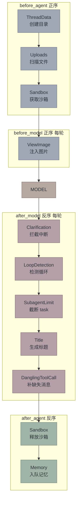

# RFC: `create_deerflow_agent` — 纯参数的 SDK 工厂 API

> **文档目的**：记录DeerFlow SDK API的设计决策和实现方案

## 1. 问题陈述

### 当前问题

当前 harness 的唯一公开入口是 `make_lead_agent(config: RunnableConfig)`。它内部：

```
make_lead_agent
  ├─ get_app_config()          ← 读 config.yaml
  ├─ _resolve_model_name()     ← 读 config.yaml
  ├─ load_agent_config()       ← 读 agents/{name}/config.yaml
  ├─ create_chat_model(name)   ← 读 config.yaml（反射加载 model class）
  ├─ get_available_tools()     ← 读 config.yaml + extensions_config.json
  ├─ apply_prompt_template()   ← 读 skills 目录 + memory.json
  └─ _build_middlewares()      ← 读 config.yaml（summarization、model vision）
```

**问题核心**：**6 处隐式 I/O** — 全部依赖文件系统。如果你想把 `deerflow-harness` 当 Python 库嵌入自己的应用，你必须准备 `config.yaml` + `extensions_config.json` + skills 目录。这对 SDK 用户是不可接受的。

### 为什么这样设计有问题

**对于SDK用户**：
- 需要了解复杂的配置文件结构
- 无法通过代码直接配置行为
- 测试和集成困难

**对于库设计**：
- 违反了显式优于隐式的原则
- 依赖隐式的全局状态
- 难以进行单元测试

### 对比分析

| | `langchain.create_agent` | `make_lead_agent` | `DeerFlowClient`（增强后） |
|---|---|---|---|
| 定位 | 底层原语 | 内部工厂 | **唯一公开 API** |
| 配置来源 | 纯参数 | YAML 文件 | **参数优先，config fallback** |
| 内置能力 | 无 | Sandbox/Memory/Skills/Subagent/... | **按需组合 + 管理 API** |
| 用户接口 | `graph.invoke(state)` | 内部使用 | **`client.chat("hello")`** |
| 适合谁 | 写 LangChain 的人 | 内部使用 | **所有 DeerFlow 用户** |

**为什么需要新的API**：
- 降低SDK使用门槛
- 提供更灵活的配置方式
- 支持纯代码集成场景

## 2. 设计原则

### Python 中的 DI 最佳实践

**为什么遵循这些原则**：

1. **函数参数即注入** — 不读全局状态，所有依赖通过参数传入
   - 显式依赖：一目了然需要什么
   - 易于测试：可以注入mock对象
   - 避免隐式耦合

2. **Protocol 定义契约** — 不依赖具体类，依赖行为接口
   - 灵活性：可以替换实现
   - 解耦：不依赖具体类型
   - 可测试：易于创建测试替身

3. **合理默认值** — `sandbox=True` 等价于 `sandbox=LocalSandboxProvider()`
   - 便利性：简单用法不需要复杂配置
   - 一致性：默认行为可预测
   - 可覆盖：高级用户可以完全自定义

4. **分层 API** — 简单用法一行搞定，复杂用法有逃生舱
   - 渐进式复杂度：从简单到复杂
   - 不限制高级用户：提供完全控制
   - 易学易用：新手友好，专家满意

### 分层架构

```
    ┌──────────────────────┐
    │   DeerFlowClient     │  ← 唯一公开 API（chat/stream + 管理）
    └──────────┬───────────┘
    ┌──────────▼───────────┐
    │   make_lead_agent    │  ← 内部：配置驱动工厂
    └──────────┬───────────┘
    ┌──────────▼───────────┐
    │  create_deerflow_agent   │  ← 内部：纯参数工厂
    └──────────┬───────────┘
    ┌──────────▼───────────┐
    │ langchain.create_agent│  ← 底层原语
    └──────────────────────┘
```

**为什么这样分层**：
- **DeerFlowClient**：唯一公开 API，提供用户友好的接口
- **make_lead_agent**：内部工厂，处理配置文件逻辑
- **create_deerflow_agent**：纯参数工厂，支持SDK场景
- **langchain.create_agent**：底层原语，提供核心能力

`DeerFlowClient` 是唯一公开 API。`create_deerflow_agent` 和 `make_lead_agent` 都是内部实现。

用户通过 `DeerFlowClient` 三个参数控制行为：

| 参数 | 类型 | 职责 |
|------|------|------|
| `config` | `dict` | 覆盖 config.yaml 的任意配置项 |
| `features` | `RuntimeFeatures` | 替换内置 middleware 实现 |
| `extra_middleware` | `list[AgentMiddleware]` | 新增用户 middleware |

不传参数 → 读 config.yaml（现有行为，完全兼容）。

### 核心约束

**为什么这些约束很重要**：

- **配置覆盖** — `config` dict > config.yaml > 默认值
  - 灵活性：代码配置优先于文件配置
  - 向后兼容：不传参数时行为不变
  - 渐进式迁移：可以逐步从文件迁移到代码

- **三层不重叠** — config 传参数，features 传实例，extra_middleware 传新增
  - 职责清晰：每个参数有明确的用途
  - 避免混淆：不会出现配置冲突
  - 易于理解：用户知道在哪里配置什么

- **向前兼容** — 现有 `DeerFlowClient()` 无参构造行为不变
  - 安全升级：现有代码不会破坏
  - 渐进式采用：可以逐步使用新功能
  - 低风险：不会引入破坏性变更

- **harness 边界合规** — 不 import `app.*`（`test_harness_boundary.py` 强制）
  - 模块化：保持harness独立
  - 可测试：不依赖app模块
  - 可重用：可以在其他项目中使用

## 3. API 设计

### 3.1 `DeerFlowClient` — 唯一公开 API

在现有构造函数上增加三个可选参数：

```python
from deerflow.client import DeerFlowClient
from deerflow.agents.features import RuntimeFeatures

client = DeerFlowClient(
    # 1. config — 覆盖 config.yaml 的任意 key（结构和 yaml 一致）
    config={
        "models": [{"name": "gpt-4o", "use": "langchain_openai:ChatOpenAI", "model": "gpt-4o", "api_key": "sk-..."}],
        "memory": {"max_facts": 50, "enabled": True},
        "title": {"enabled": False},
        "summarization": {"enabled": True, "trigger": [{"type": "tokens", "value": 10000}]},
        "sandbox": {"use": "deerflow.sandbox.local:LocalSandboxProvider"},
    },

    # 2. features — 替换内置 middleware 实现
    features=RuntimeFeatures(
        memory=MyMemoryMiddleware(),
        auto_title=MyTitleMiddleware(),
    ),

    # 3. extra_middleware — 新增用户 middleware
    extra_middleware=[
        MyAuditMiddleware(),       # @Next(SandboxMiddleware)
        MyFilterMiddleware(),      # @Prev(ClarificationMiddleware)
    ],
)
```

**为什么这样设计**：
- **config参数**：直接映射YAML结构，学习成本低
- **features参数**：类型安全，IDE支持好
- **extra_middleware**：灵活扩展，不破坏现有结构

### 三种典型用法

```python
# 用法 1：全读 config.yaml（现有行为，不变）
client = DeerFlowClient()

# 用法 2：只改参数，不换实现
client = DeerFlowClient(config={"memory": {"max_facts": 50}})

# 用法 3：替换 middleware 实现
client = DeerFlowClient(features=RuntimeFeatures(auto_title=MyTitleMiddleware()))

# 用法 4：添加自定义 middleware
client = DeerFlowClient(extra_middleware=[MyAuditMiddleware()])

# 用法 5：纯 SDK（无 config.yaml）
client = DeerFlowClient(config={
    "models": [{"name": "gpt-4o", "use": "langchain_openai:ChatOpenAI", ...}],
    "tools": [{"name": "bash", "use": "deerflow.sandbox.tools:bash_tool", "group": "bash"}],
    "memory": {"enabled": True},
})
```

内部实现：`final_config = deep_merge(file_config, code_config)`

**为什么支持deep merge**：
- 细粒度覆盖：只覆盖需要的配置项
- 配置组合：文件配置基础，代码覆盖细节
- 灵活性：支持各种配置场景

### 3.2 `create_deerflow_agent` — 内部工厂（不公开）

```python
def create_deerflow_agent(
    model: BaseChatModel,
    tools: list[BaseTool] | None = None,
    *,
    system_prompt: str | None = None,
    middleware: list[AgentMiddleware] | None = None,
    features: RuntimeFeatures | None = None,
    state_schema: type | None = None,
    checkpointer: BaseCheckpointSaver | None = None,
    name: str = "default",
) -> CompiledStateGraph:
    ...
```

**为什么不公开这个函数**：
- 用户不需要接触 `CompiledStateGraph`
- 这是内部实现细节
- 通过 `DeerFlowClient` 提供更友好的接口

### 3.3 `RuntimeFeatures` — 内置 Middleware 替换

**为什么只做一件事**：用自定义实例替换内置 middleware。不管配置参数（参数走 `config` dict）。

```python
@dataclass
class RuntimeFeatures:
    sandbox: bool | AgentMiddleware = True
    memory: bool | AgentMiddleware = False
    summarization: bool | AgentMiddleware = False
    subagent: bool | AgentMiddleware = False
    vision: bool | AgentMiddleware = False
    auto_title: bool | AgentMiddleware = False
```

| 值 | 含义 |
|---|---|
| `True` | 使用默认 middleware（参数从 config 读） |
| `False` | 关闭该功能 |
| `AgentMiddleware` 实例 | 替换整个实现 |

**为什么这样设计**：
- **清晰语义**：bool开关 vs 实例替换，一目了然
- **类型安全**：编译时检查，避免运行时错误
- **灵活性**：支持启用、禁用、替换三种模式

不再有 `MemoryOptions`、`TitleOptions` 等。参数调整走 `config` dict：

```python
# 改 memory 参数 → config
client = DeerFlowClient(config={"memory": {"max_facts": 50}})

# 换 memory 实现 → features
client = DeerFlowClient(features=RuntimeFeatures(memory=MyMemoryMiddleware()))

# 两者组合 — config 参数给默认 middleware，但 title 换实现
client = DeerFlowClient(
    config={"memory": {"max_facts": 50}},
    features=RuntimeFeatures(auto_title=MyTitleMiddleware()),
)
```

**为什么分离参数和实现**：
- **关注点分离**：参数调整不关心实现
- **测试友好**：可以独立测试参数和实现
- **文档清晰**：每个参数有明确的归属

### 3.4 Middleware 链组装

不使用 priority 数字排序。按固定顺序 append 构建列表：

```python
def _resolve(spec, default_cls):
    """bool → 默认实现 / AgentMiddleware → 替换"""
    if isinstance(spec, AgentMiddleware):
        return spec
    return default_cls()

def _assemble_from_features(feat: RuntimeFeatures, config: AppConfig) -> tuple[list, list]:
    chain = []
    extra_tools = []

    if feat.sandbox:
        chain.append(_resolve(feat.sandbox, ThreadDataMiddleware))
        chain.append(UploadsMiddleware())
        chain.append(_resolve(feat.sandbox, SandboxMiddleware))

    chain.append(DanglingToolCallMiddleware())
    chain.append(ToolErrorHandlingMiddleware())

    if feat.summarization:
        chain.append(_resolve(feat.summarization, SummarizationMiddleware))
    if config.title.enabled and feat.auto_title is not False:
        chain.append(_resolve(feat.auto_title, TitleMiddleware))
    if feat.memory:
        chain.append(_resolve(feat.memory, MemoryMiddleware))
    if feat.vision:
        chain.append(ViewImageMiddleware())
        extra_tools.append(view_image_tool)
    if feat.subagent:
        chain.append(_resolve(feat.subagent, SubagentLimitMiddleware))
        extra_tools.append(task_tool)
    if feat.loop_detection:
        chain.append(_resolve(feat.loop_detection, LoopDetectionMiddleware))

    # 插入 extra_middleware（按 @Next/@Prev 声明定位）
    _insert_extra(chain, extra_middleware)

    # Clarification 永远最后
    chain.append(ClarificationMiddleware())
    extra_tools.append(ask_clarification_tool)

    return chain, extra_tools
```

**为什么不用priority排序**：
- **可读性**：代码顺序就是执行顺序
- **可维护性**：不需要查找priority定义
- **确定性**：没有隐式的排序逻辑

### 3.6 Middleware 排序策略

**两阶段排序：内置固定 + 外置插入**

**为什么这样设计**：
1. **内置链固定顺序** — 按代码中的 append 顺序确定，不参与 @Next/@Prev
   - 稳定性：内置顺序不会意外改变
   - 可预测：开发者知道确切的执行顺序
   - 文档友好：顺序在代码中一目了然

2. **外置 middleware 插入** — `extra_middleware` 中的 middleware 通过 @Next/@Prev 声明锚点，自由锚定任意 middleware（内置或其他外置均可）
   - 灵活性：用户可以在任意位置插入
   - 类型安全：编译时检查锚点存在性
   - 声明式：通过装饰器声明位置

3. **冲突检测** — 两个外置 middleware 如果 @Next 或 @Prev 同一个目标 → `ValueError`
   - 安全性：防止意外的顺序冲突
   - 早期发现：在启动时而不是运行时发现
   - 明确错误：告诉用户哪里冲突

**这不是全排序。** 内置链的顺序在代码中已确定，外置 middleware 只做插入操作。这样可以避免内置和外置同时竞争同一个位置的问题。

### 3.7 `@Next` / `@Prev` 装饰器

**为什么使用装饰器**：用户自定义 middleware 通过装饰器声明在链中的位置，类型安全：

```python
from deerflow.agents import Next, Prev

@Next(SandboxMiddleware)
class MyAuditMiddleware(AgentMiddleware):
    """排在 SandboxMiddleware 后面"""
    def before_agent(self, state, runtime):
        ...

@Prev(ClarificationMiddleware)
class MyFilterMiddleware(AgentMiddleware):
    """排在 ClarificationMiddleware 前面"""
    def after_model(self, state, runtime):
        ...
```

**装饰器的优势**：
- **类型安全**：编译时检查middleware类型
- **声明式**：位置信息与类定义在一起
- **IDE友好**：可以跳转到目标middleware
- **可读性**：一目了然类的排序意图

实现：

```python
def Next(anchor: type[AgentMiddleware]):
    """装饰器：声明本 middleware 排在 anchor 的下一个位置。"""
    def decorator(cls: type[AgentMiddleware]) -> type[AgentMiddleware]:
        cls._next_anchor = anchor
        return cls
    return decorator

def Prev(anchor: type[AgentMiddleware]):
    """装饰器：声明本 middleware 排在 anchor 的前一个位置。"""
    def decorator(cls: type[AgentMiddleware]) -> type[AgentMiddleware]:
        cls._prev_anchor = anchor
        return cls
    return decorator
```

`_insert_extra` 算法：

1. 遍历 `extra_middleware`，读取每个 middleware 的 `_next_anchor` / `_prev_anchor`
2. **冲突检测**：如果两个外置 middleware 的锚点相同（同方向同目标），抛出 `ValueError`
3. 有锚点的 middleware 插入到目标位置（@Next → 目标之后，@Prev → 目标之前）
4. 无声明的 middleware 追加到 Clarification 之前

## 4. Middleware 执行模型

### LangChain 的执行规则

```
before_agent 正序 →  [0] → [1] → ... → [N]
before_model 正序 →  [0] → [1] → ... → [N]  ← 每轮循环
         MODEL
after_model 反序 ←   [N] → [N-1] → ... → [0]  ← 每轮循环
after_agent 反序 ←   [N] → [N-1] → ... → [0]
```

`before_agent` / `after_agent` 只跑一次。`before_model` / `after_model` 每轮 tool call 循环都跑。

### DeerFlow 的实际情况

**不是洋葱，是管道。** 11 个 middleware 中只有 SandboxMiddleware 有 before/after 对称（获取/释放），其余只用一个钩子。

硬依赖只有 2 处：
1. **ThreadData 在 Sandbox 之前** — sandbox 需要线程目录
2. **Clarification 在列表最后** — after_model 反序时最先执行，第一个拦截 `ask_clarification`

详见 [middleware-execution-flow.md](middleware-execution-flow.md)。

## 5. 使用示例

### 5.1 全读 config.yaml（现有行为不变）

```python
from deerflow.client import DeerFlowClient

client = DeerFlowClient()
response = client.chat("Hello")
```

### 5.2 覆盖配置参数

```python
client = DeerFlowClient(config={
    "memory": {"max_facts": 50},
    "title": {"enabled": False},
    "summarization": {"trigger": [{"type": "tokens", "value": 10000}]},
})
```

### 5.3 纯 SDK（无 config.yaml）

```python
client = DeerFlowClient(config={
    "models": [{"name": "gpt-4o", "use": "langchain_openai:ChatOpenAI", "model": "gpt-4o", "api_key": "sk-..."}],
    "tools": [
        {"name": "bash", "group": "bash", "use": "deerflow.sandbox.tools:bash_tool"},
        {"name": "web_search", "group": "web", "use": "deerflow.community.tavily.tools:web_search_tool"},
    ],
    "memory": {"enabled": True, "max_facts": 50},
    "sandbox": {"use": "deerflow.sandbox.local:LocalSandboxProvider"},
})
```

### 5.4 替换内置 middleware

```python
from deerflow.agents.features import RuntimeFeatures

client = DeerFlowClient(
    features=RuntimeFeatures(
        memory=MyMemoryMiddleware(),       # 替换
        auto_title=MyTitleMiddleware(),    # 替换
        vision=False,                      # 关闭
    ),
)
```

### 5.5 插入自定义 middleware

```python
from deerflow.agents import Next, Prev
from deerflow.sandbox.middleware import SandboxMiddleware
from deerflow.agents.middlewares.clarification_middleware import ClarificationMiddleware

@Next(SandboxMiddleware)
class MyAuditMiddleware(AgentMiddleware):
    def before_agent(self, state, runtime):
        log_sandbox_acquired(state)

@Prev(ClarificationMiddleware)
class MyFilterMiddleware(AgentMiddleware):
    def after_model(self, state, runtime):
        filter_sensitive_output(state)

client = DeerFlowClient(
    extra_middleware=[MyAuditMiddleware(), MyFilterMiddleware()],
)
```

## 6. Phase 1 限制

当前实现中以下 middleware 内部仍读 `config.yaml`，SDK 用户需注意：

| Middleware | 读取内容 | Phase 2 解决方案 |
|------------|---------|-----------------|
| TitleMiddleware | `get_title_config()` + `create_chat_model()` | `TitleOptions(model=...)` 参数覆盖 |
| MemoryMiddleware | `get_memory_config()` | `MemoryOptions(...)` 参数覆盖 |
| SandboxMiddleware | `get_sandbox_provider()` | `SandboxProvider` 实例直传 |

Phase 1 中 `auto_title` 默认为 `False` 以避免无 config 时崩溃。其他有 config 依赖的 feature 默认也为 `False`。

**为什么有这些限制**：
- **渐进式实现**：先建立框架，再完善细节
- **向后兼容**：不影响现有配置文件用户
- **风险控制**：逐步迁移，降低风险

## 7. 迁移路径

```
Phase 1（当前 PR #1203）:
  ✓ 新增 create_deerflow_agent + RuntimeFeatures（内部 API）
  ✓ 不改 DeerFlowClient 和 make_lead_agent
  ✗ middleware 内部仍读 config（已知限制）

Phase 2（#1380）:
  - DeerFlowClient 构造函数增加可选参数（model, tools, features, system_prompt）
  - Options 参数覆盖 config（MemoryOptions, TitleOptions 等）
  - @Next/@Prev 装饰器
  - 补缺失 middleware（Guardrail, TokenUsage, DeferredToolFilter）
  - make_lead_agent 改为薄壳调 create_deerflow_agent

Phase 3:
  - SDK 文档和示例
  - deerflow.client 稳定 API
```

**为什么分阶段**：
- **降低风险**：每个阶段都是可回滚的
- **渐进式采用**：用户可以逐步迁移
- **反馈驱动**：根据用户反馈调整后续计划

## 8. 设计决议

| 问题 | 决议 | 理由 |
|------|------|------|
| 公开 API | `DeerFlowClient` 唯一入口 | 自顶向下，先改现有 API 再抽底层 |
| create_deerflow_agent | 内部实现，不公开 | 用户不需要接触 CompiledStateGraph |
| 配置覆盖 | `config` dict，和 config.yaml 结构一致 | 无新概念，deep merge 覆盖 |
| middleware 替换 | `features=RuntimeFeatures(memory=MyMW())` | bool 开关 + 实例替换 |
| middleware 扩展 | `extra_middleware` 独立参数 | 和内置 features 分开 |
| middleware 定位 | `@Next/@Prev` 装饰器 | 类型安全，不暴露排序细节 |
| 排序机制 | 顺序 append + @Next/@Prev | priority 数字无功能意义 |
| 运行时开关 | 保留 `RunnableConfig` | plan_mode、thread_id 等按请求切换 |

## 9. 附录：Middleware 链



硬依赖：
- ThreadData → Uploads → Sandbox（before_agent 阶段）
- Clarification 必须在列表最后（after_model 反序时最先执行）

## 10. 主 Agent 与 Subagent 的 Middleware 差异

主 agent 和 subagent 共享基础 middleware 链（`_build_runtime_middlewares`），subagent 在此基础上做精简：

| Middleware | 主 Agent | Subagent | 说明 |
|------------|:-------:|:--------:|------|
| ThreadDataMiddleware | ✓ | ✓ | 共享：创建线程目录 |
| UploadsMiddleware | ✓ | ✗ | 主 agent 独有：扫描上传文件 |
| SandboxMiddleware | ✓ | ✓ | 共享：获取/释放沙箱 |
| DanglingToolCallMiddleware | ✓ | ✗ | 主 agent 独有：补缺失 ToolMessage |
| GuardrailMiddleware | ✓ | ✓ | 共享：工具调用授权（可选） |
| ToolErrorHandlingMiddleware | ✓ | ✓ | 共享：工具异常处理 |
| SummarizationMiddleware | ✓ | ✗ | 主 agent 独有：上下文压缩 |
| TodoMiddleware | ✓ | ✗ | 主 agent 独有：计划模式 |
| TitleMiddleware | ✓ | ✗ | 主 agent 独有：标题生成 |
| MemoryMiddleware | ✓ | ✗ | 主 agent 独有：记忆管理 |
| ViewImageMiddleware | ✓ | ✗ | 主 agent 独有：图片处理 |
| SubagentLimitMiddleware | ✓ | ✗ | 主 agent 独有：子代理限制 |
| LoopDetectionMiddleware | ✓ | ✗ | 主 agent 独有：循环检测 |
| ClarificationMiddleware | ✓ | ✗ | 主 agent 独有：澄清中断 |

**设计原则**：
- `RuntimeFeatures`、`@Next/@Prev`、排序机制只作用于**主 agent**
- Subagent 链短且固定（4 个），不需要动态组装
- `extra_middleware` 当前只影响主 agent，不传递给 subagent

**为什么Subagent链更短**：
- **简化**：子代理专注执行，不需要额外功能
- **性能**：减少中间件开销
- **清晰**：主代理和子代理职责分明
