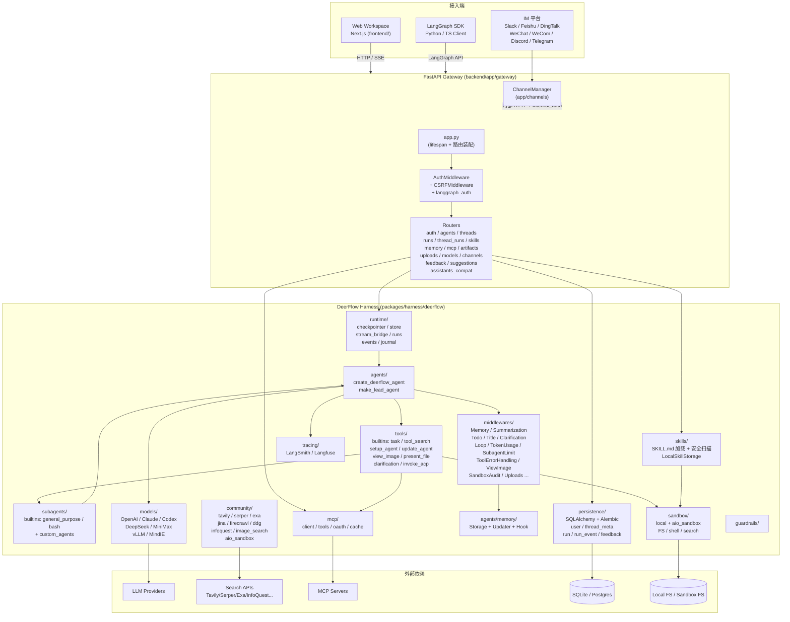
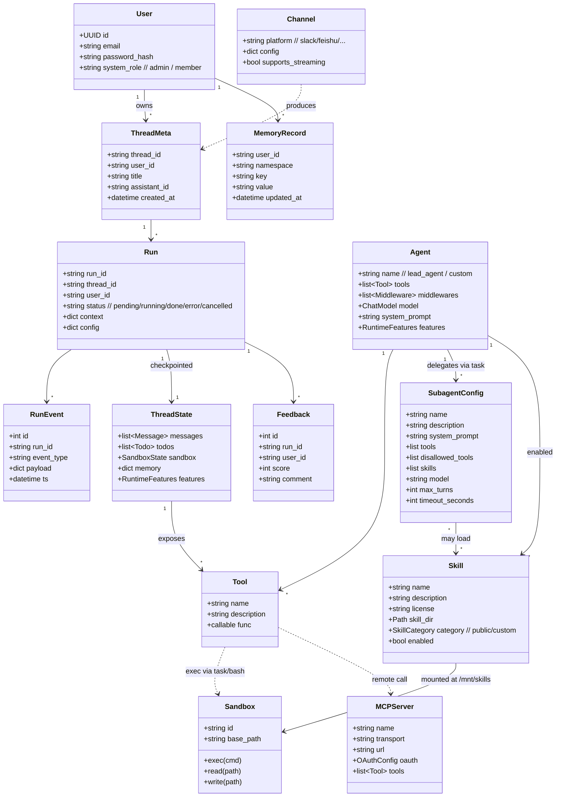
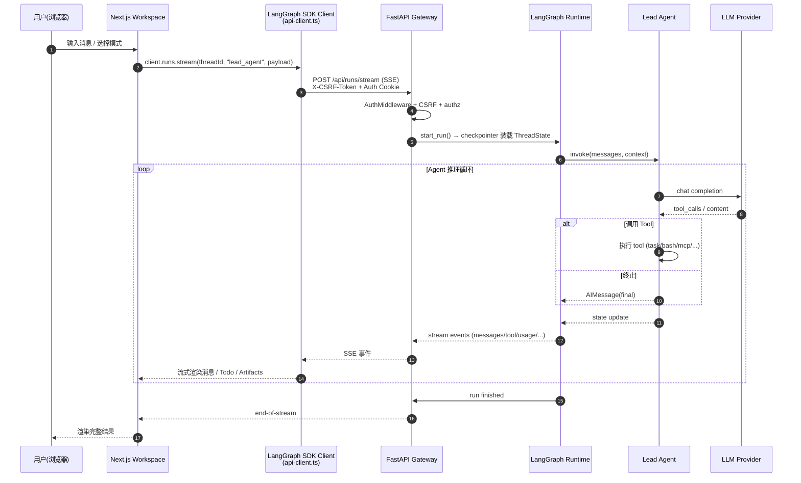
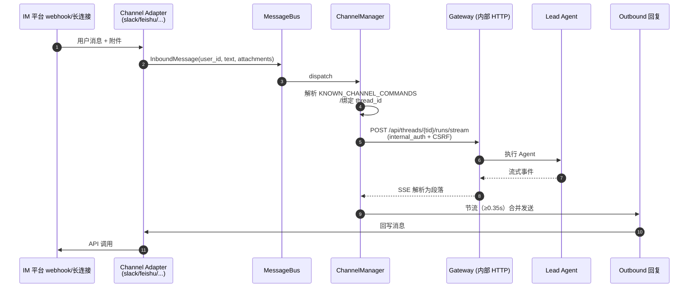
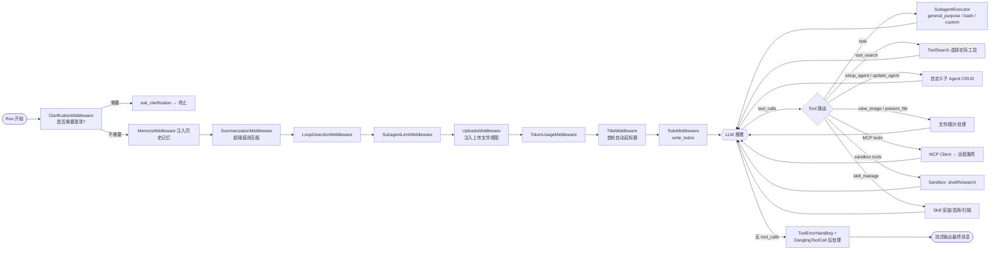
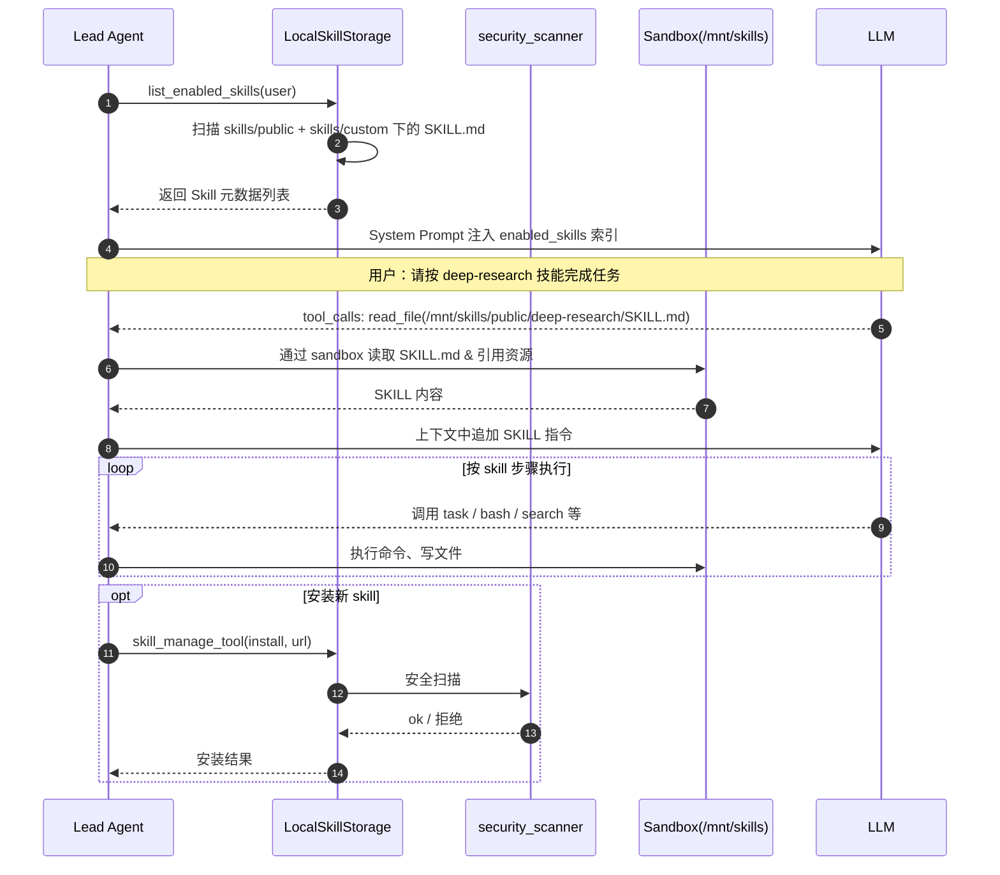

# DeerFlow 2.0 项目架构总览

> 自动扫描生成 — 包含 **整体架构图、领域模型图、核心链路图、功能索引** 四部分。
> 适用版本：DeerFlow 2.0（与 1.x 不共享代码）。

## 目录

- [一、项目定位](#一项目定位)
- [二、整体架构图](#二整体架构图)
- [三、领域模型图](#三领域模型图)
- [四、核心链路图](#四核心链路图)
  - [4.1 Web 用户对话链路](#41-web-用户对话链路)
  - [4.2 IM Channel 入站链路](#42-im-channel-入站链路)
  - [4.3 Agent 内部执行链路](#43-agent-内部执行链路)
  - [4.4 Skill 加载与执行链路](#44-skill-加载与执行链路)
- [五、功能索引](#五功能索引)
  - [5.1 后端 Gateway 层](#51-后端-gateway-层)
  - [5.2 后端 Harness 内核](#52-后端-harness-内核)
  - [5.3 IM Channels 层](#53-im-channels-层)
  - [5.4 前端 Workspace](#54-前端-workspace)
  - [5.5 Skills 资产](#55-skills-资产)
  - [5.6 部署与脚本](#56-部署与脚本)

---

## 一、项目定位

DeerFlow（**D**eep **E**xploration and **E**fficient **R**esearch **Flow**）2.0 是一个开源的 **Super Agent Harness**：通过 **Lead Agent + Sub-Agents + 可插拔 Skills + 沙箱执行 + 长期记忆** 的组合，把 LLM 编排成可以"完成几乎任何任务"的通用研究/执行代理。

- **后端**：Python 3.12 + FastAPI + LangGraph + LangChain Agents
  - `backend/app/`：Gateway（HTTP API、鉴权、IM Channels）
  - `backend/packages/harness/deerflow/`：内核（Agent 工厂、中间件、工具、技能、沙箱、运行时、持久化、社区适配器）
- **前端**：Next.js 15 + React 19 + Tailwind + Radix UI + `@langchain/langgraph-sdk`，提供 Workspace 对话与文档/博客能力
- **Skills**：以 `SKILL.md` + 资源文件形式存放在 `skills/public/`，运行时按需挂载到沙箱 `/mnt/skills` 下供 Agent 读取
- **IM Channels**：Slack / Feishu / DingTalk / WeChat / WeCom / Discord / Telegram，统一通过 Gateway 复用 Agent 编排

---

## 二、整体架构图

---

## 三、领域模型图

---

## 四、核心链路图

### 4.1 Web 用户对话链路

### 4.2 IM Channel 入站链路

### 4.3 Agent 内部执行链路

### 4.4 Skill 加载与执行链路

---

## 五、功能索引

### 5.1 后端 Gateway 层

> 路径前缀：`backend/app/gateway/`，HTTP 入口，挂载在 `app.py` 的 FastAPI 上。

- **入口与生命周期**
  - `app.py`：`FastAPI` 装配、`lifespan`（启动时 `_ensure_admin_user`、孤儿 thread 迁移）、CORS、各 Router 注册
  - `deps.py`：依赖注入工厂（`get_checkpointer` / `get_run_manager` / `get_run_event_store` / `get_stream_bridge` / `get_local_provider` / `langgraph_runtime`）
  - `services.py`：`start_run` / `sse_consumer` 等通用服务
  - `config.py`：`get_gateway_config()` Gateway 级配置
- **鉴权与安全**
  - `auth_middleware.py`、`csrf_middleware.py`：Cookie + CSRF 双因子
  - `langgraph_auth.py`：LangGraph Server `auth.path` 入口
  - `internal_auth.py`：Channel 等内部组件互调用凭证
  - `authz.py`：`require_permission` 装饰器
  - `auth/`：`local_provider.py`、`jwt.py`、`password.py`、`reset_admin.py`、`repositories/sqlite.py`（本地账户体系）
- **HTTP Routers**（路径以 `/api/...` 暴露）
  - `routers/auth.py`：登录/注册/会话
  - `routers/agents.py`：自定义 Agent CRUD
  - `routers/threads.py`：会话列表 / 详情 / 删除
  - `routers/thread_runs.py`：基于 thread 的 Run 操作（`RunCreateRequest`）
  - `routers/runs.py`：无状态 Run 入口（`/api/runs/stream`、`/api/runs/wait`）
  - `routers/skills.py`：Skill 列表 / 启停 / 安装
  - `routers/memory.py`：长期记忆读写
  - `routers/mcp.py`：MCP Server 配置
  - `routers/artifacts.py`：沙箱产物（文件、图片）下载
  - `routers/uploads.py`：用户上传文件
  - `routers/models.py`：可用模型清单
  - `routers/channels.py`：IM Channel 配置管理
  - `routers/feedback.py`：消息反馈
  - `routers/suggestions.py`：建议词
  - `routers/assistants_compat.py`：LangGraph Assistants API 兼容层

### 5.2 后端 Harness 内核

> 路径前缀：`backend/packages/harness/deerflow/`

- **Agents 编排**
  - `agents/__init__.py`：导出 `make_lead_agent` / `create_deerflow_agent` / `RuntimeFeatures`
  - `agents/factory.py`：`create_deerflow_agent`（纯参数工厂，组装 `langchain.agents.create_agent`）
  - `agents/lead_agent/agent.py`：`make_lead_agent`，装配中间件 + 工具 + 模型
  - `agents/lead_agent/prompt.py`：`apply_prompt_template`、`prime_enabled_skills_cache`
  - `agents/thread_state.py`：`ThreadState` / `SandboxState`
  - `agents/features.py`：`RuntimeFeatures`、`Next`、`Prev`
- **Middlewares**（`agents/middlewares/`）
  - `clarification_middleware.py`：澄清拦截
  - `summarization_middleware.py`：上下文压缩（含 `BeforeSummarizationHook`）
  - `memory_middleware.py`：长期记忆注入
  - `loop_detection_middleware.py`：环检测
  - `subagent_limit_middleware.py`：子 Agent 调用次数上限
  - `todo_middleware.py`：`write_todos` 工具注入
  - `title_middleware.py`：会话标题生成
  - `token_usage_middleware.py`：Token 计量
  - `tool_error_handling_middleware.py`：工具错误重试/降级
  - `dangling_tool_call_middleware.py`：悬挂 tool_call 修复
  - `view_image_middleware.py`、`uploads_middleware.py`、`thread_data_middleware.py`、`sandbox_audit_middleware.py`、`deferred_tool_filter_middleware.py`、`llm_error_handling_middleware.py`
- **Memory 子系统**（`agents/memory/`）
  - `storage.py`、`updater.py`、`queue.py`、`message_processing.py`、`prompt.py`、`summarization_hook.py`
- **Tools**（`tools/`）
  - `tools.py`：工具集合装配
  - `skill_manage_tool.py`：skill 安装/启用/卸载
  - `builtins/task_tool.py`：`task` 工具，委派给 Subagent
  - `builtins/tool_search.py`：动态发现工具
  - `builtins/setup_agent_tool.py` / `update_agent_tool.py`：自定义 Agent CRUD
  - `builtins/clarification_tool.py`：`ask_clarification`
  - `builtins/view_image_tool.py` / `present_file_tool.py`
  - `builtins/invoke_acp_agent_tool.py`：调用 ACP 协议远程 Agent
- **Subagents**（`subagents/`）
  - `registry.py`：`get_subagent_config`（builtin → custom_agents → 覆盖）
  - `executor.py`：`SubagentExecutor`、`SubagentStatus`、后台任务管理
  - `config.py`：`SubagentConfig`、`resolve_subagent_model_name`
  - `builtins/general_purpose.py`：通用子 Agent
  - `builtins/bash_agent.py`：宿主 bash 子 Agent
- **Skills**（`skills/`）
  - `types.py`：`Skill`、`SkillCategory`
  - `parser.py`：`SKILL.md` frontmatter 解析
  - `validation.py`：`_validate_skill_frontmatter`
  - `security_scanner.py`：恶意内容扫描
  - `installer.py`：`SkillAlreadyExistsError` / `SkillSecurityScanError`
  - `storage/local_skill_storage.py`、`storage/skill_storage.py`：本地存储与抽象
- **Sandbox**（`sandbox/`）
  - `sandbox.py`、`sandbox_provider.py`：抽象与多实现路由
  - `local/local_sandbox.py`、`local/local_sandbox_provider.py`、`local/list_dir.py`：本地沙箱
  - `tools.py`：暴露给 Agent 的沙箱工具集
  - `security.py`：`is_host_bash_allowed`、`LOCAL_BASH_SUBAGENT_DISABLED_MESSAGE`
  - `middleware.py`、`file_operation_lock.py`、`search.py`、`exceptions.py`
- **MCP**（`mcp/`）
  - `client.py`：MCP Client
  - `tools.py`：把 MCP 工具适配为 LangChain Tool
  - `oauth.py`、`cache.py`
- **Models**（`models/`）
  - `factory.py`：`create_chat_model`
  - 各 Provider：`patched_openai.py`、`claude_provider.py`、`patched_deepseek.py`、`patched_minimax.py`、`openai_codex_provider.py`、`vllm_provider.py`、`mindie_provider.py`
  - `credential_loader.py`：凭证加载
- **Runtime**（`runtime/`）
  - `checkpointer/async_provider.py`：LangGraph Checkpointer（langgraph.json 注册点）
  - `store/async_provider.py`：LangGraph Store（长期记忆等）
  - `stream_bridge/`：内存/异步流桥
  - `runs/`：`manager.py`、`worker.py`、`schemas.py`、`store/`
  - `events/`：事件持久化（`store/db.py` / `jsonl.py` / `memory.py`）
  - `journal.py`、`user_context.py`、`converters.py`、`serialization.py`
- **Persistence**（`persistence/`）
  - `engine.py`：SQLAlchemy 引擎与 session 工厂
  - `migrations/`：Alembic 迁移
  - `user/model.py`：`UserRow`
  - `thread_meta/`：`model.py`、`sql.py`、`memory.py`、`base.py`
  - `run/`：Run 持久化
  - `feedback/`：反馈持久化
  - `models/run_event.py`
- **Community 适配**（`community/`）
  - 搜索：`tavily/`、`serper/`、`exa/`、`ddg_search/`、`infoquest/`、`image_search/`
  - 抓取：`firecrawl/`、`jina_ai/`
  - 沙箱：`aio_sandbox/`
- **其他**
  - `guardrails/`：`provider.py`、`builtin.py`、`middleware.py`
  - `tracing/factory.py`：LangSmith / Langfuse
  - `config/`：所有领域的 `XxxAppConfig` + `app_config.py` 总入口
  - `uploads/manager.py`：上传文件管理
  - `utils/`：`time.py`、`network.py`、`readability.py`、`file_conversion.py`
  - `client.py`：DeerFlow 内部 Client SDK

### 5.3 IM Channels 层

> 路径前缀：`backend/app/channels/`

- `manager.py`：`ChannelManager`，把入站消息桥接到 Gateway 内部 HTTP，节流回写
- `message_bus.py`：`MessageBus` / `InboundMessage` / `OutboundMessage` / `ResolvedAttachment`
- `service.py`、`store.py`：Channel 服务与配置存储
- `commands.py`：内置斜杠命令
- `base.py`：Adapter 基类
- 各平台 Adapter：`slack.py`、`feishu.py`、`dingtalk.py`、`wechat.py`、`wecom.py`、`discord.py`、`telegram.py`

### 5.4 前端 Workspace

> 路径前缀：`frontend/src/`

- **App 路由（Next.js App Router）**
  - `app/page.tsx`、`app/layout.tsx`：首页与全局布局
  - `app/(auth)/login/`、`app/(auth)/setup/`：登录与首次安装
  - `app/workspace/page.tsx` / `workspace-content.tsx`：Workspace 主入口
  - `app/workspace/chats/[thread_id]/`：单会话页
  - `app/workspace/agents/[agent_name]/`、`agents/[agent_name]/chats/[thread_id]/`、`agents/new/`：自定义 Agent
  - `app/[lang]/docs/[[...mdxPath]]/`：多语言文档
  - `app/blog/`、`app/blog/posts/`、`app/blog/tags/[tag]/`：博客
  - `app/api/memory/[...path]/route.ts`：记忆代理路由
  - `app/mock/api/...`：开发态 mock
- **Core 业务层**（`core/`）
  - `core/api/api-client.ts`：基于 `@langchain/langgraph-sdk` 的 Client，注入 CSRF
  - `core/api/fetcher.ts`、`stream-mode.ts`、`feedback.ts`
  - `core/agents/`：自定义 Agent CRUD（`api.ts` / `hooks.ts` / `types.ts`）
  - `core/threads/`：会话列表、导出、Hook
  - `core/skills/`：Skill 列表与启停
  - `core/memory/`：长期记忆
  - `core/mcp/`：MCP Server 配置
  - `core/messages/`：消息工具与 token 计量
  - `core/tools/utils.ts`：工具调用展示工具
  - `core/uploads/`、`core/artifacts/`、`core/todos/`、`core/tasks/`
  - `core/auth/`、`core/notification/`、`core/settings/`、`core/config/`
  - `core/models/`：模型选择
  - `core/blog/`、`core/i18n/locales/`、`core/streamdown/`、`core/rehype/`：内容渲染与 i18n
- **UI 组件**（`components/`）
  - `components/workspace/`：`workspace-container.tsx`、`workspace-sidebar.tsx`、`workspace-header.tsx`、`input-box.tsx`、`recent-chat-list.tsx`、`thread-title.tsx`、`todo-list.tsx`、`token-usage-indicator.tsx`、`command-palette.tsx`、`code-editor.tsx`、`agent-welcome.tsx`、`welcome.tsx`
  - `components/workspace/messages/`、`citations/`、`artifacts/`、`agents/`、`chats/`、`settings/`
  - `components/landing/`：着陆页（`hero.tsx`、`header.tsx`、`footer.tsx`、`progressive-skills-animation.tsx`、`sections/`）
  - `components/ui/`：Radix UI 封装
  - `components/ai-elements/`：AI 输出元素
- **Hooks / Lib**
  - `hooks/use-global-shortcuts.ts`、`hooks/use-mobile.ts`
  - `lib/utils.ts`、`lib/ime.ts`
  - `env.js`、`mdx-components.ts`

### 5.5 Skills 资产

> 路径前缀：`skills/public/`，每个目录一个 `SKILL.md` + `references/` / `scripts/` / `templates/` / `assets/`

- **研究类**：`deep-research`、`github-deep-research`、`systematic-literature-review`、`academic-paper-review`、`consulting-analysis`、`data-analysis`
- **创作类**：`newsletter-generation`、`podcast-generation`、`ppt-generation`、`video-generation`、`image-generation`、`chart-visualization`
- **前端/部署**：`frontend-design`、`web-design-guidelines`、`vercel-deploy-claimable`、`bootstrap`
- **开发协作**：`code-documentation`、`claude-to-deerflow`
- **元能力**：`skill-creator`（创建 Skill）、`find-skills`（检索 Skill）、`surprise-me`

### 5.6 部署与脚本

- **Docker**
  - `docker/docker-compose.yaml`、`docker/docker-compose-dev.yaml`
  - `backend/Dockerfile`、`frontend/Dockerfile`
- **配置样例**
  - `config.example.yaml`：DeerFlow 总配置（models / agents / subagents / skills / sandbox / memory / tracing / guardrails …）
  - `extensions_config.example.json`：扩展配置
  - `.env.example`、`backend/langgraph.json`
- **顶层 Makefile**：开发/构建/测试入口
- **scripts/**
  - `setup_wizard.py`、`configure.py`：初始化向导
  - `doctor.py`、`check.py`、`check.sh`：健康检查
  - `deploy.sh`、`docker.sh`、`serve.sh`、`start-daemon.sh`、`wait-for-port.sh`：部署/启动
  - `cleanup-containers.sh`、`config-upgrade.sh`、`tool-error-degradation-detection.sh`：运维
  - `export_claude_code_oauth.py`、`load_memory_sample.py`：辅助工具
  - `run-with-git-bash.cmd`：Windows 适配

---

## 附：阅读建议

1. 想理解 **整体启动流程**：`backend/app/gateway/app.py` → `langgraph.json` → `packages/harness/deerflow/agents/lead_agent/agent.py`
2. 想理解 **一次对话的内部循环**：`agents/factory.py` → 各 `middlewares/*.py` → `tools/builtins/task_tool.py` → `subagents/executor.py`
3. 想新增 **能力**：
   - 加工具：`tools/builtins/` 新文件 + 在 `tools/tools.py` 注册
   - 加技能：在 `skills/public/<name>/SKILL.md` 写描述与脚本即可
   - 加子 Agent：`config.yaml` 的 `custom_agents` 段
   - 接 LLM：在 `models/` 新增 Provider + 在 `models/factory.py` 注册
4. 想接入新 **IM 平台**：在 `backend/app/channels/` 新增 Adapter，继承 `base.py`，并在 `manager.py` 注册能力。

