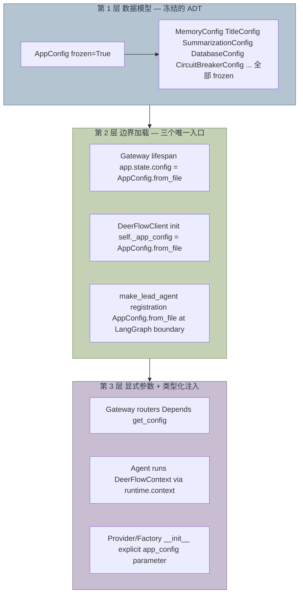

# DeerFlow 配置系统设计

> 对应实现：[PR #2271](https://github.com/bytedance/deer-flow/pull/2271) · RFC [#1811](https://github.com/bytedance/deer-flow/issues/1811) · 归档 spec：[config-refactor-design](./plans/2026-04-12-config-refactor-design.md)
>
> 文档版本：**Phase 2 终态**。早期 Phase 1 设计（`AppConfig.current()` 三层 fallback）已被推翻，详见 §6。

## 1. 为什么要重构

重构前的 `deerflow/config/` 有三个结构性问题，凑在一起就是"全局可变状态 + 副作用耦合"的经典反模式：

| 问题 | 具体表现 |
|------|----------|
| 双重真相 | 每个 sub-config 同时是 `AppConfig` 字段**和**模块级全局（`_memory_config` / `_title_config` …）。consumer 不知道该信哪个 |
| 副作用耦合 | `AppConfig.from_file()` 顺便 mutate 8 个 sub-module 的 globals（通过 `load_*_from_dict()`） |
| 隔离不完整 | 原有的 `ContextVar` 只罩住 `AppConfig` 本体，8 个 sub-config globals 漏在外面 |

从类型论视角看：config 本应是一个**纯值对象（value object）**——构造一次、不变、可复制——但上面这套设计让它变成了"带全局状态的活对象"，于是 test mutation、async 边界、热更新都会互相污染。

## 2. 核心设计原则

> **Config is a value object, passed explicitly. No ambient lookup.**
> 在三个明确的进程边界点加载，之后沿调用链作为参数显式流动。新 config = 重新加载 + 重新构造依赖它的对象。

这一条原则推导出后面所有决策：

- 全部 config model `frozen=True` → 非法状态不可表示
- `AppConfig.from_file()` 是纯函数 → 无副作用
- **没有任何 ambient 查找**——既没有 `get_app_config()` 单例，也没有 `AppConfig.current()` ContextVar fallback，更没有 mtime 自动 reload
- 改变配置等于"在边界点重新加载 + 重新装配 agent"，由调用方决定语义

## 3. 三层架构



### 3.1 第 1 层：冻结的 ADT

所有 config model 都是 Pydantic `frozen=True`。

```python
class MemoryConfig(BaseModel):
    model_config = ConfigDict(frozen=True)
    enabled: bool = True
    storage_path: str | None = None
    ...

class AppConfig(BaseModel):
    model_config = ConfigDict(extra="allow", frozen=True)
    memory: MemoryConfig
    title: TitleConfig
    database: DatabaseConfig
    circuit_breaker: CircuitBreakerConfig
    ...
```

改 config 用 copy-on-write：

```python
new_config = config.model_copy(update={"memory": new_memory_config})
```

**从类型论视角**：这就是个 product type（record），所有字段组合起来才是一个完整的 `AppConfig`。冻结意味着 `AppConfig` 是**指称透明**的——同样的输入永远拿到同样的对象，没有"今天看到的 config 和明天看到的 config 不一样"这种现象。

### 3.2 第 2 层：边界加载 — 三个唯一入口

整个进程里**只有三个地方**调 `AppConfig.from_file()`，对应三种部署形态：

| # | 调用点 | 何时执行 | 存到哪 |
|---|--------|---------|-------|
| ① | `app/gateway/app.py` 的 lifespan | Gateway 进程启动 | `app.state.config` |
| ② | `DeerFlowClient.__init__` | 嵌入式客户端构造 | `self._app_config` |
| ③ | `deerflow/agents/lead_agent/agent.py` 里的 `make_lead_agent` | LangGraph Server 注册 graph 时 | 闭包到 agent 内部 |

```python
# ① Gateway lifespan
async def lifespan(app: FastAPI):
    app.state.config = AppConfig.from_file()
    async with langgraph_runtime(app):  # config 通过 app.state 显式向下传
        yield

# ② DeerFlowClient 构造
class DeerFlowClient:
    def __init__(self, config: AppConfig | None = None, config_path: Path | None = None):
        if config is not None:
            self._app_config = config
        elif config_path is not None:
            self._app_config = AppConfig.from_file(config_path)
        else:
            self._app_config = AppConfig.from_file()

# ③ LangGraph Server 注册边界
def make_lead_agent(config: RunnableConfig) -> CompiledStateGraph:
    app_config = _resolve_app_config(config)  # 内部调 AppConfig.from_file()
    return _build_agent(app_config, ...)
```

**为什么是这三个，不能再多？**

- 这三处都是**进程/会话边界**——之外的代码全是 inner loop，应该接收已经加载好的 config 而不是自己再去 I/O
- 每多一处 `from_file()`，就多一次"配置漂移"的可能：A 路径加载到的 config 和 B 路径加载到的 config 不是同一个对象
- 边界点之外如果还想读 config，必须沿调用链显式传过去——没有 ambient lookup 这条捷径

> **历史包袱**：当前还存在两处 in-middleware 的 `AppConfig.from_file()` band-aid（见 §6），是因为合并 main 时这两个 hot path 暂时找不到优雅的传递路径，标记为 follow-up。

### 3.3 第 3 层：显式参数 + 类型化注入

边界加载完之后，config 怎么流到内部？三种 caller、三种模式：

| Caller 类型 | 注入方式 | 例子 |
|------------|---------|------|
| Gateway router | FastAPI `Depends(get_config)` 读 `request.app.state.config` | `app/gateway/routers/*.py` |
| Agent middleware / tool | LangGraph `Runtime[DeerFlowContext]` 注入，`runtime.context.app_config.xxx` 直读 | `memory_middleware`、`title_middleware`、`thread_data_middleware` 等 |
| Provider / Factory / 普通函数 | `__init__` 或函数签名上的 `app_config: AppConfig` 必传参数 | `make_checkpointer(config)`、`get_sandbox_provider(config)`、`load_skills(config, ...)` |

#### Gateway 侧

```python
# app/gateway/deps.py
def get_config(request: Request) -> AppConfig:
    cfg = getattr(request.app.state, "config", None)
    if cfg is None:
        raise HTTPException(status_code=503, detail="Configuration not available")
    return cfg

# app/gateway/routers/models.py
@router.get("/")
async def list_models(config: AppConfig = Depends(get_config)):
    return ModelsListResponse(models=[ModelResponse(**m.model_dump()) for m in config.models])
```

#### Agent 侧

```python
# Gateway 侧（主路径）
deer_flow_context = DeerFlowContext(
    app_config=app.state.config,   # 来自 lifespan 加载
    thread_id=thread_id,
)
agent.astream(input, config=runnable_config, context=deer_flow_context)

# DeerFlowClient 侧
context = DeerFlowContext(
    app_config=self._app_config,   # 来自 client 构造
    thread_id=thread_id,
)
agent.stream(input, config=runnable_config, context=context)
```

LangGraph 把 `context=...` 注入到 `Runtime[DeerFlowContext].context`。Middleware 拿到的就是 typed 的 `DeerFlowContext`：

```python
class TitleMiddleware:
    async def after_model(self, state: ThreadState, runtime: Runtime[DeerFlowContext]) -> dict:
        title_cfg = runtime.context.app_config.title  # 直读，零包装
        if not title_cfg.enabled:
            return {}
        ...
```

#### `DeerFlowContext` 是什么

```python
# deerflow/config/deer_flow_context.py
@dataclass(frozen=True)
class DeerFlowContext:
    """Typed, immutable, per-invocation context injected via LangGraph Runtime."""
    app_config: AppConfig
    thread_id: str
    agent_name: str | None = None
```

为什么不把 `thread_id` 也放进 `AppConfig`？

- `AppConfig` 是**配置**——进程启动时确定，所有请求共享
- `thread_id` 是**每次调用变的运行时身份**——必须 per-invocation

两者是不同的 category，混在一起就是把静态配置和动态 identity 耦合。

**不进 context 的东西**：`sandbox_id`——它是 mid-execution 才 acquire 的**可变运行时状态**，正确的归宿是 `ThreadState.sandbox`（state channel，有 reducer），不是 context。

## 4. `resolve_context()` 的契约

```python
# deerflow/config/deer_flow_context.py
def resolve_context(runtime: Any) -> DeerFlowContext:
    """Return the typed DeerFlowContext that the runtime carries."""
    ctx = getattr(runtime, "context", None)
    if isinstance(ctx, DeerFlowContext):
        return ctx

    raise RuntimeError(
        "resolve_context: runtime.context is not a DeerFlowContext "
        "(got type %s). Every entry point must attach one at invoke time — "
        "Gateway/Client via agent.astream(context=DeerFlowContext(...)), "
        "LangGraph Server via the make_lead_agent boundary that loads "
        "AppConfig.from_file()." % type(ctx).__name__
    )
```

**单分支 + 异常**——拿不到 typed context 直接 `RuntimeError`，**没有 fallback**。

为什么不像 Phase 1 那样 fall back 到 `AppConfig.current()`？

- 让非法状态不可表示：runtime.context 必须是 typed DeerFlowContext，不是就是 caller bug
- Let-it-crash：错误立刻浮出来，能看到 stack trace、能看到调用链上是谁忘了挂 context；退化到 ambient lookup 的代价是这个 bug 永远被吞掉
- 入口点已经穷举：Gateway / DeerFlowClient / LangGraph Server registration——三个都会显式 attach context，剩下任何"漏挂"都是真错误

旧的 dict-legacy 兼容分支已经删掉。所有测试要么走 typed context，要么不进 `resolve_context()`。

## 5. 配置热更新

历史上 Gateway 用 `reload_*_config()` + mtime 检测做"自动热加载"。现在改成**显式重新加载 + 显式 swap**：

```python
# app/gateway/routers/mcp.py
@router.put("/config")
async def update_mcp_config(req: McpConfigUpdateRequest, http_request: Request, ...):
    # 1. 写盘
    save_extensions_config(...)

    # 2. 重新加载 AppConfig（纯函数）
    reloaded = AppConfig.from_file()

    # 3. 原子 swap app.state.config（CPython 赋值在 GIL 下原子）
    http_request.app.state.config = reloaded

    return McpConfigResponse(...)
```

**没有**：mtime 检测、自动刷新、`reload_*()` 函数、ambient ContextVar 查找。

**Skills router 同理**：

```python
# app/gateway/routers/skills.py
reloaded = AppConfig.from_file()
http_request.app.state.config = reloaded
await refresh_skills_system_prompt_cache_async(reloaded)
skills = load_skills(reloaded, enabled_only=False)
```

哲学：**结构性变化（模型、tools、middleware 链）需要重建 agent；运行时变化（`memory.enabled` 这种 flag）下一次 invocation 通过 `Depends(get_config)` 拿到新值就自动生效**。不需要给 config 做"活对象"语义，更不需要让代码处处感知"现在是不是应该 reload"。

## 6. 从原计划的演化（Phase 0 → Phase 1 → Phase 2）

设计经过两次推翻：

| 维度 | Phase 0（重构前） | Phase 1（过渡） | Phase 2（终态，已 ship） |
|------|------------------|---------------|------------------------|
| Config lifecycle | 模块级 globals + mtime 自动 reload + 8 个 sub-config singleton | `AppConfig.current()` 三层 fallback（override > global > auto-load） | 三个边界加载点 + 显式参数传递，**`AppConfig.current()` 已删** |
| ContextVar | 不完整（只罩 AppConfig 本体） | 用作 per-test override，配 `Token` reset | **删除**——测试 fixture 直接传 config 进 `app.state` 或对象构造器 |
| `_global: ClassVar` | 无（用模块级 `_app_config`） | `AppConfig._global` ClassVar 作为进程全局 | **删除** |
| Gateway 路由读 config | `get_app_config()` 全局函数 | `AppConfig.current()` | `Depends(get_config)` 从 `app.state.config` 读 |
| `resolve_context()` | 不存在 | 三分支 fallback：typed / dict-legacy / 完全空 | **单分支 + RuntimeError**，非 typed 一律拒绝 |
| 热更新 | mtime 自动检测 | `AppConfig.init(AppConfig.from_file())` | `app.state.config = AppConfig.from_file()` 显式赋值 |
| 测试隔离 | 模块级 globals 互相污染 | `set_override()` / `reset_override()` Token API | fixture 直接构造 `AppConfig` 传给 `app.state.config` 或 client |

**为什么 Phase 1 没坚持？**

Phase 1 的核心妥协是 `_global: ClassVar`——一个进程级单例，"GIL 原子赋值，无需锁"。但这个妥协带来两个连锁副作用：

1. **Async edge 仍然有歧义**：Gateway 处理一个请求时改了全局 config，正在 async-running 的 background task 是看到老 config 还是新 config？答案不一致——读到老的看到的是 `_override.get()`（如果该 task 之前 set 过），读到新的看到的是 `_global`，但这两条路径在不同 task 里的覆盖关系很难推理
2. **测试隔离假象**：`_override` 看似干净，但 `_global` 一污染就整个进程持续生效；测试套件按文件并行就崩
3. **理论上的妥协沦为实际上的拐杖**：因为 `current()` 永远能拿到 config（auto-load fallback），上层代码完全有借口在任意位置随手 `AppConfig.current().xxx`——本来想当 fallback 用，结果变成了主路径

Phase 2 的核心判断：**与其精心设计一个"勉强够用的全局"，不如把 config 流动彻底显式化**。代价是每个调用链都要把 `app_config` 传下去，但这个代价换来的是：

- 类型系统检查所有路径是否都拿到 config
- 测试 fixture 一次性塞进对象构造器，永不污染其他测试
- 配置漂移（"两个地方读到的不是同一份")彻底不存在

从 Scala/FP 视角：Phase 1 是 `Reader[AppConfig, A]` 配 `Option[ContextVar]` 的混合模型，Phase 2 干脆把 `Reader` 物化成构造器参数（partial application），更朴素也更稳。

## 7. 从 Scala / Actor 视角的几点观察

- **`AppConfig` 是 case class / ADT**。`frozen=True` 相当于 Scala 的 `final case class`：构造完就不动。改动靠 `model_copy(update=…)`，对应 Scala 的 `copy(…)`。
- **`DeerFlowContext` 是 typed reader**。Middleware 接收 `Runtime[DeerFlowContext]`，本质是 `Kleisli[DeerFlowContext, State, Result]`——依赖注入，类型化。比 `RunnableConfig.configurable: dict[str, Any]` 强太多。
- **`resolve_context()` 不再是适配层，是断言点**。它现在只回答一个问题："runtime 里挂的 context 是合法的 typed context 吗？"——是就过，不是就崩。这种"边界处的硬断言"本质上和 actor 系统启动时验证 message protocol 是一回事。
- **Let-it-crash 的体现**：commit `a934a822` 干掉 middleware 里 `try/except resolve_context(...)`、干掉 `TitleConfig | None` 的 defensive fallback；Phase 2 进一步干掉 `AppConfig.current()` 的 auto-load fallback。每去掉一层 fallback，错误浮出来的速度就快一层。
- **没有妥协的全局了**。Phase 1 还有 `_global: ClassVar` 这一个进程单例作为"妥协的容器"，Phase 2 把它也拆了——边界加载完直接落到 `app.state.config` 这种**作用域明确的容器**里，没有"进程级全局"这个概念。Python 没有 actor system，但这套结构等价于把"配置广播"的职责从隐式（class attribute）变成了显式（生命周期容器）。

## 8. Cheat sheet

想访问 config，怎么办？按你写代码的位置看：

| 我在写什么 | 用什么 |
|------------|--------|
| Gateway router | 函数签名加 `config: AppConfig = Depends(get_config)` |
| Gateway 内部 helper（拿不到 Request） | 调用方传 `app_config: AppConfig` 必传参数 |
| Typed agent middleware（签名 `Runtime[DeerFlowContext]`） | `runtime.context.app_config.xxx` |
| Typed agent tool（`ToolRuntime[DeerFlowContext]`） | `runtime.context.app_config.xxx` |
| Provider / Factory / 库函数 | 构造器或函数签名上 `app_config: AppConfig` 必传 |
| Gateway 启动时初始化 | `app.state.config = AppConfig.from_file()`（在 lifespan 里） |
| DeerFlowClient 启动 | `DeerFlowClient(config=...)` 或 `DeerFlowClient(config_path=...)` |
| LangGraph Server 边界 | `make_lead_agent` 内部已经 `AppConfig.from_file()`，调用方什么都不用做 |
| Gateway 写完新 `extensions_config.json` 之后 | `request.app.state.config = AppConfig.from_file()`（一行赋值） |
| 测试里想换 config | fixture 里直接 `app.state.config = AppConfig(...)` 或 `DeerFlowClient(config=...)` |

不要：
- ~~`get_app_config()`~~（已删）
- ~~`AppConfig.current()` / `AppConfig.init()` / `AppConfig.set_override()`~~（已删）
- ~~`get_memory_config()` / `get_title_config()` 等旧 getter~~（已删）
- ~~`reload_app_config()` / `reset_app_config()`~~（已删）
- ~~`_memory_config` 等模块级 global~~（已删）
- ~~mtime 自动检测、文件 watcher~~（已删）
- ~~`runtime.context["sandbox_id"] = ...`~~（走 `runtime.state["sandbox"]`）
- ~~`resolve_context()` fall back 到 `AppConfig.current()`~~（已改成 RuntimeError）
- ~~防御性 `try/except resolve_context(...)`~~（让它崩）
- 在边界点之外的任何代码里调 `AppConfig.from_file()`——除非你在改 `app/gateway/app.py`、`DeerFlowClient.__init__` 或 `make_lead_agent` 这三个文件
