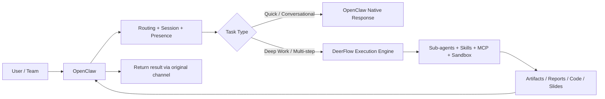

# Hybrid System Blueprint: OpenClaw + DeerFlow

## 1. Mục tiêu

Thiết kế một hệ thống AI toàn diện, trong đó:

- `OpenClaw` là lớp hiện diện, giao tiếp, điều phối, và phân phối kết quả
- `DeerFlow` là lớp thực thi sâu cho các tác vụ dài hơi, nhiều bước, nhiều nguồn, nhiều artifact

Mục tiêu không phải là “ghép hai công cụ lại cho có”, mà là phân vai rõ để tận dụng điểm mạnh riêng của từng hệ thống.

## 2. Kết luận điều hành

Kết luận ngắn gọn:

- Không nên dùng `DeerFlow` để thay thế hoàn toàn `OpenClaw`
- Không nên dùng `OpenClaw` để gánh toàn bộ các tác vụ nghiên cứu, phân tích, code, tổng hợp dài hơi
- Kiến trúc tối ưu là:
  - `OpenClaw = interface layer + presence layer + routing layer`
  - `DeerFlow = deep execution layer + artifact factory + research/code engine`

Nếu triển khai đúng, hệ thống hybrid này sẽ tạo ra 4 giá trị cốt lõi:

- giao tiếp đa kênh, luôn sẵn sàng
- xử lý tác vụ phức tạp, dài hơi, có evidence
- tách biệt rõ giữa “trợ lý giao tiếp” và “bộ máy làm việc”
- dễ mở rộng thành hệ thống vận hành AI cho cá nhân hoặc team

## 3. Phân vai hai hệ thống

### 3.1. OpenClaw nên giữ vai trò gì

`OpenClaw` nên là lớp ở gần người dùng nhất.

Vai trò phù hợp:

- nhận yêu cầu từ nhiều kênh: WhatsApp, Telegram, Slack, Discord, WebChat, mobile, desktop
- quản lý identity, session, routing, pairing, allowlist
- cung cấp trải nghiệm “always-on assistant”
- xử lý các yêu cầu ngắn, phản hồi nhanh, điều phối nhẹ
- gửi thông báo, nhắc việc, follow-up, trigger automation
- làm control plane cho các agent hoặc execution backend khác

Không nên ép `OpenClaw` trở thành cỗ máy xử lý nặng cho mọi loại tác vụ dài hơi nếu DeerFlow đã làm việc đó tốt hơn.

### 3.2. DeerFlow nên giữ vai trò gì

`DeerFlow` nên là lớp làm việc sâu.

Vai trò phù hợp:

- phân rã tác vụ lớn thành nhiều bước
- gọi sub-agent song song
- dùng sandbox để thao tác file, chạy lệnh, tạo outputs
- dùng skills và MCP để mở rộng khả năng
- đọc nhiều tài liệu đầu vào và tổng hợp thành artifact
- giữ memory và context cho các workflow lặp lại
- phục vụ như HTTP backend hoặc embedded execution engine

Không nên dùng `DeerFlow` làm lớp omnichannel assistant chính nếu nhu cầu cốt lõi là luôn hiện diện trên các kênh giao tiếp cá nhân.

## 4. Kiến trúc mục tiêu

## 5. Task classification

### 5.1. Task nên ở lại OpenClaw

Các task sau nên xử lý ngay trong OpenClaw:

- hỏi đáp ngắn
- điều khiển tác vụ đơn giản
- gửi nhắc việc
- truy vấn trạng thái hệ thống
- phản hồi qua kênh chat trong thời gian ngắn
- các thao tác cần presence hoặc device integration

Ví dụ:

- “Nhắc tôi 8 giờ tối gọi khách hàng X”
- “Gửi cho tôi tóm tắt 5 dòng của lịch hôm nay”
- “Trả lời nhanh tin nhắn này theo phong cách ngắn gọn, lịch sự”

### 5.2. Task nên chuyển sang DeerFlow

Các task sau nên được đẩy sang DeerFlow:

- nghiên cứu sâu nhiều nguồn
- tổng hợp báo cáo dài
- phân tích tài liệu tải lên
- review code hoặc so sánh kiến trúc
- tạo artifact có cấu trúc rõ
- công việc kéo dài nhiều phút đến nhiều giờ
- công việc cần chia nhỏ cho nhiều sub-agent

Ví dụ:

- “Phân tích 10 đối thủ logistics Đông Nam Á và xuất executive brief”
- “Đọc 6 PDF này, tóm tắt rủi ro pháp lý, rồi đề xuất khuyến nghị”
- “Review thay đổi code trong repo này theo chuẩn governance nội bộ, có evidence”

## 6. Contract giữa OpenClaw và DeerFlow

Muốn hybrid bền, phải có một execution contract rõ ràng.

Đề xuất contract đầu vào từ OpenClaw sang DeerFlow:

- `request_id`
- `source_channel`
- `user_id`
- `task_title`
- `objective`
- `context_summary`
- `attachments`
- `constraints`
- `expected_outputs`
- `priority`
- `deadline`
- `model_profile`

Đầu ra từ DeerFlow về OpenClaw nên chuẩn hóa:

- `status`
- `short_summary`
- `detailed_summary`
- `artifacts`
- `evidence`
- `open_questions`
- `follow_up_actions`

Điểm quan trọng:

- OpenClaw không nên gửi nguyên cả lịch sử hội thoại nếu không cần
- DeerFlow không nên trả về raw stream dài dòng cho người dùng cuối nếu kênh đích không phù hợp
- Cần có bản tóm tắt ngắn để OpenClaw dùng làm câu trả lời cuối

## 7. Memory strategy

Không nên trộn memory của hai hệ thống một cách ngây thơ.

Khuyến nghị:

- `OpenClaw memory`: sở thích cá nhân, quan hệ giao tiếp, routing, hành vi thường ngày, thói quen trao đổi
- `DeerFlow memory`: workflow, phong cách output, kiến thức kỹ thuật, context dự án, pattern xử lý tác vụ

Nguyên tắc:

- chỉ đồng bộ các fact bền vững, có giá trị lâu dài
- không đồng bộ toàn bộ chat history giữa hai hệ thống
- các artifact quan trọng nên được sync ở mức metadata, không phải nhồi lại vào memory

## 8. Use cases trọng điểm

### Case 1. Founder assistant có deep research

Luồng:

1. User gửi qua Telegram hoặc WhatsApp cho OpenClaw:
   “Phân tích 5 đối thủ trong mảng AI sales enablement và cho tôi 1 brief để nói chuyện với nhà đầu tư.”
2. OpenClaw xác định đây là deep task.
3. OpenClaw tạo execution packet và chuyển sang DeerFlow.
4. DeerFlow chia 3 sub-agent:
   - market mapping
   - pricing and packaging
   - GTM and messaging
5. DeerFlow tạo:
   - 1 executive summary
   - 1 bảng so sánh
   - 1 danh sách rủi ro hoặc giả định chưa xác minh
6. OpenClaw gửi bản tóm tắt ngắn qua kênh chat, kèm file hoàn chỉnh.

Giá trị:

- người dùng vẫn tương tác tự nhiên qua kênh quen thuộc
- phần phân tích sâu được tách sang engine chuyên trị

### Case 2. Governance-aware code review

Luồng:

1. User gửi cho OpenClaw:
   “Review PR này theo chuẩn nội bộ, chỉ nêu finding có evidence.”
2. OpenClaw chuyển task sang DeerFlow cùng repo path, brief, và policy stack.
3. DeerFlow dùng skill review, sandbox, file ops, và sub-agent nếu cần.
4. DeerFlow tạo:
   - findings theo priority
   - evidence references
   - merge readiness
   - suggested patch
5. OpenClaw trả summary ngắn qua chat và đính kèm full report.

Giá trị:

- OpenClaw giữ trải nghiệm điều phối
- DeerFlow làm phần review có cấu trúc, kiểm chứng, artifact-driven

### Case 3. Sales / account intelligence

Luồng:

1. User gửi một file khách hàng, website, và vài email cũ.
2. OpenClaw nhận yêu cầu và gọi DeerFlow.
3. DeerFlow đọc file, trích bối cảnh, tìm thêm dữ liệu công khai, tổng hợp thành account brief.
4. OpenClaw dùng output đó để:
   - nhắc follow-up
   - gợi ý next action
   - hỗ trợ trả lời nhanh trên kênh chat

Giá trị:

- OpenClaw mạnh ở tương tác thường ngày
- DeerFlow mạnh ở chuẩn bị “đạn thật” cho tương tác đó

## 9. Lộ trình triển khai

### Phase 0. Kiến trúc và governance

Mục tiêu:

- chốt vai trò từng hệ thống
- chốt execution contract
- chốt memory policy
- chốt security boundary

Deliverables:

- architecture decision note
- execution schema v1
- risk register v1

### Phase 1. Manual handoff MVP

Mục tiêu:

- cho phép OpenClaw kích hoạt DeerFlow thủ công hoặc qua một lệnh bridge đơn giản

Phạm vi:

- một command hoặc tool trong OpenClaw để tạo task packet
- một endpoint hoặc runner trong DeerFlow để nhận packet
- trả lại summary + artifact links

Success criteria:

- chạy end-to-end được ít nhất 3 use case
- không cần đồng bộ memory tự động ở pha này

### Phase 2. Structured artifact return

Mục tiêu:

- DeerFlow trả output theo schema ổn định
- OpenClaw hiển thị kết quả gọn, đúng kênh

Phạm vi:

- short summary
- detailed report
- artifact metadata
- evidence block

### Phase 3. Smart routing

Mục tiêu:

- OpenClaw tự phân loại task nào giữ lại, task nào đẩy sang DeerFlow

Phạm vi:

- quick-response path
- deep-execution path
- fallback nếu DeerFlow fail hoặc timeout

### Phase 4. Selective memory sync

Mục tiêu:

- đồng bộ fact có ích giữa hai hệ thống mà không gây memory contamination

Phạm vi:

- fact promotion rules
- metadata sync cho artifact
- per-user / per-project memory boundary

### Phase 5. Production hardening

Mục tiêu:

- logging
- tracing
- retry policy
- timeout policy
- auth giữa hai hệ thống
- runbook vận hành

## 10. Rủi ro chính

### Rủi ro 1. Chồng chéo vai trò

Nếu không phân vai rõ, OpenClaw và DeerFlow sẽ cùng cố làm một loại việc, dẫn tới:

- UX rối
- khó debug
- khó tối ưu cost

### Rủi ro 2. Memory contamination

Nếu sync memory bừa bãi:

- OpenClaw có thể bị “nặng đầu”
- DeerFlow có thể kéo theo nhiều context không liên quan
- kết quả sẽ khó kiểm soát hơn

### Rủi ro 3. Over-engineering quá sớm

Không nên làm đủ mọi thứ ngay pha đầu:

- automation đầy đủ
- memory sync hai chiều
- multi-tenant phức tạp
- governance quá dày

Pha đầu chỉ nên chứng minh value bằng 2 đến 3 use case sắc nét.

### Rủi ro 4. Không có execution contract rõ ràng

Nếu OpenClaw gửi context quá mơ hồ hoặc DeerFlow trả về output quá tự do:

- khó tích hợp
- khó retry
- khó audit

## 11. Chỉ số thành công

Nên đo tối thiểu:

- thời gian từ user request đến first useful response
- thời gian từ request đến artifact hoàn chỉnh
- tỷ lệ task được route đúng ngay lần đầu
- tỷ lệ task DeerFlow hoàn thành mà không cần con người can thiệp thêm
- tỷ lệ output có thể tái sử dụng trong workflow thật
- mức giảm rework so với khi dùng từng hệ thống riêng lẻ

## 12. Khuyến nghị triển khai

Khuyến nghị của mình:

- bắt đầu bằng mô hình `OpenClaw front / DeerFlow back`
- chưa đồng bộ memory hai chiều ở Phase 1
- chuẩn hóa contract trước khi tối ưu UX
- chọn đúng 3 use case làm pilot:
  - deep research
  - governance-aware code review
  - account intelligence / founder brief

Đây là điểm cân bằng tốt nhất giữa:

- giá trị thực tế
- độ phức tạp triển khai
- khả năng chứng minh ROI sớm

## 13. Quy trình làm việc với Opus

Quy trình đúng nên là:

1. Codex viết blueprint và implementation hypothesis
2. Opus phản biện kiến trúc, challenge giả định, nêu failure modes
3. Chốt phiên bản kiến trúc sau phản biện
4. Codex triển khai theo phase
5. Review lại bằng evidence, không tranh luận cảm tính

Mục tiêu của Opus trong pha này không phải “thiết kế thay”, mà là:

- bóc các giả định yếu
- phát hiện lỗ hổng kiến trúc
- đề xuất chỉnh hướng trước khi code

## 14. Quyết định đề xuất để chốt

Nếu phải chốt nhanh một hướng làm việc:

- Chọn `OpenClaw` làm lớp giao tiếp và điều phối
- Chọn `DeerFlow` làm engine deep execution
- Dùng contract-based handoff thay vì trộn logic hai bên ngay từ đầu
- Pilot bằng 3 use case thực tế
- Đưa blueprint này cho Opus phản biện trước khi triển khai

