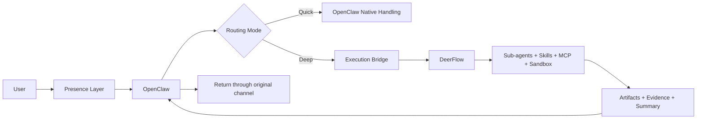

# Hybrid System Blueprint v2: OpenClaw + DeerFlow

## 1. Mục tiêu của bản v2

Tài liệu này là phiên bản đã hấp thụ phản biện kiến trúc từ Opus.

Mục tiêu của bản v2:

- giữ lại hướng kiến trúc đúng
- sửa các giả định yếu
- thêm các contract còn thiếu
- đưa hệ thống về trạng thái có thể triển khai theo phase mà không tự tạo nợ kiến trúc quá sớm

## 2. Kết luận đã điều chỉnh

Kết luận của bản v2 là:

- **End-state architecture vẫn là hybrid**
- **Rollout strategy phải là DeerFlow-first**
- **OpenClaw chỉ được đưa vào như presence layer khi có nhu cầu channel hoặc device vượt quá DeerFlow**

Nói ngắn gọn:

- đích đến: `OpenClaw + DeerFlow`
- điểm khởi đầu: `DeerFlow-first`, rồi mở rộng sang hybrid có kiểm soát

Đây là sự điều chỉnh quan trọng nhất sau review của Opus.

## 3. Disposition of Opus Feedback

### 3.1. Feedback được chấp nhận hoàn toàn

- explicit routing ở giai đoạn đầu
- cần response adapter layer thay vì giả định DeerFlow trả đúng schema
- phải kéo auth, logging, tracing lên Phase 1
- phải có error contract
- phải chốt ownership của IM channels
- cần progress heartbeat cho deep tasks
- memory sync nên hoãn tới khi có evidence rõ ràng

### 3.2. Feedback được chấp nhận có điều chỉnh

`DeerFlow-first` là chiến lược rollout đúng, nhưng **không thay đổi target architecture**.

Điểm điều chỉnh:

- không kết luận “hybrid có thể không cần”
- chỉ kết luận “chưa nên tích hợp hybrid quá sớm”

### 3.3. Điều vẫn giữ nguyên từ bản v1

- phân vai `OpenClaw = presence layer`
- phân vai `DeerFlow = deep execution layer`
- chọn 3 use case pilot
- dùng contract-based handoff, không tight coupling

## 4. Quyết định kiến trúc v2

### Decision 1. Chốt end-state architecture

End-state chính thức:

- `OpenClaw` là front door cho user-facing channels
- `DeerFlow` là execution backend cho deep tasks

### Decision 2. Chốt rollout strategy

Rollout strategy chính thức:

- Phase 1 và 2 chạy theo hướng `DeerFlow-first`
- chỉ tích hợp `OpenClaw` khi pilot chứng minh rằng DeerFlow channels không đủ

### Decision 3. Channel ownership policy

Khi đã bước vào hybrid mode:

- `OpenClaw` own tất cả end-user channels
- `DeerFlow` chạy **headless** cho luồng production
- DeerFlow IM chỉ được dùng cho:
  - admin
  - debugging
  - internal operations

Điều này loại bỏ rủi ro “hai bot cùng xuất hiện trên một kênh”.

### Decision 4. Routing policy

Routing policy chính thức:

- Phase 1: user chọn rõ `quick` hoặc `deep`
- Phase 2: vẫn explicit routing, nhưng có progress tracking tốt hơn
- Phase 3: `suggest + confirm`
- chỉ cân nhắc auto-routing sau khi có dữ liệu thật

### Decision 5. Memory policy

Memory policy chính thức:

- chưa làm cross-system sync ở giai đoạn đầu
- chỉ sync fact bền vững nếu có bằng chứng rõ ràng rằng thiếu sync gây tổn thất thực tế

## 5. Kiến trúc mục tiêu



## 6. Execution contract v2

### 6.1. Request contract

Yêu cầu từ presence layer sang DeerFlow phải đi theo schema chuẩn:

```yaml
request:
  request_id: string
  source_system: openclaw|internal
  source_channel: string
  user_id: string
  mode: quick|deep
  task_title: string
  objective: string
  context_summary: string
  constraints: []
  attachments: []
  expected_outputs: []
  priority: low|medium|high
  deadline: string|null
  budget_hint: low|medium|high
```

### 6.2. Response contract

DeerFlow không được kỳ vọng trả contract này một cách native ở Phase 1.

Thay vào đó sẽ có `response adapter` sinh output chuẩn:

```yaml
response:
  request_id: string
  status: accepted|running|partial|completed|failed|timed_out
  short_summary: string
  detailed_summary: string|null
  artifacts: []
  evidence: []
  estimated_duration: string|null
  follow_up_actions: []
  open_questions: []
```

### 6.3. Error contract

Đây là phần bị thiếu trong bản v1 và giờ là bắt buộc:

```yaml
error_contract:
  timeout_policy:
    soft_warning: 5m
    hard_limit: 15m
  partial_result_policy: return_best_effort_with_disclaimer
  retry_policy:
    transient_error_auto_retry: 1
    non_retryable_errors:
      - auth_failed
      - invalid_request
      - policy_denied
  circuit_breaker:
    open_after_failures: 3
    window: 10m
  fallback_policy:
    quick_fallback: ask_user_to_switch_to_deep
    deep_failure: return_partial_or_failure_summary
```

## 7. Response adapter layer

Đây là phần kiến trúc mới bắt buộc của v2.

### Vai trò

- nhận raw output từ DeerFlow
- gom stream events, status, artifacts
- trích short summary
- dựng metadata cho artifacts
- map lỗi vào error contract

### Tại sao bắt buộc

Hiện tại DeerFlow mạnh về execution, nhưng chưa phải structured contract runtime theo kiểu external orchestration.

Nếu không có adapter:

- OpenClaw sẽ phải hiểu raw DeerFlow output
- contract sẽ vỡ ngay khi model/provider đổi format
- không thể đảm bảo behavior ổn định

## 8. Latency model

Deep task phải được xem là asynchronous workflow.

### Phân loại latency

- `quick`: kỳ vọng trả lời trong 3-15 giây
- `deep`: 30 giây đến vài phút
- `long-run`: trên 5 phút

### Chính sách UX

- deep task phải trả lời ngay một acknowledgement
- acknowledgement phải có `estimated_duration`
- hệ thống phải có progress heartbeat
- user phải không bị rơi vào trạng thái “không biết còn sống hay chết”

### Cơ chế ưu tiên

Ưu tiên tận dụng DeerFlow SSE hoặc streaming state thay vì polling mù.

## 9. Security baseline

Đây không còn là Phase 5. Đây là điều kiện vào Phase 1.

### Bắt buộc ở MVP

- API key hoặc token giữa OpenClaw và DeerFlow
- request validation
- rate limit per user hoặc per channel
- deny arbitrary execution requests từ bridge layer
- audit log theo `request_id`

### Không làm ở MVP

- multi-tenant zero-trust phức tạp
- RBAC đầy đủ nhiều vai trò
- policy engine nâng cao

## 10. Observability baseline

### Bắt buộc ở MVP

- `request_id` xuyên suốt hai hệ thống
- trạng thái task: accepted, running, partial, completed, failed, timed_out
- duration tracking
- basic cost tracking theo task
- structured logs dạng máy đọc được

### Mục tiêu

- debug được failure
- đo được latency
- chứng minh được ROI hoặc bottleneck

## 11. Cost policy

V2 bổ sung cost policy tối thiểu:

- mỗi task có `budget_hint`
- deep task phải được log theo model profile
- pilot phải ghi lại chi phí ước tính theo task type

Không cần chính xác tuyệt đối ở Phase 1, nhưng phải có visibility.

## 12. Use case strategy

Vẫn giữ 3 use case pilot, nhưng thứ tự triển khai điều chỉnh:

### Use case A. Deep research

Đây là use case số 1 vì:

- fit tự nhiên với DeerFlow
- dễ đo value
- dễ tạo artifact

### Use case B. Governance-aware code review

Đây là use case số 2 vì:

- tận dụng sandbox, file ops, artifact, evidence
- có business value rõ

### Use case C. Account intelligence / founder brief

Đây là use case số 3 vì:

- bắt đầu chạm vào nhu cầu hybrid giữa giao tiếp và execution
- phù hợp để quyết định có cần OpenClaw integration sớm hay không

## 13. Revised rollout

### Phase 0. Finalize architecture

Deliverables:

- blueprint v2
- request/response/error contract
- channel ownership policy
- security baseline

### Phase 1. DeerFlow-first MVP

Phạm vi:

- chạy DeerFlow độc lập cho 2 use case đầu
- explicit routing
- response adapter
- auth tối thiểu
- structured logging

Success criteria:

- tạo được artifact đúng contract
- đo được latency và basic cost
- không có channel conflict

### Phase 2. Async UX hardening

Phạm vi:

- progress heartbeat
- partial result handling
- failure mapping rõ ràng

### Phase 3. OpenClaw bridge

Điều kiện vào:

- pilot chứng minh DeerFlow-only không đủ về channel hoặc device surface

Phạm vi:

- OpenClaw gọi DeerFlow qua bridge
- OpenClaw gửi kết quả về đúng kênh gốc
- vẫn giữ explicit routing

### Phase 4. Suggest routing

Phạm vi:

- OpenClaw đề xuất `quick` hoặc `deep`
- user xác nhận
- ghi lại decision data để học tiếp

### Phase 5. Optional memory sync

Chỉ làm nếu có bằng chứng rằng:

- repeated context loss đang gây rework thực sự
- metadata sync đơn thuần là chưa đủ

## 14. Khi nào không cần hybrid

Không nên tích hợp OpenClaw vào DeerFlow ngay nếu:

- chỉ dùng web UI hoặc 3 kênh DeerFlow đang có là đủ
- chưa có nhu cầu mobile native hoặc omnichannel breadth
- chưa có use case cần presence layer mạnh

Trong trường hợp đó:

- DeerFlow-only là bước đi đúng hơn
- hybrid chỉ là target architecture, chưa phải immediate build priority

## 15. Quyết định chốt để triển khai

Quyết định cuối cùng của v2:

- giữ hybrid làm target architecture
- áp dụng DeerFlow-first làm rollout strategy
- kéo auth, logging, error contract lên MVP
- cấm channel overlap trong hybrid mode
- buộc dùng response adapter
- hoãn memory sync cho tới khi có evidence

Đây là bản đủ chặt để chuyển sang implementation planning.

