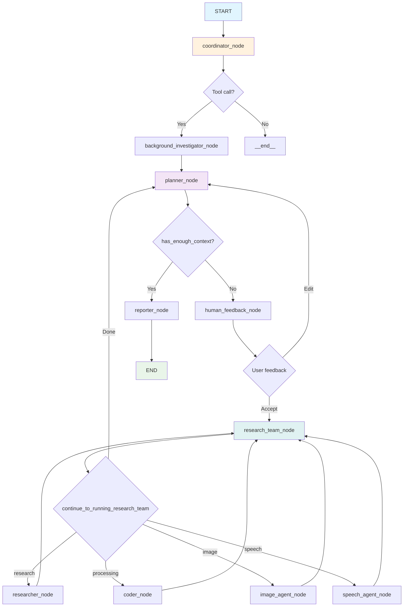
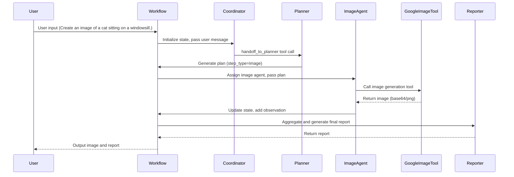

# DeerFlow Agent Mechanics

## Overview

This document provides an in-depth analysis of the working principles of Agents in DeerFlow, with a particular focus on prompt construction, state transitions, and tool usage.

## Step 1: Prompt Construction Analysis

### 1.1 Prompt Template System Architecture

DeerFlow uses a Jinja2-based template system to construct and manage agent prompts.

#### Core File Structure
```
src/prompts/
├── template.py          # Core of the template engine
├── coordinator.md       # Coordinator prompt
├── planner.md           # Planner prompt
├── reporter.md          # Reporter prompt
├── researcher.md        # Researcher prompt
├── image_agent.md       # Image generation agent prompt
├── speech_agent.md      # Speech generation agent prompt
└── ...
```

#### Template Engine Implementation

```python
# src/prompts/template.py
def apply_prompt_template(
    prompt_name: str, state: AgentState, configurable: Configuration = None
) -> list:
    """Apply template variables to the prompt template and return formatted messages"""
    
    # Convert state to dict for template rendering
    state_vars = {
        "CURRENT_TIME": datetime.now().strftime("%a %b %d %Y %H:%M:%S %z"),
        **state,
    }
    
    # Add configurable variables
    if configurable:
        state_vars.update(dataclasses.asdict(configurable))
    
    # Render template
    template = env.get_template(f"{prompt_name}.md")
    system_prompt = template.render(**state_vars)
    
    # Return message list: system prompt + messages in state
    return [{"role": "system", "content": system_prompt}] + state["messages"]
```

### 1.2 Prompt Construction Process

#### 1.2.1 Prompt Binding at Agent Creation

```python
# src/agents/agents.py
def create_agent(agent_name: str, agent_type: str, tools: list, prompt_template: str):
    """Factory function: create an agent with consistent configuration"""
    return create_react_agent(
        name=agent_name,
        model=get_llm_by_type(AGENT_LLM_MAP[agent_type]),
        tools=tools,
        prompt=lambda state: apply_prompt_template(prompt_template, state),  # Key: dynamic binding
    )

# Example: Image generation agent
image_agent = create_agent(
    agent_name="ImageAgent",
    agent_type="image",               
    tools=[google_image_tool],       
    prompt_template="image_agent",    # Bind to image_agent.md template
)
```

#### 1.2.2 Runtime Prompt Construction

```python
# src/graph/nodes.py - coordinator_node example
def coordinator_node(state: State, config: RunnableConfig):
    """Coordinator node communicates with the client"""
    configurable = Configuration.from_runnable_config(config)
    
    # 1. Build message list
    messages = apply_prompt_template("coordinator", state)
    
    # 2. Call model
    response = (
        get_llm_by_type(AGENT_LLM_MAP["coordinator"])
        .bind_tools([handoff_to_planner])
        .invoke(messages)  # Pass in constructed messages
    )
```

### 1.3 Prompt Template Example Analysis

#### 1.3.1 Coordinator Prompt Template

```markdown
# src/prompts/coordinator.md
---
CURRENT_TIME: {{ CURRENT_TIME }}  # Dynamic timestamp
---

You are DeerFlow, a friendly AI assistant...

# Request Classification
1. **Handle Directly**: Simple greetings...
2. **Reject Politely**: Harmful requests...
3. **Hand Off to Planner**: Research questions, image generation...

# Execution Rules
- If simple greeting: Respond in plain text
- If harmful request: Reject politely  
- For research/image/speech requests: call `handoff_to_planner()`
```

**Key Features:**
- Uses Jinja2 variable replacement `{{ CURRENT_TIME }}`
- Clear classification and execution rules
- Tool invocation instructions

#### 1.3.2 Planner Prompt Template

```markdown
# src/prompts/planner.md
---
CURRENT_TIME: {{ CURRENT_TIME }}
---

You are a professional Deep Researcher...

# Output Format
Directly output the raw JSON format of `Plan`:

```ts
interface Step {
  need_search: boolean;
  title: string;
  description: string;
  step_type: "research" | "processing" | "image" | "speech";
}

interface Plan {
  locale: string;
  has_enough_context: boolean;
  thought: string;
  title: string;
  steps: Step[];
}
```
```

**Key Features:**
- Structured output format definition
- Supports multiple step types (research, processing, image, speech)
- Strict context evaluation criteria

### 1.4 Prompt Variable Injection Mechanism

#### 1.4.1 State Variable Injection

```python
# State variables are automatically injected into the template
state_vars = {
    "CURRENT_TIME": datetime.now().strftime("%a %b %d %Y %H:%M:%S %z"),
    **state,  # All state variables
}
```

#### 1.4.2 Configurable Variable Injection

```python
# Configurable variable injection
if configurable:
    state_vars.update(dataclasses.asdict(configurable))
```

#### 1.4.3 Dynamic Message Construction

```python
# Final message format
return [
    {"role": "system", "content": system_prompt},  # Rendered system prompt
    *state["messages"]  # Historical messages in state
]
```

### 1.5 Key Impacts of Prompt Construction

#### 1.5.1 Impact on Agent Output

1. **Role Definition**: System prompt defines the agent's identity and responsibilities
2. **Behavior Constraints**: Clear execution rules and classification standards
3. **Output Format**: Structured output requirements (e.g., JSON format)
4. **Tool Integration**: Tool invocation instructions in the prompt

#### 1.5.2 Example: Complete Prompt Construction Process

```python
# Input state
state = {
    "messages": [
        {"role": "user", "content": "Create an image of a cat"}
    ],
    "locale": "en-US"
}

# 1. Template rendering
system_prompt = """
You are DeerFlow, a friendly AI assistant...
For image generation requests: call handoff_to_planner()
"""

# 2. Final message list
messages = [
    {"role": "system", "content": system_prompt},
    {"role": "user", "content": "Create an image of a cat"}
]

# 3. Model invocation
response = model.invoke(messages)
```

### 1.6 Summary

DeerFlow's Prompt Construction system has the following features:

1. **Templated**: Uses Jinja2 template engine, supports variable replacement
2. **Dynamic**: Dynamically constructed at runtime based on state and configuration
3. **Structured**: Clear output format and behavior rules
4. **Extensible**: Easy to add new agent types and prompt templates
5. **Tool Integration**: Tool invocation instructions in the prompt

This design allows agents to flexibly adjust their behavior according to different contexts and configurations while maintaining consistent output formats.

---

## Step 2: State Handling Analysis

### 2.1 State Type Definition

#### 2.1.1 Main State Type

```python
# src/graph/types.py
class State(MessagesState):
    """Agent system state, inherits from MessagesState"""
    # ...
```

    # Runtime variables
    locale: str = "en-US"                    # Locale
    research_topic: str = ""                 # Research topic
    observations: list[str] = []             # List of observations
    resources: list[Resource] = []           # List of resources
    plan_iterations: int = 0                 # Number of plan iterations
    current_plan: Plan | str = None          # Current plan
    final_report: str = ""                   # Final report
    auto_accepted_plan: bool = False         # Whether the plan is auto-accepted
    enable_background_investigation: bool = True  # Whether background investigation is enabled
    background_investigation_results: str = None  # Background investigation results
```

#### 2.1.2 Inheritance Hierarchy

```python
# State inheritance hierarchy
MessagesState (LangGraph)  # Base message state
    ↓
State (DeerFlow)          # Main state type
    ↓
Other specialized state types:
- PodcastState
- PPTState  
- ProseState
- PromptEnhancerState
```

### 2.2 State Initialization

#### 2.2.1 Workflow Entry Initialization

```python
# src/workflow.py
import logging
logger = logging.getLogger(__name__)

async def run_agent_workflow_async(user_input: str, ...):
    logger.info(f"[ENTRY] user_input={user_input}")
    """Run agent workflow asynchronously"""
    
    # Initial state definition
    initial_state = {
        "messages": [{"role": "user", "content": user_input}],  # User input
        "auto_accepted_plan": True,                             # Auto-accept plan
        "enable_background_investigation": enable_background_investigation,
    }
    
    # Configuration object
    config = {
        "configurable": {
            "thread_id": "default",
            "max_plan_iterations": max_plan_iterations,
            "max_step_num": max_step_num,
            "mcp_settings": {...},
        },
        "recursion_limit": 100,
    }
    
    # Start graph execution
    async for s in graph.astream(input=initial_state, config=config, stream_mode="values"):
        logger.info(f"[STATE STREAM] {s}")
        # Handle streaming output
```

#### 2.2.2 State Default Values

```python
# Default values for state fields (from type annotations)
State.locale == "en-US"
State.observations == []
State.plan_iterations == 0
State.current_plan is None
State.final_report == ""
State.auto_accepted_plan is False
State.enable_background_investigation is True
State.background_investigation_results is None
```

### 2.3 State Update Mechanism

#### 2.3.1 Command Pattern Update

DeerFlow uses LangGraph's `Command` pattern to update state:

```python
# src/graph/nodes.py
from langgraph.graph import Command

def coordinator_node(state: State, config: RunnableConfig):
    """Coordinator node"""
    # ... processing logic ...
    
    return Command(
        update={                    # State update
            "locale": locale,
            "research_topic": research_topic,
            "resources": configurable.resources,
        },
        goto="planner",            # Next node
    )
```

#### 2.3.2 State Update Example

```python
# Planner node state update
def planner_node(state: State, config: RunnableConfig):
    # ... generate plan ...
    
    if curr_plan.get("has_enough_context"):
        return Command(
            update={
                "messages": [AIMessage(content=full_response, name="planner")],
                "current_plan": new_plan,  # Update current plan
            },
            goto="reporter",
        )
    else:
        return Command(
            update={
                "messages": [AIMessage(content=full_response, name="planner")],
                "current_plan": full_response,  # Store raw response
            },
            goto="human_feedback",
        )
```

### 2.4 State Flow Diagram



### 2.5 State Passing Mechanism

#### 2.5.1 State Passing Between Nodes

```python
# src/graph/builder.py
def _build_base_graph():
    """Build base state graph"""
    builder = StateGraph(State)  # Use State type
    
    # Add nodes
    builder.add_node("coordinator", coordinator_node)
    builder.add_node("planner", planner_node)
    builder.add_node("researcher", researcher_node)
    # ...
    
    # Add edges (state is passed automatically)
    builder.add_edge(START, "coordinator")
    builder.add_edge("coordinator", "planner")
    builder.add_conditional_edges(
        "research_team",
        continue_to_running_research_team,  # Conditional function
        ["planner", "researcher", "coder", "image_agent", "speech_agent"],
    )
```

#### 2.5.2 Conditional Routing Function

```python
def continue_to_running_research_team(state: State):
    """Decide next node based on current state"""
    current_plan = state.get("current_plan")
    
    if not current_plan or not current_plan.steps:
        return "planner"
    
    # Find the first unexecuted step
    for step in current_plan.steps:
        if not step.execution_res:
            break
    
    # Route based on step type
    if step.step_type == StepType.RESEARCH:
        return "researcher"
    elif step.step_type == StepType.PROCESSING:
        return "coder"
    elif step.step_type == StepType.IMAGE:
        return "image_agent"
    elif step.step_type == StepType.SPEECH:
        return "speech_agent"
    
    return "planner"
```

### 2.6 State Update Function Analysis

#### 2.6.1 Main State Update Functions

| Function Name | Location | Update Content | Effect |
|--------------|----------|---------------|--------|
| `coordinator_node` | `src/graph/nodes.py:205` | `locale`, `research_topic`, `resources` | Set research environment and resources |
| `planner_node` | `src/graph/nodes.py:81` | `current_plan`, `messages` | Generate and store research plan |
| `human_feedback_node` | `src/graph/nodes.py:156` | `current_plan`, `plan_iterations` | Handle user feedback, update plan |
| `_execute_agent_step` | `src/graph/nodes.py:301` | `observations`, `messages` | Execute research step, record observations |
| `reporter_node` | `src/graph/nodes.py:258` | `final_report` | Generate final report |

#### 2.6.2 State Update Before and After Example

**Example 1: Coordinator → Planner**

```python
# State before update
state_before = {
    "messages": [{"role": "user", "content": "What is AI?"}],
    "locale": "en-US",
    "research_topic": "",
    "resources": [],
}

# Coordinator processing
response = model.invoke(messages)
tool_calls = [{"name": "handoff_to_planner", "args": {"locale": "en-US", "research_topic": "What is AI?"}}]

# State after update
state_after = {
    "messages": [{"role": "user", "content": "What is AI?"}],
    "locale": "en-US",                    # Extracted from tool call
    "research_topic": "What is AI?",      # Extracted from tool call
    "resources": ["resource1", "resource2"],  # Injected from config
}
```

**Example 2: Planner → Human Feedback**

```python
# State before update
state_before = {
    "messages": [...],
    "current_plan": None,
    "plan_iterations": 0,
}

# Planner generates plan
plan_response = """
{
  "has_enough_context": false,
  "title": "Research on AI",
  "thought": "Need to gather comprehensive information about AI",
  "steps": [...],
  "locale": "en-US"
}
"""

# State after update
state_after = {
    "messages": [..., AIMessage(content=plan_response, name="planner")],
    "current_plan": plan_response,  # Store raw response (string)
    "plan_iterations": 0,
}
```

**Example 3: Human Feedback → Research Team**

```python
# State before update
state_before = {
    "current_plan": "{\"has_enough_context\": false, ...}",
    "plan_iterations": 0,
    "auto_accepted_plan": True,
}

# User accepts plan
# Parse plan and update

# State after update
state_after = {
    "current_plan": Plan(...),  # Parsed Plan object
    "plan_iterations": 1,       # Incremented
    "locale": "en-US",         # Extracted from plan
}
```

**Example 4: Researcher → Research Team**

```python
# State before update
state_before = {
    "observations": [],
    "current_plan": Plan(steps=[Step(execution_res=None), ...]),
}

# Researcher executes step
step_result = "AI is a branch of computer science..."

# State after update
state_after = {
    "observations": ["AI is a branch of computer science..."],  # Add observation
    "current_plan": Plan(steps=[Step(execution_res="AI is a branch of computer science..."), ...]),  # Update step result
    "messages": [..., AIMessage(content=step_result, name="researcher")],
}
```

### 2.7 State Persistence

#### 2.7.1 In-Memory Checkpoint

```python
# src/graph/builder.py
def build_graph_with_memory():
    """Build workflow graph with memory"""
    memory = MemorySaver()  # Memory checkpoint saver
    builder = _build_base_graph()
    return builder.compile(checkpointer=memory)
```

#### 2.7.2 State Recovery

```python
# State can be recovered via checkpoint
# Supports persistence of conversation history
# TODO: Support SQLite / PostgreSQL
```

### 2.8 Summary

DeerFlow's State Handling system has the following features:

1. **Type Safety**: Uses TypedDict and Pydantic models to ensure type safety
2. **Inheritance Structure**: Based on LangGraph's MessagesState, supports message history
3. **Command Pattern**: Uses Command objects for state updates and routing
4. **Conditional Routing**: Dynamically decides the next node based on state content
5. **Streaming**: Supports real-time state updates and streaming output
6. **Persistence**: Supports state checkpointing and recovery

This design ensures that state can be safely and consistently passed and updated throughout the workflow, while supporting complex conditional logic and error handling.

---

## Step 3: Tool Registration & Invocation Analysis

### 3.1 Tool System Architecture

#### 3.1.1 Tool Directory Structure

```
src/tools/
├── __init__.py              # Tool exports
├── decorators.py            # Tool decorators
├── google_image.py          # Google image generation tool
├── google_speech.py         # Google speech generation tool
├── search.py                # Search tool
├── crawl.py                 # Web crawling tool
├── python_repl.py           # Python code execution tool
├── retriever.py             # Retrieval tool
├── tts.py                   # Text-to-speech tool
└── tavily_search/           # Tavily search tool
    └── tavily_search_results_with_images.py
```

#### 3.1.2 Tool Export Mechanism

```python
# src/tools/__init__.py
from .crawl import crawl_tool
from .python_repl import python_repl_tool
from .retriever import get_retriever_tool
from .search import get_web_search_tool
from .tts import VolcengineTTS
from .google_image import google_image_tool   
from .google_speech import google_speech_tool

__all__ = [
    "crawl_tool",
    "python_repl_tool",
    "get_web_search_tool",
    "get_retriever_tool",
    "VolcengineTTS",
    "google_image_tool",
    "google_speech_tool"
]
```

### 3.2 Tool Definition and Decorators

#### 3.2.1 Tool Decorator System

```python
# src/tools/decorators.py
def log_io(func: Callable) -> Callable:
    """Decorator to log tool input and output"""
    @functools.wraps(func)
    def wrapper(*args: Any, **kwargs: Any) -> Any:
        # Log input parameters
        func_name = func.__name__
        params = ", ".join([*(str(arg) for arg in args), *(f"{k}={v}" for k, v in kwargs.items())])
        logger.info(f"Tool {func_name} called with parameters: {params}")
        
        # Execute function
        result = func(*args, **kwargs)
        
        # Log output
        logger.info(f"Tool {func_name} returned: {result}")
        return result
    return wrapper

def create_logged_tool(base_tool_class: Type[T]) -> Type[T]:
    """Factory function to create tool class with logging"""
    class LoggedTool(LoggedToolMixin, base_tool_class):
        pass
    LoggedTool.__name__ = f"Logged{base_tool_class.__name__}"
    return LoggedTool
```

#### 3.2.2 Tool Definition Example

```python
# src/tools/google_image.py
class GoogleImageTool(BaseTool):
    name: str = "google_image"
    description: str = (
        "Generate an image with Imagen-3.\n"
        "Input: prompt string → Output: base-64 PNG string."
    )

    def _run(self, prompt: str) -> str:
        try:
            client = genai.Client(api_key=os.getenv("GOOGLE_API_KEY"))   
            resp = client.models.generate_images(
                model="models/imagen-3.0-generate-002",
                prompt=prompt,
                config={"number_of_images": 1, "output_mime_type": "image/png"},
            )
            img_bytes = resp.generated_images[0].image.image_bytes
            return base64.b64encode(img_bytes).decode()
        except Exception as e:
            raise ToolException(f"Image generation failed: {e}") from e

google_image_tool = GoogleImageTool()

# src/tools/python_repl.py
@tool
@log_io
def python_repl_tool(
    code: Annotated[str, "The python code to execute to do further analysis or calculation."],
):
    """Use this to execute python code and do data analysis or calculation."""
    # ... implementation logic
```

### 3.3 Tool Registration and Binding

#### 3.3.1 Tool Binding at Agent Creation

```python
# src/agents/agents.py
def create_agent(agent_name: str, agent_type: str, tools: list, prompt_template: str):
    """Factory function: create an agent with consistent configuration"""
    return create_react_agent(
        name=agent_name,
        model=get_llm_by_type(AGENT_LLM_MAP[agent_type]),
        tools=tools,  # Tool list bound to agent
        prompt=lambda state: apply_prompt_template(prompt_template, state),
    )

# Example: Image generation agent
image_agent = create_agent(
    agent_name="ImageAgent",
    agent_type="image",               
    tools=[google_image_tool],       # Bind image generation tool
    prompt_template="image_agent",    
)
```

#### 3.3.2 Runtime Tool Configuration

```python
# src/graph/nodes.py
async def researcher_node(state: State, config: RunnableConfig):
    """Researcher node"""
    configurable = Configuration.from_runnable_config(config)
    
    # Build tool list
    tools = [get_web_search_tool(configurable.max_search_results), crawl_tool]
    retriever_tool = get_retriever_tool(state.get("resources", []))
    if retriever_tool:
        tools.insert(0, retriever_tool)
    
    # Execute step with tools
    return await _setup_and_execute_agent_step(
        state, config, "researcher", tools,
    )
```

### 3.4 MCP Tool Integration

#### 3.4.1 MCP Tool Dynamic Loading

```python
# src/graph/nodes.py
async def _setup_and_execute_agent_step(
    state: State, config: RunnableConfig, agent_type: str, default_tools: list
):
    """Helper function to set up and execute agent step"""
    configurable = Configuration.from_runnable_config(config)
    mcp_servers = {}
    enabled_tools = {}

    # Extract MCP server config
    if configurable.mcp_settings:
        for server_name, server_config in configurable.mcp_settings["servers"].items():
            if (
                server_config["enabled_tools"]
                and agent_type in server_config["add_to_agents"]
            ):
                mcp_servers[server_name] = {
                    k: v for k, v in server_config.items()
                    if k in ("transport", "command", "args", "url", "env")
                }
                for tool_name in server_config["enabled_tools"]:
                    enabled_tools[tool_name] = server_name

    # Create and execute agent with MCP tools
    if mcp_servers:
        client = MultiServerMCPClient(mcp_servers)
        loaded_tools = default_tools[:]
        tools = await client.get_tools()
        for tool in tools:
            if tool.name in enabled_tools:
                tool.description = f"Powered by '{enabled_tools[tool.name]}'.\n{tool.description}"
                loaded_tools.append(tool)
        agent = create_agent(agent_type, agent_type, loaded_tools, agent_type)
    else:
        # Use default tools
        agent = create_agent(agent_type, agent_type, default_tools, agent_type)
    
    return await _execute_agent_step(state, agent, agent_type)
```

### 3.5 Tool Invocation Trigger Mechanism

#### 3.5.1 Model Output Parsing

```python
# src/graph/nodes.py - coordinator_node example
def coordinator_node(state: State, config: RunnableConfig):
    """Coordinator node"""
    configurable = Configuration.from_runnable_config(config)
    messages = apply_prompt_template("coordinator", state)
    
    # Call model and bind tools
    response = (
        get_llm_by_type(AGENT_LLM_MAP["coordinator"])
        .bind_tools([handoff_to_planner])  # Bind tools
        .invoke(messages)
    )
    
    # Check tool calls
    if len(response.tool_calls) > 0:
        goto = "planner"
        # Handle tool call parameters
        for tool_call in response.tool_calls:
            if tool_call.get("name", "") == "handoff_to_planner":
                locale = tool_call.get("args", {}).get("locale")
                research_topic = tool_call.get("args", {}).get("research_topic")
                break
    else:
        goto = "__end__"
    
    return Command(update={...}, goto=goto)
```

#### 3.5.2 Tool Invocation Process

```python
# Tool invocation trigger process
1. Model output contains tool_calls
2. Parse name and args in tool_calls
3. Find the corresponding tool by name
4. Call the tool with args
5. Return tool result to model
6. Model continues to generate or complete response
```

### 3.6 Tool Invocation Example Analysis

#### 3.6.1 Coordinator Tool Invocation Example

```python
# User input: "What is AI?"
# Model output:
{
    "tool_calls": [
        {
            "name": "handoff_to_planner",
            "args": {
                "research_topic": "What is AI?",
                "locale": "en-US"
            }
        }
    ]
}

# Processing logic:
if len(response.tool_calls) > 0:
    goto = "planner"  # Route to planner node
    # Extract parameters to update state
    locale = "en-US"
    research_topic = "What is AI?"
```

#### 3.6.2 Researcher Tool Invocation Example

```python
# Model output:
{
    "tool_calls": [
        {
            "name": "web_search",
            "args": {
                "query": "artificial intelligence definition"
            }
        }
    ]
}

# Processing logic:
# 1. Find web_search tool
# 2. Call tool: web_search(query="artificial intelligence definition")
# 3. Get search results
# 4. Return results to model for further processing
```

### 3.7 Tool List Table

| Tool Name | Function Description | File Path | Invocation Method | Trigger Condition |
|-----------|---------------------|-----------|-------------------|-------------------|
| `handoff_to_planner` | Handoff to planner | `src/graph/nodes.py:37` | `@tool` decorator | Coordinator recognizes research request |
| `google_image_tool` | Google image generation | `src/tools/google_image.py` | `BaseTool` class | Image Agent executes image step |
| `google_speech_tool` | Google speech generation | `src/tools/google_speech.py` | `BaseTool` class | Speech Agent executes speech step |
| `web_search` | Web search | `src/tools/search.py` | Dynamically created | Researcher Agent needs to search information |
| `crawl_tool` | Web crawling | `src/tools/crawl.py` | `@tool` decorator | Researcher Agent needs to crawl web pages |
| `python_repl_tool` | Python code execution | `src/tools/python_repl.py` | `@tool` decorator | Coder Agent needs to execute code |
| `get_retriever_tool` | Local retrieval | `src/tools/retriever.py` | Dynamically created | Researcher Agent accesses local resources |
| `VolcengineTTS` | Volcengine TTS | `src/tools/tts.py` | Class instance | Speech generation requirement |

### 3.8 Complete Tool Invocation Logic Chain Example

#### 3.8.1 Example: User Requests Image Generation

```python
# 1. User input
user_input = "Create an image of a cat sitting on a windowsill"

# 2. Coordinator processing
messages = apply_prompt_template("coordinator", state)
response = model.bind_tools([handoff_to_planner]).invoke(messages)

# 3. Model output tool call
tool_calls = [{
    "name": "handoff_to_planner",
    "args": {
        "research_topic": "Create an image of a cat",
        "locale": "en-US"
    }
}]

# 4. Parse tool call
if len(response.tool_calls) > 0:
    goto = "planner"
    research_topic = "Create an image of a cat"
    locale = "en-US"

# 5. State update and routing
return Command(
    update={
        "locale": locale,
        "research_topic": research_topic,
        "resources": configurable.resources,
    },
    goto="planner"
)

# 6. Planner generates plan
# Recognized as image generation request, create image step
plan = {
    "has_enough_context": False,
    "steps": [{
        "step_type": "image",
        "title": "Generate cat image",
        "description": "Create an image of a cat",
        "need_search": False
    }]
}

# 7. Research Team routes to Image Agent
continue_to_running_research_team(state) -> "image_agent"

# 8. Image Agent executes
tools = [google_image_tool]
agent = create_agent("image", "image", tools, "image_agent")

# 9. Model calls image tool
response = model.bind_tools([google_image_tool]).invoke(messages)
tool_calls = [{
    "name": "google_image",
    "args": {
        "prompt": "A beautiful cat sitting on a windowsill"
    }
}]

# 10. Execute image generation
result = google_image_tool._run("A beautiful cat sitting on a windowsill")
# Returns base64 encoded image data

# 11. Update state
return Command(
    update={
        "observations": [result],
        "messages": [AIMessage(content=result, name="image_agent")]
    },
    goto="research_team"
)
```

#### 3.8.2 Key Trigger Point Analysis

1. **Prompt Trigger**: Coordinator prompt contains tool invocation instruction
2. **Model Decision**: Model decides whether to call tool based on prompt and context
3. **Tool Binding**: Tools are bound to model via `bind_tools()`
4. **Parameter Parsing**: Extract tool name and parameters from `tool_calls`
5. **Tool Execution**: Find and execute the corresponding tool by name
6. **Result Handling**: Return tool execution result to model for further processing

### 3.9 Summary

DeerFlow's Tool Registration & Invocation system has the following features:

1. **Multiple Tool Types**: Supports decorator tools, class tools, dynamic tools
2. **Flexible Binding**: Tools can be bound at agent creation and runtime
3. **MCP Integration**: Supports dynamic loading of MCP server tools
4. **Logging**: Complete logging of tool calls
5. **Error Handling**: Robust exception handling for tool execution
6. **Streaming Support**: Supports streaming output for tool calls

This design allows DeerFlow to flexibly integrate various tools and support complex multi-agent collaboration scenarios.

---

## Step 4: Execution Trace Walkthrough

### 1. Overview

This section uses "Create an image of a cat sitting on a windowsill." as an example to trace the execution process of the DeerFlow image agent in detail. It covers the entire process from user input, task assignment, plan generation, agent selection, tool invocation, state update, to final output. All data comes from real logs.

---

### 2. Mermaid Sequence Diagram



---

### 3. Key Stages and State Transitions

| Stage | Main Input | Main Output | State Change | Key Log/Code |
|-------|------------|-------------|--------------|--------------|
| User Input | "Create an image of a cat sitting on a windowsill." | - | Initialize messages | `[ENTRY] user_input=...` |
| Coordinator | messages | tool_calls: handoff_to_planner | Add locale, research_topic | `[COORDINATOR] tool_calls: ...` |
| Planner | state, research_topic | Plan (step_type=image) | current_plan, plan_iterations | `[PLANNER] plan response: ...` |
| Research Team | current_plan | Enter image agent | - | `Research team is collaborating on tasks.` |
| ImageAgent | plan step | Generate image | observations, step.execution_res | `[IMAGE_AGENT] input state: ...`<br>`Generated image saved as: ...` |
| GoogleImageTool | step.description | base64 image | - | `[AGENT_EXECUTE] agent_name=image ...` |
| Reporter | observations, plan | Final report | final_report | `reporter response: ...` |
| Complete | final_report | Output | - | `[COMPLETE] Async workflow completed successfully` |

---

### 4. Detailed Log Interpretation and Code Chain

#### 4.1 User Input and State Initialization

- User input is encapsulated as `HumanMessage` and written to the initial state.
- Log: `[ENTRY] user_input=...`, `[INIT_STATE] ...`

#### 4.2 Coordinator Node

- Coordinator reads state and decides to call the `handoff_to_planner` tool, handing the task to the Planner.
- Log: `[COORDINATOR] tool_calls: ...`

#### 4.3 Planner Node

- Planner generates a plan containing an image-type step.
- The plan content is written to the `current_plan` field of the state.
- Log: `[PLANNER] plan response: ...`

#### 4.4 Research Team Collaboration

- The research team node assigns the plan to the image agent.
- Log: `Research team is collaborating on tasks.`

#### 4.5 Image Agent Node

- ImageAgent reads the step and calls GoogleImageTool to generate the image.
- The generated image is written to the observation as base64 and saved as a local file.
- Log: `[IMAGE_AGENT] input state: ...`, `Generated image saved as: ...`

#### 4.6 Tool Invocation

- GoogleImageTool actually performs image generation and returns a base64-encoded image.
- Log: `[AGENT_EXECUTE] agent_name=image ...`

#### 4.7 Report Generation

- Reporter aggregates observation and plan to generate the final markdown report.
- Log: `reporter response: ...`

#### 4.8 Completion

- The final report and image are returned to the user via state.
- Log: `[COMPLETE] Async workflow completed successfully`

---

### 5. Real Input/Output Example

**User Input:**
```
Create an image of a cat sitting on a windowsill.
```

**Final Output (excerpt):**
```markdown
## Generated Images

### Cat on Windowsill
**Description**: This image depicts a cat sitting comfortably on a windowsill, gazing out at the scenery. The cat has orange fur and green eyes.
**Purpose**: To provide a visual representation of a common domestic scene.
**Prompt Used**: A cat with orange fur and green eyes sitting on a windowsill looking outside.


**Generated image saved as: `generated_image_20250624_094030.png`**
```

---

### 6. Evaluation and Conclusion

- **Complete Chain**: The logs cover every step from input to output, with clear state transitions for traceability and debugging.
- **State Traceability**: Each stage's state changes are thoroughly recorded, making it easy to understand multi-agent collaboration mechanisms.
- **Good Extensibility**: Each node in the process has clear responsibilities, making it easy to extend new agents or tools in the future.
- **Strong Reproducibility**: With logs and state snapshots, any execution can be easily reproduced and analyzed.
- The final output:https://easy-peasy.ai/cdn-cgi/image/quality=70,format=auto,width=300/https://media.easy-peasy.ai/4ba2ac17-3246-472e-b7e8-8c5dd0d18c00/f7befdcd-89ab-4b7e-8ecd-b6644cdaedde.png 
---
