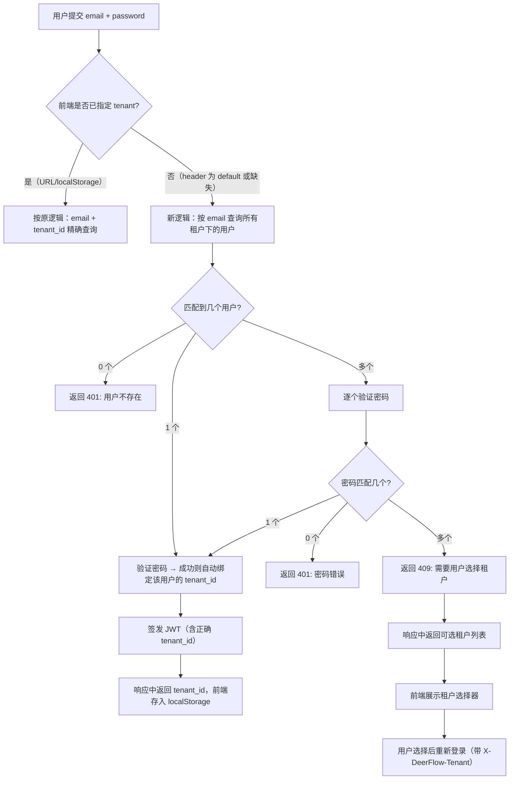

# 租户自动识别设计方案

> 创建日期：2026-05-12  
> 状态：Draft  
> 作者：DeerFlow Team

## 1. 问题背景

当前租户识别依赖前端通过 URL 参数 `?tenant=xxx` 手动指定，首次访问时如果不带参数，系统默认使用 `"default"` 租户。这导致：

1. 用户登录时如果未指定正确的 tenant，即使邮箱密码正确也会 401（因为 `get_user_by_email_and_tenant` 按 email + tenant_id 联合查询）
2. 用户需要记住自己属于哪个租户，或者依赖管理员分发带 `?tenant=` 参数的链接
3. 同一邮箱在不同租户下可以存在不同账号，但用户无法自行区分

## 2. 设计目标

- 用户只需输入邮箱和密码即可登录，系统自动识别其所属租户
- 兼容现有多租户隔离机制（同一邮箱可存在于多个租户）
- 不破坏现有 URL 参数和 localStorage 缓存机制（作为显式覆盖保留）
- 最小化改动范围，优先改后端登录逻辑

## 3. 当前架构

### 3.1 租户解析优先级（前端）

```
URL ?tenant=xxx → localStorage → "default"
```

- 文件：`frontend/src/core/tenant/store.ts`
- 解析后通过 `X-DeerFlow-Tenant` 请求头发送给后端

### 3.2 登录认证流程（后端）

```
POST /api/v1/auth/login/local
  → 从 X-DeerFlow-Tenant 头取 tenant_id（默认 "default"）
  → get_user_by_email_and_tenant(email, tenant_id)
  → 验证密码
  → 签发 JWT（含 tenant_id claim）
```

- 文件：`backend/app/gateway/routers/auth.py`
- 文件：`backend/app/gateway/auth/local_provider.py`

### 3.3 用户存储

- 数据库：`backend/.deer-flow/data/deerflow.db`（SQLite）
- 表：`users`，字段包含 `email`、`tenant_id`、`password_hash`
- 约束：`(email, tenant_id)` 联合唯一

## 4. 方案设计

### 4.1 核心思路：登录时按邮箱反查租户

在登录接口中，当前端未显式指定租户（即 `X-DeerFlow-Tenant` 为 `"default"` 或缺失）时，后端不再严格按 `(email, tenant_id)` 查询，而是先按 `email` 查找所有匹配用户，再根据匹配数量决定行为。

### 4.2 详细流程



### 4.3 API 变更

#### 4.3.1 登录接口增强（`POST /api/v1/auth/login/local`）

**现有行为保持不变**：当 `X-DeerFlow-Tenant` 头明确指定非 default 值时，走原有精确匹配逻辑。

**新增行为**：当 tenant 为 `"default"` 或缺失时，启用自动识别：

成功响应增加 `tenant_id` 字段：

```json
{
  "expires_in": 604800,
  "needs_setup": false,
  "tenant_id": "zm"
}
```

多租户冲突响应（HTTP 409），遵循现有 `AuthErrorResponse` 格式并扩展：

```json
{
  "detail": {
    "code": "tenant_selection_required",
    "message": "Multiple tenants found for this account. Please select one.",
    "tenants": [
      {"tenant_id": "zm", "email": "user@example.com"},
      {"tenant_id": "acme", "email": "user@example.com"}
    ]
  }
}
```

#### 4.3.2 错误码扩展

在 `backend/app/gateway/auth/errors.py` 中：

```python
class AuthErrorCode(StrEnum):
    # ... 现有值 ...
    TENANT_SELECTION_REQUIRED = "tenant_selection_required"

class AuthErrorResponse(BaseModel):
    code: AuthErrorCode
    message: str
    tenants: list[dict] | None = None  # 仅 409 时使用
```

#### 4.3.3 AuthProvider 协议变更

当前 `AuthProvider.authenticate()` 签名为 `-> User | None`。自动识别引入了第三种结果（多租户冲突），需要扩展返回类型而非抛异常，以保持协议契约的完整性：

```python
from dataclasses import dataclass

@dataclass(frozen=True)
class TenantSelectionRequired:
    """多租户冲突结果 — authenticate() 的第三种返回值"""
    tenants: list[dict]

# AuthProvider 协议更新
class AuthProvider(ABC):
    @abstractmethod
    async def authenticate(self, credentials: dict) -> "User | TenantSelectionRequired | None":
        """Authenticate user with given credentials.

        Returns:
            User — 认证成功
            TenantSelectionRequired — 密码正确但匹配多个租户
            None — 认证失败
        """
        raise NotImplementedError
```

**设计决策**：使用 result type 而非异常，原因：

- 不破坏现有调用方（返回 None 的分支不变）
- 类型系统可检查（mypy/pyright 能提示未处理的 case）
- 避免异常穿透到未预期的调用方（如 IM channels 内部认证）

#### 4.3.4 新增 Repository 方法

在 `backend/app/gateway/auth/repositories/base.py` 和 `sqlite.py` 中新增：

```python
@abstractmethod
async def get_users_by_email(self, email: str) -> list[User]:
    """查询所有租户下匹配该邮箱的用户（不限 tenant_id）"""
    raise NotImplementedError
```

#### 4.3.5 修复现有 `get_user_by_email` 方法

现有 `get_user_by_email` 使用 `scalar_one_or_none()`，当同一邮箱存在于多个租户时会抛出 `MultipleResultsFound`。需改为 `.first()` 以避免崩溃：

```python
# 修复前（会崩溃）
async def get_user_by_email(self, email: str) -> User | None:
    stmt = select(UserRow).where(UserRow.email == email)
    async with self._sf() as session:
        result = await session.execute(stmt)
        row = result.scalar_one_or_none()  # ← 多行时抛异常

# 修复后
async def get_user_by_email(self, email: str) -> User | None:
    stmt = select(UserRow).where(UserRow.email == email).limit(1)
    async with self._sf() as session:
        result = await session.execute(stmt)
        row = result.scalars().first()  # ← 安全，返回第一个匹配
        return self._row_to_user(row) if row is not None else None
```

受影响调用方：

- `reset_admin.py` — CLI 工具，无 tenant 上下文
- `change-password` 端点 — 邮箱唯一性检查（已知问题，后续按 tenant 隔离）

### 4.4 前端变更

#### 4.4.1 登录成功后自动设置租户

在登录成功响应中读取 `tenant_id`，调用 `setCurrentTenantId(tenant_id)` 存入 localStorage：

```typescript
// 登录成功后
const data = await response.json();
if (data.tenant_id && data.tenant_id !== DEFAULT_TENANT_ID) {
  setCurrentTenantId(data.tenant_id);
}
```

文件：登录组件（处理登录响应的位置）

#### 4.4.2 处理 409 多租户冲突

当登录返回 409 时，展示租户选择器：

```typescript
if (response.status === 409) {
  const data = await response.json();
  if (data.detail?.code === "tenant_selection_required") {
    setTenantChoices(data.detail.tenants);
    return;
  }
}
```

用户选择租户后重新登录。注意：登录页使用 raw `fetch()`（非 `fetchGateway()`），因此重试时必须手动注入 `X-DeerFlow-Tenant` header：

```typescript
// 用户选择租户后重新提交
const handleTenantSelect = async (tenantId: string) => {
  const res = await fetch("/api/v1/auth/login/local", {
    method: "POST",
    headers: {
      "Content-Type": "application/x-www-form-urlencoded",
      "X-DeerFlow-Tenant": tenantId,  // 手动注入，不能依赖 getTenantHeaders()
    },
    body: `username=${encodeURIComponent(email)}&password=${encodeURIComponent(password)}`,
    credentials: "include",
  });
  // 成功后再 setCurrentTenantId(tenantId)
};
```

#### 4.4.3 租户选择器组件

新增轻量级选择器组件，仅在 409 时展示：

- 列出可选租户（名称 + ID）
- 用户点击后设置 tenant 并重新提交登录
- 不需要额外页面，作为登录表单的内联状态

### 4.5 解析优先级（更新后）

```
显式 URL ?tenant=xxx
  → localStorage 缓存（含登录后自动写入的值）
  → 登录时后端自动识别
  → "default" 兜底
```

## 5. 安全考量

| 风险 | 缓解措施 |
| --- | --- |
| 邮箱枚举攻击 | 无论匹配 0 个还是多个，统一返回相同的错误消息格式；409 仅在密码验证通过后才返回租户列表 |
| 暴力破解 | 现有 rate limiting（5 次/5 分钟）继续生效，按 IP 限制；一次登录请求无论内部验证几个用户，只消耗 1 次 rate-limit 配额 |
| 跨租户信息泄露 | 409 响应只返回 tenant_id 和 email，不返回其他用户信息 |
| 密码验证开销（bcrypt DoS） | 设置验证上限：最多验证 10 个用户，超出直接返回 409 要求选择租户。实际同一邮箱跨租户极少（通常 1-2 个） |
| 时序侧信道 | 多用户验证时响应时间与匹配数成正比，可泄露租户数量。接受此风险：实际 N ≤ 2，且 409 本身已暴露多租户事实 |
| `get_user_by_email` 崩溃 | 现有方法使用 `scalar_one_or_none()`，多租户下会抛 `MultipleResultsFound`。本次修复为 `.first()` |

## 6. 实施计划

### Phase 1：后端登录自动识别（核心）

| 步骤 | 文件 | 改动 |
| --- | --- | --- |
| 1 | `auth/errors.py` | 新增 `TENANT_SELECTION_REQUIRED` 错误码；`AuthErrorResponse` 增加 `tenants` 可选字段 |
| 2 | `auth/providers.py` | 新增 `TenantSelectionRequired` dataclass；更新 `authenticate()` 返回类型为三态联合类型 |
| 3 | `auth/repositories/base.py` | 新增 `get_users_by_email()` 抽象方法 |
| 4 | `auth/repositories/sqlite.py` | 实现 `get_users_by_email()`；修复 `get_user_by_email()` 使用 `.first()` 替代 `scalar_one_or_none()` |
| 5 | `auth/local_provider.py` | `authenticate()` 增加自动识别分支（含 10 用户上限、仅单匹配胜出者 rehash） |
| 6 | `routers/auth.py` | `LoginResponse` 增加 `tenant_id` 字段；`login_local` 处理 `TenantSelectionRequired` 返回 409 |
| 7 | `tests/test_auth_tenant_detection.py` | 单元测试覆盖：单租户自动识别、多租户冲突、显式指定不受影响、`get_user_by_email` 多行安全 |

### Phase 2：前端适配

| 步骤 | 文件 | 改动 |
| --- | --- | --- |
| 5 | 登录组件 | 登录成功后从响应读取 tenant_id 并存入 localStorage |
| 6 | 登录组件 | 处理 409 状态码，展示租户选择器 |
| 7 | `core/tenant/` | 新增 `TenantSelector` 组件（内联在登录表单中） |

### Phase 3：增强（可选）

| 步骤 | 改动 |
| --- | --- |
| 8 | 登录页根据邮箱域名预填租户（如 `@shenguyun.com` → `zm`） |
| 9 | 管理后台支持配置"邮箱域名 → 租户"映射规则 |
| 10 | 支持子域名识别租户（如 `zm.deerflow.example.com`） |

## 7. 工作量估算

| Phase | 估算 | 说明 |
| --- | --- | --- |
| Phase 1 | 4 SP | 后端改动小，主要是 authenticate 方法的分支逻辑 + 测试 |
| Phase 2 | 3 SP | 前端登录组件适配 + 选择器 UI |
| Phase 3 | 5 SP | 域名映射需要新增配置和管理接口 |

总计：Phase 1+2 = 7 SP（核心功能），Phase 3 = 5 SP（增强）

## 8. 兼容性

- 现有 `?tenant=xxx` URL 参数机制完全保留，作为最高优先级覆盖
- 现有 localStorage 缓存机制保留，登录成功后自动更新
- 已登录用户的 JWT 中已包含 tenant_id，不受影响
- 无认证模式（auth disabled）不受影响，继续使用 "default"
- API Key 认证继续依赖 `X-DeerFlow-Tenant` 头（无变化）
- IM Channels（Feishu/Slack/Telegram/DingTalk）不受影响，它们使用内部 auth token 而非 `LocalAuthProvider.authenticate()`

## 9. 范围与排除

**本次范围**：

- 登录接口的自动识别逻辑
- 前端登录页适配（409 处理 + 选择器）
- 修复 `get_user_by_email` 多行崩溃问题

**明确排除**：

- 注册接口不做自动识别（注册时必须指定或使用 default 租户）
- `change_password` 邮箱唯一性检查的 tenant 隔离（已知问题，后续独立修复）
- Phase 3 域名映射功能

## 10. 密码 Rehash 策略

自动识别路径下的 rehash 规则：

- **单用户匹配**：验证通过后正常 rehash（与现有逻辑一致）
- **多用户逐个验证**：仅对最终胜出的单个用户执行 rehash
- **多用户多密码匹配（409）**：不执行 rehash（用户尚未完成登录）

## 11. 关键文件清单

| 文件 | 角色 |
| --- | --- |
| `backend/app/gateway/auth/errors.py` | 新增错误码 + 扩展响应模型 |
| `backend/app/gateway/auth/providers.py` | 新增 `TenantSelectionRequired`；更新 ABC 返回类型 |
| `backend/app/gateway/auth/repositories/base.py` | 新增 `get_users_by_email()` 抽象方法 |
| `backend/app/gateway/auth/repositories/sqlite.py` | 实现 `get_users_by_email()`；修复 `get_user_by_email()` |
| `backend/app/gateway/auth/local_provider.py` | 自动识别核心逻辑 |
| `backend/app/gateway/routers/auth.py` | 登录响应增强 + 409 处理 |
| `frontend/src/app/(auth)/login/page.tsx` | 409 处理 + 租户选择器 UI |
| `frontend/src/core/tenant/store.ts` | 登录后自动设置 tenant（已有逻辑，验证兼容） |
| `backend/.deer-flow/data/deerflow.db` | users 表（无 schema 变更） |
