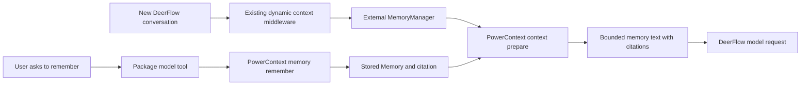

# RFC: Optional PowerContext integration for cross-session memory

**Status:** Draft for maintainer discussion; no adapter has been implemented by this RFC.

**Date:** 2026-10-09

**Chinese version:** [中文稿](2026-10-09-powercontext-integration-rfc.zh.md)

## Summary and decision requested

Add an optional, independently packaged PowerContext integration using DeerFlow's
existing `MemoryManager` and Python extension contracts. The first delivery lets
an operator bind one DeerFlow user to an existing PowerContext Scope, explicitly
save a fact in chat, and recall it automatically in a **new conversation**. The
same authorized Scope can supply memories already saved by another host.

The proposed adapter lives in the PowerContext repository under
`integrations/deerflow/`. DeerFlow receives integration documentation and any
separately justified, provider-neutral contract fixes. There is no new default
dependency, service, database migration, or frontend feature in the first delivery.
DeerMem remains the default backend; opting in selects PowerContext for that
deployment's memory backend.

Maintainer feedback is requested on three decisions:

1. Is an externally maintained `MemoryManager` plus a packaged explicit-save tool
   the preferred integration surface?
2. Is a single-user, single-Scope pilot with new-conversation recall an acceptable
   first milestone?
3. Should the eventual setup guide live at `docs/POWERCONTEXT.md`, following the
   [OpenViking integration](../OPENVIKING.md) precedent?

## 1. User problem and first usable workflow

DeerFlow already has persistent memory and remote memory backends. The additional
use case is sharing selected, durable knowledge with other tools connected to
PowerContext, while keeping PowerContext responsible for storage, retrieval and
memory lifecycle. Users should not need to copy the same confirmed convention
between agents and fresh conversations.

For example, a developer working on an order service says:

> Remember this for the order service: money amounts are integer cents; use pytest
> for backend tests.

With the proposed package installed:

1. The agent invokes the package's explicit-save tool. A newly stored entry returns
   its Memory citation; an identical save can succeed without creating a new
   entry. The assistant reports the server-confirmed result, never an assumed save.
2. The user opens a new DeerFlow conversation: “Add a refund calculation to the
   order service, following its conventions.”
3. DeerFlow asks the configured memory backend for context using that request.
   PowerContext returns bounded text with citations, and DeerFlow includes it in
   its existing memory message.
4. The agent uses the convention and can identify its source. The current user
   request and live repository still determine what work should be done.
5. Another authorized PowerContext client can retrieve the saved convention from
   the same Scope. Sharing must be configured explicitly.

A second acceptance case starts with an existing Memory saved through another
PowerContext integration and verifies that a fresh DeerFlow chat receives it.
These are proposed acceptance scenarios, not measured results.

## 2. Scope of the first delivery

| Included | Deferred |
| --- | --- |
| One explicitly bound, authenticated DeerFlow user and one existing personal Scope | Auth-disabled deployments, multi-user credential provisioning and project/agent-specific Scopes |
| Automatic recall at the host's existing initial-context boundary | Refresh on every turn or after a mid-conversation edit |
| Explicit save through a package-contributed model tool | Automatic transcript capture and background extraction |
| Bounded HTTP calls, citations, isolated credentials and useful diagnostics | Handoff/Continue, Task Outcome, Profile, Experience and Skill workflows |
| Local and Docker install/restart/rollback instructions | DeerMem-compatible memory-management UI and automatic data migration |

Same-user sharing across Gateway web, IM and scheduled-task runs is intentional:
whenever the host resolves a run to the configured owner's trusted identity,
recall uses the same personal Scope and the save tool is available if host tool
policy admits it. The adapter does not impose a web-only gate. This is **not**
an agent, project or channel isolation contract. A scheduled run can save when
its user-authored task explicitly requests saving; there is no interactive
confirmation, and non-interactive execution does not itself authorize a save.

The first live dogfood covers ordinary Gateway web conversations with the default
lead agent. Deterministic host-contract tests cover the same-owner and rejected
identity paths for IM and scheduled runs; live transport testing for those
surfaces remains later work. Standalone embedding and independent subagent
memory lifecycles are outside the supported host scope. Where Gateway admits a
plugin tool to a delegated agent, that tool follows the same owner/Scope rule.

Passive `add`, `aadd` and `add_nowait` are explicit no-ops in the first adapter.
Installing it therefore does not upload existing chats or automatically learn
from each turn. This behavior must be prominent in the setup guide and capability
description, because it differs from DeerMem's passive extraction.

## 3. What the current code already supports

This proposal was checked against DeerFlow
`127c2c220c30d875b2995e95608b98d86db6bc13` and PowerContext
`4d3165f87e3d5780fa9aeab3d9b8c5fa4bc17ed2`. DeerFlow's local revision matched
upstream `main` when checked on 2026-10-09.
The review revision also checked configuration rewriting and identity fallback
against PR head `79ea52fc174fe707709c79babd88d2852c36fad1`.

| Existing contract | Consequence for this proposal |
| --- | --- |
| `memory.manager_class` accepts an external class path; `from_config` receives private backend settings | A provider-specific backend need not be built into DeerFlow |
| `MemoryManager.get_context` accepts `user_id`, `agent_name`, `thread_id` and `query` | Implement the complete signature; the current automatic caller forwards user, agent and query, **not thread ID** |
| `DynamicContextMiddleware` builds full memory context when there is no date reminder | Normal new conversations get recall; ordinary later turns do not refresh it, including at midnight. A first-turn empty result or read error can also leave this reminder in place |
| Async context construction offloads the synchronous `get_context` path with a five-second host timeout | Implement a shorter bounded synchronous read; overriding only `aget_context` would miss this path |
| Recalled memory is a separate `HumanMessage` with memory provenance | Keep external content on the existing data channel, outside framework-owned system instructions |
| `PluginContribution` can contribute model tools without browser code | The package can expose explicit saving without a core tool or new UI |
| `ToolContext` contains a host-bound principal and thread ID | Resolve the owner from the host; do not accept a user ID, token or Scope from model arguments |
| Gateway memory management expects DeerMem-shaped documents | Do not map a PowerContext response to this UI by returning an unrelated JSON object |

These are existing interfaces, not newly proposed hooks. No new extension
contract is required for this deliberately bounded milestone.

## 4. Proposed package and data flow

Proposed distribution name: `powercontext-deerflow`; proposed module:
`powercontext_deerflow`. These names and the configuration below describe work
to be implemented, not an available installation.



The package owns its transport integration, configuration validation, owner/Scope
binding, `MemoryManager` implementation, extension entry point, tool handlers and
tests. Reuse `powercontext[client]` for async API operations and public contracts;
the sync host path needs a bounded bridge or equivalent sync transport, without
installing PowerContext's server/database extras into DeerFlow. The backend
follows the existing portability rule: import the
`MemoryManager` contract, not DeerFlow configuration singletons or private
persistence implementations. The tool uses `deerflow_extension_api`.

### Recall

`get_context` first rejects absent, blank, whitespace-padded or `default` user
IDs, then requires an exact match with the configured owner before any request.
Rejected identities receive no context and cause no remote request. The literal
`default` is also DeerFlow's missing-identity fallback, so it cannot be an owner
binding. Agent names do not select a different Scope in this pilot.

It sends `POST /v1/context/prepare` with the configured `scope_id`, the current
`query`, `max_bytes: 8000`, and a memory-only assembly:

```json
{
  "scope_id": "<existing-authorized-scope>",
  "query": "Add a refund calculation to the order service",
  "max_bytes": 8000,
  "assembly": {"format": "markdown", "sections": [{"family": "memory", "limit": 6}]}
}
```

The current host derives at most 1000 characters from the latest actual user
input. The adapter also enforces the API's 8192-character limit for other callers.
A missing or blank query returns no context in this version. It validates the response schema,
`powercontext.prepared-context.v1`, status (`ready` or `empty`), UTF-8 byte count
and budget before returning ready `content` unchanged. Empty results return an
empty string. Unknown, malformed or oversized responses are
discarded; do not cut through citations or re-render raw search results locally.
The 8000-byte budget covers PowerContext content; the host's wrapper adds a small
amount of text and is not included in that count.

Start with a configurable two-second total recall deadline and no in-call retry.
The HTTP client's phase timeouts alone must not allow a slow streaming response
to exceed this total deadline. Network/authorization/schema failures produce a
content-free diagnostic and let the ordinary chat proceed without new memory.
Keep clients bounded and safe for concurrent worker-thread reads, and close them
through the manager's shutdown contract. Implement async methods for callers
that use them; do not block their event loops.

Prepared context is evidence of retrieval. A test must inspect DeerFlow's actual
outbound model messages to establish that the content was included. Successful
inclusion alone is not evidence of improved task results.

### Explicit saving

Register a `ModelTool` with logical name `remember` in a package namespace such
as `powercontext`. DeerFlow supplies the final namespace-qualified tool name.
The package must check whether `registry.plugin(...)` accepts the contribution
and report an unsupported host instead of silently losing the tool.
When the operator-enabled loader calls `install()`, the package registers
`PluginContribution(enabled=True)`: the outer `plugins[].enabled` determines
whether installation runs; the contribution flag determines tool availability.

The model supplies only `text` within the API's 8192 UTF-8 byte limit after
normalization and an allowed `kind` such as `fact` or `preference`. The tool
description prohibits saving secrets and directs the agent to call it only for an
explicit user request to save information; this instruction is not a new
human-approval or intent-verification mechanism. Host tool policy still applies.
The handler applies the same identity rejection and exact-owner check to
`ToolContext.principal.user_id`, then calls `POST /v1/memory/remember` with
`scope_id`, `kind` and `text`. Rejected identities return a tool error without a
remote request, including when missing runtime identity has become `default`.

Validate the successful response before reporting success. For a newly stored
entry, return its exact citation. An identical active entry can produce HTTP 200
with `entry: null`: this is a successful no-op, not a malformed response. Report
that no new entry was added and retain the returned Memory revision. A bounded
readback may resolve the existing entry's citation; never invent one or retry a
successful no-op merely to obtain it. A rejected write must be shown as failed.
If the request may have
committed but its response is lost, report an **unknown save outcome**, not a
failure that invites a blind retry. The current request has no idempotency key;
the adapter must not promise exactly-once saving or silently retry the mutation.
Use a bounded write deadline below the host tool's 30-second timeout.

This route also has no `evidence_refs` input. A direct save must not claim that it
created or linked a transcript Source. Citation and source lineage are different
claims.

## 5. Installation, identity and operations

The operator first starts PowerContext, creates the target Scope and authorizes
the selected credential. The plugin neither launches PowerContext nor creates
Scopes implicitly. PowerContext's static Bearer token represents one server
principal; a Scope ID is a data boundary, not authentication. Prefer a dedicated
PowerContext deployment/credential for the single-user pilot. A multi-user
release needs a separate design for authenticated principals and Scope grants.

### One configuration source for recall and saving

The proposed package exposes a `deerflow.extensions` installation entry point.
Use the existing extension manager to install it and retain its locked dependency
in local and Docker environments. A bare environment-only `pip install` is not
the deployment procedure. After installation, the operator merges the following
into `config.yaml` and restarts Gateway:

```yaml
# PROPOSED adapter configuration: unavailable until the package is implemented.
memory:
  enabled: true
  mode: middleware
  injection_enabled: true
  manager_class: powercontext_deerflow.memory:PowerContextMemoryManager
  backend_config: {}

plugins:
  - use: powercontext_deerflow:install
    enabled: true
    config: {}
```

Preserve unrelated configuration and existing plugin entries. The empty private
maps are deliberate: the package reads one fixed set of Gateway-process
environment variables, rather than two YAML copies of the binding:

```dotenv
# PROPOSED package settings; supply to the Gateway process/container.
POWERCONTEXT_DEERFLOW_BASE_URL=https://powercontext.example.com
POWERCONTEXT_DEERFLOW_OWNER_USER_ID=<actual-authenticated-user-id>
POWERCONTEXT_DEERFLOW_SCOPE_ID=<existing-authorized-scope>
POWERCONTEXT_DEERFLOW_MAX_BYTES=8000
POWERCONTEXT_DEERFLOW_RECALL_TIMEOUT_SECONDS=2.0
POWERCONTEXT_DEERFLOW_REMEMBER_TIMEOUT_SECONDS=5.0
# Supply POWERCONTEXT_DEERFLOW_TOKEN through the deployment's secret mechanism.
```

Both `from_config()` and `install()` use the same package-owned settings loader.
It reads and validates these variables once per process and shares one immutable
snapshot containing endpoint, credential, owner, Scope, budget and deadlines.
Initialization must be thread-safe; neither consumer independently refreshes
the environment. Missing or invalid required settings prevent both components
from becoming usable, with no fallback to a different owner or Scope. The
adapter rejects binding/transport overrides in either YAML private map rather
than silently applying them; the host-supplied memory `storage_path` remains
accepted. It does not inspect DeerFlow's private configuration singleton.

The extension manager serializes the `plugins` subtree during mutations, and
configuration APIs may rewrite YAML. Neither operation may create an independent
binding copy. A YAML anchor is not a durable source of shared configuration.
Rotating credentials or changing the Scope requires updating the Gateway
environment and restarting every Gateway process; hot reload is unsupported.
For Docker, provision the variables in the actual Gateway container, not only
the shell that invokes Compose. There is no browser-editable binding.

Validate non-empty binding fields, `max_bytes` in the API's 512–32768 range and
positive finite deadlines, and reject insecure remote transport. A loopback-only
HTTP development exception can be documented explicitly. Tokens must never enter
model arguments, browser-visible fields, model messages or diagnostic logs.

### Authenticated owner, not the fallback user

The pilot requires normal Gateway authentication. Deployments with
`DEER_FLOW_AUTH_DISABLED=1` are unsupported; operators must bind an actual signed-in
user's persisted ID. The package rejects an absent, blank, whitespace-padded or
literal `default` owner at configuration initialization. It applies the same
rejection to runtime IDs before comparing them with the owner. Do not normalize
an anonymous caller into the owner or treat a constructed `ToolContext.principal`
as proof of authentication: the current resolver can return `default` when no
identity exists. Tests must exercise that actual fallback path.

These public callbacks do not carry an authentication-source attestation. The
design therefore relies on the authenticated Gateway to establish a trusted
non-default owner, including its owner-bound IM and scheduler launch paths; it
does not establish an authentication boundary for arbitrary embedded callers.
Thread titles, prompt text, `agent_name` and user-submitted Scope strings cannot
grant access. Neither `MemoryManager.get_context` nor `ToolContext` carries a
caller-surface discriminator, and the latter also lacks `agent_name`. This design
therefore does not claim a default-agent-only or web-only authorization boundary.

The deployment switch is opt-in. Recall and the explicit-save tool have separate
host switches: setting `memory.enabled: false` does not disable the plugin tool.
Disabling requires restoring the previous
`memory.manager_class` and backend settings, disabling the plugin and restarting
Gateway; disabling only the plugin does not unload the configured memory class.
Do this before removing the package. Previously stored DeerMem data remains
available when switching back; there is no dual writing or automatic migration.
Remote PowerContext data is retained until managed there explicitly.

The DeerFlow Settings memory page is unsupported for this backend. Management
methods retain explicit unsupported behavior; the guide directs users to
PowerContext's management UI/API for inspection, correction and retirement.
Retirement affects future retrieval, not text already present in a DeerFlow
conversation/checkpoint. Use a new conversation to verify a correction or
retirement. Uninstalling does not erase historical chat content or remote data.

## 6. Why not the alternatives?

| Alternative | Trade-off |
| --- | --- |
| MCP only | Useful for explicit operations, but model tool availability does not establish automatic recall at the host context boundary |
| Provider code in DeerFlow core | Unnecessary with external class loading; increases host maintenance and dependency surface |
| Replace DeerFlow checkpoints/history with PowerContext | Much larger durability and execution-semantics change; unnecessary for reusable memory |
| A second recall middleware alongside DeerMem | Enables coexistence but introduces ordering, duplicate context and budget policy; defer until a measured use case requires it |
| Full transcript synchronization first | Requires durable incremental capture, privacy filtering and extraction readiness before it yields a reliable user-visible loop |

## 7. Later work, with separate acceptance gates

**Opt-in Source capture.** Map `add/aadd/add_nowait` to incremental
`POST /v1/sources/content` writes. Persist a bounded local outbox before claiming
queued capture; replay the same Source IDs and exact payloads after restart.
The same ID with changed content or metadata conflicts, so changed evidence
needs a new identity. Derive
identity from host message/turn IDs with installation/user/thread namespacing,
not only text hashes. Filter hidden/injected memory, system text, reasoning and
unapproved tool data; retain applicable host redaction. Do not repeatedly submit
the whole conversation.

Source acceptance is not Memory creation. Background extraction depends on
PowerContext model, scheduler and authorization configuration and can produce
no useful Memory. Validate those prerequisites explicitly. Do not force a
per-turn `flush` or describe `add_nowait` during compaction as a guaranteed remote
checkpoint. Bound queue size, retention and retry, and define deletion behavior
before enabling capture.

**Refresh, projects and multiple users.** Consider a provider-neutral refresh
policy and trusted thread/project identity projection only after a concrete
need is demonstrated. Existing frozen memory messages can survive in a thread;
per-turn revocation/refresh needs replacement and checkpoint semantics, not just
another network call. Do not infer project Scope from prompt content.

**Handoff and reviewed knowledge.** Add explicit Handoff/Continue or reviewed
Experience operations as later package capabilities. They need their own user
flows and approval semantics; saving a Memory is not handing off a running task.

## 8. Delivery and acceptance

1. **RFC agreement:** agree on scope, ownership and supported host baseline.
2. **PowerContext package:** implement the backend, tool, packaging, contract
   tests and a reproducible single-user example; publish a versioned adapter.
3. **DeerFlow documentation:** add the setup/rollback guide, README entry and
   relevant agent guidance with the actual supported versions and limitations.
   Any generic host fix gets an independently tested PR.
4. **Dogfood:** run the following matrix on a real Gateway, PowerContext server
   and model, recording package versions and both repository revisions.

| Case | Required evidence |
| --- | --- |
| Explicit save → new chat | Successful write citation, a bounded prepare response, matching outbound model-message content and an answer using the convention |
| Repeat the identical explicit save | HTTP 200 with `entry: null` is handled as a successful no-op; no invented citation or mutation retry |
| Other host → DeerFlow | Seed using an existing authorized PowerContext client, then observe the same evidence in a fresh DeerFlow chat |
| Disabled integration | No PowerContext requests; normal DeerFlow behavior with the previous backend restored |
| Different/missing/fallback user | Reject invalid configured owners, including `default`; exercise the real resolver's missing-identity-to-`default` path in recall and tool dispatch, with no remote reads/writes |
| Auth-disabled deployment | Unsupported configuration; synthetic `default` callers cannot access the configured Scope, even when a non-default owner is supplied |
| Same-owner IM/scheduled run | Host-contract fixtures verify the same Scope and tool policy as web runs; an explicit scheduled save needs no interactive confirmation, and live transport coverage is reported separately |
| Recall timeout, 401/403, malformed/oversized response | Chat continues within the budget, no new memory is injected, no secrets appear in diagnostics |
| Save timeout after possible commit | Visible unknown outcome and no automatic mutation retry |
| Untrusted text and long/multibyte data | Existing user-role memory boundary and citations are preserved; API/budget limits are respected |
| Second turn, retirement and restart | No claim of per-turn refresh; fresh-chat read observes remote state; restart preserves the configured binding |
| Local and Docker installation/rollback | Locked package survives normal startup; restoration succeeds without migrating DeerMem data |
| Config rewrite and rotation | Exercise extension upgrade/enable/disable and a config-API rewrite; both consumers keep one settings snapshot. After an environment change and process restart, both use the new binding; YAML overrides are rejected |
| Passive capture excluded | Neither normal turns nor compaction submit transcript Sources |

Use deterministic HTTP/host-message fixtures for adapter and host-contract tests
and the repository's required offline checks for any host code changes. The
live dogfood is separate evidence. A small paired integration-off/on workload may
report convention adherence and added latency with denominators; it does not
justify general claims about accuracy, token savings or task success.

**Validation of this RFC:** source/public API inspection and offline document
checks. A reproduction using the unchanged host YAML-rewrite functions confirmed
the original alias loss and the revised empty-map behavior. The production user
resolver was exercised with a no-runnable-context fixture to confirm its
`default` fallback. No adapter, remote memory calls or live end-to-end integration
were executed for this document.

## References

- [DeerFlow memory backend contract](../../backend/packages/harness/deerflow/agents/memory/backends/README.md)
- [MemoryManager and factory](../../backend/packages/harness/deerflow/agents/memory/manager.py)
- [Dynamic context and memory injection](../../backend/packages/harness/deerflow/agents/middlewares/dynamic_context_middleware.py)
- [Memory read caller](../../backend/packages/harness/deerflow/agents/lead_agent/prompt.py)
- [Python extension contract and deployment](../../backend/packages/harness/deerflow/extensions/AGENTS.md)
- [Full-stack contributions, including tools-only packages](../full-stack-plugins.md)
- [Public tool context](../../backend/packages/extension-api/deerflow_extension_api/plugins.py)
- [Extension manager configuration rewriting](../../backend/packages/harness/deerflow/extensions/manager.py)
- [Runtime identity and fallback](../../backend/packages/harness/deerflow/runtime/user_context.py)
- [Gateway auth-disabled mode](../../backend/app/gateway/auth_disabled.py)
- [PowerContext canonical API at the reviewed revision](https://github.com/oceanbase/powercontext/blob/4d3165f87e3d5780fa9aeab3d9b8c5fa4bc17ed2/openapi/powercontext.yaml)
- [PowerContext configuration and processing prerequisites](https://github.com/oceanbase/powercontext/blob/4d3165f87e3d5780fa9aeab3d9b8c5fa4bc17ed2/docs/en/docs/operate/configuration.md)
