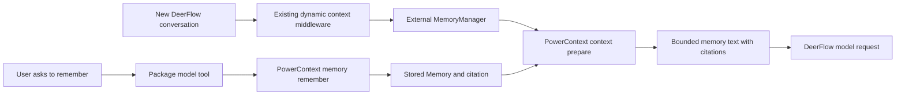

# RFC：通过可选的 PowerContext 集成实现跨会话记忆

**状态：** 提交维护者讨论的草案；本 RFC 尚未实现适配器。

**日期：** 2026-10-09

**英文版：** [English](2026-10-09-powercontext-integration-rfc.md)

## 摘要与待决事项

通过 DeerFlow 现有的 `MemoryManager` 和 Python 扩展契约，提供独立打包、按需启用的
PowerContext 集成。第一版先完成一个可以实际使用的闭环：运维人员将一名 DeerFlow
用户绑定到已有的 PowerContext Scope；用户在聊天中明确要求记住一条信息；随后打开
**新会话**，DeerFlow 自动取回这条记忆。同一个已授权 Scope 中由其他宿主保存的记忆，
也可以供 DeerFlow 使用。

适配器拟放在 PowerContext 仓库的 `integrations/deerflow/` 下。DeerFlow 仓库增加集成
文档；如果发现确有必要的通用契约修复，则另行论证并提交。第一版不增加默认依赖、服务、
数据库迁移或前端功能。DeerMem 仍是默认后端；主动启用此集成后，该部署使用 PowerContext
作为记忆后端。

希望维护者就以下三个问题给出意见：

1. 是否认可“外部维护的 `MemoryManager` + 扩展包提供的显式保存工具”作为集成方式？
2. 是否认可单用户、单 Scope、在新会话中召回记忆作为第一个里程碑？
3. 后续安装指南是否按 [OpenViking 集成](../OPENVIKING.md)的先例，放在
   `docs/POWERCONTEXT.md`？

## 1. 用户问题与第一个可用流程

DeerFlow 已有持久化记忆和远程记忆后端。本提案新增的用途是：与其他接入 PowerContext
的工具共享经过选择、值得长期保留的知识，由 PowerContext 负责存储、检索和记忆生命周期。
用户不必在不同 Agent 和新会话之间反复复制已经确认的约定。

例如，一位开发者正在开发订单服务，并说：

> 请记住订单服务的约定：金额使用整数分，后端测试使用 pytest。

安装本提案中的扩展包后：

1. Agent 调用扩展包的显式保存工具。新存储的条目返回其 Memory 引用标识；保存相同
   内容也可能成功，但不新增条目。助手报告服务端确认的结果，不能自行假定保存成功。
2. 用户新建一个 DeerFlow 会话：“给订单服务增加退款计算，遵循项目约定。”
3. DeerFlow 用这一请求向配置的记忆后端获取上下文。PowerContext 返回有大小上限、
   带引用标识的文本，DeerFlow 将其放入现有的记忆消息。
4. Agent 使用这些约定，并能指出来源。具体执行什么工作，仍由当前用户请求和仓库现状决定。
5. 其他已获授权的 PowerContext 客户端也能从同一个 Scope 中检索这条约定。共享必须显式配置。

另一个验收场景从其他 PowerContext 集成已保存的 Memory 开始，验证 DeerFlow 新会话
能够收到它。这些是拟定的验收场景，尚非实测结果。

## 2. 第一版范围

| 包含 | 暂缓 |
| --- | --- |
| 一名显式绑定且已认证的 DeerFlow 用户和一个已有的个人 Scope | 关闭认证的部署、多用户凭据配置，以及按项目或 Agent 区分的 Scope |
| 在宿主现有的初始上下文构建位置自动召回 | 每轮刷新，或在会话中途修改记忆后刷新 |
| 通过扩展包贡献的模型工具显式保存 | 自动采集对话记录和后台提取 |
| 有界的 HTTP 调用、引用标识、隔离的凭据和有效的诊断信息 | Handoff/Continue、Task Outcome、Profile、Experience 和 Skill 工作流 |
| 本地及 Docker 的安装、重启和回滚说明 | 兼容 DeerMem 的记忆管理界面与自动数据迁移 |

同一用户在 Gateway 网页、IM 和定时任务之间共享记忆，是本方案的预期行为：只要宿主
将一次运行解析为配置所属用户的可信身份，召回就使用同一个个人 Scope；宿主工具策略
允许时，保存工具也可用。适配器不设置仅限网页的访问条件。这**不构成**按 Agent、项目
或渠道隔离的契约。定时任务由用户编写的任务说明明确要求保存时，可以执行保存，无需
交互确认；非交互执行本身并不授予保存权限。

首轮真实环境试用覆盖通过 Gateway 网页发起、使用默认主 Agent 的普通会话。确定性的
宿主契约测试覆盖 IM 和定时任务中同一用户身份及身份被拒绝的路径；这些渠道的真实传输
测试留待后续。独立嵌入式使用和子 Agent 的独立记忆生命周期不在支持的宿主范围内。
Gateway 允许受委派的 Agent 使用插件工具时，该工具遵循相同的用户与 Scope 规则。

第一版适配器将被动写入接口 `add`、`aadd` 和 `add_nowait` 明确定义为空操作。因此，
安装集成不会上传已有聊天，也不会在每轮对话后自动学习。安装指南和能力说明必须醒目地
注明这一点，因为它与 DeerMem 的被动提取行为不同。

## 3. 当前代码已经支持什么

本提案核对了 DeerFlow `127c2c220c30d875b2995e95608b98d86db6bc13` 和 PowerContext
`4d3165f87e3d5780fa9aeab3d9b8c5fa4bc17ed2`。2026-10-09 检查时，DeerFlow 的本地版本
与上游 `main` 一致。
此次评审修订还基于 PR head `79ea52fc174fe707709c79babd88d2852c36fad1` 核查了
配置重写和身份回退行为。

| 现有契约 | 对本提案的影响 |
| --- | --- |
| `memory.manager_class` 接受外部类路径；`from_config` 接收后端私有设置 | 无需将特定服务商的后端实现内置到 DeerFlow |
| `MemoryManager.get_context` 接受 `user_id`、`agent_name`、`thread_id` 和 `query` | 实现完整签名；当前自动调用方传递用户、Agent 和查询，**不传 thread ID** |
| `DynamicContextMiddleware` 在没有日期提醒时构建完整记忆上下文 | 普通新会话会召回记忆；后续普通轮次不会刷新，跨越午夜也不会。首轮结果为空或读取失败，也可能留下这一提醒 |
| 异步上下文构建将同步 `get_context` 放到工作线程执行，宿主超时为五秒 | 实现总时限更短的同步读取；只覆盖 `aget_context` 无法接入这条调用路径 |
| 召回的记忆使用单独的 `HumanMessage`，并带有记忆来源标识 | 外部内容沿用现有数据通道，不进入框架管理的系统指令 |
| `PluginContribution` 无需浏览器端代码即可贡献模型工具 | 扩展包可以提供显式保存，无需增加核心工具或新界面 |
| `ToolContext` 包含由宿主绑定的身份主体和 thread ID | 从宿主解析所属用户；不接受模型参数传入的用户 ID、令牌或 Scope |
| Gateway 的记忆管理接口要求 DeerMem 格式的文档 | 不应返回结构无关的 JSON 对象，冒充对该界面的支持 |

这些都是已有接口，不是本提案新增的钩子。在上述有意收窄的里程碑中，不需要新增扩展契约。

## 4. 扩展包与数据流

拟用发行包名：`powercontext-deerflow`；拟用模块名：`powercontext_deerflow`。这些名称
及下文配置描述的是待实现方案，不代表已有可安装的集成。



扩展包负责 HTTP 对接、配置校验、用户与 Scope 绑定、`MemoryManager` 实现、扩展入口、
工具处理函数及测试。异步 API 操作和公开契约复用 `powercontext[client]`；宿主的同步
调用路径需要有明确时限的桥接方式或等效的同步传输实现，不向 DeerFlow 安装
PowerContext 的服务端或数据库可选依赖。后端遵循现有可移植性约定：导入 `MemoryManager`
契约，不导入 DeerFlow 的配置单例或私有持久化实现。工具使用 `deerflow_extension_api`。

### 召回

`get_context` 先拒绝缺失、空白、首尾带空白字符或值为 `default` 的用户 ID，再要求其
与配置的所属用户完全匹配，之后才能发出请求。被拒绝的身份不会获得上下文，也不会
触发远程请求。字面值 `default` 同时是 DeerFlow 缺失身份时的回退值，因此不能用作
所属用户绑定。试点中，Agent 名称不会选择不同的 Scope。

向 `POST /v1/context/prepare` 发送已配置的 `scope_id`、当前 `query`、`max_bytes: 8000`，
并且只组装 memory 内容：

```json
{
  "scope_id": "<existing-authorized-scope>",
  "query": "给订单服务增加退款计算",
  "max_bytes": 8000,
  "assembly": {"format": "markdown", "sections": [{"family": "memory", "limit": 6}]}
}
```

当前宿主最多从最近一条真实用户输入中提取 1000 个字符。针对其他调用方，适配器还需执行
API 的 8192 字符上限。此版本遇到缺失或空白查询时不返回上下文。它校验响应结构、
`powercontext.prepared-context.v1` 标识、状态（`ready` 或 `empty`）、UTF-8 字节数及
预算，随后原样返回就绪响应的 `content`。空结果返回空字符串。未知、格式错误或超限的
响应直接丢弃；不截断引用标识，也不在本地重新渲染原始搜索结果。8000 字节预算覆盖
PowerContext 内容；宿主包装时增加的少量文本不计入这一预算。

初始配置采用可调整的两秒召回总时限，单次调用内不重试。不能仅依赖 HTTP 客户端各阶段
的超时设置，否则缓慢的流式响应仍可能超过总时限。网络、授权或响应结构校验失败时，
输出不含内容的诊断信息，让普通聊天在不注入新记忆的情况下继续。客户端的资源使用必须
有界，支持工作线程并发读取，并通过 manager 的关闭契约释放资源。为使用异步接口的
调用方实现对应方法，不阻塞其事件循环。

Prepared context 只能证明检索发生了。测试必须检查 DeerFlow 实际发给模型的消息，才能
证明内容已被加入。仅成功加入上下文，也不能证明任务结果有所改善。

### 显式保存

在扩展包的命名空间（例如 `powercontext`）中注册逻辑名称为 `remember` 的 `ModelTool`。
DeerFlow 负责生成带命名空间的最终工具名。扩展包必须检查 `registry.plugin(...)`
是否接受这一贡献；若不支持，应报告宿主不兼容，不能让工具悄然缺失。
当运维人员启用的加载器调用 `install()` 时，扩展包注册
`PluginContribution(enabled=True)`：外层 `plugins[].enabled` 决定是否执行安装入口，
贡献对象的标志决定工具是否可用。

模型只提供 `text` 和允许的 `kind`，例如 `fact` 或 `preference`；`text` 归一化后必须
满足 API 的 8192 UTF-8 字节上限。工具说明禁止保存秘密信息，并要求 Agent 仅在用户
明确提出保存信息时调用；这一说明本身不构成新增的人工审批或意图校验机制。宿主现有的
工具策略仍然适用。处理函数对 `ToolContext.principal.user_id` 执行相同的身份拒绝规则
和所属用户精确匹配检查，再携带 `scope_id`、`kind` 和 `text` 调用
`POST /v1/memory/remember`。身份被拒绝时，工具返回错误，不发起远程请求；运行时缺失的
身份已经被转为 `default` 时也必须拒绝。

只有校验了成功响应，才能报告成功。对于新存储的条目，返回其原始引用标识。如果已经
存在相同的有效条目，服务端可能返回 HTTP 200 和 `entry: null`；这是成功的空操作，
不是格式错误的响应。此时报告未新增条目，并保留返回的 Memory 修订版本。可以通过有
明确时限的回读获取已有条目的引用标识；不能编造引用，也不能仅为获得引用而重试已经
成功的空操作。被拒绝的写入必须显示失败。如果请求可能已经提交，但响应丢失，应报告
**保存结果未知**，不能将其当作失败而诱导盲目重试。当前请求没有幂等键；适配器不得承诺
恰好保存一次，也不得静默重试这一写入操作。写入总时限应明确受限，并短于宿主工具的
30 秒超时。

这个接口也不接受 `evidence_refs`。直接保存不能声称创建了对话记录 Source，或建立了
与其的关联。引用标识与来源追溯是两种不同的保证。

## 5. 安装、身份与运维

运维人员先启动 PowerContext，创建目标 Scope，并为所选凭据授权。插件不负责启动
PowerContext，也不隐式创建 Scope。PowerContext 的静态 Bearer 令牌代表一个服务端
身份主体；Scope ID 是数据边界，不是认证凭据。单用户试点优先使用独立的 PowerContext
部署或凭据。多用户版本需要另行设计认证主体和 Scope 授权。

### 召回与保存共用一个配置来源

扩展包拟提供 `deerflow.extensions` 安装入口。通过现有扩展管理器安装，确保本地及
Docker 环境保留锁定的依赖。仅在某个环境中执行 `pip install` 不构成部署流程。安装后，
运维人员将以下内容合并到 `config.yaml`，然后重启 Gateway：

```yaml
# PROPOSED adapter configuration: unavailable until the package is implemented.
memory:
  enabled: true
  mode: middleware
  injection_enabled: true
  manager_class: powercontext_deerflow.memory:PowerContextMemoryManager
  backend_config: {}

plugins:
  - use: powercontext_deerflow:install
    enabled: true
    config: {}
```

合并时保留无关配置及已有插件条目。两个私有配置映射特意留空：扩展包读取 Gateway
进程中一组固定的环境变量，避免在 YAML 中维护两份绑定配置：

```dotenv
# PROPOSED package settings; supply to the Gateway process/container.
POWERCONTEXT_DEERFLOW_BASE_URL=https://powercontext.example.com
POWERCONTEXT_DEERFLOW_OWNER_USER_ID=<actual-authenticated-user-id>
POWERCONTEXT_DEERFLOW_SCOPE_ID=<existing-authorized-scope>
POWERCONTEXT_DEERFLOW_MAX_BYTES=8000
POWERCONTEXT_DEERFLOW_RECALL_TIMEOUT_SECONDS=2.0
POWERCONTEXT_DEERFLOW_REMEMBER_TIMEOUT_SECONDS=5.0
# Supply POWERCONTEXT_DEERFLOW_TOKEN through the deployment's secret mechanism.
```

`from_config()` 和 `install()` 使用同一个由扩展包维护的设置加载器。每个进程只读取并
校验一次这些变量，两者共享一份包含端点、凭据、所属用户、Scope、预算和时限的不可变
快照。初始化必须保证线程安全；两者都不能独立刷新环境变量。必填设置缺失或无效时，
两个组件都不能进入可用状态，也不能回退到其他用户或 Scope。适配器拒绝在任一 YAML
私有映射中覆盖绑定或传输设置，不能静默采用它们；宿主传入的记忆 `storage_path` 仍然
接受。适配器不读取 DeerFlow 的私有配置单例。

扩展管理器执行变更时会序列化 `plugins` 子树，配置 API 也可能重写 YAML。这两种操作
都不能产生独立的绑定副本。YAML 锚点不能作为共享配置的持久保证。轮换凭据或更改
Scope 时，需要更新 Gateway 环境并重启每个 Gateway 进程；不支持热加载。Docker
部署必须将变量提供给实际运行的 Gateway 容器，不能只设置在执行 Compose 的 shell
中。绑定配置不向浏览器开放编辑。

校验绑定字段非空、`max_bytes` 位于 API 的 512–32768 范围内、时限为有限的正数，并
拒绝不安全的远程传输。可以明确记录仅限回环地址的 HTTP 开发例外。令牌绝不能进入
模型参数、浏览器可见字段、模型消息或诊断日志。

### 绑定已认证用户，拒绝回退身份

试点要求使用 Gateway 的正常认证机制。不支持设置了 `DEER_FLOW_AUTH_DISABLED=1` 的
部署；运维人员必须绑定真实登录用户的持久化 ID。扩展包在配置初始化时拒绝缺失、空白、
首尾带空白字符或字面值为 `default` 的所属用户 ID。运行时 ID 与所属用户比较之前，
也必须执行相同的拒绝规则。不能将匿名调用方归一化为所属用户，也不能将已构造的
`ToolContext.principal` 当作认证证明：当前解析器在身份缺失时可能返回 `default`。
测试必须覆盖这条实际的回退路径。

这些公开回调不携带认证来源的证明。因此，本设计依赖已启用认证的 Gateway 建立可信的
非 `default` 用户身份，包括其绑定用户的 IM 和调度器启动路径；它不为任意嵌入式调用方
建立认证边界。会话标题、提示词、`agent_name` 和用户提交的 Scope 字符串都不能授予
访问权。`MemoryManager.get_context` 和 `ToolContext` 均不携带调用渠道标识，后者也不
携带 `agent_name`。因此，本设计不声称具备“仅默认 Agent 可访问”或“仅网页可访问”的
授权边界。

部署切换由运维人员主动启用。召回与显式保存工具各自受宿主开关控制：设置
`memory.enabled: false` 不会禁用插件工具。停用集成时，需要恢复之前的
`memory.manager_class` 和后端设置、禁用插件，并重启 Gateway；只禁用插件不会卸载已经
配置的记忆类。移除扩展包前，应先完成这些操作。切回原后端后，之前存储的 DeerMem 数据
仍然可用；本方案不双写，也不自动迁移。远程 PowerContext 数据会保留，直到在
PowerContext 中显式管理它们。

DeerFlow 设置中的记忆页面不支持此后端。管理方法保留明确的“不支持”行为；指南引导
用户使用 PowerContext 的管理界面或 API 检查、修正和停用记忆。停用影响未来检索，不会
删除已出现在 DeerFlow 会话或检查点中的文本。应通过新会话验证修正或停用效果。卸载
不会清除历史聊天内容或远程数据。

## 6. 为什么不采用其他方案？

| 备选方案 | 权衡 |
| --- | --- |
| 仅使用 MCP | 适合显式操作，但模型可以调用工具，不代表宿主构建上下文时会自动召回 |
| 将服务商代码放进 DeerFlow 核心 | 现有外部类加载已经够用；内置实现会增加宿主维护成本及依赖面 |
| 用 PowerContext 替换 DeerFlow 检查点或历史记录 | 会大幅改变持久性和执行语义，可复用记忆不需要这一步 |
| 在 DeerMem 旁增加第二套召回中间件 | 可以共存，但会引入顺序、重复上下文和预算策略问题；等有实测需求再考虑 |
| 先完整同步对话记录 | 需要先解决可靠的增量采集、隐私过滤和提取就绪条件，才能形成可靠的用户闭环 |

## 7. 后续工作及各自的验收门槛

**主动启用的 Source 采集。** 将 `add/aadd/add_nowait` 映射为向
`POST /v1/sources/content` 的增量写入。声称采集已入队之前，先将其持久化到有容量上限的
本地待发送队列；重启后以相同 Source ID 和完全一致的载荷重放。相同 ID 搭配变化后的
内容或元数据会产生冲突，因此改变的证据需要新的标识。标识应从宿主消息或轮次 ID 派生，
并带上安装实例、用户和会话命名空间，不能只使用文本哈希。过滤隐藏或注入的记忆、系统
文本、推理及未经允许的工具数据，并保留适用的宿主脱敏处理。不要重复提交整个会话。

Source 被接收不等于生成 Memory。后台提取依赖 PowerContext 的模型、调度器和授权
配置，也可能不产出有用的 Memory。必须显式验证这些前置条件。不要强制每轮 `flush`，
也不要将上下文压缩期间的 `add_nowait` 描述成有保证的远程检查点。启用采集前，明确队列
容量、保留时间、重试上限及删除行为。

**刷新、项目和多用户。** 在出现明确需求后，再考虑与服务商无关的刷新策略，以及可信的
会话或项目身份传递。已有的静态记忆消息可能持续留在会话中；逐轮撤销或刷新需要定义消息
替换和检查点语义，不能只增加一次网络调用。不要从提示词推断项目 Scope。

**任务交接与审阅后的知识。** 后续可通过扩展包增加显式 Handoff/Continue 或经过审阅的
Experience 操作。它们需要各自的用户流程和审批语义；保存一条 Memory 不等于交接正在
执行的任务。

## 8. 交付与验收

1. **RFC 达成共识：** 确定范围、维护归属和支持的宿主基线。
2. **PowerContext 扩展包：** 实现后端、工具、打包、契约测试和可复现的单用户示例；发布
   带版本的适配器。
3. **DeerFlow 文档：** 增加安装与回滚指南、README 入口及相关 Agent 指南，注明实际支持
   的版本和限制。任何通用宿主修复均单独提交经过测试的 PR。
4. **实际试用：** 使用真实 Gateway、PowerContext 服务和模型运行以下矩阵，记录扩展包
   版本及两个仓库的提交版本。

| 场景 | 所需证据 |
| --- | --- |
| 显式保存 → 新会话 | 成功写入的引用标识、符合大小限制的 prepare 响应、内容匹配的实际模型出站消息，以及遵循约定的回答 |
| 重复显式保存相同内容 | 将 HTTP 200 和 `entry: null` 作为成功的空操作处理，不编造引用标识，不重试写入 |
| 其他宿主 → DeerFlow | 通过已有且获授权的 PowerContext 客户端预存记忆，然后在 DeerFlow 新会话中观察同样的证据 |
| 集成已停用 | 没有 PowerContext 请求；恢复此前后端后，DeerFlow 正常工作 |
| 用户不同、缺失或使用回退身份 | 拒绝包含 `default` 在内的无效所属用户配置；在召回和工具分发中覆盖真实解析器将缺失身份转为 `default` 的路径，不发起远程读写 |
| 关闭认证的部署 | 此配置不受支持；即使配置了非 `default` 所属用户，合成的 `default` 调用方也不能访问配置的 Scope |
| 同一用户的 IM 或定时任务运行 | 宿主契约测试样本验证其与网页使用相同 Scope 和工具策略；明确要求保存的定时任务无需交互确认，真实传输覆盖情况单独报告 |
| 召回超时、401/403、响应格式错误或超限 | 聊天在时限内继续，不注入新记忆，诊断信息不泄露秘密 |
| 可能已提交后的保存超时 | 明确显示结果未知，不自动重试写入 |
| 不可信文本及长文本、多字节数据 | 保留现有用户角色记忆边界和引用标识，遵守 API 与预算限制 |
| 第二轮、记忆停用与重启 | 不声称逐轮刷新；新会话读取反映远程状态；重启后保留配置的绑定 |
| 本地及 Docker 安装与回滚 | 锁定的扩展包在正常启动后仍可用；无需迁移 DeerMem 数据即可恢复 |
| 配置重写与轮换 | 覆盖扩展升级、启用、禁用及配置 API 重写；两个组件保持共用一份设置快照。环境变更并重启进程后，两者均使用新绑定；拒绝 YAML 覆盖项 |
| 排除被动采集 | 普通轮次和上下文压缩都不提交对话记录 Source |

适配器及宿主契约测试使用确定性的 HTTP 和宿主消息测试样本；若修改宿主代码，运行仓库
要求的离线检查。真实环境试用作为单独的证据。可以用小规模的集成关闭/开启配对任务，
报告约定遵循情况和增加的延迟，并注明统计分母；这些结果不能支撑准确率、Token 节省或
任务成功率普遍提升的主张。

**本 RFC 的验证情况：** 检查了源码、公开 API 和离线文档。复现使用未修改的宿主 YAML
重写函数，确认了原锚点失效及新空映射配置的行为；使用“无 runnable context”的测试替身
调用生产身份解析器，确认了 `default` 回退。本文未执行适配器、远程记忆调用或真实
端到端集成。

## 参考资料

- [DeerFlow 记忆后端契约](../../backend/packages/harness/deerflow/agents/memory/backends/README.md)
- [MemoryManager 与工厂](../../backend/packages/harness/deerflow/agents/memory/manager.py)
- [动态上下文与记忆注入](../../backend/packages/harness/deerflow/agents/middlewares/dynamic_context_middleware.py)
- [记忆读取调用方](../../backend/packages/harness/deerflow/agents/lead_agent/prompt.py)
- [Python 扩展契约与部署](../../backend/packages/harness/deerflow/extensions/AGENTS.md)
- [全栈贡献，包括仅提供工具的扩展包](../full-stack-plugins.md)
- [公开工具上下文](../../backend/packages/extension-api/deerflow_extension_api/plugins.py)
- [扩展管理器的配置重写](../../backend/packages/harness/deerflow/extensions/manager.py)
- [运行时身份与回退](../../backend/packages/harness/deerflow/runtime/user_context.py)
- [Gateway 关闭认证模式](../../backend/app/gateway/auth_disabled.py)
- [所审阅版本的 PowerContext 规范 API](https://github.com/oceanbase/powercontext/blob/4d3165f87e3d5780fa9aeab3d9b8c5fa4bc17ed2/openapi/powercontext.yaml)
- [PowerContext 配置与处理前置条件](https://github.com/oceanbase/powercontext/blob/4d3165f87e3d5780fa9aeab3d9b8c5fa4bc17ed2/docs/en/docs/operate/configuration.md)
