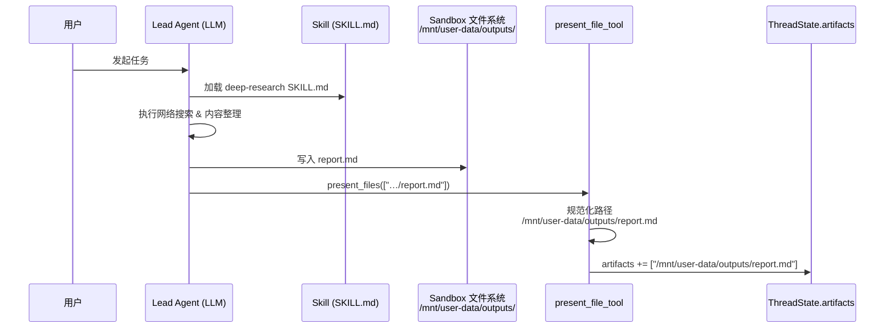
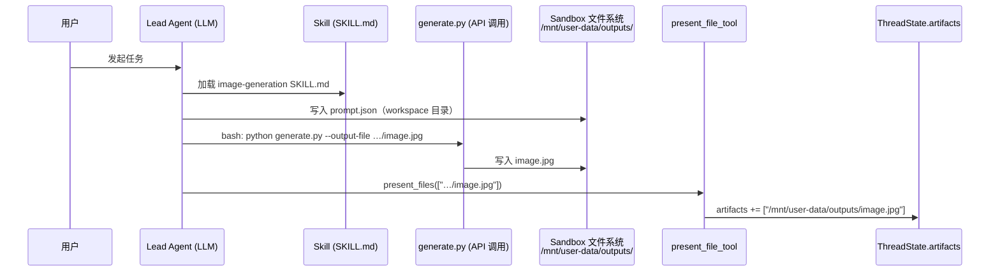
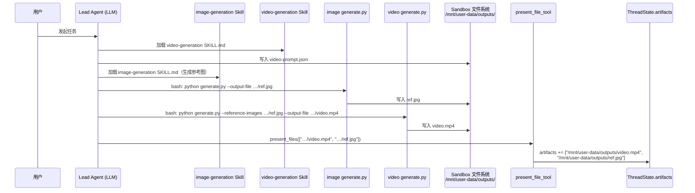

# Skill Result API 设计方案

## 背景

DeerFlow skill 执行完成后，结果散落在 `ThreadState.artifacts`（裸路径列表）和 `messages`（对话记录）中，缺乏结构化的对外输出接口。本方案定义一个新端点，将 skill 产出整理为统一的结构化结果。

---

## 现有文件写入流程

### 报告（Markdown）



### 图片



### 视频



---

## 新增端点

```
GET /api/threads/{thread_id}/result
```

- 先确认 thread 已执行完毕（`next` 为空），未完成则返回 `404`
- 每次实时读取文件解析（暂不做 ThreadState 缓存）
- `artifacts` 为空（纯问答任务）时返回空对象 `{}`

---

## 返回结构

```json
{
  "thread_id": "...",
  "document": {
    "title": "...",
    "summary": "...",
    "content": "...(前3000字符)",
    "content_url": "..."
  },
  "image": {
    "image_url": "...",
    "image_thumbnail_url": "...?thumbnail=true&size=512"
  },
  "video": {
    "video_url": "...",
    "video_thumbnail_url": "...?thumbnail=true&size=512"
  },
  "data": {
    "data_url": "..."
  }
}
```

**规则：**
- 每个类型只取第一条（按 `present_files` 提交顺序）
- 没有对应类型的产出，字段不出现（非 `null`）
- `thumbnail_url` 直接由原文件 URL 加参数派生，不是独立文件路径

---

## 各类型识别与提取逻辑

| 类型 | 扩展名 | 提取内容 |
|---|---|---|
| document | `.md` `.txt` | title / summary / content（前3000字符）|
| image | `.jpg` `.png` `.webp` `.gif` 等 | image_url |
| video | `.mp4` `.mov` 等 | video_url |
| data | `.csv` `.json` `.yaml` `.xml` 等 | data_url |
| 其他 | `.pdf` `.docx` 等 | 不进入结构化结果 |

### document 字段提取规则

- **title**：优先 front matter `title:`，其次正文第一个 `# H1`，最后退化为文件名
- **summary**：优先 front matter `description:` / `summary:`，其次 H1 之后的第一段纯文本
- **content**：原始 markdown 格式，截取前 3000 字符
- **content_url**：完整文件的访问地址（使用现有 artifact 端点）

---

## 缩略图机制

在现有 artifact 端点扩展 `?thumbnail=true` 参数：

```
GET /api/threads/{id}/artifacts/mnt/user-data/outputs/image.jpg?thumbnail=true&size=512
GET /api/threads/{id}/artifacts/mnt/user-data/outputs/video.mp4?thumbnail=true&size=512
```

**图片缩略图**：Pillow resize，保持比例，默认宽度 256px

**视频缩略图**：ffmpeg 提取首帧

**尺寸参数**：支持 `?thumbnail=true&size=512`，指定输出宽度（像素）

**缓存**：生成后落盘到同 thread outputs 目录下的 `.thumb/` 子目录，下次请求直接返回缓存文件

**降级**：ffmpeg 不可用时返回 `404`，Result API 照常写入 `video_thumbnail_url`，由调用方处理

---

## 实现范围

| 组件 | 变更 |
|---|---|
| `artifacts.py` | 新增 `?thumbnail=true&size=N` 处理逻辑 |
| 新增 `results.py` | `GET /api/threads/{id}/result` 端点 |
| 新增 `result_extractor.py` | 文件类型识别、markdown 解析、URL 构造 |
| `present_file_tool.py` | 不变 |
| `ThreadState` | 不变 |
| skill SKILL.md 文件 | 不变 |

---

## 待决问题

- thread 处于 error 或 human-in-the-loop 中断状态时，Result API 的返回行为
- 是否对高频调用做 ThreadState 级别的解析结果缓存（当前暂缓）
