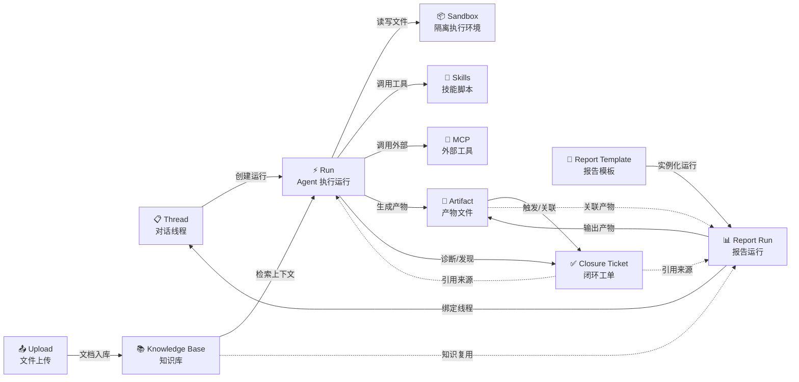

# DeerFlow 第一主流程定义

最后更新：2026-05-22

本文档定义 DeerFlow 的第一主流程，覆盖"任务/对话 → 工具/知识 → 报告/产物 → 闭环/治理"的完整链路。供产品、架构、前后端共同引用。

## 1. 主流程图

## 2. 节点职责说明

| 节点 | 定义 | 目标用户 | 前置依赖 |
|------|------|----------|----------|
| **Thread** | 对话线程，承载用户与 Agent 的完整会话上下文 | 普通业务用户、分析用户 | LangGraph 运行时 |
| **Run** | Agent 的一次执行运行，在 Thread 内创建，驱动工具调用和流式响应 | 普通业务用户 | Thread、模型、工具/Skills/MCP |
| **Upload** | 用户上传的文件，自动转换为 Markdown 后入库 | 知识管理员、业务用户 | 文件转换服务（MarkItDown） |
| **Knowledge Base** | 组织知识的向量存储，支持检索增强生成（RAG） | 知识管理员、报告使用者 | Upload、Embedding 模型、Vector Store |
| **Skills** | 可复用的技能脚本，提供领域工具和数据查询能力 | Agent 运行时 | Skills 目录、report_scripts.yaml |
| **MCP** | Model Context Protocol 集成，接入外部工具服务 | 平台配置者 | MCP Server 配置、网络可达性 |
| **Sandbox** | 隔离的文件执行环境，Agent 在其中读写文件、执行命令 | Agent 运行时 | 本地/容器沙箱、用户隔离目录 |
| **Artifact** | Agent 执行过程中生成的输出文件（代码、报告、图表等） | 最终用户 | Run 执行完成、Sandbox 输出 |
| **Report Template** | DSL 驱动的报告模板，定义表单、数据步骤、变换和输出 | 分析用户、模板设计者 | Skills 注册表、知识库 |
| **Report Run** | 报告模板的一次实例化运行，收集参数、执行数据步骤、渲染输出 | 分析用户、运营人员 | Report Template、Thread/Run、Skills |
| **Closure Ticket** | 闭环工单，跟踪故障/诊断结果的修复状态 | 租户管理员、运维人员 | Run/Report Run 诊断结果 |

## 3. 导航分类

基于 `frontend/src/components/workspace/workspace-nav-chat-list.tsx` 和 `frontend/src/app/workspace/` 路由结构提取。

### 3.1 一级导航项

| 导航项 | 当前路由 | 来源 |
|--------|----------|------|
| 聊天 (Chats) | `/workspace/chats` | 固定导航 |
| Agent 列表 | `/workspace/agents` | Agent 注册表动态展开 |
| 知识库 (Knowledge Bases) | `/workspace/knowledge-bases` | 固定导航 |
| 闭环管理 (Closed Loop) | `/workspace/closed-loop` | 条件渲染（defect-closure agent 启用时） |
| 报告模板 (Report Templates) | `/workspace/report-templates` | 动态导航（agent nav_items） |
| 报告运行 (Report Runs) | `/workspace/report-runs` | 动态导航（agent nav_items） |
| A2UI 调试 | `/workspace/debug/a2ui` | 固定导航（调试入口） |

### 3.2 分类结果

| 导航项 | 路由 | 分类 | 分类理由 |
|--------|------|------|----------|
| 聊天 (Chats) | `/workspace/chats` | **主入口** | 用户与 Agent 交互的核心入口，Thread/Run 生命周期在此承载 |
| 知识库 (Knowledge Bases) | `/workspace/knowledge-bases` | **主入口** | 知识管理和检索的直接入口，主链"知识→执行"的起点 |
| 报告模板 (Report Templates) | `/workspace/report-templates` | **主入口** | 报告模板管理，主链"报告/产物"的定义入口 |
| 报告运行 (Report Runs) | `/workspace/report-runs` | **主入口** | 报告运行历史，主链"报告/产物"的执行入口 |
| 闭环管理 (Closed Loop) | `/workspace/closed-loop` | **主入口** | 闭环工单跟踪，主链"闭环/治理"的直接入口 |
| Agent 列表 | `/workspace/agents` | **扩展域** | Agent 浏览和选择，辅助主链但不直接参与核心工作流 |
| A2UI 调试 | `/workspace/debug/a2ui` | **扩展域** | 开发调试工具，不面向业务用户 |

> **说明**：Agent 管理（`/workspace/agents` 下的 Agent 详情、配置等）属于扩展域。MCP 配置、租户管理等管理功能位于管理后台（`/admin` 或设置面板），不在工作台侧栏中展示。

## 4. 未决问题

以下问题在主流程和对象模型定义过程中发现，尚未达成共识。这些问题不影响已达成共识的基线部分。

| # | 问题描述 | 涉及对象 | 影响范围 | 建议解决时机 |
|---|----------|----------|----------|-------------|
| Q1 | **Thread 的双重语义**：当前 thread 同时承载"聊天会话"和"任务执行"两种语义。一个 thread 可能有多次 run，每次 run 可能执行完全不同的任务。这对前端展示（按对话分组还是按任务分组）和后端生命周期管理（何时归档 thread）带来歧义。 | Thread, Run | 前端导航结构、后端归档策略、产品信息架构 | ISSUE-02（统一生命周期与状态语义） |
| Q2 | **Artifact 与 Report Run 产物的概念重叠**：两类对象都产出文件（artifact 产出 agent 生成的代码/图表；report run 产出 report.md/pdf），但生命周期和所有权不同（artifact 属于 thread/report run；report run 产物属于 run 的 exports 目录）。是否需要统一为一类"产出物"对象？ | Artifact, Report Run | 产物管理 API、前端文件列表、存储清理策略 | ISSUE-04（知识主链）之前 |
| Q3 | **Closure Ticket 的上下文归属**：closure ticket 通过 `source_thread_id` 和 `source_run_id` 关联到生成它的 thread/run，但它本身是否应该共享 thread 的上下文（如引用 thread 中的 artifact、对话消息）？如果 thread 被删除，关联的 closure ticket 应该如何处理？ | Closure Ticket, Thread, Run | 闭环工单详情页、工单与对话的导航跳转 | ISSUE-03（打通跳转链路） |
| Q4 | **Upload 与 Knowledge Base 的边界**：upload 是临时性文件上传（用户在一个 thread 中上传文件），知识库是持久化知识存储。但当前上传到 thread 的文件也可以"加入知识库"，两者的生命周期差异较大。是否需要在上传时就让用户选择"临时使用"还是"入库"？ | Upload, Knowledge Base | 上传 UI、文件存储策略、知识库入库流程 | ISSUE-04（知识主链） |
| Q5 | **Report Template 是否需要独立于 Agent 的入口**：当前 report template 和 report run 通过 Agent 的 `nav_items` 机制注册到侧栏（由 `ai-report--custom` agent 提供），这意味着如果没有启用该 agent，报告入口将不可见。报告的"产品化"定位是否应该让它成为一个独立于 agent 的一级入口？ | Report Template, Agent | 前端导航结构、产品信息架构 | ISSUE-03 或产品路线图讨论 |
| Q6 | **Sandbox 是否为可观测对象**：sandbox 是 Agent 的运行时依赖，但它是否需要独立的状态和生命周期管理（如 sandbox 健康检查、资源配额、超时回收）？当前 sandbox 管理对外部不可见。 | Sandbox, Run | 运维监控、资源管理、成本核算 | 运维需求确认后 |
