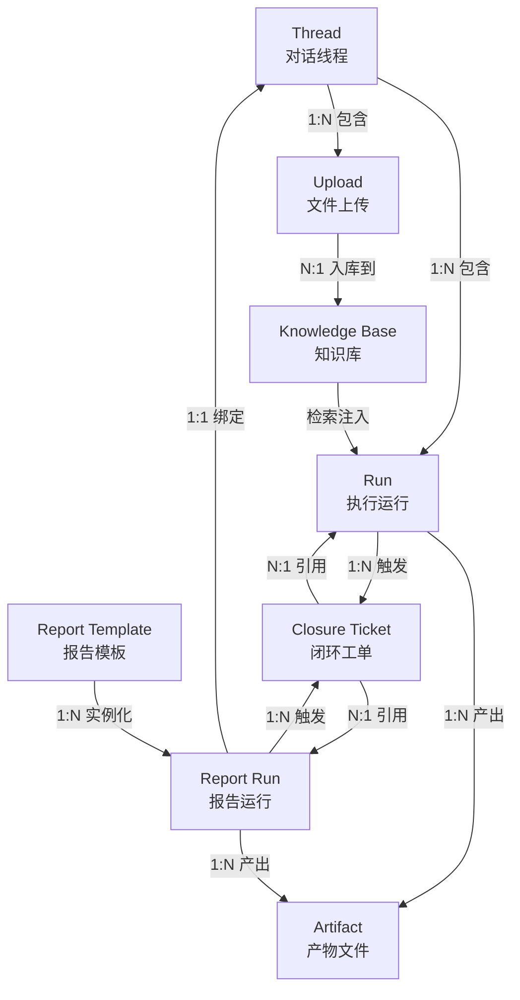

# DeerFlow 主对象模型

最后更新：2026-05-22

本文档定义 DeerFlow 的 8 个核心对象，包含每个对象的业务含义、生命周期状态、关键关系和主要 API 入口。供产品、开发、测试共同引用。

## 对象关系总图



---

## 1. Thread（对话线程）

### 业务含义

Thread 是用户与 Agent 之间的一次完整对话会话，承载消息历史、执行上下文和会话级状态。它是 DeerFlow 最顶层的工作单元。

### 生命周期状态

```mermaid
state-v2
    [*] --> idle: 创建线程
    idle --> active: Run 开始执行
    active --> idle: Run 完成（无运行中/待执行 Run）
    active --> active: 追加 Run
    idle --> archived: 用户归档
    active --> archived: 用户归档
    archived --> idle: 取消归档
```

| 状态 | 含义 | 触发条件 |
|------|------|----------|
| `idle` | 空闲，无运行中的 Run | 默认初始状态；所有 Run 结束后自动进入 |
| `active` | 活跃，有至少一个 Run 在 pending/running | Run 被创建时自动聚合 |
| `archived` | 已归档，不在默认视图中显示 | 用户手动归档 |

> Thread 状态由下辖 Run 状态自动聚合，不可手动设置。

### 关键关系

| 关联对象 | 关系 | 说明 |
|----------|------|------|
| Run | 1:N | 一个 Thread 包含多次 Agent 执行 |
| Upload | 1:N | 用户在对话中上传的文件 |
| Artifact | 1:N（间接，通过 Run） | Agent 在对话中生成的产物 |
| Report Run | 1:N（间接） | 报告运行绑定到特定 Thread |
| Closure Ticket | 1:N（间接） | 从对话中生成的闭环工单 |

### 主要 API 入口

| 操作 | 端点 | 方法 |
|------|------|------|
| 创建线程 | LangGraph `/threads` | POST |
| 查询线程列表 | LangGraph `/threads` | GET |
| 查询线程详情 | LangGraph `/threads/{thread_id}/state` | GET |
| 删除线程 | `/api/threads/{id}` | DELETE |
| 上传文件 | `/api/threads/{id}/uploads` | POST |
| 列出文件 | `/api/threads/{id}/uploads/list` | GET |
| 获取产物 | `/api/threads/{id}/artifacts/{path}` | GET |
| 生成建议 | `/api/threads/{id}/suggestions` | POST |

---

## 2. Run（Agent 执行运行）

### 业务含义

Run 是 Agent 在 Thread 内的一次具体执行。用户发送消息后，系统创建 Run 来驱动 Agent 推理、工具调用和流式响应。一次对话通常包含多次 Run。

### 生命周期状态

```mermaid
state-v2
    [*] --> pending: POST /runs
    pending --> running: Worker 接管
    running --> success: 正常完成
    running --> failed: 异常终止
    pending --> cancelled: 用户取消
    running --> cancelled: 用户取消
```

| 状态 | 含义 | 可恢复 |
|------|------|--------|
| `pending` | 已创建，等待 Worker 执行 | — |
| `running` | Worker 正在执行 Agent 推理和工具调用 | — |
| `success` | 执行成功完成 | 终态 |
| `failed` | 执行异常终止（含 error/timeout/interrupted） | 重试（新建 Run） |
| `cancelled` | 用户主动取消 | 终态 |

**失败子分类**（`RunFailureCategory`）：
- `execution_failed` — Agent 执行逻辑异常
- `upload_failed` — 文件上传/转换失败
- `external_dependency_unavailable` — 模型或外部服务不可用

### 关键关系

| 关联对象 | 关系 | 说明 |
|----------|------|------|
| Thread | N:1 | 每个 Run 必须属于一个 Thread |
| Artifact | 1:N | Run 执行过程中生成的文件 |
| Closure Ticket | 1:N | Run 诊断结果触发的工单 |
| Report Run | 1:1（可选） | Run 可能承载一个报告运行 |

### 主要 API 入口

| 操作 | 端点 | 方法 |
|------|------|------|
| 创建并流式执行 | `/api/threads/{id}/runs/stream` | POST |
| 创建后台运行 | `/api/threads/{id}/runs` | POST |
| 创建并阻塞等待 | `/api/threads/{id}/runs/wait` | POST |
| 列出运行 | `/api/threads/{id}/runs` | GET |
| 查询运行详情 | `/api/threads/{id}/runs/{rid}` | GET |
| 取消运行 | `/api/threads/{id}/runs/{rid}/cancel` | POST |
| 加入 SSE 流 | `/api/threads/{id}/runs/{rid}/join` | GET |
| 获取消息 | `/api/threads/{id}/runs/{rid}/messages` | GET |
| 无状态流式执行 | `/api/runs/stream` | POST |

---

## 3. Upload（文件上传）

### 业务含义

Upload 是用户在 Thread 中上传的文件。系统自动将 PDF/DOCX/PPTX/XLSX 等格式转换为 Markdown，使其可被 Agent 理解和检索。上传文件存储在用户隔离目录中，并可选入库到知识库。

### 生命周期状态

```mermaid
state-v2
    [*] --> uploading: 文件传输中
    uploading --> converting: 传输完成
    converting --> ready: 转换成功
    converting --> failed: 转换失败
    uploading --> failed: 传输中断
    failed --> uploading: 重新上传
```

| 状态 | 含义 | 可恢复 |
|------|------|--------|
| `uploading` | 文件正在上传 | — |
| `converting` | 文件正在转换为 Markdown | — |
| `ready` | 文件就绪，可被 Agent 使用 | 终态 |
| `failed` | 上传或转换失败 | 重新上传 |

### 关键关系

| 关联对象 | 关系 | 说明 |
|----------|------|------|
| Thread | N:1 | 上传文件属于一个 Thread |
| Knowledge Base | N:1（可选） | 文件可入库到知识库 |

### 主要 API 入口

| 操作 | 端点 | 方法 |
|------|------|------|
| 上传文件 | `/api/threads/{id}/uploads` | POST |
| 列出上传文件 | `/api/threads/{id}/uploads/list` | GET |
| 删除上传文件 | `/api/threads/{id}/uploads/{filename}` | DELETE |

---

## 4. Artifact（产物文件）

### 业务含义

Artifact 是 Agent 在执行过程中生成的输出文件，如代码文件、报告 Markdown、图表 SVG、数据 JSON 等。产物存储在 thread 隔离的输出目录中，通过 API 提供下载。

### 生命周期状态

```mermaid
state-v2
    [*] --> generating: Agent 工具正在生成
    generating --> ready: 生成完成
    generating --> failed: 生成异常
```

| 状态 | 含义 | 可恢复 |
|------|------|--------|
| `generating` | Agent 正在生成产物 | — |
| `ready` | 产物就绪，可下载 | 终态 |
| `failed` | 产物生成失败 | 重试（新 Run） |

### 关键关系

| 关联对象 | 关系 | 说明 |
|----------|------|------|
| Run | N:1 | 产物由 Run 生成 |
| Thread | N:1（间接） | 产物存储在线程目录下 |
| Report Run | N:1（可选） | 报告运行产出物是 Artifact 的特化 |

### 主要 API 入口

| 操作 | 端点 | 方法 |
|------|------|------|
| 下载产物 | `/api/threads/{id}/artifacts/{path}` | GET |

---

## 5. Knowledge Base（知识库）

### 业务含义

Knowledge Base 是持久化的组织知识存储，将文档转换为向量嵌入以支持检索增强生成（RAG）。知识库支持多文档、多版本、权限控制和可观测性。

### 状态

知识库本身的生命周期状态为 `active` / `archived`（软删除）。其下文档的索引状态由 Document 的 `index_status` 字段管理：

| 文档状态 | 含义 |
|----------|------|
| `pending` | 等待索引调度 |
| `indexing` | 正在向量化和入库 |
| `ready` | 索引完成，可检索 |
| `failed` | 索引失败 |
| `cancelled` | 索引被取消 |

### 关键关系

| 关联对象 | 关系 | 说明 |
|----------|------|------|
| Upload | 1:N（来源） | 文档从上传文件入库 |
| Document (KB) | 1:N | 知识库包含多个文档 |
| Run | N:M（检索） | Run 执行时检索知识库 |
| Report Run | N:M（检索） | 报告运行可使用知识库数据 |

### 主要 API 入口

| 操作 | 端点 | 方法 |
|------|------|------|
| 创建知识库 | `/api/knowledge-bases` | POST |
| 列出知识库 | `/api/knowledge-bases` | GET |
| 查询知识库详情 | `/api/knowledge-bases/{kb_id}` | GET |
| 更新知识库 | `/api/knowledge-bases/{kb_id}` | PUT |
| 删除知识库 | `/api/knowledge-bases/{kb_id}` | DELETE |
| 上传文档 | `/api/knowledge-bases/{kb_id}/documents` | POST |
| 列出文档 | `/api/knowledge-bases/{kb_id}/documents` | GET |
| 检索 | `/api/knowledge-bases/{kb_id}/search` | POST |
| 索引统计 | `/api/knowledge-bases/{kb_id}/index-stats` | GET |
| 文档索引状态 | `/api/knowledge-bases/{kb_id}/documents/{doc_id}/index-status` | GET |
| 检索 | `/api/rag/search` | POST |

---

## 6. Report Template（报告模板）

### 业务含义

Report Template 是 DSL（YAML）驱动的报告定义，描述报告的表单步骤、数据获取步骤、变换逻辑和输出渲染方式。模板支持版本化、发布、Fork 和归档。

### 生命周期状态

```mermaid
state-v2
    [*] --> draft: 创建模板
    draft --> draft: 更新草稿
    draft --> published: 发布版本 v1
    published --> draft: 编辑（新草稿版本）
    published --> published: 发布新版本
    published --> archived: 归档
    draft --> deleted: 硬删除
    archived --> published: 取消归档
```

| 状态 | 含义 |
|------|------|
| `draft` | 草稿，仅创建者可见，可编辑 |
| `published` | 已发布，按 visibility 规则可见，版本不可变 |
| `archived` | 已归档，不可用于新建运行，历史运行仍可查看 |
| `deleted` | 硬删除（仅 draft 状态可删除） |

**可见性**（`visibility`）：
- `private` — 仅创建者可见
- `tenant` — 租户内所有用户可见
- `builtin` — 内置模板，只读

### 关键关系

| 关联对象 | 关系 | 说明 |
|----------|------|------|
| Report Template Version | 1:N | 每个模板有多个版本快照 |
| Report Run | 1:N | 模板被实例化为多次运行 |
| Skills | N:M | 模板的数据步骤引用技能脚本 |

### 主要 API 入口

| 操作 | 端点 | 方法 |
|------|------|------|
| 列出模板 | `/api/report-templates` | GET |
| 创建草稿 | `/api/report-templates` | POST |
| 获取模板 | `/api/report-templates/{id}` | GET |
| 更新草稿 | `/api/report-templates/{id}` | PUT |
| 校验 DSL | `/api/report-templates/{id}/validate` | POST |
| 发布版本 | `/api/report-templates/{id}/publish` | POST |
| Fork 模板 | `/api/report-templates/{id}/fork` | POST |
| 归档模板 | `/api/report-templates/{id}/archive` | POST |
| 删除模板 | `/api/report-templates/{id}` | DELETE |
| 版本列表 | `/api/report-templates/{id}/versions` | GET |
| 版本快照 | `/api/report-templates/{id}/versions/{n}` | GET |

---

## 7. Report Run（报告运行）

### 业务含义

Report Run 是 Report Template 的一次实例化执行。它在绑定的 Thread/Run 中运行，收集用户表单输入、执行数据步骤脚本、组装 report_payload.json 并渲染导出 Markdown/PDF。

### 生命周期状态

```mermaid
state-v2
    [*] --> pending: 准备运行
    pending --> running: 开始执行
    running --> running: 各步骤执行中
    running --> success: 全部步骤完成 + 导出成功
    running --> failed: 步骤执行/导出失败
    pending --> cancelled: 用户取消
    running --> cancelled: 用户取消
```

| 状态 | 含义 | 可恢复 |
|------|------|--------|
| `pending` | 运行已创建，等待开始 | — |
| `running` | 正在执行表单/数据/渲染步骤 | — |
| `success` | 所有步骤完成，产物已导出 | 终态 |
| `failed` | 步骤执行或导出失败 | 重试（新建 Run） |
| `cancelled` | 用户取消 | 终态 |

**失败错误码**（`ReportRunErrorCode`）：
- `TEMPLATE_UNAVAILABLE` — 模板不存在或不可访问
- `KB_UNAVAILABLE` — 依赖的知识库不可用
- `RUN_INTERRUPTED` — 运行被中断
- `DATA_STEP_FAILED` — 数据步骤脚本执行失败

### 关键关系

| 关联对象 | 关系 | 说明 |
|----------|------|------|
| Report Template | N:1 | 每个运行属于一个模板 |
| Thread | 1:1 | 运行绑定到一个对话线程 |
| Artifact | 1:N | 运行产出 report.md/pdf 等产物 |
| Closure Ticket | 1:N（可选） | 运行结果可触发闭环工单 |
| Knowledge Base | N:M（检索） | 运行可能从一个或多个知识库检索数据 |

### 主要 API 入口

| 操作 | 端点 | 方法 |
|------|------|------|
| 列出运行 | `/api/report-runs` | GET |
| 获取运行记录 | `/api/report-runs/{rid}` | GET |
| 获取 payload | `/api/report-runs/{rid}/payload` | GET |

---

## 8. Closure Ticket（闭环工单）

### 业务含义

Closure Ticket 是闭环工单，用于跟踪故障诊断、报告发现或人工提出的问题的修复流程。它具备严格的线性状态机、SLA 时效管理和完整的审计日志。

### 生命周期状态

```mermaid
state-v2
    [*] --> pending: 创建工单 (create)
    pending --> assigned: 指派处理人 (assign)
    pending --> rejected: 驳回 (reject)
    assigned --> in_progress: 开始处理 (start)
    assigned --> rejected: 驳回 (reject)
    in_progress --> pending_verification: 提交验证 (submit_verification)
    in_progress --> rejected: 驳回 (reject)
    pending_verification --> closed: 验证通过并关闭 (verify_close)
    pending_verification --> in_progress: 验证驳回 (reject_verification)
    closed --> reopened: 重开 (reopen)
    reopened --> assigned: 重新指派 (assign)
    reopened --> in_progress: 直接开始 (start)
```

| 状态 | 含义 | 终态 |
|------|------|------|
| `pending` | 待处理 | 否 |
| `assigned` | 已指派，等待处理人响应 | 否 |
| `in_progress` | 处理中 | 否 |
| `pending_verification` | 等待验证人确认 | 否 |
| `closed` | 已关闭（验证通过） | 是 |
| `rejected` | 已驳回 | 是 |
| `reopened` | 已重开 | 否 |

**SLS 优先级**（默认 SLA 小时数）：
- `urgent` — 4 小时
- `important` — 72 小时
- `normal` — 7 天
- `observe` — 30 天

### 关键关系

| 关联对象 | 关系 | 说明 |
|----------|------|------|
| Run | N:1（可选） | 工单可能从诊断 Run 生成 |
| Report Run | N:1（可选） | 工单可能从报告运行结果生成 |
| Thread | N:1（可选） | 工单可能关联来源 Thread |

**来源类型**（`source_type`）：
- `diagnosis` — 故障诊断
- `report` — 报告发现
- `manual` — 人工创建
- `chat` — 对话中创建

### 主要 API 入口

| 操作 | 端点 | 方法 |
|------|------|------|
| 创建工单 | `/api/closure-tickets` | POST |
| 列出工单 | `/api/closure-tickets` | GET |
| 获取工单 | `/api/closure-tickets/{id}` | GET |
| 状态转换 | `/api/closure-tickets/{id}/transition` | POST |
| 获取事件日志 | `/api/closure-tickets/{id}/events` | GET |
| SLA 状态 | `/api/closure-tickets/summary` | GET |

---

## 附录：API 端点与 Gateway 路由对照

对象模型中列出的 API 端点对应以下 Gateway 路由模块：

| 对象 | Gateway 路由模块 |
|------|-----------------|
| Thread | `routers/threads.py` + LangGraph SDK |
| Run | `routers/thread_runs.py` + `routers/runs.py` |
| Upload | `routers/uploads.py` |
| Artifact | `routers/artifacts.py` |
| Knowledge Base | `routers/knowledge_bases.py` + `routers/rag.py` |
| Report Template | `routers/report_templates.py` |
| Report Run | `routers/report_runs.py` |
| Closure Ticket | `routers/closure_tickets.py` |

所有端点均可在 `backend/app/gateway/routers/` 目录下找到对应的路由注册，满足对象模型基线可校验要求。
