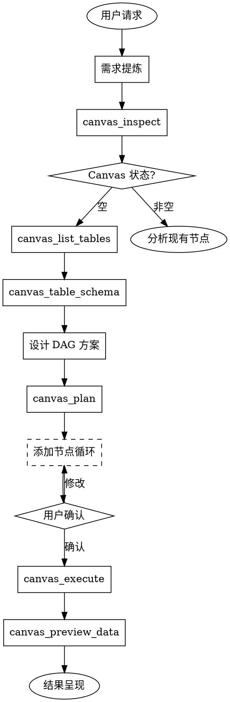

# Canvas Analysis Skill 设计文档

> 创建日期：2026-04-26

## 概述

`canvas-analysis` 是一个数据分析技能，帮助用户通过 Canvas DAG 构建可复用的数据处理管道。技能从用户宽泛的分析请求中提炼具体目标，自动设计完整的 DAG 结构，为每个节点生成处理逻辑，执行后输出分析结果。

## 与现有技能的区别

| 技能 | 数据来源 | 处理方式 | 输出 | 适用场景 |
|-----|---------|---------|------|---------|
| data-analysis | 上传的 Excel/CSV 文件 | DuckDB 即时查询 | 一次性分析结果 | 快速分析本地文件 |
| canvas-analysis | 数据库连接（MySQL/PostgreSQL） | Canvas DAG 多节点管道 | 分析结果 + 可复用 DAG | 生产级数据处理管道 |

## 触发条件

当用户表达数据分析意图时自动触发：
- "帮我分析...数据"
- "做个报表"
- "统计一下..."
- "看看销售情况"
- 任何涉及数据库查询或多步骤数据处理的请求

## 核心流程



## Canvas 工具集

### 现有工具

| 工具 | 功能 |
|-----|------|
| `canvas_plan_tool` | 创建或更新 Canvas 描述 |
| `canvas_add_node_tool` | 添加节点（data_source/sql_executor/python_script/data_output） |
| `canvas_add_edge_tool` | 添加边连接节点 |
| `canvas_execute_tool` | 执行 DAG |
| `canvas_status_tool` | 获取 Canvas 基本状态 |

### 新增工具

#### 1. canvas_inspect_tool

**功能：** 详细检查 Canvas 当前状态，返回节点配置、边关系、可用变量。

**返回内容：**
```json
{
  "canvas_id": "canvas-abc123",
  "status": "idle",
  "nodes": [
    {
      "id": "node-1",
      "type": "data_source",
      "config": {
        "connection_id": "dataflow",
        "table_name": "dim_experiment"
      }
    },
    {
      "id": "node-2", 
      "type": "sql_executor",
      "config": {
        "output_table": "experiment_stats",
        "sql": "SELECT ..."
      },
      "executed": true
    }
  ],
  "edges": [
    {"source": "node-1", "target": "node-2"}
  ],
  "available_variables": [
    {"name": "{{node-1.table_name}}", "value": "dim_experiment"},
    {"name": "{{node-2.output_table}}", "value": "experiment_stats"}
  ]
}
```

**调用时机：** 每次添加节点前调用，了解当前状态。

#### 2. canvas_list_tables_tool

**功能：** 列出数据库连接中可用的表。

**参数：**
- `connection_id`（可选）：指定连接ID，不传则返回所有连接的表

**返回内容：**
```json
{
  "connections": [
    {
      "connection_id": "dataflow",
      "connection_name": "阿里云RDS",
      "tables": ["dim_experiment", "dim_experiment_metric", "fact_experiment_assignment"]
    }
  ]
}
```

**调用时机：** 选择 data_source 节点的表时。

#### 3. canvas_table_schema_tool

**功能：** 获取表的字段结构。

**参数：**
- `connection_id`：数据库连接ID
- `table_name`：表名

**返回内容：**
```json
{
  "table_name": "dim_experiment",
  "columns": [
    {"name": "experiment_id", "type": "INTEGER", "nullable": false},
    {"name": "experiment_name", "type": "VARCHAR(128)", "nullable": false},
    {"name": "start_date", "type": "DATE", "nullable": false}
  ]
}
```

**调用时机：** 设计 SQL 查询前，了解字段信息。

#### 4. canvas_preview_data_tool

**功能：** 预览表数据或节点输出数据。

**参数：**
- `source`：数据源，可以是表名或节点ID（如 "node-2"）
- `limit`：返回行数，默认100

**返回内容：**
```json
{
  "source": "node-2",
  "rows": [
    {"experiment_type": "A/B Test", "count": 45},
    {"experiment_type": "MVT", "count": 12}
  ],
  "columns": [
    {"name": "experiment_type", "type": "VARCHAR"},
    {"name": "count", "type": "BIGINT"}
  ],
  "total_rows": 2
}
```

**调用时机：** 验证节点输出、展示最终结果时。

## DAG 设计模式

### 典型结构

```
data_source → sql_executor → [python_script] → data_output
```

### 节点类型与配置

#### data_source 节点

```json
{
  "connection_id": "dataflow",
  "table_name": "dim_experiment",
  "display_name": "实验维度表"
}
```

**可用变量生成：** `{{node-X.table_name}}`

#### sql_executor 节点

```json
{
  "output_table": "result_table_name",
  "sql": "SELECT ... FROM {{node-Y.table_name}} WHERE ...",
  "display_name": "描述性名称"
}
```

**SQL 变量引用：** 使用上游节点的 `{{node-X.table_name}}` 或 `{{node-X.output_table}}`

#### python_script 节点

```json
{
  "output_table": "processed_table",
  "input_tables": ["{{node-X.output_table}}"],
  "script": "import pandas as pd\n...",
  "display_name": "处理脚本"
}
```

#### data_output 节点

```json
{
  "input_table": "{{node-X.output_table}}",
  "output_format": "csv",
  "filename": "分析结果.csv"
}
```

### 按分析类型选择结构

| 分析类型 | DAG 结构 |
|---------|---------|
| 简单查询 | data_source → sql_executor → data_output |
| 多表关联 | 2+ data_source → sql_executor(JOIN) → data_output |
| 聚合统计 | data_source → sql_executor(GROUP BY) → data_output |
| 复杂处理 | data_source → sql_executor → python_script → data_output |
| 对比分析 | data_source → sql_executor(分组统计) → data_output |

## 技能执行流程

### Step 1: 需求提炼

从用户请求中提取：
- **分析目标**: 用户想得到什么结果？
- **时间范围**: 需要分析哪个时间段的数据？
- **筛选条件**: 需要哪些过滤条件？
- **输出类型**: 报表/统计/对比/趋势？

### Step 2: 观察环境

```
canvas_inspect_tool() → 了解当前 Canvas 状态
canvas_list_tables_tool() → 了解可用数据源
canvas_table_schema_tool() → 了解表结构（按需）
```

### Step 3: 设计 DAG 方案

向用户展示：
- 将使用的表及原因
- 节点数量和类型
- 每个 SQL 节点的核心逻辑（SQL 框架）
- 预期输出

### Step 4: 用户确认

用户可以：
- 确认执行
- 请求修改某个节点的逻辑
- 指定不同的表

### Step 5: 构建 DAG

循环添加节点，**每次添加前调用 `canvas_inspect_tool()`**：

```
canvas_plan_tool(description="...")

canvas_inspect_tool() → 确认状态
canvas_add_node_tool("data_source", {...})

canvas_inspect_tool() → 获取可用变量
canvas_add_node_tool("sql_executor", {
    "sql": "SELECT ... FROM {{node-1.table_name}} ...",
    ...
})

canvas_add_edge_tool("node-1", "node-2")

... 继续添加节点 ...

canvas_add_node_tool("data_output", {...})
canvas_add_edge_tool(..., "node-N")
```

### Step 6: 执行与呈现

```
canvas_execute_tool()
canvas_preview_data_tool(source="node-N")
```

## 结果呈现格式

```markdown
## Canvas 分析完成

**执行状态:** ✅ 完成 (耗时 3.2s)

**DAG 结构:**
- node-1: data_source → dim_experiment (实验维度表)
- node-2: sql_executor → experiment_stats (实验类型统计)
- node-3: data_output → 实验分析报告.csv

**节点执行详情:**

| 节点 | 类型 | 状态 | 耗时 | 输出 |
|-----|------|-----|------|------|
| node-1 | data_source | ✅ | 0.1s | dim_experiment |
| node-2 | sql_executor | ✅ | 1.5s | experiment_stats |
| node-3 | data_output | ✅ | 0.3s | 实验分析报告.csv |

**结果预览:**

| experiment_type | count | avg_duration |
|-----------------|-------|--------------|
| A/B Test | 45 | 14.2 days |
| MVT | 12 | 21.5 days |

**输出文件:** `/mnt/user-data/outputs/实验分析报告.csv`

**Canvas 已保存，可通过前端界面查看和编辑。**
```

## 错误处理

### 节点执行失败

- 停止后续执行
- 显示错误详情和失败节点
- 建议修改方案

### 数据源连接失败

- 提示检查连接配置
- 尝试备用连接（如果有）

### SQL 语法错误

- 显示具体错误位置
- 建议修正方案
- 提供重新执行选项

## 技能协作

`canvas-analysis` 专注于 DAG 流程设计和执行，不直接调用其他技能。

但分析结果可被其他技能消费：
- 用户可请求 `chart-visualization` 对输出结果生成图表
- 用户可请求 `data-analysis` 对导出的 CSV 进行补充分析

## 示例对话

**用户:** 帮我分析一下我们做的实验的情况，看看哪种类型实验最多

**技能:**
我来帮你分析实验情况。让我先看看可用的数据源。

*[调用 canvas_inspect_tool() - Canvas 为空]*

*[调用 canvas_list_tables_tool()]*

发现 `dataflow` 数据库中有以下实验相关表：
- dim_experiment - 实验维度表
- dim_experiment_metric - 实验指标表
- fact_experiment_assignment - 实验分配事实表

我设计的分析方案：
1. **data_source**: 从 dim_experiment 获取实验数据
2. **sql_executor**: 按实验类型分组统计数量
3. **data_output**: 导出为 CSV

核心 SQL 逻辑：
```sql
SELECT experiment_type, COUNT(*) as count
FROM dim_experiment
GROUP BY experiment_type
ORDER BY count DESC
```

是否按此方案执行？

**用户:** 可以

**技能:**
*[调用 canvas_plan_tool]*
*[调用 canvas_inspect_tool]*
*[调用 canvas_add_node_tool - data_source]*
*[调用 canvas_inspect_tool - 获取可用变量 {{node-1.table_name}}]*
*[调用 canvas_add_node_tool - sql_executor]*
*[调用 canvas_add_edge_tool]*
*[调用 canvas_add_node_tool - data_output]*
*[调用 canvas_add_edge_tool]*
*[调用 canvas_execute_tool]*
*[调用 canvas_preview_data_tool]*

## Canvas 分析完成

**执行状态:** ✅ 完成 (耗时 1.2s)

**结果预览:**

| experiment_type | count |
|-----------------|-------|
| A/B Test | 45 |
| MVT | 12 |
| Multi-armed Bandit | 8 |

**输出文件:** `/mnt/user-data/outputs/实验类型统计.csv`

如需可视化，可以说"生成图表"。
