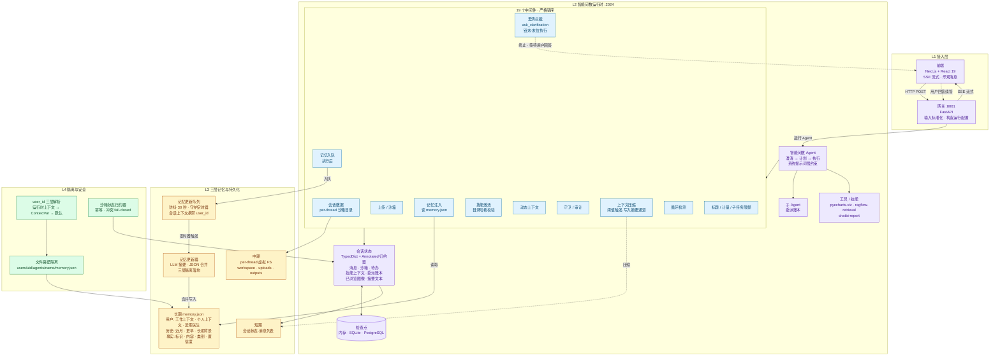

# 模块三 · 智能问数系统的多轮对话与记忆架构

> 所属提案：智能问数 · 创新提案
> 本章定位：智能问数体系中"上下文管理与个性化推理"的能力底座
> 核心特征：**三层记忆 + 中间件链 + 中断式澄清 + 异步防抖写入**

---

## 一、为什么这层能力决定了智能问数的天花板

智能问数不是"问一句答一句"，它必须在以下四类场景中都能交付可靠结果：

1. **多轮澄清**——报表口径不齐、模板未给、字段模糊时，系统要主动停下来把问题摆清楚，而不是"猜一个最可能的答案跑下去"。
2. **跨会话偏好复用**——领导偏好的描述风格、计量单位、上次用过的口径，下一次启动新对话时就要带上。
3. **长程任务连续性**——报表生成往往跨分钟到跨小时；中间状态必须可恢复、可回放、可审计。
4. **多用户严格隔离**——A 部门和 B 部门看到的"用户偏好"不能串，共享数据不能泄。

没有这层能力，再聪明的模型也只能停留在"一次性问答"层面——遇到复杂报表场景就会因上下文丢失、用户偏好遗忘、异常中断无法续接而崩盘。

**这一章要交付的，正是智能问数系统最底层、最难替代、却最容易被忽视的能力底座。**

---

## 二、整体架构（分层视角）

智能问数系统的多轮对话与记忆能力，按"接入 → 运行时 → 记忆与持久化 → 隔离与安全"四层组织：

```
┌──────────────────────────────────────────────────────────────────────────────┐
│  L1  接入层   前端 (Next.js + React 19)  +  网关 (FastAPI, :8001)            │
│      ── SSE 流式 ── 线程 / 运行 / 消息 ── 输入标准化 ──                     │
├──────────────────────────────────────────────────────────────────────────────┤
│  L2  智能问数运行时 (:2024)   智能问数 Agent  ── 19 个中间件（严格链序）    │
│      会话状态(TypedDict)  ◀── 检查点（内存 · SQLite · PostgreSQL）           │
│      ┌─ 执行前拦截 ─┐   ┌─ 模型调用包装 ─┐   ┌─ 执行后拦截 ─┐               │
│      │ 会话数据准备 │   │ 澄清→计划→执行 │   │ 记忆入队     │               │
│      │ 上传/沙箱   │   │ 上下文压缩     │   │ 标题/计量   │               │
│      │ 记忆注入     │   │ 守卫/审计      │   │ 子任务限额 │               │
│      │ 技能激活     │   │ 循环检测       │   │ 澄清拦截   │◀ 链末        │
│      └──────────────┘   └────────────────┘   └─────────────┘               │
├──────────────────────────────────────────────────────────────────────────────┤
│  L3  记忆与持久化                                                            │
│   ├─ 短期  会话状态.消息列表 (LangGraph state)  → 压缩通道摘要              │
│   ├─ 中期  per-thread 虚拟目录 workspace/uploads/outputs（沙箱挂载）        │
│   └─ 长期  memory.json  {用户.工作上下文|个人上下文|近期关注                  │
│                          + 历史.近月|更早|长期背景 + 事实列表[]}            │
│       写盘路径：记忆中间件 → 记忆更新队列 (防抖 30 秒)                       │
│                 → 记忆更新器 (LLM 摘要) → JSON 三层隔离落地                  │
└──────────────────────────────────────────────────────────────────────────────┘
```

---

## 三、核心创新点

### 1. 三层记忆正交设计

把"刚才说的 / 这次会话留下的 / 跨会话一直记得的"切成三段，各有存储、各有生命周期：

- **短期（工作记忆）**：当前对话的消息流，按轮次实时追加；token 接近上限时触发压缩到摘要通道。
- **中期（会话文件系统）**：每个会话独立挂载 workspace / uploads / outputs 虚拟目录，文件级隔离，生命周期与会话绑定。
- **长期（跨会话用户画像）**：按用户、按 Agent 维度落盘的 memory.json，包含 6 个区域 + 事实列表 + 置信度。

这种切分让"上下文窗口塞不下"和"用户偏好丢失"两个常见痛点彻底解耦。

### 2. 中间件链 = "Agent 的内核"

智能问数系统的 Agent 不是裸的 LLM 调用，而是一个**有 19 个横切关注点的运行时内核**：沙箱、审计、循环检测、压缩、澄清拦截、限额、记忆注入……每个中间件都是一个可插拔的横切关注点，用严格链序保证顺序契约。

> 这比市面上"prompt + 单次调用"的 Agent 模式更可控——把不确定性显式隔离到固定位置。

### 3. 中断式澄清协议

澄清不是"用户在 UI 上点取消"，而是被做成**协议级中断**：Agent 调用 `ask_clarification` 工具 → 末位中间件拦截 → 返回 `Command(goto=END)` 终止当轮 → SSE 推送澄清事件 → 前端展示澄清卡片 → 用户回答后用同一会话 ID 续答。

**这意味着多轮对话天然可恢复、可回放——状态由检查点全权接管。**

### 4. 防抖 + 用户上下文捕获 = 异步记忆写入的正确姿势

记忆写入不是"对话一停就写盘"——而是用 30 秒防抖把短时间内的多轮对话合并，再交给 LLM 摘要合并写入。

更关键的是：定时器线程不继承请求内的用户上下文变量（ContextVar）。系统的做法是**在请求线程内就把 user_id 烧进数据载体**（ConversationContext），让定时器线程后续处理时直接读取——这是工程上一个微小却关键的设计正确性。

### 5. 三层用户隔离

`user_id` 的解析按三层优先级：

```
1. 运行时上下文（runtime.context["user_id"]）   ── 最高，跨线程边界
2. ContextVar (_current_user)                   ── 请求内可靠
3. DEFAULT_USER_ID ("default")                  ── 无认证回退
```

落到文件系统则是 `users/{uid}/agents/{name}/memory.json`——每用户每 Agent 一份，物理隔离 + 逻辑隔离双重保险。

### 6. 纠正 / 强化信号 = 记忆的"权重"

不是所有对话都值得同等写入。系统在记忆入队时检测两种信号：

- **纠正（correction）**：用户指出"上次那个不对"——写入时 LLM 摘要模块会优先淘汰被纠正的事实。
- **强化（reinforcement）**：用户明确"这个偏好记住"——写入时优先固化。

让记忆有"权重"，而不是把所有对话一视同仁。

### 7. 失败即闭合（fail-closed）的一致性防御

很多系统在不一致出现时"静默兜底"——选一个值继续运行。智能问数系统反其道而行：

- **沙箱 ID 冲突**：同一会话出现两个不同沙箱 ID，直接报错而不是选一个——把并发隔离漏洞做成代码错误。
- **技能目录漂移**：持久化的旧技能名遇上目录哈希变化时，整体替换——防止过期技能名意外暴露已下线的工具。
- **委派账本终态保护**：已结束的子任务记录不被非终态覆盖——像 Kafka 的 compacted topic：可回看、不可篡改。

> **把一致性漏洞当 bug 防御，而不是用兜底掩盖。**

---

## 四、多轮对话主流程（一次"问 → 答 → 澄清 → 续答"的完整往返）

```
1. 用户输入 ─► 网关.输入标准化 ─► 启动新一轮运行（POST /threads/{tid}/runs/stream）
2. 构造运行配置 ─► 配置可注入项（会话 ID、Agent 名、模型名…）
3. 加载会话状态（检查点反序列化）── 缺失沙箱则懒初始化
4. 19 个中间件"执行前"阶段
       ├─ 会话数据：准备 /mnt/user-data/{workspace,uploads,outputs}
       ├─ 上传注入：注入本轮上传文件
       ├─ 记忆注入：把长期记忆格式化后注入系统提示词
       └─ 技能激活：按需启用技能（带目录哈希校验）
5. 智能问数 Agent LLM 调用 ── 系统提示词强制 澄清 → 计划 → 执行
       ├─ 若触发 ask_clarification 工具 ─► 澄清中间件 ─► 终止
       │       └─ SSE 推送澄清事件 ─► 前端展示澄清卡片
       │       └─ 用户回答 ─► 新一轮运行复用同一会话 ID（检查点恢复状态）
       └─ 否则走"模型调用包装"中间件（审计/压缩/循环检测） ─► 工具/子 Agent
6. 19 个中间件"执行后"阶段
       ├─ 记忆中间件：过滤 (人类 + 无工具调用的 AI)，检测
       │       纠正/强化信号 → 队列.入队
       ├─ 标题中间件：首轮自动生成对话标题
       └─ 计量/限额中间件：限额检查
7. 30 秒后定时器触发
       └─ 记忆更新器.update_memory(): LLM 分析 → JSON 合并 → 三层隔离落地
8. 下次运行 ── 跳回第 3 步（检查点加载最新会话状态 + 注入最新记忆）
```

---

## 五、三层记忆对照表

| 层 | 存储 | 写入时机 | 读取时机 | 生命周期 | 容量约束 |
|---|---|---|---|---|---|
| **短期（工作记忆）** | 会话状态.消息列表 | 每轮用户/AI 消息即时追加 | 每个中间件入口读取 | 单次会话内 | 压缩中间件阈值触发→写入摘要通道 |
| **中期（会话 FS）** | `threads/{tid}/user-data/{workspace,uploads,outputs}` | 工具/沙箱写入 | 工具读取 | 会话销毁为止 | 物理磁盘上限 |
| **长期（跨会话）** | `users/{uid}/agents/{name}/memory.json` | 记忆更新队列防抖后 LLM 摘要合并 | 新运行前注入系统提示词 | 永久（可手动导出/清空/编辑） | 注入时截断到约 2000 tokens |

---

## 六、对智能问数各模块的关键支撑

| 模块 | 受益方式 |
|---|---|
| **自然语言 → 数据查询** | 多轮澄清机制让"我要查 X"这种模糊表达能落到精准口径 |
| **报表生成 / 模板理解** | 短期压缩让超长报表上下文可承载；委派账本让"parse → compute → render"全程留痕 |
| **跨会话个性化** | 长期记忆保存"用户偏好中国式表头"`单位：万元`等偏好，跨会话复用 |
| **多部门多用户** | 三层用户隔离让 A 部门与 B 部门看到的偏好与文件物理隔离 |
| **异常与失败处理** | fail-closed + 信号驱动记忆让"被纠正的事实"优先被淘汰，避免系统永远重复犯错 |
| **审计与可解释性** | 委派账本 + 全流程中间产物落盘，事后可回放"哪一步、谁、做了什么" |

---

## 七、Mermaid 架构图（可粘贴至任何 Mermaid 渲染器）



---

## 八、AI 绘图工具提示词（用于生成信息图）

> 把下面这段贴进 nanobanana 或类似 AI 绘图工具即可。如工具支持结构化字段，把"画布与风格 / 整体布局 / 组件清单 / 关键连线 / 生成参数"作为约束传入。

```
请生成一张"智能问数系统 · 多轮对话与记忆系统架构图"。

【画布与风格】
- 画布比例：横向 16:9，深色科技风背景（深蓝近黑），线条白色发光描边
- 主色：青蓝 / 紫 / 琥珀 / 翡翠 四色分区
- 风格：tech infographic / system architecture diagram，等距分层布局
- 字体：无衬线 / 等宽；中文与英文混排，组件名用粗体，注释用细体
- 系统名统一标注为"智能问数系统"，不出现其他无关项目字样

【整体布局：从上到下四层】
- 顶层 L1 接入层（左右两个圆角矩形）
- 中层 L2 智能问数运行时（最大的中央容器）
- 底层 L3 三层记忆（左右并列三块，琥珀色）
- 侧栏 L4 隔离与安全（右侧纵向窄条，翡翠色）

【必须出现的组件（按层从上到下）】

L1 接入层：
  - 前端 (Next.js + React 19) — 标注：SSE 流式 · 乐观消息
  - 网关 (FastAPI :8001) — 标注：输入标准化 · 构造运行配置

L2 智能问数运行时：
  - 中心：智能问数 Agent — 圆角大矩形，标题"智能问数 Agent"，
    副标题"澄清 → 计划 → 执行"，再副标题"系统提示词强约束"
  - 中部：19 个中间件链（垂直 11 个代表性节点，不要画满 19 个）：
      1) 会话数据中间件        2) 上传/沙箱中间件
      3) 记忆注入中间件        4) 技能激活中间件
      5) 动态上下文中间件      6) 守卫/审计中间件
      7) 上下文压缩中间件      8) 循环检测中间件
      9) 澄清拦截中间件        ← 标注"链末·末位执行"
     10) 记忆入队中间件       11) 标题/计量/子任务限额
     用一条带箭头的纵线把它们串起来；澄清拦截节点用红色脉冲光圈
  - 右侧：会话状态 (TypedDict + Annotated 归约器)
     列出 channel：消息 · 沙箱 · 待办 · 技能上下文 · 委派账本 · 已浏览图像 · 摘要文本
  - 右下：检查点 (内存 · SQLite · PostgreSQL) 用圆柱形数据库图标
  - 左侧：子 Agent (委派账本) + 工具/技能 (pyecharts-viz · ragflow-retrieval · chatbi-report)

L3 三层记忆（琥珀色长条三连）：
  - 短期：会话状态.消息列表    标注：每轮追加·压缩阈值触发
  - 中期：per-thread 虚拟 FS   标注：workspace · uploads · outputs
  - 长期：memory.json          标注：
       用户.{工作上下文 · 个人上下文 · 近期关注}
       历史.{近月 · 更早 · 长期背景}
       事实[{标识 · 内容 · 类别 · 置信度}]
  - 长期旁支：记忆更新队列（防抖 30 秒 · 守护定时器）→ 记忆更新器（LLM 摘要）→ JSON 合并
  - 用一条带"30 秒防抖"标注的虚线箭头连接 记忆入队中间件 → 队列 → 更新器 → 长期 memory.json

L4 隔离与安全（右侧翡翠色窄条）：
  - user_id 三层解析：运行时上下文 → ContextVar → 默认用户
  - 文件路径隔离：users/{uid}/agents/{name}/memory.json
  - 沙箱状态归约器：幂等 · 冲突 fail-closed

【关键连线（必须画）】
1) 前端 → 网关：实线，标注"HTTP POST + SSE"
2) 网关 → 智能问数 Agent：实线，标注"运行 Agent"
3) 中间件链内部：每个中间件之间用细箭头纵向串联
4) 澄清拦截中间件 → 前端：红色虚线回环，标注"终止当轮 · 等待用户回答"
5) 前端 → 网关 续答：另一条红色虚线回到网关，标注"复用同一会话 ID · 检查点恢复状态"
6) 记忆注入中间件 → 长期 memory.json：读箭头，标注"记忆格式化注入 · 约 2000 tokens 截断"
7) 记忆入队中间件 → 记忆更新队列：写箭头，标注"会话上下文携带 user_id"
8) 队列 → 更新器：标注"定时器触发 · 守护线程"
9) 更新器 → 长期 memory.json：标注"三层隔离落地 · JSON 合并"
10) 检查点 ↔ 会话状态：双向，标注"快照 · 检查点"

【底部说明栏（小字）】
- 副标题："智能问数系统 · 多轮对话与记忆架构 — 19 中间件链 · 三层记忆 · 30 秒防抖异步 · 三层用户隔离"
- 第二行："chatbi-report / pyecharts-viz / ragflow-retrieval 等技能通过技能接口接入"

【生成参数】
- 分辨率：2048x1152 或更高
- 输出：单张 PNG，背景纯色，无水印
- 文字位置：组件内文字水平居中，连线标注紧贴箭头中段
- 文字语言：中文（技术名词可保留英文）
```

---

## 九、关键创新速记（汇报 / 评审用）

1. **19 个中间件链 = "Agent 的内核"**：每个中间件都是一个可插拔的横切关注点，用严格链序保证顺序契约；比"裸 LLM 调用"或"prompt + 单次调用"模式更可控。
2. **三层记忆正交设计**：短期（消息流）+ 中期（per-thread FS）+ 长期（per-user memory.json），各自独立生命周期，互不污染。
3. **协议级澄清中断**：澄清中间件位于链末，`ask_clarification` 被拦截后 `Command(goto=END)` 终止当轮——把"用户澄清"做成**协议级中断**而非 UI 级打断。
4. **防抖 + 用户上下文捕获**：解决定时器线程不继承 ContextVar 的经典工程坑，把 user_id 烧进数据载体。
5. **纠正 / 强化信号**：让记忆有"权重"，被纠正的事实优先淘汰，被强化的偏好优先固化。
6. **fail-closed 一致性防御**：沙箱 ID 冲突、目录哈希漂移都做成代码错误而不是静默兜底——把一致性漏洞当 bug 来防御。
7. **跨会话个性化**：memory.json 让"用户偏好的描述风格 / 计量单位 / 常用口径"跨会话自动带回，无需用户重复告知。

> **这一层能力的价值，不在于"用了什么模型"，而在于"把多轮对话与长期记忆做成了可工程化、可审计、可扩展的运行时内核"。**
>
> 它让智能问数从"一次性问答"升级为"看得见全局、记得住偏好、控得住流程、查得到源头"的智能系统。
>
> 这是智能问数体系的底座升级，不是某一项工具的升级。