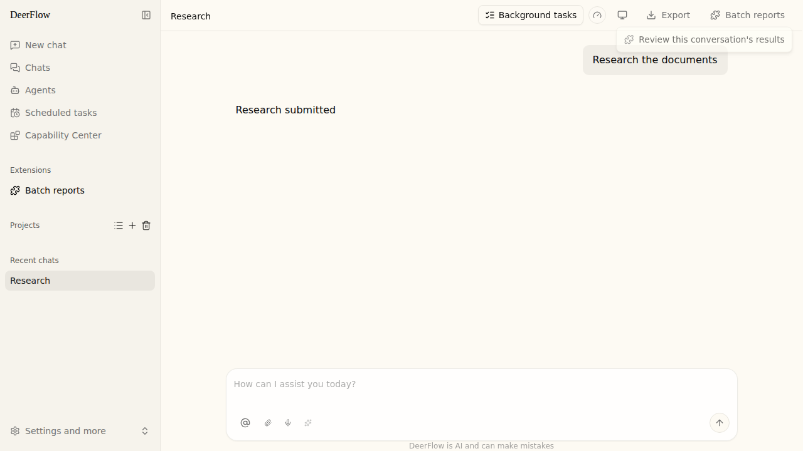
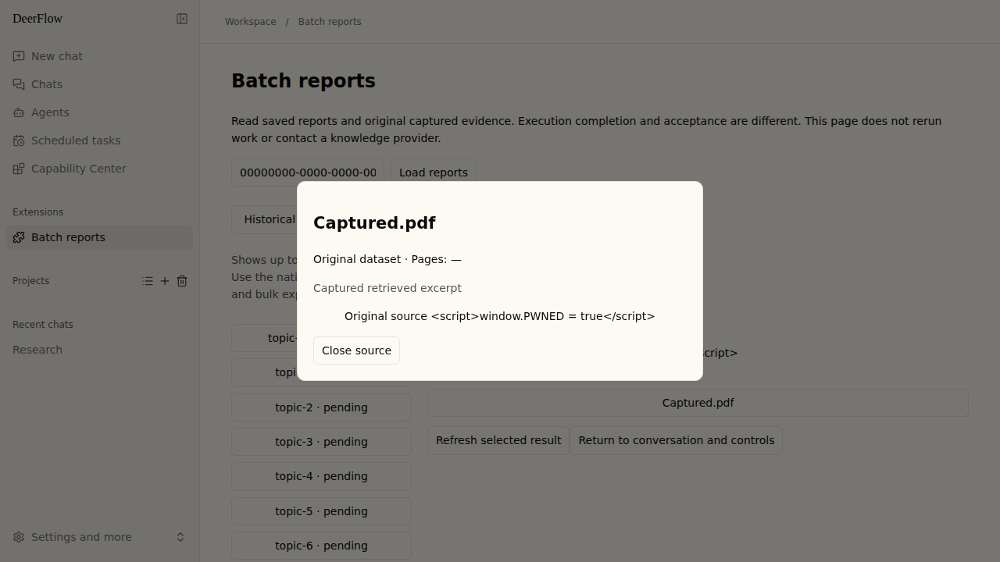

# Batch result review

Optional, read-only browser application for DeerFlow's saved native batch reports
and captured RAGFlow excerpts. Requires a host implementing extension-api 0.2.6.
It adds no provider requests, background worker, database or migration.

## Install and open

From `backend/`, install the trusted local package:

```sh
uv run deerflow extensions install ../examples/deerflow-extension-batch-review --yes
```

The CLI creates a managed `plugins:` entry in root `config.yaml`. In that existing
entry (`use: deerflow_extension_batch_review:install`), set its private setting:

```yaml
config:
  enabled: true
```

Keep the generated `name`, `package`, `use`, host-level `enabled` and `required`
fields; do not add a second entry. Restart Gateway after this edit. The package's
private setting defaults off independently of host-level activation.

Open an existing default or Custom Agent conversation. In its plugin actions,
choose **Batch reports → Review this conversation's results**. The installed page
receives this conversation ID through host-owned navigation. Alternatively use
**Batch reports** in the sidebar and enter an existing conversation ID. A context
ID never grants access: every backend read checks the authenticated user's
effective permission, thread access and batch ownership.

Select a batch, select an item, and inspect the saved report. Report text is
displayed literally, preserving Markdown characters; only native citation
destinations become evidence buttons. HTML is text, not executable markup.
Inline/fenced code citations stay literal. The **Captured sources** list opens
the same saved excerpts with dataset/document/page metadata. Source IDs cannot
be resolved through another conversation or by refetching current provider data.

Execution and acceptance are shown separately. No criteria means acceptance
was not requested. Missing verdict means unchecked. `all_hold` is the stored
deterministic verdict, not a claim of model quality or human approval.

Browser examples below use synthetic research data from the real plugin-router
fixture, with mocked LangGraph responses and loopback test authentication.




## Limits and recovery

- Up to 20 recent batches per conversation and 50 compact items per page. Load
  more explicitly; complete reports are fetched only when selected. A selected
  view exposes up to 100 captured sources; other citations remain unavailable.
- A selected result is one public row projection with its own revision. Refresh
  replaces report and evidence together, closes the old source dialog and
  cancels obsolete selection requests. Switching account/thread or leaving the
  page cancels the old view; request errors expose **Retry read**.
- Available with SQL storage even when the native batch worker is stopped.
  Legacy, unsupported or malformed snapshots show unavailable evidence.
  Sources omitted before storage cannot be reconstructed here.
- Stored reports retain the native truncation flag. Historical rows beyond the
  native 1,000,000-character schema ceiling get a marked bounded view. Excerpts
  are never shortened under their IDs; oversized artifacts are unavailable.
- **Return to conversation and controls** resolves current thread metadata through
  the host. Retry a failed item using the existing native batch panel; its worker
  restrictions and scheduling semantics remain authoritative. This package
  never writes native state or reruns successful work.
- The existing model-facing `read_batch_item`, compact batch API and bulk JSONL
  export are unchanged. Full-stack packages are trusted deployment code, not
  sandboxed plugins; install only trusted sources.

## Verification

```sh
cd backend
uv run pytest tests/test_extension_batch_results_reader.py tests/test_batch_review_acceptance.py
```

`TEST_POSTGRES_URI` enables isolated-schema PostgreSQL acceptance through the
existing actual RAG formatter/step capture/worker fixture. SQLite runs by default;
the PostgreSQL skip is not a PostgreSQL pass. No paid model is called. Browser
entry, literal rendering, citations, pagination and request recovery are tested
with packaged assets and the real action router using synthetic authentication.
