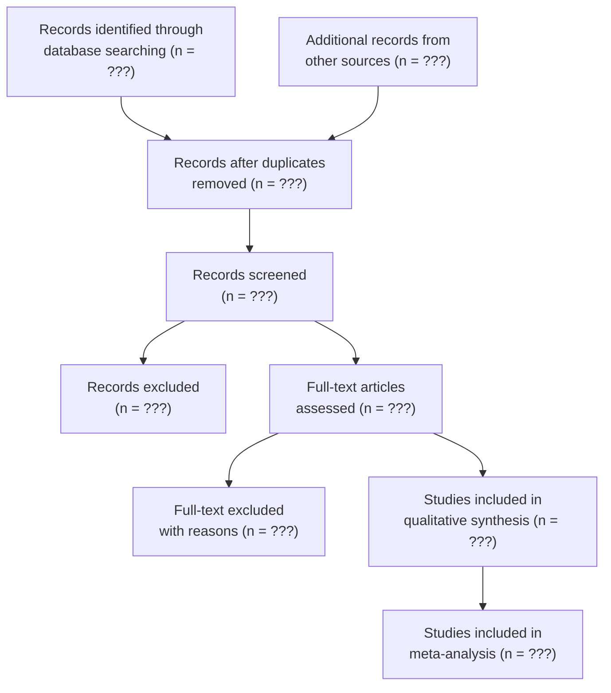

# Literature Review Skill

## Overview

This skill provides a systematic methodology for conducting academic literature reviews. It covers literature discovery through academic databases, reference management, citation analysis, research gap identification, and automated Related Work section generation.

## When to Use This Skill

**Always load this skill when:**

- User wants to find academic papers on a specific topic
- User needs a systematic literature review
- User wants to generate a Related Work section
- User needs to manage references (BibTeX, EndNote, etc.)
- User asks about research gaps or trends in a field
- User wants citation analysis or relationship mapping
- User needs to convert between citation formats

## Core Capabilities

| Capability | Description |
|-----------|-------------|
| **Academic Search** | Search Semantic Scholar, arXiv, CrossRef via web APIs |
| **Literature Screening** | Filter by relevance, recency, citation count, venue quality |
| **Deduplication** | Detect and merge duplicate papers across sources |
| **Citation Management** | Generate BibTeX, APA, GB/T 7714, IEEE formatted citations |
| **Research Gap Analysis** | Identify underexplored areas from literature patterns |
| **Related Work Generation** | Auto-generate thematic Related Work sections |
| **Citation Graph** | Map citation relationships and influence networks |
| **Trend Analysis** | Track research trends by year, topic, and methodology |

## Workflow

### Phase 1: Literature Discovery

#### Step 1.1: Define Search Strategy

Based on the user's research topic, construct a multi-source search plan:

```markdown
## Search Strategy

### Research Question
[Specific research question or topic]

### Search Terms
- **Primary Terms**: [core concepts]
- **Synonyms/Alternatives**: [alternative phrasings]
- **Boolean Queries**: [combined queries]

### Academic Sources
1. Semantic Scholar API (broad CS/bio/med coverage)
2. arXiv API (preprints, CS/Physics/Math)
3. CrossRef API (DOI-based, all disciplines)
4. Google Scholar via web_search (supplementary)

### Inclusion Criteria
- Publication years: [range]
- Venue types: [journal/conference/preprint]
- Minimum citations: [threshold for established work]
- Languages: [en/zh/etc.]

### Exclusion Criteria
- [criteria to exclude irrelevant results]
```

#### Step 1.2: Execute Academic Searches

**Preferred Method — Use Built-in Academic Tools (if available):**

If the system has academic tools configured (`semantic_scholar_search`, `crossref_lookup`, `arxiv_search`), use them directly instead of the Python scripts below. They are faster, more reliable, and handle API errors automatically:

```
semantic_scholar_search(query="[SEARCH_QUERY]", limit=20, year_range="2020-2026")
crossref_lookup(query="[SEARCH_QUERY]", rows=10)
arxiv_search(query="[SEARCH_QUERY]", category="cs.CL", max_results=15)
```

For citation chain analysis, use `semantic_scholar_paper(paper_id="DOI_OR_S2_ID")` to get references and citations.

**Fallback Method — Python Scripts (when tools are not configured):**

**Search Semantic Scholar:**
```bash
python -c "
import json, urllib.request, urllib.parse

query = urllib.parse.quote('[SEARCH_QUERY]')
url = f'https://api.semanticscholar.org/graph/v1/paper/search?query={query}&limit=20&fields=title,authors,year,abstract,citationCount,venue,externalIds,url,openAccessPdf'

req = urllib.request.Request(url, headers={'User-Agent': 'DeerFlow/1.0'})
with urllib.request.urlopen(req, timeout=15) as resp:
    data = json.loads(resp.read())

papers = data.get('data', [])
for i, p in enumerate(papers, 1):
    authors = ', '.join(a.get('name','') for a in (p.get('authors') or [])[:3])
    if len(p.get('authors', [])) > 3:
        authors += ' et al.'
    cite_count = p.get('citationCount', 0)
    year = p.get('year', 'N/A')
    venue = p.get('venue', 'N/A')
    ext_ids = p.get('externalIds', {})
    doi = ext_ids.get('DOI', 'N/A')
    arxiv_id = ext_ids.get('ArXiv', '')
    pdf_url = (p.get('openAccessPdf') or {}).get('url', 'N/A')
    print(f'{i}. [{year}] {p[\"title\"]}')
    print(f'   Authors: {authors}')
    print(f'   Venue: {venue} | Citations: {cite_count} | DOI: {doi}')
    if arxiv_id:
        print(f'   arXiv: {arxiv_id}')
    print(f'   PDF: {pdf_url}')
    abstract = (p.get('abstract') or '')[:200]
    if abstract:
        print(f'   Abstract: {abstract}...')
    print()
"
```

**Search arXiv:**
```bash
python -c "
import urllib.request, urllib.parse
import xml.etree.ElementTree as ET

query = urllib.parse.quote('[SEARCH_QUERY]')
url = f'http://export.arxiv.org/api/query?search_query=all:{query}&start=0&max_results=15&sortBy=relevance&sortOrder=descending'

req = urllib.request.Request(url, headers={'User-Agent': 'DeerFlow/1.0'})
with urllib.request.urlopen(req, timeout=15) as resp:
    root = ET.fromstring(resp.read())

ns = {'atom': 'http://www.w3.org/2005/Atom'}
entries = root.findall('atom:entry', ns)
for i, entry in enumerate(entries, 1):
    title = entry.find('atom:title', ns).text.strip().replace('\n', ' ')
    authors = [a.find('atom:name', ns).text for a in entry.findall('atom:author', ns)]
    author_str = ', '.join(authors[:3]) + (' et al.' if len(authors) > 3 else '')
    published = entry.find('atom:published', ns).text[:10]
    summary = entry.find('atom:summary', ns).text.strip()[:200]
    arxiv_id = entry.find('atom:id', ns).text.split('/')[-1]
    pdf_link = f'https://arxiv.org/pdf/{arxiv_id}'
    print(f'{i}. [{published}] {title}')
    print(f'   Authors: {author_str}')
    print(f'   arXiv ID: {arxiv_id}')
    print(f'   PDF: {pdf_link}')
    print(f'   Abstract: {summary}...')
    print()
"
```

**Search CrossRef (for DOI-based lookup):**
```bash
python -c "
import json, urllib.request, urllib.parse

query = urllib.parse.quote('[SEARCH_QUERY]')
url = f'https://api.crossref.org/works?query={query}&rows=10&sort=relevance&select=DOI,title,author,published-print,container-title,is-referenced-by-count,URL'

req = urllib.request.Request(url, headers={'User-Agent': 'DeerFlow/1.0 (mailto:research@example.com)'})
with urllib.request.urlopen(req, timeout=15) as resp:
    data = json.loads(resp.read())

items = data.get('message', {}).get('items', [])
for i, item in enumerate(items, 1):
    title = item.get('title', ['N/A'])[0]
    authors = item.get('author', [])
    author_str = ', '.join(f\"{a.get('family','')}, {a.get('given','')}\" for a in authors[:3])
    if len(authors) > 3:
        author_str += ' et al.'
    year = str(item.get('published-print', {}).get('date-parts', [[None]])[0][0] or 'N/A')
    journal = item.get('container-title', ['N/A'])[0]
    citations = item.get('is-referenced-by-count', 0)
    doi = item.get('DOI', 'N/A')
    print(f'{i}. [{year}] {title}')
    print(f'   Authors: {author_str}')
    print(f'   Journal: {journal} | Citations: {citations}')
    print(f'   DOI: https://doi.org/{doi}')
    print()
"
```

#### Step 1.3: Screen and Rank Results

After collecting results, apply screening criteria:

1. **Relevance Filter**: Does the paper directly address the research question?
2. **Quality Filter**: Published in reputable venue? Sufficient citation count?
3. **Recency Filter**: Within the specified time range?
4. **Deduplication**: Same paper found across multiple sources?

Ranking heuristic:
```
Score = 0.4 × Relevance + 0.3 × Quality + 0.2 × Recency + 0.1 × Citation_Count_Normalized
```

### Phase 2: Literature Analysis

#### Step 2.1: Paper Categorization

Organize papers into thematic categories:

```markdown
## Literature Taxonomy

### Category 1: [Theme]
- [Paper 1] — [Key contribution]
- [Paper 2] — [Key contribution]

### Category 2: [Theme]
- [Paper 3] — [Key contribution]
- [Paper 4] — [Key contribution]

### Category 3: [Theme]
- ...
```

#### Step 2.2: Research Gap Identification

Analyze patterns to identify gaps:

```markdown
## Research Gap Analysis

### Well-Covered Areas
- [Area 1]: Extensively studied with N papers, consensus on X
- [Area 2]: Multiple approaches proposed, [Leading method] dominates

### Under-Explored Areas (Research Gaps)
1. **Gap 1**: [Description] — Only N papers address this, and they [limitation]
2. **Gap 2**: [Description] — Existing methods assume X, but Y is unexplored
3. **Gap 3**: [Description] — No work combines A with B

### Emerging Trends
- [Trend 1]: Growing interest since [year], N papers in last 2 years
- [Trend 2]: [Description]
```

#### Step 2.3: Citation Relationship Mapping

Generate a citation relationship summary:

```markdown
## Citation Network Summary

### Foundational Papers (most cited)
1. [Paper] (Year) — N citations — [Significance]
2. [Paper] (Year) — N citations — [Significance]

### Recent Influential Work
1. [Paper] (Year) — Builds on [Foundation], extends with [Innovation]
2. [Paper] (Year) — Challenges [Prior assumption], proposes [Alternative]

### Citation Clusters
- Cluster A: [Papers 1,3,7] — Share methodology of [X]
- Cluster B: [Papers 2,4,8] — Focus on application in [Y]
```

### Phase 3: Reference Management

#### Step 3.1: Generate BibTeX Entries

From collected paper metadata, generate well-formatted BibTeX:

```bash
python -c "
papers = [
    {
        'key': 'author2024title',
        'type': 'article',
        'title': 'Paper Title',
        'author': 'Last, First and Last2, First2',
        'journal': 'Journal Name',
        'year': '2024',
        'volume': 'XX',
        'number': 'X',
        'pages': '1--10',
        'doi': '10.xxxx/xxxxx',
    },
]

bibtex_entries = []
for p in papers:
    entry_type = p['type']
    fields = []
    for key in ['title', 'author', 'journal', 'booktitle', 'year', 'volume', 'number', 'pages', 'doi', 'url', 'publisher']:
        if key in p:
            fields.append(f'  {key} = {{{p[key]}}}')
    entry = f\"@{entry_type}{{{p['key']},\n\" + ',\n'.join(fields) + '\n}'
    bibtex_entries.append(entry)

content = '\n\n'.join(bibtex_entries)
with open('/mnt/user-data/outputs/references.bib', 'w') as f:
    f.write(content)
print('BibTeX file generated with', len(bibtex_entries), 'entries.')
print(content)
"
```

#### Step 3.2: Convert Between Citation Formats

Supported formats and their patterns:

**BibTeX → APA 7th:**
```
Author, A. A., & Author, B. B. (Year). Title of article. Journal Name, Volume(Issue), Pages. https://doi.org/xxxxx
```

**BibTeX → GB/T 7714-2015:**
```
[N] AUTHOR A, AUTHOR B. Title[J]. Journal Name, Year, Volume(Issue): Pages.
```

**BibTeX → IEEE:**
```
[N] A. A. Author and B. B. Author, "Title of article," Journal Name, vol. X, no. X, pp. X-X, Month Year.
```

**BibTeX → Vancouver:**
```
N. Author AA, Author BB. Title. Journal Name. Year;Volume(Issue):Pages. doi:xxxxx
```

### Phase 4: Related Work Generation

#### Step 4.1: Auto-Generate Related Work Section

Given a set of papers and the user's research context, generate a thematic Related Work section:

**Writing Principles:**
1. Organize by **themes**, not by individual papers
2. Each paragraph covers a **research direction**
3. Use **citation clusters** (e.g., "[1,2,3]" or "(Author1, Year; Author2, Year)")
4. End each subsection with a **positioning statement**
5. Flow: General → Specific → Gap → Our approach

**Template:**
```markdown
## Related Work

### [Theme 1 Title]

[Overview sentence establishing the theme]. Early work by Author et al. [1] 
introduced [concept], which was later extended by [2,3] to address [challenge]. 
More recently, [4] proposed [method] achieving [result]. However, these approaches 
[limitation], which our method overcomes by [differentiation].

### [Theme 2 Title]

[Overview]. Several studies have explored [direction] [5-8]. Among them, [5] 
focuses on [aspect A], while [6,7] address [aspect B]. [8] combines both aspects 
but [limitation]. Unlike prior work, our approach [unique contribution].

### Summary

Table 1 summarizes the comparison of representative methods.

| Method | Feature A | Feature B | Feature C | Limitation |
|--------|:---------:|:---------:|:---------:|-----------|
| [1] | ✓ | ✗ | ✓ | [limitation] |
| [4] | ✓ | ✓ | ✗ | [limitation] |
| **Ours** | **✓** | **✓** | **✓** | — |
```

### Phase 5: Systematic Review Protocol (PRISMA-Compliant)

When the user requests a systematic review or meta-analysis, follow this PRISMA-compliant protocol.

#### Step 5.1: Protocol Registration

Recommend registering on PROSPERO (health/medical) or OSF (other fields). Generate protocol document:

```markdown
## Systematic Review Protocol

### Research Question
[PICO/PEO format: Population, Intervention/Exposure, Comparison, Outcome]

### Eligibility Criteria
**Inclusion**: [publication years, study types, languages, populations]
**Exclusion**: [review papers, editorials, non-peer-reviewed, duplicates]

### Information Sources
[List all databases with justification]

### Search Strategy
[Full search string per database — reproducible]

### Study Selection Process
[Two-stage: title/abstract screening → full-text review]

### Data Extraction
[Variables to extract: authors, year, sample size, methods, outcomes, effect sizes]

### Quality Assessment Tool
[Newcastle-Ottawa Scale / CASP / JBI / Cochrane RoB — specify per study type]

### Synthesis Method
[Narrative synthesis / Statistical meta-analysis — specify conditions]
```

#### Step 5.2: Comprehensive Multi-Database Search

Execute documented search across all relevant databases:

| Database | Search String | Results | Date |
|----------|--------------|:-------:|------|
| Semantic Scholar | [query] | N | YYYY-MM-DD |
| arXiv | [query] | N | YYYY-MM-DD |
| CrossRef | [query] | N | YYYY-MM-DD |
| Google Scholar (via web_search) | [query] | N | YYYY-MM-DD |
| PubMed (if medical) | [query] | N | YYYY-MM-DD |

Use the search scripts from Phase 1.2 for each database, documenting exact queries and result counts.

#### Step 5.3: PRISMA Flow Diagram

Generate a PRISMA flow diagram showing the screening process:



#### Step 5.4: Quality Assessment

For each included study, rate on standardized criteria:

| Study | Design | Sample | Methodology | Bias Risk | Quality Score |
|-------|--------|:------:|:-----------:|:---------:|:------------:|
| [Paper 1] | RCT | N=200 | High | Low | 8/10 |
| [Paper 2] | Cohort | N=500 | Medium | Medium | 6/10 |

#### Step 5.5: Evidence Synthesis

**Narrative Synthesis**: Theme-based integration with strength-of-evidence ratings.

**Quantitative Meta-Analysis** (if applicable — use `statistical-analysis` skill):
- Calculate pooled effect sizes (Cohen's d, OR, RR)
- Generate forest plot
- Assess heterogeneity (Q statistic, I², τ²)
- Generate funnel plot for publication bias assessment
- Conduct sensitivity analysis (leave-one-out)
- Subgroup analysis if heterogeneity is significant

### Phase 6: Forward & Backward Citation Tracing

Use citation tracing to discover additional relevant papers beyond keyword search.

#### Step 6.1: Backward Citation Tracing (References OF a paper)

```bash
python -c "
import json, urllib.request

paper_id = '[SEMANTIC_SCHOLAR_ID_OR_DOI]'
url = f'https://api.semanticscholar.org/graph/v1/paper/{paper_id}/references?fields=title,authors,year,citationCount,venue&limit=50'

req = urllib.request.Request(url, headers={'User-Agent': 'DeerFlow/1.0'})
with urllib.request.urlopen(req, timeout=15) as resp:
    data = json.loads(resp.read())

print('=== References (Backward Citations) ===')
for ref in data.get('data', []):
    cited = ref.get('citedPaper', {})
    if cited.get('title'):
        year = cited.get('year', '?')
        cites = cited.get('citationCount', 0)
        venue = cited.get('venue', '')
        print(f'- [{year}] {cited[\"title\"]} (Citations: {cites}) {venue}')
"
```

#### Step 6.2: Forward Citation Tracing (Papers that CITE this paper)

```bash
python -c "
import json, urllib.request

paper_id = '[SEMANTIC_SCHOLAR_ID_OR_DOI]'
url = f'https://api.semanticscholar.org/graph/v1/paper/{paper_id}/citations?fields=title,authors,year,citationCount,venue&limit=50'

req = urllib.request.Request(url, headers={'User-Agent': 'DeerFlow/1.0'})
with urllib.request.urlopen(req, timeout=15) as resp:
    data = json.loads(resp.read())

print('=== Citing Papers (Forward Citations) ===')
for cit in data.get('data', []):
    citing = cit.get('citingPaper', {})
    if citing.get('title'):
        year = citing.get('year', '?')
        cites = citing.get('citationCount', 0)
        venue = citing.get('venue', '')
        print(f'- [{year}] {citing[\"title\"]} (Citations: {cites}) {venue}')
"
```

#### Step 6.3: Snowball Search Strategy

1. Start with 3-5 **seed papers** (highly relevant, well-cited)
2. **Backward trace**: Identify foundational references shared across seeds
3. **Forward trace**: Find recent work building on seeds
4. **Iterate**: Check new high-relevance papers' references
5. **Stop when**: No new relevant papers emerge (saturation — typically 2-3 iterations)

### Phase 7: Bibliometric Analysis

When the user wants to understand a field's research landscape quantitatively.

#### Step 7.1: Publication Trend Analysis

Search for papers by year to identify growth/decline patterns:

```bash
python -c "
import json, urllib.request, urllib.parse

topic = urllib.parse.quote('[TOPIC]')
years = range(2018, 2027)
print('=== Publication Trend ===')
for year in years:
    url = f'https://api.semanticscholar.org/graph/v1/paper/search?query={topic}&year={year}-{year}&limit=1&fields=paperId'
    req = urllib.request.Request(url, headers={'User-Agent': 'DeerFlow/1.0'})
    try:
        with urllib.request.urlopen(req, timeout=10) as resp:
            data = json.loads(resp.read())
        total = data.get('total', 0)
        bar = '█' * (total // 100) if total > 0 else '░'
        print(f'{year}: {total:>6} papers {bar}')
    except Exception:
        print(f'{year}: [error]')
"
```

#### Step 7.2: Top Authors & Venues

From collected papers, aggregate:

```markdown
## Bibliometric Summary: [Topic]

### Top Authors (by paper count in corpus)
| Rank | Author | Papers | Total Citations | Affiliation |
|:----:|--------|:------:|:---------------:|-------------|
| 1 | [Name] | N | N | [Institution] |

### Top Venues
| Rank | Venue | Type | Papers | Avg Citations |
|:----:|-------|------|:------:|:-------------:|
| 1 | [Name] | Journal/Conf | N | N |

### Geographic Distribution
| Country | Papers | % |
|---------|:------:|:-:|
| [Country] | N | X% |
```

#### Step 7.3: Keyword Co-occurrence Analysis

From paper titles and abstracts, identify frequently co-occurring terms to map subtopic relationships. Present as a co-occurrence matrix or network description.

## Academic Database Quick Reference

| Database | Coverage | API | Best For |
|---------|---------|-----|----------|
| **Semantic Scholar** | 200M+ papers, CS/Bio/Med focus | Free REST API | Broad academic search |
| **arXiv** | Preprints, CS/Physics/Math/Bio | Free OAI-PMH/REST | Latest CS/ML research |
| **CrossRef** | 130M+ DOI records, all disciplines | Free REST API | DOI lookup, journal papers |
| **Google Scholar** | Broadest coverage | Via web_search | Supplementary search |
| **PubMed** | Biomedical/life sciences | Free E-utilities API | Medical/bio research |
| **DBLP** | CS publications | Free REST API | CS venue-specific search |
| **CNKI** | Chinese academic papers | Via web_search | Chinese scholarly work |

## Search Tips for Different Disciplines

**Computer Science:**
- Prioritize arXiv for latest preprints
- Check DBLP for venue-specific results
- Focus on top-tier venues: NeurIPS, ICML, CVPR, ACL, SIGIR, etc.

**Life Sciences / Medicine:**
- Use PubMed as primary source
- Check for systematic reviews and meta-analyses
- Look for clinical trial registrations

**Social Sciences / Humanities:**
- Use CrossRef and Google Scholar
- Check SSRN for working papers
- Include books and book chapters

**Engineering:**
- Combine IEEE Xplore (via web_search) with Semantic Scholar
- Check for patents alongside papers

## Integration with Other Skills

- **academic-writing**: Pass references to generate properly cited manuscript sections
- **data-analysis**: Analyze bibliometric data (publication trends, citation patterns)
- **chart-visualization**: Visualize citation networks, publication trends, topic distributions
- **deep-research**: Use for supplementary web-based research beyond academic databases

## Output Files

All generated files are saved to `/mnt/user-data/outputs/`:
- `references.bib` — BibTeX database
- `literature_review.md` — Structured literature review
- `research_gaps.md` — Gap analysis report
- `related_work.md` — Generated Related Work section

Use `present_files` to share outputs with the user.

## Notes

- Rate-limit API calls: Semantic Scholar allows ~100 req/5min, arXiv has no strict limit but be respectful
- For comprehensive reviews, search multiple databases and deduplicate
- Always verify paper metadata (authors, year, venue) against the source
- When search returns insufficient results, try alternative keywords and broader queries
- For Chinese academic research, supplement with CNKI searches via `web_search`
